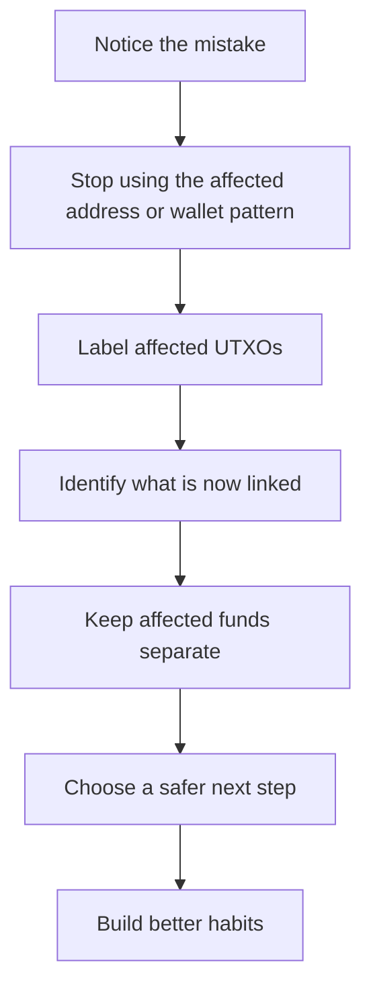
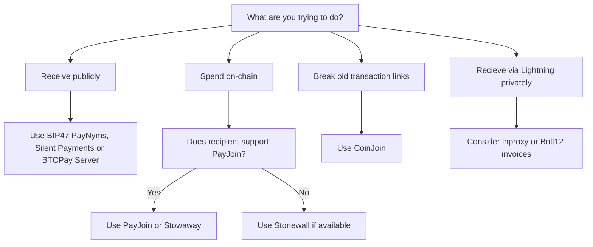
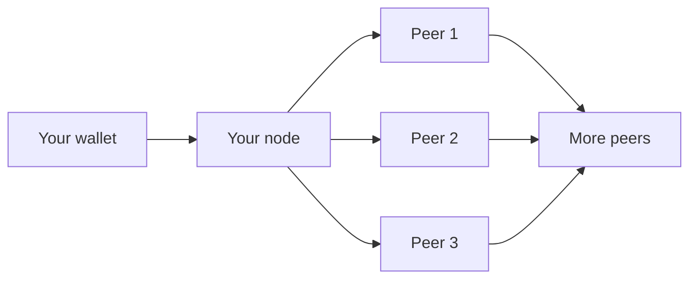
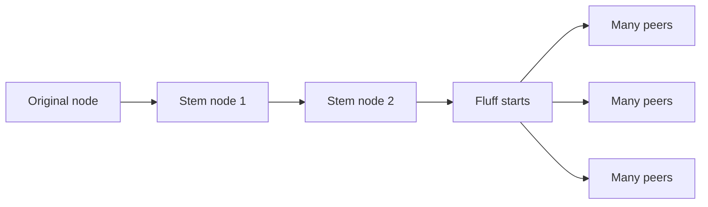
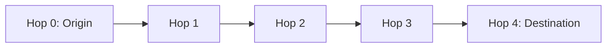
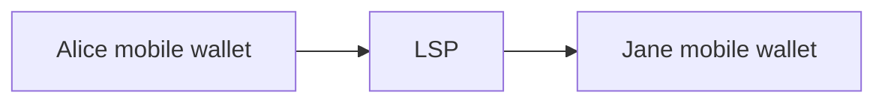

# BitcoinPrivacy.Wiki - Full Consolidated Documentation
> This document is a single-file compilation of all educational resources on Bitcoin privacy from BitcoinPrivacy.Wiki.

---


# SECTION: Home
<!-- FILE: index.md -->
---

# Home

Bitcoin lets ordinary people hold money directly. That is powerful, but it comes with a trade-off: **Bitcoin is public by default**.

Anyone with an internet connection can inspect Bitcoin transactions, amounts, addresses, and coin history. This website explains what that means, why it matters, and how normal people can reduce unnecessary exposure.

---

## Choose Your Next Step

<div class="grid cards" markdown>

-   __Basics__

    ---

    Understand why Bitcoin privacy matters for normal people and get a basic understanding of all concepts.

    [Getting Started →](./full-site.md#why-care-about-bitcoin-privacy)

-   __Privacy Techniques__

    ---

    Learn about techniques such as coin control, CoinJoin, PayJoin, and Stonewall that people use to enhance their on chain privacy.

    [Privacy Techniques →](./full-site.md#privacy-tools-decision-tree)

-   __Lightning Privacy__

    ---

    People often say lightning solves Bitcoin Privacy, read why this is not the case.

    [Lightning Privacy →](./full-site.md#lightning-privacy)

-   __Fungibility__

    ---

    Learn why privacy protects Bitcoin's cash-like properties.

    [Bitcoin Fungibility →](./full-site.md#bitcoin-fungibility)

-   __Advanced Analysis__

    ---

    Understand Boltzmann entropy, valid interpretations, and link probability matrices — the math behind transaction privacy.

    [Boltzmann Entropy →](./full-site.md#boltzmann-entropy)

-   __Real Examples__

    ---

    See how real transactions can be analyzed by anyone with a internet connection and what data they can infer from the public blockchain.

    [Analysis Walkthroughs →](./full-site.md#privacy-analysis-guided-examples)

</div>

---

## What This Site Is For

This site is information for ordinary people who want to understand Bitcoin privacy clearly.

It explains:

- Why financial privacy matters for safety
- What the public Bitcoin ledger reveals
- How identities get linked to addresses
- Why exchange data leaks are dangerous
- What privacy tools are available
- What each tool can and cannot do
- How someone can analyze their own privacy

---

## Special Thanks

Special thanks to **[LaurentMT](https://github.com/LaurentMT)**, creator of the Boltzmann transaction privacy framework, for [auditing](https://x.com/LaurentMT/status/2050679000293425429) the Boltzmann entropy explanations and mathematics to ensure their accuracy.

Special thanks to **[Arkad](https://x.com/Multicripto)**, co-author of [am-i.exposed](https://am-i.exposed/), for auditing the Boltzmann entropy explanations and mathematics to ensure their accuracy.


# SECTION: Getting Started / Why Care About Bitcoin Privacy?
<!-- FILE: getting-started/why-care-about-bitcoin-privacy.md -->
---

# Why Care About Bitcoin Privacy?

Many people first see Bitcoin as a tool for saving, wealth preservation, or long-term wealth accumulation. That is understandable. Bitcoin has a fixed supply, it can be held directly, and it can be sent without asking permission from a bank.

But Bitcoin also has a trade-off that is not obvious to beginners:

> **[DANGER] Bitcoin Is More Transparent Than Most People Realize**
>
>
> Bitcoin is not like a bank account, PayPal account, or brokerage account.
>
> With a bank or payment company, the people who can usually see a payment are you, your bank, the company you are paying, and sometimes their bank or payment processor.
>
> With Bitcoin, **anyone with an internet connection can view the public ledger**. They can see confirmed transactions, pending transactions, amounts, addresses, and the history of coins moving from one place to another.
>
That transparency is useful for verifying that Bitcoin works. But for ordinary people, it also creates real safety risks.

This page explains why privacy matters for normal Bitcoin users: parents, savers, business owners, teenagers stacking sats, workers paid in bitcoin, and long-term holders who simply do not want strangers knowing their financial life.

---

## Privacy Is About Safety

Privacy is not about hiding because you are doing something wrong. Privacy is about controlling who gets to know sensitive information about your life.

You already use privacy every day:

<div class="grid cards" markdown>

-   __You close your curtains__

    ---

    Not because your living room is suspicious, but because strangers do not need to watch your family.

-   __You protect your bank login__

    ---

    Not because your savings are wrong, but because your balance and spending history are private.

-   __You do not post your passport online__

    ---

    Not because your identity is wrong, but because personal information can be abused.

-   __Bitcoin needs the same mindset__

    ---

    Your [addresses](./full-site.md#glossary), [UTXOs](./full-site.md#glossary), wallet history, and public payments can reveal more than you expect.

</div>

Bitcoin privacy is financial self-defense. It helps prevent strangers, companies, data brokers, attackers, and even people you casually transact with from learning more than they need to know.

---

## The Public Ledger Changes Everything

A normal person may assume Bitcoin works like a private account balance. It does not.

Bitcoin uses a public blockchain. Every [transaction](./full-site.md#glossary) is visible forever. That means observers can look at:

- Which coins were spent
- Which new coins were created
- How much moved
- When it moved
- Which coins were combined together
- Whether an address was reused
- Whether a payment came from a known exchange, wallet, or privacy tool

> **[WARNING] Bitcoin Does Not Forget**
>
>
> If you make a privacy mistake today, it may still be visible years later.
>
> A reused address, a careless withdrawal, or a bad [UTXO](./full-site.md#glossary) consolidation can become part of a permanent public record.
>
This is why Bitcoin privacy matters more than many beginners expect. With Bitcoin, your future safety can depend on your past habits.

---

## The Physical Safety Risk Is Real

As Bitcoin becomes more valuable, people known to hold bitcoin can become targets.

As of **4 May 2026**, the physical attack tracker at [stats.gart.io](https://stats.gart.io/#timeline) reported:

| Metric | Reported number |
|---|---:|
| Reported attacks | **337** |
| Countries | **59** |
| Year-over-year increase (2024-2025) | **+84%** |
| Fatalities | **26** |

> **[DANGER] The Trend Matters**
>
>
> These are only reported cases. Many incidents are never made public.
>
> The important lesson is not the exact number. The important lesson is that attacks against known Bitcoin and crypto holders have happened across many countries, and the number has been trending upward.
>
You can browse the database and sources at [stats.gart.io](https://stats.gart.io/#timeline). Jameson Lopp also maintains a long-running archive of known physical Bitcoin attacks in the [physical-bitcoin-attacks repository](https://github.com/jlopp/physical-bitcoin-attacks/blob/master/README.md).

---

## This Is Not Just a Problem for Famous People

It is easy to think: "I am not rich or famous, so this does not apply to me."

But the public cases show that targets have included many different kinds of people:

=== "Families"

    Families have been threatened because someone believed a family member had access to bitcoin or crypto assets.

    In April 2023, a **76-year-old couple in Durham, North Carolina** were forced at gunpoint to transfer cryptocurrency.[^durham]

    In April 2026, a **family in France** was held hostage and attackers managed to extort hundreds of thousands of euros in cryptocurrency.[^ploudalmezeau]

=== "Young people"

    Young people have also been targeted.

    In 2021, a **14-year-old boy in Bradford, England** was kidnapped after being said to have made money from bitcoin.[^bradford]

    In 2025, a **17-year-old in Los Angeles** was targeted in a home invasion involving cryptocurrency.[^la]

=== "Public figures"

    Public attention can increase risk.

    In March 2025, streamer **Kaitlyn Siragusa (Amouranth)** reportedly posted a screenshot of a large bitcoin wallet and later became the victim of an armed home invasion.[^amouranth]

    In January 2025, **Ledger co-founder David Balland and his wife** were kidnapped and ransomed.[^ledger]

=== "Mistaken targets"

    Sometimes people are targeted because attackers believe they are connected to bitcoin wealth, even when the information is wrong.

    In February 2026, a woman in France was reportedly struck by masked men who had gone to the wrong address while looking for a crypto entrepreneur.[^wrong-address]

The lesson is simple: you do not need to be a celebrity for financial information to create risk. If the wrong people believe you have accessible wealth, that belief can be enough to put you or your family in danger.

---

## Why Bitcoin Holders Can Be Especially Attractive Targets

Bitcoin is a [bearer asset](./full-site.md#glossary). That means whoever controls the private keys controls the coins.

If someone steals your bank card, the bank may freeze the card. If someone makes a bank transfer under pressure, there may be a support desk, a fraud department, or a legal process that can sometimes help.

Bitcoin is different:

<div class="grid cards" markdown>

-   __Keys control the coins__

    ---

    If someone gets your [private keys](./full-site.md#glossary), seed phrase, or unlocked wallet, they can move the funds.

-   __Transactions are final__

    ---

    Once a valid Bitcoin transaction confirms, there is no bank manager who can reverse it.

-   __The chain is pseudonymous__

    ---

    Bitcoin addresses do not contain legal names by default. That can make recovery difficult if funds are moved away.

-   __Balances can leak__

    ---

    A careless payment can expose more wallet history than you intended.

</div>

This does not make Bitcoin bad. It means Bitcoin requires a stronger safety mindset.

> **[TIP] Self-Custody Requires Self-Protection**
>
>
> Bitcoin gives you direct control. Direct control is powerful, but it also means you must protect your privacy, your keys, your devices, and your personal information.
>
---

## How Privacy Reduces Physical Risk

The connection between privacy and safety is simple:

> If fewer people know you own bitcoin, how much you own, where you live, and how to connect that information together, there are fewer ways to target you.

Privacy reduces risk by making sure no single person, company, website, or casual observer can build a complete picture of your life.

Think about the difference between these two situations:

=== "Poor privacy"

    Your name is connected to an exchange account. The exchange has your home address, ID documents, purchase history, and withdrawal records. You post about bitcoin online. You reuse addresses. When you pay someone, they can look at the transaction and learn more about your wallet than you meant to show.

    In this situation, many separate clues point in the same direction: **you**.

=== "Better privacy"

    You avoid public balance screenshots. You do not tell strangers how much bitcoin you own. You use fresh addresses. You keep different parts of your bitcoin life separated. You are careful about what companies know about you. When you pay someone, the payment does not reveal your savings.

    In this situation, the clues are harder to connect. Your bitcoin activity is less useful to anyone trying to profile or target you.

That is the real purpose of privacy: not secrecy for its own sake, but reducing unnecessary exposure. The less information you leak, the less useful you are to someone looking for an easy target.

---

## The Exchange Database Problem

[KYC](./full-site.md#glossary) means "Know Your Customer." When you buy bitcoin from a regulated exchange, you often give them:

- Your full name
- Your home address
- Your date of birth
- Your phone number
- Your email address
- A photo of your passport or ID
- A selfie or face scan
- Your bank details
- Your purchase history
- Your withdrawal addresses

That information sits in a database. A database like that is a honeypot: a gold mine of information for attackers.

> **[DANGER] These Databases Will Be Broken Into Sooner or Later**
>
>
> A database full of names, home addresses, identity documents, photos, balances, and bitcoin purchase history is extremely sensitive.
>
> In 2025, Coinbase disclosed a breach where stolen data reportedly included names, home addresses, phone numbers, email addresses, partial Social Security numbers, masked bank account details, government ID images, balance snapshots, and transaction history.[^coinbase-breach]
>
> This kind of data will leak sooner or later. Major data breaches happen many times every year, and when exchange data leaks it tells attackers who bought bitcoin, how much they bought, where they live, and how to contact them.
>
This is why [acquiring bitcoin privately](./full-site.md#acquiring-bitcoin-privately) can be valuable for normal people. It reduces the amount of sensitive personal information stored in large databases.

It is also why, if you already have exchange-linked bitcoin, you should learn how to keep it separated from other funds and avoid linking more of your financial life to that identity record.

---

## A Small Payment Can Reveal Too Much

Bitcoin payments can reveal more than beginners expect.

Imagine you pay someone the equivalent of **$50** in bitcoin. If you are not careful, that person may be able to look at the public transaction and work out that you still control change worth **tens of thousands of dollars**.

The payment was small. The information leak was not.

> **[WARNING] Do Not Show More Than You Meant To Show**
>
>
> Paying someone should not accidentally reveal your savings, your wallet history, or where your bitcoin came from.
>
> Good privacy habits help make sure a simple payment stays a simple payment.
>
There is another risk too: after you spend bitcoin, the person who receives it now controls that coin. If the coin still looks strongly connected to your identity or past wallet history, future activity by someone else can be misunderstood as connected to you.

For example, you might sell bitcoin to someone or use bitcoin to buy something normal. Later, that same coin moves again. You do not control it anymore, but if the history still points clearly back to you, someone looking at the chain may ask why "your" coin ended up there.

The [Understanding UTXOs](./full-site.md#understanding-utxos) page explains this risk in more detail and includes an audio clip from Urban Hacker discussing why this matters.

---

## Privacy Also Protects Your Economic Life

Physical safety is the most serious concern, but privacy also protects your everyday financial life.

Without privacy, observers may learn:

<div class="grid cards" markdown>

-   __How much you earn__

    ---

    A reused address or public wallet can reveal income patterns.

-   __What you buy__

    ---

    Payments can reveal habits, subscriptions, donations, hobbies, or medical spending.

-   __Who you pay__

    ---

    Transaction history can reveal relationships between people and businesses.

-   __How much you save__

    ---

    Poor [UTXO](./full-site.md#glossary) management can expose savings or long-term holdings.

-   __Your business activity__

    ---

    Competitors may estimate revenue, suppliers, customers, and payment timing.

-   __Your location clues__

    ---

    Wallet servers, exchanges, and block explorers can connect activity to IP addresses and timing.

</div>

Financial privacy lets ordinary people live without being watched, profiled, priced, pressured, or targeted based on their savings and spending.

---

## Privacy Is Built in Layers

You do not need to become an expert overnight. The goal is to build better habits step by step.

=== "First layer: do not leak more than necessary"

    Start with the basics:

    - Do not talk publicly about how much bitcoin you own
    - Do not post wallet balances or screenshots
    - Do not reuse addresses
    - Do not look up your own addresses on public explorers from your home IP
    - Do not keep all funds in one obvious wallet

=== "Second layer: use better tools"

    Learn the tools that reduce public links:

    - [Coin control](./full-site.md#coin-control)
    - [Public receiving tools](./full-site.md#public-receiving)
    - [BIP47 PayNyms](./full-site.md#bip47-paynyms)
    - [Silent Payments](./full-site.md#silent-payments)
    - [PayJoin](./full-site.md#payjoin-stowaway)
    - [Stonewall](./full-site.md#stonewall)
    - [CoinJoin](./full-site.md#coinjoin-intro)

=== "Third layer: protect your network and identity"

    Reduce leaks outside the blockchain:

    - Run your own [node](./full-site.md#glossary)
    - Use [Tor](./full-site.md#glossary) where practical
    - Avoid unnecessary [KYC](./full-site.md#glossary) exposure
    - Separate wallets by purpose
    - Keep public activity separate from private savings

> **[TIP] You Do Not Need Perfect Privacy to Be Safer**
>
>
> Even simple habits make a big difference: fresh addresses, careful UTXO labels, avoiding public balance screenshots, separating funds, and using coin control.
>
> Privacy is not all-or-nothing. Every broken link helps.
>
---

## What This Website Explains

Bitcoin gives normal people the ability to hold money directly. That is powerful. But direct ownership also means your privacy choices matter.

> **[SUCCESS] Privacy Protects Normal People**
>
>
> Bitcoin privacy is for the average person who wants to protect their savings, their family, their home, their business, and their future.
>
> It is about reducing unnecessary exposure before it becomes a problem.
>
The rest of this website explains Bitcoin privacy from the ground up: how Bitcoin transactions work, why privacy leaks happen, what information can be seen on the public ledger, which privacy tools exist, what their trade-offs are, and how someone can analyze their own privacy.

This is information for ordinary people who want to understand the risks clearly and make safer choices.

---

## References

- [stats.gart.io physical attack tracker](https://stats.gart.io/#timeline) — Reported physical attack statistics and case database
- [Jameson Lopp's physical Bitcoin attacks archive](https://github.com/jlopp/physical-bitcoin-attacks/blob/master/README.md) — Long-running public archive of reported cases
- [Acquiring Bitcoin Privately](./full-site.md#acquiring-bitcoin-privately) — Why reducing KYC exposure matters
- [Threat Modeling](./full-site.md#threat-modeling) — How to choose privacy tools for your situation
- [Coin Control](./full-site.md#coin-control) — How to avoid linking UTXOs by accident
- [Address Hygiene](./full-site.md#address-hygiene) — Why address reuse is dangerous

[^coinbase-breach]: Proton, ["Coinbase data breach: What happened and what you can do"](https://proton.me/blog/coinbase-breach).
[^durham]: Jameson Lopp physical Bitcoin attacks archive, 12 April 2023, Durham, North Carolina case.
[^ploudalmezeau]: Jameson Lopp physical Bitcoin attacks archive, 20 April 2026, Ploudalmézeau, France case.
[^bradford]: Jameson Lopp physical Bitcoin attacks archive, May 2021, Bradford, England case.
[^la]: Jameson Lopp physical Bitcoin attacks archive, 28 December 2024, Los Angeles, California case.
[^amouranth]: Jameson Lopp physical Bitcoin attacks archive, 2 March 2025, Houston, Texas case.
[^ledger]: Jameson Lopp physical Bitcoin attacks archive, 21 January 2025, Vierzon, France case.
[^wrong-address]: Jameson Lopp physical Bitcoin attacks archive, 12 February 2026, Vaucresson, France case.


# SECTION: Getting Started / What is Bitcoin Privacy?
<!-- FILE: getting-started/what-is-privacy.md -->
---

# What Is Bitcoin Privacy?

The previous page explained why privacy matters. This page explains **what Bitcoin privacy actually means**.

Bitcoin privacy is not one single setting you turn on. It is the practice of controlling which pieces of information are linked together.

In Bitcoin, the most important question is usually:

> Who can connect this transaction, address, or coin to a real person or identity?

---

## Bitcoin Is Pseudonymous, Not Anonymous

Bitcoin does not put your legal name inside a transaction. A Bitcoin [address](./full-site.md#glossary) looks like a random string:

```text
bc1qelem0ann687r2e9jax542lja7q8cu8s35h96pc
```

There is no name, phone number, passport number, or home address written inside that address.

But that does **not** mean Bitcoin is anonymous.

!!! warning "Pseudonymous Means 'Name Hidden, Activity Visible'"

    Bitcoin is better described as **pseudonymous**.

    Your real name is not automatically shown, but your activity can still be watched and linked together. If one address becomes connected to you, other addresses and transactions may become connected to you too.

A simple way to think about it:

- **Anonymous:** nobody can tell who you are
- **Pseudonymous:** you use identifiers that are not your real name, but those identifiers can still build a history

Bitcoin addresses are like public usernames for money. If a username is ever linked to you, the history attached to that username becomes easier to understand.

---

## Privacy Means Breaking Unwanted Links

Bitcoin privacy is mostly about preventing unwanted links.

A **link** is a connection between two pieces of information.

Examples:

- Your name is linked to a Bitcoin address
- Two addresses are linked to the same wallet
- A payment is linked to your employer
- A donation address is linked to your public identity
- Several coins are linked together in one transaction
- Your wallet activity is linked to your IP address

The fewer unwanted links you create, the harder it is for someone to build a clear picture of your financial life.

> **[TIP] The Goal Is Selective Disclosure**
>
>
> Good privacy does not mean hiding everything from everyone.
>
> It means revealing only what is necessary. If you pay someone, they need to know they were paid. They do not need to learn your savings balance, your other payments, or your full wallet history.
>
---

## The Four Main Things That Get Linked

Most Bitcoin privacy problems come from links between four things:

<div class="grid cards" markdown>

-   __Identity__

    ---

    Your real name, public username, business, phone number, email address, social profile, or anything else that points to you.

-   __Wallet Activity__

    ---

    The addresses, balances, transactions, and coins that your wallet controls.

-   __Network Activity__

    ---

    Your IP address, wallet server connections, block explorer searches, and transaction broadcasts.

-   __Context__

    ---

    Timing, amounts, invoices, labels, public posts, messages, or real-world events that help explain a transaction.

</div>

Bitcoin privacy means keeping these categories separated when they do not need to be connected.

---

## A Simple Example

Imagine you receive bitcoin to a fresh address from a friend.

That address is not automatically tied to your real name. But links can appear later:

1. You reuse the same address for another payment
2. You post that address on social media
3. You spend coins from that address together with coins from another source
4. You look up the address on a public block explorer from your normal browser
5. You send from that wallet to a service that knows your identity

Each step adds more clues. One clue may not reveal much. Many clues together can reveal a lot.

??? info "Why Small Clues Matter"

    Bitcoin privacy often fails through combination.

    A single address, a single IP address, or a single payment amount may not prove much by itself. But when several clues point in the same direction, the picture becomes clearer.

---

## Bitcoin Privacy Is About Context

A Bitcoin transaction is just data. It shows inputs, outputs, amounts, and timing.

Privacy leaks happen when that data gains context.

For example:

| Context added | What it can reveal |
|---|---|
| A reused address | Payments belong to the same receiver |
| A public donation page | Payments are connected to a public project |
| An exchange withdrawal | Coins started from an identity-linked account |
| A wallet server query | Which addresses a wallet is interested in |
| A payment amount | Which output is likely the real payment |
| A social media post | A real person may be connected to an address |

This is why Bitcoin privacy is not only about the blockchain. It is also about how you receive, spend, connect, post, label, and talk about bitcoin.

---

## Privacy Is a Skill

Bitcoin privacy is not hopeless, but it is not automatic either.

You do not need to learn everything at once. Start with the basic idea:

> Do not create unnecessary links.

Then learn the practical habits one by one:

1. Use fresh addresses
2. Keep different sources of bitcoin separate
3. Understand [UTXOs](./full-site.md#glossary)
4. Use wallets with good privacy features
5. Run your own [node](./full-site.md#glossary) when ready
6. Learn privacy tools before using them with large amounts

Each habit reduces the amount of information you leak.

---

## What Comes Next

Now that you understand what Bitcoin privacy means, the next step is to think about your own situation.

A public donation page, a long-term savings wallet, and everyday spending all have different privacy needs. A simple [threat model](./full-site.md#threat-modeling) helps you decide what matters most.

[Threat Modeling →](./full-site.md#threat-modeling)


# SECTION: Getting Started / Threat Modeling
<!-- FILE: getting-started/threat-modeling.md -->
---

# Threat Modeling

A threat model is a simple plan for thinking about privacy. It helps you answer three questions:

1. **What am I trying to protect?**
2. **Who am I trying to protect it from?**
3. **What trade-offs am I willing to make?**

You do not need to hide from everyone in the world. You need to understand your own situation and choose tools that match it.

> **[TIP] Privacy Is Personal**
>
>
> A journalist, a shop owner, a teenager saving sats, a public donation project, and a long-term holder all have different privacy needs.
>
> The right privacy setup is the one that fits your real life, not the one that looks most extreme.
>
---

## Why Threat Modeling Matters

Bitcoin privacy can feel overwhelming because there are many tools: [CoinJoin](./full-site.md#glossary), [PayJoin](./full-site.md#glossary), [Stonewall](./full-site.md#glossary), [Lightning](./full-site.md#glossary), [Tor](./full-site.md#glossary), [BIP47](./full-site.md#glossary), and [Silent Payments](./full-site.md#glossary).

A threat model helps you avoid two common mistakes:

- **Doing too little** because you do not know where to start
- **Trying to do everything** and making mistakes because the setup is too complex

Good privacy is built in layers. Start with the biggest risks first.

---

## Step 1: What Are You Protecting?

First, decide what information you want to keep private.

<div class="grid cards" markdown>

-   __Your Balance__

    ---

    You may not want others to know how much bitcoin you own.

-   __Your Identity__

    ---

    You may not want your real name linked to your addresses or transactions.

-   __Your Payments__

    ---

    You may not want others to know who you pay or who pays you.

-   __Your Location__

    ---

    You may not want your IP address or physical location connected to your Bitcoin activity.

-   __Your Business Activity__

    ---

    If you accept payments publicly, you may not want competitors or strangers to see your income.

-   __Your Safety__

    ---

    If people know you own a lot of bitcoin, you may become a target for theft or coercion.

</div>

---

## Step 2: Who Are You Protecting Against?

Different adversaries have different powers. You do not defend against all of them in the same way.

| Adversary | What they may see | Main defenses |
|---|---|---|
| A stranger using a block explorer | Public addresses and transactions | Avoid [address reuse](./full-site.md#glossary), use fresh addresses, use public receiving tools |
| A KYC exchange | Your identity, withdrawals, deposits | Avoid unnecessary KYC, separate KYC and non-KYC funds |
| A wallet server | Your IP address and queried addresses | Run your own [node](./full-site.md#glossary), use [Tor](./full-site.md#glossary) |
| Chain analysis companies | Transaction graph patterns and heuristics | Use [coin control](./full-site.md#glossary), [CoinJoin](./full-site.md#glossary), [PayJoin](./full-site.md#glossary) |
| A payment recipient | The UTXO you spent and sometimes your change | Use good coin control, PayJoin, Stonewall, or Lightning |
| A public observer of your donation page | All payments to a reused address | Use [BIP47](./full-site.md#bip47-paynyms), [Silent Payments](./full-site.md#silent-payments), BOLT12, or fresh invoices |

> **[WARNING] You Cannot Defend Against What You Do Not Notice**
>
>
> Most Bitcoin privacy leaks happen quietly. You may not feel like anything went wrong when you reuse an address, consolidate UTXOs, or query your wallet through a third-party server.
>
> The damage appears later when those links are combined.
>
---

## Step 3: Choose Your Privacy Level

Most people fit into one of these levels.

=== "Basic"

    This is for people who want better privacy without making Bitcoin difficult to use.

    Do this:

    - Use a non-custodial wallet like sparrow
    - Never reuse addresses
    - Label your [UTXOs](./full-site.md#glossary)
    - Do not mix KYC and non-KYC funds
    - Ideally run your own node
    - Use [coin control](./full-site.md#coin-control) before spending

=== "Intermediate"

    This is for people who want stronger privacy and are willing to learn more.

    Add this:

    - Run your own node
    - Use Tor for wallet connections
    - Use [BIP47](./full-site.md#bip47-paynyms) or [Silent Payments](./full-site.md#silent-payments) for public receiving
    - Use [PayJoin](./full-site.md#payjoin-stowaway) when available
    - Use [CoinJoin](./full-site.md#coinjoin-intro) before privacy-sensitive spending
    - Learn [post-mix best practices](./full-site.md#post-mix-best-practices)

=== "Advanced"

    This is for people with higher-risk situations or strong privacy requirements.

    Add this only after understanding the basics:

    - Separate wallets by identity and purpose
    - Use dedicated privacy wallets
    - Self-host more infrastructure
    - Use CoinJoin with strict post-mix discipline
    - Use collaborative spending tools when possible
    - Avoid linking public identities, IP addresses, and on-chain activity

---

## Step 4: Match Tools to Problems

Use the simplest tool that solves the problem you actually have.

| Problem | Tool to consider |
|---|---|
| You need to receive publicly | [Public Receiving](./full-site.md#public-receiving) |
| You keep accidentally linking UTXOs | [Coin Control](./full-site.md#coin-control) |
| You want to break historical links | [CoinJoin](./full-site.md#coinjoin-intro) |
| You are spending to a competent business | [PayJoin](./full-site.md#payjoin-stowaway) |
| You are spending post-mix | [Post-Mix Best Practices](./full-site.md#post-mix-best-practices) |
| You need small payments | [Lightning](./full-site.md#lightning-network-basics) |
| You need help choosing | [Privacy Tools Decision Tree](./full-site.md#privacy-tools-decision-tree) |

---

## Step 5: Think About Trade-Offs

Every privacy tool has trade-offs.

| Trade-off | What it means |
|---|---|
| Privacy vs convenience | Stronger privacy often requires more steps |
| Privacy vs fees | Some tools create larger or extra transactions |
| Privacy vs speed | Waiting can improve privacy, but slows you down |
| Privacy vs complexity | Complex setups can cause mistakes if you do not understand them |
| Privacy vs liquidity | Some tools need other users or available routing capacity |

> **[TIP] Do Not Let Perfect Stop Good**
>
>
> You do not need perfect privacy to improve. Never reusing addresses, using coin control, and keeping funds separated already puts you ahead of most users.
>
---

## Example Threat Models

=== "Beginner saving bitcoin"

    Main risks:

    - KYC exchange knows purchases
    - Wallet leaks addresses to third-party servers
    - Accidental UTXO consolidation

    Good first steps:

    - Move funds to a wallet you control
    - Label UTXOs
    - Avoid address reuse
    - Connect to your own node when ready

=== "Public donation project"

    Main risks:

    - Reused donation address reveals all income
    - Public funds get linked to private savings
    - Donor activity becomes visible

    Good first steps:

    - Use BIP47, Silent Payments, BOLT12, or fresh invoices
    - Keep donation funds in a separate wallet
    - Label incoming payments
    - Avoid sweeping everything into personal savings

=== "Privacy-sensitive spender"

    Main risks:

    - Recipient sees too much wallet history
    - Change output is identified
    - Post-mix UTXOs get consolidated

    Good first steps:

    - Use coin control
    - Use PayJoin when available
    - Use Stonewall if PayJoin is not available
    - Spend post-mix UTXOs independently

---

## Key Takeaways

1. A threat model helps you choose the right privacy tools
2. Start by deciding what you want to protect
3. Identify who you are protecting it from
4. Use the simplest tool that solves your real problem
5. Strong privacy is built slowly, with good habits

---

## What Comes Next

Now that you understand how to think about your own privacy needs, the next step is to understand [UTXOs](./full-site.md#glossary) - the individual pieces of bitcoin your wallet spends.

[Understanding UTXOs →](./full-site.md#understanding-utxos)


# SECTION: Getting Started / Understanding UTXOs
<!-- FILE: getting-started/utxos.md -->
---

# Understanding UTXOs

Understanding UTXOs (Unspent Transaction Outputs) is the single most important foundation for Bitcoin privacy. If you understand UTXOs, you understand why Bitcoin privacy works the way it does.

---

## The UTXO Model Explained

Most people are used to thinking about money like a bank account. Your bank account has a single balance - say, $1,000. When you spend $50, the bank subtracts $50 from your balance and you have $950 left. Simple.

> **[DANGER] Bitcoin Does NOT Work This Way**
>
>
> Bitcoin does not have account balances. Instead, your wallet holds a collection of **UTXOs** - individual chunks of bitcoin, each with a specific value.
>
> Think of UTXOs like physical banknotes in your purse.
>
=== "The Purse Analogy"

    Imagine you have a physical purse with these banknotes:

    - One $20 note
    - One $10 note
    - Three $5 notes

    Your total is $45, but you do not have a single $45 note. You have **five separate notes** that add up to $45.

    **Each of these notes is like a UTXO in Bitcoin.**

=== "How Spending Works"

    Let us say you want to buy something that costs $25. You cannot hand over "exactly $25" because you do not have a $25 note. Instead, you have to:

    1. Pick one or more notes that add up to at least $25
    2. Hand them over to the seller
    3. Receive change back

    For example, you might hand over the $20 note and the 10 dollar note ($30 total). The seller keeps $25 and gives you $5 in change.

    **After this transaction:**

    - The seller has your $20 and $10 notes
    - You have a new $5 note (change) plus your original three $5 notes
    - Your total is still correct, but the specific notes you hold have changed

---

## Why UTXOs Matter for Privacy

Here is the critical privacy insight: **when you combine multiple UTXOs in a single transaction, you publicly link them together on the blockchain.**

Going back to the purse example: imagine someone is watching every transaction you make. They see you hand over a $20 note and a $10 note together. They now know that whoever made that transaction owned both of those notes at the same time.

??? warning "The Common Input Ownership Heuristic"

    In Bitcoin terms: if a transaction spends UTXO A and UTXO B together, anyone looking at the blockchain knows that whoever made that transaction controlled both UTXO A and UTXO B.

    This is called the [Common Input Ownership Heuristic (CIOH)](./full-site.md#glossary), and it is the foundation of all Bitcoin surveillance.

=== "The Privacy Problem"

    Every time you receive bitcoin, you receive it to a new UTXO. If you receive bitcoin 10 times, you have 10 UTXOs. When you want to spend bitcoin, your wallet picks some of those UTXOs to spend.

    If your wallet picks 3 UTXOs to combine in a single transaction, it has just publicly linked those 3 UTXOs together. Anyone analyzing the blockchain now knows they belong to the same person.

=== "The Linking Chain"

    If one of those UTXOs was ever linked to your real identity (through a KYC exchange, a public address, a business transaction), then all 3 UTXOs are now linked to your identity too.

    And if you later spend those 3 UTXOs alongside 2 more UTXOs, you have now linked 5 UTXOs together. The chain grows with every careless transaction.

---

## When Someone Else Gets Your UTXO

A UTXO is not just a number in your wallet. It is a specific coin with a visible history.

When you spend bitcoin, one or more of your UTXOs become someone else's UTXOs. That is normal. Ownership has changed. The problem is that the public history of that coin does not reset when ownership changes.

If the UTXO you spent is clearly linked to your identity, your old wallet, or your past activity, that history can still point back toward you after you no longer control it.

Imagine this simple chain:

1. You buy bitcoin from an exchange that knows your identity
2. You send that bitcoin to someone else
3. That person later spends it somewhere else
4. An observer follows the coin history backward and sees your exchange-linked withdrawal

You did not control the coin after step 2. You did not choose what happened after step 2. But the chain can still make it look like the coin's later activity has something to do with you.

> **[DANGER] Your Old Coin Can Create New Problems**
>
>
> If your payment history points clearly back to your identity, someone else's later activity can drag your name into a situation you had nothing to do with.
>
> This is not because you still own the coin. You do not. It is because Bitcoin history is public, and a clear trail can be misunderstood by people, companies, or investigators who do not know the full story.
>
This is a serious reason to care about UTXO privacy. Good privacy creates separation between your past ownership and someone else's future actions.

> **[INFO] Urban Hacker Explaining Bitcoin Privacy and UTXOs | MUST LISTEN**
>
>
> In this clip from the [Ungovernable Misfits podcast](https://www.ungovernablemisfits.com/shows/), [Urban Hacker](https://x.com/realUrbanHacker) explains Bitcoin's UTXO model and the implications it has on Bitcoin Privacy.
>
> <audio controls preload="metadata" style="width: 100%;">
>   <source src="https://m.primal.net/IbZb.mov" type="audio/mp4">
>   Your browser does not support the audio element. You can listen directly at <a href="https://m.primal.net/IbZb.mov">this link</a>.
> </audio>
>
This is one reason [CoinJoin](./full-site.md#glossary), [PayJoin](./full-site.md#glossary), and careful UTXO management matter.

---

## Coin Control: Taking Control of Your UTXOs

**[Coin control](./full-site.md#glossary)** is the ability to choose which UTXOs to spend in a transaction. Without coin control, your wallet automatically picks UTXOs for you, and it usually picks them in a way that is convenient but not private.

With coin control, you can:

- Choose UTXOs that are already linked together (avoiding new linking)
- Avoid spending UTXOs that came from KYC sources alongside non-KYC UTXOs
- Avoid spending dust UTXOs that might be surveillance attacks
- Keep your UTXOs separated by source and purpose
- **Label your UTXOs** - Tag each UTXO with notes about where it came from (KYC exchange, non-KYC purchase, CoinJoin output, etc.) so you always know what you are spending

??? tip "Good Wallets with Coin Control"

    - **[Sparrow Wallet](./full-site.md#glossary)** - Excellent coin control with detailed UTXO information
    - **[Ashigaru Wallet](./full-site.md#glossary)** - Coin control with labeling
    - **[BlueWallet](./full-site.md#glossary)** - Basic coin control

---

## UTXO Consolidation: The Privacy Disaster

**Consolidation** is when you combine many UTXOs into a single UTXO. This is like taking all the separate notes in your purse and exchanging them for one big note.

On the blockchain, a consolidation transaction looks like this:

- **Many inputs** (all your separate UTXOs)
- **One output** (the consolidated UTXO)

> **[DANGER] This Is the Worst Thing You Can Do for Privacy**
>
>
> A consolidation transaction publicly declares that all of those input addresses belong to the same person. If any one of them is ever linked to your identity, all of them are.
>
---

## Best Practices for UTXO Privacy

<div class="grid cards" markdown>

-   __Never Consolidate__

    ---

    Never combine UTXOs unless they are already linked together. Each consolidation publicly links all inputs.

-   __Use Coin Control__

    ---

    Always choose which UTXOs to spend. Do not let your wallet pick them automatically.

-   __Label Your UTXOs__

    ---

    Label each UTXO by source: KYC, non-KYC, CoinJoin, dust, etc.

-   __Freeze Dust UTXOs__

    ---

    Any UTXO under 1000 sats should be frozen. It might be a surveillance attack.

-   __Never Mix KYC and Non-KYC__

    ---

    Keep your KYC and non-KYC bitcoin completely separate. Never spend them together.

-   __Use CoinJoin__

    ---

    CoinJoin breaks the links between your UTXOs by creating ambiguity about which input funded which output.

</div>

---

## What Comes Next

Now that you understand UTXOs, the next step is to understand how chain analysis companies use this information to track you.

[How Chain Analysis Works →](./full-site.md#how-chain-analysis-works)


# SECTION: Getting Started / How Chain Analysis Works
<!-- FILE: getting-started/chain-analysis.md -->
---

# How Chain Analysis Works

When you send or receive bitcoin, the transaction is recorded on the blockchain - a public ledger that anyone can view. While your name is not attached to the transaction, chain analysis companies have developed sophisticated techniques to link Bitcoin addresses to real-world identities.

---

## What Are Chain Analysis Companies?

Companies like **Chainalysis**, **Elliptic**, **CipherTrace** (owned by Mastercard), and **Crystal Blockchain** specialize in analyzing the Bitcoin blockchain to identify who owns which addresses.

??? warning "Who Uses These Tools?"

    Their clients include:

    - **Law enforcement agencies** (FBI, DEA, local police)
    - **Government tax agencies**
    - **Cryptocurrency exchanges**
    - **Banks and financial institutions**
    - **Insurance companies**

    These companies maintain massive databases that map Bitcoin addresses to real-world identities. They use a combination of automated software analysis and human intelligence to build these databases.

---

## How They Track Your Bitcoin

=== "KYC Exchange Anchor Points"

    The single most powerful tool chain analysis companies have is **KYC (Know Your Customer) exchange data**. When you create an account on a regulated exchange like Coinbase or Binance, you provide:

    - Your full legal name
    - Your home address
    - A photo of your government ID
    - Sometimes a selfie or video call

    When you buy bitcoin on that exchange and withdraw it to your personal wallet, the exchange records which address you withdrew to. This creates an **anchor point** - a known link between your real identity and a Bitcoin address.

    From that anchor point, chain analysis software can follow every transaction you make from that address forward.

=== "The Common Input Ownership Heuristic"

    This is the single most powerful clustering technique in the chain analysis toolkit. It works like this:

    **If a Bitcoin transaction has multiple inputs, all of those inputs are assumed to belong to the same person.**

    This assumption is usually correct because, under normal circumstances, only the owner of a wallet has access to all the private keys needed to sign inputs from different addresses. When you combine multiple [UTXOs](./full-site.md#glossary) from different addresses into a single transaction, you are publicly declaring that all those addresses belong to the same entity.

    This is why **[coin control](./full-site.md#glossary)** (choosing which UTXOs to spend) is so important for privacy. If you spend carelessly, you can link dozens of addresses together in a single transaction.

=== "Change Detection"

    When you send bitcoin, your wallet typically creates two outputs:

    1. The **payment output** - goes to the recipient
    2. The **change output** - goes back to you

    If chain analysis can figure out which output is the change, they can follow your money through multiple hops. They use several techniques to identify change:

    - **Address type matching**: If the inputs are from SegWit addresses and one output is also SegWit while the other is different, the matching output is likely change
    - **Round amounts**: Payments are often round numbers (0.1 BTC, 1 BTC). Change is almost never round
    - **Output ordering**: Some wallets always put change in the same position
    - **Value disparity**: If one output is much larger than the other, the larger one is often change

=== "Address Clustering"

    By combining the Common Input Ownership Heuristic with change detection, chain analysis companies can build massive clusters of addresses that all belong to the same person or entity. A single careless transaction can link dozens of addresses together.

    Once they have a cluster, if they can identify even one address in that cluster (through a KYC exchange, a public donation, a business transaction, etc.), they can identify the entire cluster.

---

## Wallet Fingerprinting

Different wallet software produces transactions with subtly different characteristics. By examining the raw transaction data, analysts can often identify which wallet created it, Yyu do not need to worry about any of this "technical" jargon below but these are some data points analysts often look at:

- **nLockTime**: Bitcoin Core sets this to the current block height. Many mobile wallets set it to 0
- **nSequence**: Different wallets set different default values
- **BIP69 ordering**: Some wallets sort inputs and outputs lexicographically
- **Low-R signatures**: Bitcoin Core grinds signatures to produce smaller ones

You do not need to worry about any of this "technical" jargon, just realise that the reality is 

> **[INFO] 45% of Transactions Are Identifiable**
>
>
> Research shows approximately **45% of Bitcoin transactions** can be attributed to specific wallet software based on structure alone.
>
---

## What They Can Do With Your Data

Once chain analysis companies have linked your identity to your Bitcoin activity, they can:

- Track every transaction you make
- Estimate your total bitcoin holdings
- Identify who you transact with
- Flag you for suspicious activity
- Sell this data to governments and financial institutions
- Help exchanges block or freeze your accounts

---

## How to Protect Yourself

The good news is that all of these techniques can be defeated or mitigated:

<div class="grid cards" markdown>

-   __Avoid KYC Exchanges__

    ---

    This removes the anchor point. Buy from non-KYC sources.

-   __Use CoinJoin__

    ---

    This breaks the Common Input Ownership Heuristic.

-   __Use PayJoin__

    ---

    This poisons the heuristic silently.

-   __Never Reuse Addresses__

    ---

    This prevents easy clustering.

-   __Run Your Own Node__

    ---

    This prevents IP correlation.

-   __Use Tor__

    ---

    This masks your IP address.

-   __Practice Good Coin Control__

    ---

    This prevents accidental linking.

</div>

Each technique you apply improves your privacy meaningfully. You do not need to do everything perfectly - just doing the basics puts you ahead of most Bitcoin users.

More info on each of these is provided further on.

---

## What Comes Next

Now that you understand how chain analysis works, let's look at the specific techniques (heuristics) they use in more detail.

[Privacy Heuristics Explained →](./full-site.md#privacy-heuristics-explained)


# SECTION: Getting Started / Privacy Heuristics Explained
<!-- FILE: getting-started/heuristics.md -->
---

# Privacy Heuristics Explained

Chain analysis companies use a set of **heuristics** (rules of thumb or assumptions) to analyze Bitcoin transactions and link addresses to real identities. Understanding these heuristics is essential because it tells you exactly what you need to defend against.

---

## Round Amount Detection

> **[NOTE] What It Detects**
>
>
> When you send bitcoin, you typically send a round amount - "send 0.1 BTC" or "send 50,000 sats." The change output, by contrast, is whatever is left over after subtracting the payment and the fee. Change is almost never round.
>
**Why it matters:** If a transaction has two outputs and one is a round amount, an observer can confidently identify which output is the payment and which is the change. This breaks the ambiguity that protects the sender's privacy.

**How to defend:** Use [CoinJoin](./full-site.md#glossary), which creates multiple equal-value outputs. Use changeless transactions when possible.

---

## Change Detection

> **[WARNING] Critical Heuristic**
>
>
> Change detection attempts to identify which output in a transaction returns funds to the sender. This is one of the most consequential heuristics because correctly identifying change allows an adversary to follow the money through multiple hops.
>
**Sub-heuristics used:**

- **Address type mismatch**: If all inputs are from one address type and one output matches that type while another does not, the matching output is likely change
- **Round payment amount**: If one output is round and the other is not, the non-round output is likely change
- **Unnecessary input heuristic**: If a single input alone would have been sufficient to fund the payment, the additional inputs are likely from the same wallet
- **Value disparity**: If one output is 100x or more larger than the other, the larger output is likely change

**Why it matters:** Change detection is the backbone of transaction tracing. If an adversary can identify which output is change, they know which output returns to the sender's wallet and can follow it forward.

**How to defend:** Use [PayJoin](./full-site.md#glossary), which makes the recipient contribute an input, breaking the assumptions. Use CoinJoin. Use uniform address types.

---

## Common Input Ownership Heuristic (CIOH)

> **[DANGER] The Most Powerful Clustering Tool**
>
>
> If a transaction spends multiple inputs, all of those inputs are assumed to be controlled by the same entity. This is the foundational clustering heuristic - the single most powerful tool in the chain surveillance arsenal.
>
**Why it matters:** CIOH alone enables the majority of address clustering. A single multi-input transaction can link dozens of addresses to the same entity. Combined with a single KYC anchor point, an entire wallet's history can be deanonymized.

**Critical exceptions where CIOH does NOT hold:**

- **CoinJoin transactions** - Multiple users contribute inputs. CIOH is deliberately broken
- **PayJoin (BIP78)** - The sender and recipient both contribute inputs. CIOH is deliberately violated
- **Dual-funded Lightning channel opens** - Two parties contribute inputs cooperatively
- **Batched payments by exchanges** - Exchange hot wallets batch many withdrawals

**How to defend:** Use CoinJoin. Use PayJoin. Avoid consolidating UTXOs from different sources.

---

## CoinJoin

> **[SUCCESS] The ONLY Positive Privacy Signal**
>
>
> CoinJoin is a collaborative transaction where multiple users combine their inputs and outputs into a single transaction. When done correctly, an observer cannot determine which inputs funded which outputs.
>
**Types detected:**

- **Whirlpool**: 5+ equal outputs at known denominations (50k, 100k, 1M, 5M, 50M sats)
- **Wasabi/WabiSabi**: Large number of inputs (50-150), many equal-value outputs
- **JoinMarket**: Maker/taker model, unequal inputs, equal outputs for the CoinJoin amount
- **Stonewall**: 2+ inputs, 4 outputs with 2 equal-value pairs

**Why it matters:** CoinJoin is the ONLY positive privacy signal in on-chain analysis. A well-executed CoinJoin breaks the transaction graph by creating ambiguity. After a CoinJoin, an adversary encounters an exponential increase in possible interpretations.

---

## Address Reuse

> **[FAILURE] The #1 Privacy Killer**
>
>
> When a Bitcoin address receives funds in more than one transaction. This is the single biggest privacy failure a Bitcoin user can make.
>
**Why it matters:** Address reuse:

- Links all transactions to the same entity with certainty
- Reveals the total amount received and spent over time
- Allows temporal analysis of spending patterns
- Makes change detection trivial
- Is not a probabilistic heuristic - it is a deterministic, irrefutable link

---

## Wallet Fingerprinting

> **[TIP] 45% of Transactions Are Identifiable**
>
>
> Different wallet software produces transactions with subtly different structural characteristics. By examining the raw transaction data, analysts can often identify which wallet created it.
>
**Signals analyzed:**

- **nLockTime**: Bitcoin Core sets this to the current block height. Many mobile wallets set it to 0
- **nVersion**: Version 1 vs Version 2
- **nSequence values**: Different wallets set different default values
- **BIP69 ordering**: Some wallets sort inputs and outputs lexicographically
- **Low-R signatures**: Bitcoin Core grinds signatures to produce smaller ones

---

## Dust Detection

> **[WARNING] Active Surveillance Technique**
>
>
> Tiny UTXOs (<1000 sats) that may be "dusting attacks." In a dusting attack, an adversary sends tiny amounts to target addresses. When the victim spends this dust alongside other UTXOs, CIOH links the dusted address to all other inputs.
>
**How to defend:** Never spend dust UTXOs. Freeze them using coin control.

---

## Post-Mix Consolidation Detection

> **[DANGER] The Single Most Damaging Mistake**
>
>
> Spending 2+ outputs from different CoinJoin transactions in a single non-CoinJoin transaction. This re-links UTXOs via CIOH, completely destroying the anonymity set gained from mixing.
>
**Why it matters:** This is the single most damaging mistake a CoinJoin user can make. It undoes the mixing entirely. An adversary can then trace backward through each CoinJoin to the pre-mix inputs, collapsing the anonymity set to 1.

**How to defend:** Never spend outputs from different CoinJoin rounds in the same transaction. Use each post-mix UTXO independently.

---

## What Comes Next

Now that you understand the heuristics used against you, let's look at how to acquire bitcoin without creating a KYC anchor point in the first place.

[Acquiring Bitcoin Privately →](./full-site.md#acquiring-bitcoin-privately)


# SECTION: Getting Started / Acquiring Bitcoin Privately
<!-- FILE: getting-started/acquiring.md -->
---

# Acquiring Bitcoin Privately

95% of Bitcoin on-ramps today require KYC (Know Your Customer). If you purchase through one of these regulated entities, you essentially tag your bitcoin addresses to your personal identity. This makes it trivial for chain surveillance firms to track you.

---

## Why No-KYC Matters

=== "What KYC Exchanges Know"

    When you buy from a KYC exchange, they know:

    - Your full legal name
    - Your home address
    - Your photo and government ID
    - How much you bought
    - When you bought it
    - Your banking information
    - Where you withdraw to

=== "What They Can Do With It"

    This information can be used to:

    - Track your spending habits
    - Prevent you from using other regulated services
    - Confiscate your bitcoin
    - Come after you for tax liabilities
    - Sell your data to other companies without telling you

> **[DANGER] Data Breaches Happen**
>
>
> A central party holding millions of people's sensitive and personal information creates a huge honey pot at risk of being stolen. How would you feel if your name, address, photo and exactly how much Bitcoin you own was stolen from an exchange and being sold to the highest bidder on a darknet market?
>
> Data leaks happen all too often.
>
---

## Where to Buy No-KYC

<div class="grid cards" markdown>

-   __[Hodl Hodl](https://hodlhodl.com)__

    ---

    Non-custodial P2P exchange. No KYC required.

-   __[Bisq](https://bisq.network)__

    ---

    Desktop P2P exchange. Fully decentralised, no central server. Tor by default.

-   __[RoboSats](https://robosats.org)__

    ---

    Lightning-based P2P exchange. Simple, clean interface. No KYC required. Tor by default.

-   __[Peach Bitcoin](https://peachbitcoin.com)__

    ---

    Mobile-first P2P exchange. No KYC required. Wide range of payment methods. Good liquidity.

</div>

---

## The No-KYC Premium

It is absolutely true that you will see some offers to purchase bitcoin on P2P exchanges for some very high premiums over the spot price. However, if you are patient enough, you can pick some up at spot or just marginally (1-4%) above.

> **[TIP] How to Minimize the Premium**
>
>
> Man services allow you to create a **"Buy offer"** which is essentially you telling the market that you want to buy "X" amount of bitcoin at "X%" relative to the spot price. All you need to do then is wait for a seller to accept your offer.
>
> Many experienced bitcoiners take this approach and have never waited for more than a day for someone to accept the offer of around 2-4% premium.
>
=== "Why the Premium Is Worth It"

    Think of the premium not as an extra cost, but as an investment in your privacy and security:

    - **No identity linkage**: Your bitcoin is truly yours, with no paper trail
    - **No censorship risk**: No exchange can freeze your account
    - **No confiscation risk**: No one can take your bitcoin from you
    - **No data breach risk**: Your personal information is not sitting in a database

---

## What If You Already Have KYC Bitcoin?

Once you have purchased Bitcoin from a KYC source you can **never** undo that. Not even with advanced techniques like CoinJoin that create forward looking privacy. You have three main options:

=== "Option 1: Sell and Start Fresh"

    Sell your KYC bought coins back at the exchange you bought them from. Depending on your jurisdiction, this will likely create a taxable event but you will then have a paper trail to prove you no longer own those coins. This provides a "clean start."

=== "Option 2: Keep Two Stacks"

    Cease purchasing bitcoin via KYC sources immediately and completely segregate and label those funds. Start obtaining bitcoin via a non-KYC source, ensuring you maintain complete segregation.

    You should also consider coinjoining your KYC stack. This will not erase your KYC history but it would give forward looking privacy for future transactions.

=== "Option 3: Move Jurisdictions"

    Moving jurisdictions could be an option to free you from future obligations. Of course this is not a 100% guarantee as certain jurisdictions may have information sharing agreements.

> **[DANGER] Never Mix Stacks**
>
>
> The single most important thing you can do is **never mix KYC and non-KYC bitcoin in the same transaction**. If you spend a KYC UTXO and a non-KYC UTXO together, you have just linked them on the blockchain.
>
> Use coin control to keep them separate. Label your UTXOs clearly.
>
---

## Other Ways to Get Bitcoin

- **Earn it**: Sell goods or services for bitcoin
- **ATMs**: Though some may require identifying info like a phone number
- **Mine it**: Mining is rarely profitable for individuals today

---

## What Comes Next

Now that you have acquired bitcoin privately, you need a safe place to store it. Let's look at how to choose a wallet.

[Choosing a Wallet →](./full-site.md#choosing-a-wallet)


# SECTION: Getting Started / Choosing a Wallet
<!-- FILE: getting-started/wallets.md -->
---

# Choosing a Wallet

A Bitcoin [wallet](./full-site.md#glossary) is just like your real wallet - it is a method of storing value. The main difference with a Bitcoin wallet is that it does not actually store bitcoin inside. Bitcoins exist solely on the distributed ledger (blockchain). A Bitcoin wallet stores the keys required to sign the transactions that send bitcoin.

> **[QUOTE] Not Your Keys, Not Your Coins**
>
>
> If you are not in control of your private keys (your recovery/seed words) then you are not in control of your bitcoin. A good wallet gives you full control over your keys.
>
---

## What Makes a Wallet Private?

When evaluating a wallet's privacy capabilities, consider these features:

| Feature | Why It Matters |
|---------|---------------|
| **[Tor](./full-site.md#glossary) support** | Hides your IP address from the nodes you connect to |
| **[Coin control](./full-site.md#glossary)** | Lets you choose which UTXOs to spend, preventing accidental linking |
| **Address reuse prevention** | Automatically generates fresh addresses for each receive |
| **Node connection** | Connect to your own node instead of trusting third-party servers |
| **[CoinJoin](./full-site.md#glossary) support** | Built-in mixing for breaking transaction links |
| **[PayJoin](./full-site.md#glossary) support** | Poison the Common Input Ownership Heuristic |
| **Labeling** | Track where your UTXOs came from |

---

## Mobile Wallets

Mobile wallets provide the ultimate in convenience. They are on a device we generally have with us 24/7, which makes transacting anytime, any place, easy. This convenience comes with the trade-off that it may not be a suitable solution for storing a large proportion of your wealth.

Here are two of the best mobile wallets, [Ashigaru](https://ashigaru.rs) and [BlueWallet](https://bluewallet.io)

=== "Ashigaru Wallet"

    **Privacy Features:**

    - Connect to own node (Dojo)
    - Runs over Tor
    - CoinJoin (Whirlpool) + PayJoin (Stowaway)
    - Coin control
    - PayNyms (BIP47 stealth addresses)
    - Stonewall transactions
    - Riccochet for transactional distance

    **Limitations:** Android only

    **Best for:** Users who want maximum privacy on mobile

=== "BlueWallet"

    **Privacy Features:**
    
    - Connect to own node (via Electrum server)
    - PSBT and multi-sig
    - Create multiple accounts
    - Buy bitcoin within the app via Hodl Hodl
    - Coin control + labelling
    - Partial silent Payments support

    **Limitations:** No Tor support

    **Best for:** Beginners who want a simple, feature-rich wallet

---

## Desktop Wallets

Desktop wallets can offer more usability and a greater feature set. Most desktop wallets offer hardware wallet support. Computers are inherently more at risk of being exposed to malicious software compared to phones, so always double check the download source.

There is only one wallet that is reccomended today and that is [Sparrow Wallet](https://sparrowwallet.com):

**Privacy Features:**
- Connect to own node
- PSBT and multi-sig
- Coin control
- Can run over Tor
- Whirlpool integration (removed)
- Stonewall algorithm
- Extremely detailed transaction previews
- Hardware wallet support

---

## Hardware Wallet Purchase Privacy

Hardware wallets are useful security tools, but buying one can create a privacy leak if you order it like any normal online purchase.

If you buy a hardware wallet with a debit card and ship it to your home, the seller or payment processor may store:

- Your name
- Your home address
- Your email address
- Your phone number
- Your payment details
- The fact that you bought a Bitcoin storage device

That kind of list is sensitive. If it leaks, it can connect your identity and home address to Bitcoin ownership.

> **[TIP] Buy Hardware Wallets More Privately**
>
>
> If you want to buy a hardware wallet, consider paying with bitcoin privately instead of using a card, and consider delivery to a PO box or other non-home delivery address when possible.
>
> The goal is simple: avoid putting your name, home address, and hardware wallet purchase into the same database.
>
### SeedSigner: Build Instead of Buy

[SeedSigner](https://seedsigner.com/) is different from most hardware wallets. It is a DIY, air-gapped signing device that you can build from generic off-the-shelf parts.

This has two privacy benefits:

1. The parts do not obviously identify you as a Bitcoin holder
2. You reduce supply chain risk because you are not relying on a pre-built Bitcoin device arriving from a specialist vendor

SeedSigner is not the easiest option for everyone, but it is worth knowing about if you care about purchase privacy and supply chain privacy.

---

## Choosing the Right Wallet

| Your Situation | Recommended Wallet |
|---------------|-------------------|
| **Beginner, mobile only** | BlueWallet (iOS/Android) |
| **Privacy-focused, mobile** | Samourai Wallet (Android) |
| **Privacy-focused, desktop** | Sparrow Wallet |
| **DIY, minimal supply chain risk** | SeedSigner |

> **[WARNING] Always Back Up Your Seed Phrase**
>
>
> Regardless of the type of wallet(s) you use, always ensure you have a physical seed backup. Write your 12 or 24 words on paper/metal and store them somewhere safe. Never store them digitally.
>
---

## What Comes Next

Now that you have a wallet, the next step is to run your own node to stop leaking your addresses to third-party servers.

[Running Your Own Node →](./full-site.md#running-your-own-node)


# SECTION: Getting Started / Running Your Own Node
<!-- FILE: getting-started/node.md -->
---

# Running Your Own Node

A Bitcoin [node](./full-site.md#glossary) is a computer that runs Bitcoin software to validate transactions and blocks. Running your own node is one of the most important privacy steps you can take.

---

## What Is a Node?

A Bitcoin node downloads every transaction and block, checks them against the rules of the Bitcoin protocol, and relays valid data to other nodes. It is your personal, independent verifier of Bitcoin truth.

!!! tip "Don't Trust, Verify"

    When you use someone else's node (through a wallet that connects to a third-party server), that server can:

    - See which addresses you are interested in
    - Link your IP address and location to those addresses
    - Lie to you about your balance
    - Withhold transaction information
    - Track your financial activity

    When you run your own node, you verify everything yourself. No one can lie to you.

---

## Why Run a Node for Privacy?

=== "Without a Node"

    When you use a wallet that connects to a public server:

    1. Your wallet sends your addresses to the server
    2. The server sees your IP address
    3. The server can build a profile of your activity
    4. The server could be logging everything

=== "With a Node"

    When you connect your wallet to your own node:

    1. Your wallet queries your own server
    2. No third party sees your addresses
    3. Your IP is not logged
    4. No one is logging your activity

---

## How to Get a Node

=== "Plug and Play Solutions"

    Pre-built devices that run a node with minimal setup. Just plug in and go.

    The best plug and play nodes are from [Start9](https://start9.com) and [Umbrel](https://umbrel.com).

=== "DIY Solutions"

    If you want to be fully sovereign you will want to build your own node from scratch.

    A full walkthough of this is availiable [here](https://www.youtube.com/playlist?list=PLCRbH-IWlcW0g0HCrtI06_ZdVVolUWr39) presented by K3tan on YouTube.

---

## Connecting Your Wallet to Your Node

Once your node is running, you can connect your wallet to it:

=== "Sparrow Wallet"

    1. Open Sparrow Wallet
    2. Go to Preferences > Server
    3. Enter your node's IP address and port (usually 50001 for Electrum)
    4. Test the connection
    5. Save and restart

=== "BlueWallet"

    1. Open BlueWallet
    2. Go to Settings > Network
    3. Enter your node's Electrum server address
    4. Test and save

---

## Running a Node Over Tor

For maximum privacy, run your node over [Tor](./full-site.md#glossary) so your IP address is not visible to the Bitcoin network.

> **[TIP] Tor Benefits**
>
>
> - Hides your IP from peers
> - Prevents ISP from seeing Bitcoin traffic
> - Makes it harder to target your node
> - Protects your physical location
>
Most plug and play nodes have tor supported out of the box.

### Why Tor Matters

When you run a node without Tor, your IP address is visible. This means:

- Other nodes know your IP address
- Your ISP can see you are running Bitcoin software
- Your physical location can be approximated from your IP

Running your node over Tor hides all of this. Your node appears to be coming from a random relay somewhere in the world, making it much harder to target.

---

## What Comes Next

Now you understand the fundamentals of using bitcoin privately here is a short summary everything we have covered so far.

[First Steps To Privacy →](./full-site.md#your-first-steps)


# SECTION: Getting Started / Your First Steps
<!-- FILE: getting-started/first-steps.md -->
---

# Your First Steps

Now that you understand what Bitcoin privacy is, it is time to take your first steps toward actually using Bitcoin privately.

This page is your practical starting point. Do not try to do everything at once. Focus on building a private foundation one step at a time.

---

## Step 1: Stop Using Custodial Wallets

If your bitcoin is sitting on an exchange, in a brokerage account, or in a custodial app where you do not control the seed phrase, you do not yet control your bitcoin.

> **[WARNING] Your Keys Must Be Yours**
>
>
> The first thing you should do is move your bitcoin into a wallet where you control the private keys. This means a wallet that gives you a seed phrase and lets you back it up yourself.
>
> If you leave your bitcoin on a third-party platform, the platform can freeze it, censor it, or shut down entirely.
>
---

## Step 2: Learn the Difference Between Identity and Activity

Bitcoin privacy is about breaking links between:

- **Your real-world identity**
- **Your Bitcoin addresses**
- **Your transaction history**
- **Your internet activity**

The more links you prevent, the harder it is for outsiders to understand your finances.

> **[TIP] Compartmentalize**
>
>
> Think of each source of bitcoin as a separate compartment.
>
> - KYC bitcoin goes in one compartment
> - Non-KYC bitcoin goes in another
> - CoinJoined bitcoin goes in another
> - Lightning funds go in another
>
> Never mix compartments unless you understand the privacy consequences.
>
---

## Step 3: Use a Wallet That Supports Privacy

Not all wallets are equal. Some wallets leak your data by default. Others give you the tools you need to stay private.

=== "Good Starting Features"

    A privacy-friendly wallet should ideally offer:

    - A fresh address for every receive
    - Coin control
    - Tor support or the ability to connect to your own node
    - Hardware wallet support
    - Clear labeling of UTXOs

=== "What to Avoid"

    Avoid wallets that:

    - Reuse addresses
    - Hide UTXOs from you
    - Force you to connect to third-party servers without control
    - Do not let you choose fees or coins
    - Mix privacy-sensitive data into their servers without telling you

---

## Step 4: Learn How to Receive Bitcoin Privately

When you receive bitcoin, the address you use matters.

### Use a Fresh Address Every Time

A good wallet should automatically generate a new receive address each time you ask for one. This prevents easy address reuse and makes it much harder for someone to build a complete picture of your wallet.

### Do Not Reuse Donation or Public Addresses

If you publish a Bitcoin address on a website, social profile, or invoice, assume it is now public forever. Do not use that address again for anything private.

### Separate Public and Private Receiving

If you need a public donation address, keep that wallet separate from your personal savings wallet. Never let public funds and private funds mix.

---

## Step 5: Learn How to Spend Privately

Spending is where most privacy mistakes happen.

> **[DANGER] Spending Can Reveal Everything**
>
>
> When you spend bitcoin, your wallet may combine several UTXOs into a single transaction. If those UTXOs came from different sources, you have just publicly linked them together.
>
To spend privately:

1. Use coin control to choose the exact UTXOs you want to spend
2. Avoid combining KYC and non-KYC bitcoin
3. Avoid consolidating coins unnecessarily
4. Learn CoinJoin before trying advanced spending

---

## Step 6: Build Your Privacy Stack Slowly

You do not need every tool on day one. A strong privacy stack is built in layers.

<div class="grid cards" markdown>

-   __Layer 1: Wallet__

    ---

    Choose a wallet where you control the keys and that supports fresh addresses.

-   __Layer 2: Node__

    ---

    Connect to your own node so wallet queries and balance lookups do not leak to third-party servers.

-   __Layer 3: Acquisition__

    ---

    Buy bitcoin without KYC where possible so your identity is not attached at the source.

-   __Layer 4: CoinJoin__

    ---

    Use CoinJoin to break transaction graph links and build post-mix privacy.

-   __Layer 5: Lightning__

    ---

    Use Lightning for some spending and receiving when it fits your privacy needs.

-   __Layer 6: Advanced OPSEC__

    ---

    Tor, VPNs, secure messaging, strong passwords, and other protections matter too.

</div>

---

## A Simple Starter Plan

If you want a very simple first-week plan, do this:

1. Move bitcoin into a wallet you control
2. Turn on address generation for every receive
3. Stop reusing addresses
4. Learn what UTXOs are
5. Keep KYC and non-KYC bitcoin separate
6. Read the CoinJoin section before making any large on-chain spend
7. Connect your wallet to your own node when ready


# SECTION: Getting Started / Recovering from Privacy Mistakes
<!-- FILE: getting-started/recovering-from-privacy-mistakes.md -->
---

# Recovering from Privacy Mistakes

Everyone makes mistakes. Bitcoin privacy is not about being perfect from day one. It is about understanding what happened, stopping the damage from spreading, and building better habits.

This page explains what to do after common privacy mistakes.

> **[WARNING] You Usually Cannot Undo the Past**
>
>
> Bitcoin transactions are permanent. If an address was reused, UTXOs were consolidated, or KYC and non-KYC funds were linked, that history cannot be deleted.
>
> Recovery means preventing the mistake from getting worse and improving privacy from this point forward.
>
---

## First Rule: Do Not Panic-Spend

When people notice a privacy mistake, they often rush to move funds. That can make things worse.

Before doing anything:

1. Stop and identify what was linked
2. Label the affected UTXOs
3. Do not consolidate more funds
4. Do not combine affected funds other funds
5. Plan the next transaction before broadcasting it

> **[DANGER] Rushed Recovery Can Create More Links**
>
>
> A rushed transaction can combine UTXOs that were not previously linked. That turns one privacy mistake into a larger one.
>
---

## Mistake: You Reused an Address

[Address reuse](./full-site.md#glossary) means the same Bitcoin address received more than one payment.

### What leaked?

Observers may see:

- Every payment to that address
- The total amount received
- Timing patterns
- When the funds are later spent
- Any identity connected to that public address

### What to do now

<div class="grid cards" markdown>

-   __Stop Using the Address__

    ---

    Never receive to that address again.

-   __Label the UTXOs__

    ---

    Mark all funds from that address as linked to the same public context.

-   __Use Fresh Addresses__

    ---

    Generate a new address for each private receive.

-   __Use Public Receiving Tools__

    ---

    For public donations or tips, use [BIP47](./full-site.md#bip47-paynyms), [Silent Payments](./full-site.md#silent-payments), [BOLT12](./full-site.md#bolt12-offers), or fresh invoices.

</div>

> **[TIP] Treat Reused-Address Funds as Public**
>
>
> If an address was published publicly, assume funds received there are connected to that public identity forever.
>
---

## Mistake: You Consolidated UTXOs

[Consolidation](./full-site.md#utxo-consolidation) means combining many UTXOs into one transaction.

### What leaked?

The [Common Input Ownership Heuristic](./full-site.md#glossary) now suggests the inputs belong to the same owner. If one input was linked to your identity, the others may now be linked too.

### What to do now

1. Label the consolidated output clearly
2. Assume all inputs in that transaction are now linked together
3. Do not mix the consolidated output with unrelated funds
4. Use better [coin control](./full-site.md#coin-control) in the future
5. If you need forward-looking privacy, study [CoinJoin](./full-site.md#coinjoin-intro)

??? warning "Can CoinJoin Undo a Consolidation?"

    CoinJoin can help create forward-looking privacy after a consolidation, but it cannot erase the old consolidation transaction.

    The blockchain will still show that the inputs were once spent together. CoinJoin can help make future spending more private, but it does not delete the past.

---

## Mistake: You Mixed KYC and Non-KYC Funds

This happens when you spend a KYC UTXO and a non-KYC UTXO in the same transaction.

### What leaked?

You may have connected your non-KYC funds to an identity-linked source.

### What to do now

| Step | Action |
|---|---|
| 1 | Label the affected UTXOs as linked |
| 2 | Stop spending KYC and non-KYC funds together |
| 3 | Separate wallets or accounts by source |
| 4 | Use coin control every time you spend |
| 5 | Consider CoinJoin for forward-looking privacy |

> **[DANGER] Do Not Try to Fix This by Mixing More Funds**
>
>
> Adding more unrelated UTXOs to a follow-up transaction can link even more of your wallet. Isolate the affected funds first.
>
---

## Mistake: You Spent Post-Mix UTXOs Together

Post-mix UTXOs come from [CoinJoin](./full-site.md#glossary). Spending multiple post-mix outputs together can undo the privacy gained from mixing.

### What leaked?

Observers may infer that the post-mix outputs belong to the same wallet. This can reduce or destroy the [anonymity set](./full-site.md#glossary) you gained.

### What to do now

1. Label the linked post-mix UTXOs
2. Treat them as part of the same cluster
3. Do not combine them with other post-mix UTXOs
4. Review [Post-Mix Best Practices](./full-site.md#post-mix-best-practices)
5. In the future, spend post-mix UTXOs one at a time

> **[WARNING] The Golden Rule Still Applies**
>
>
> Never spend two or more post-mix UTXOs together unless you fully understand the privacy consequences.
>
---

## Mistake: You Looked Up Your Address on a Public Explorer

Searching your own address or transaction on a public block explorer can reveal interest in that address to the explorer operator.

### What leaked?

The explorer may see:

- Your IP address
- The address or transaction you searched
- The time of the search
- Browser metadata

### What to do now

- Avoid repeating the search from your normal browser or home IP
- Use Tor Browser for future lookups
- Prefer your own node or self-hosted explorer
- Do not search many related addresses together

??? tip "A Single Lookup Is Not the End of the World"

    A lookup does not automatically prove ownership. But repeated lookups of your own addresses from the same IP address can create a strong pattern.

---

## Mistake: You Sent CoinJoined Funds to a KYC Exchange

This may connect your mixed funds back to your identity.

### What leaked?

The exchange may know:

- Your legal identity
- The deposit transaction
- That the funds came from a CoinJoin history
- Your account activity before and after the deposit

### What to do now

1. Do not send more post-mix funds to the same account unless necessary
2. Keep records in case the exchange asks questions
3. Avoid using regulated services as the destination for privacy-sensitive funds
4. If you must send to a regulated service in the future, understand [Riccochet](./full-site.md#riccochet) and its limitations

> **[WARNING] Riccochet Is Not a Guarantee**
>
>
> Riccochet may reduce friction with simple blacklist heuristics, but it does not guarantee acceptance by any exchange or service.
>
---

## Mistake: You Received Public Donations Into a Personal Wallet

This links public activity to a wallet that may contain private savings.

### What to do now

- Stop using the personal wallet for public receiving
- Create a dedicated public receiving wallet or account
- Use [Public Receiving](./full-site.md#public-receiving) tools
- Label all existing public donation UTXOs
- Avoid spending public donation UTXOs with private savings UTXOs

---

## A General Recovery Plan

Use this process for almost any privacy mistake:



---

## What Not to Do

<div class="grid cards" markdown>

-   __Do Not Panic Consolidate__

    ---

    Consolidating everything usually makes privacy worse.

-   __Do Not combine when not neccesary__

    ---

    Keep unrelated UTXOs separate.

-   __Do Not Assume CoinJoin Deletes History__

    ---

    CoinJoin creates forward-looking privacy. It does not erase old transactions.

-   __Do Not Ignore Labels__

    ---

    Without labels, you will forget which UTXOs are linked.

</div>

---

## Key Takeaways

1. Most privacy mistakes cannot be erased, but they can be contained
2. Stop the mistake before moving funds
3. Label affected UTXOs clearly
4. Keep linked funds separate from unlinked funds
5. Use better tools and habits going forward

---

## What Comes Next

Read [Threat Modeling](./full-site.md#threat-modeling) to decide which privacy risks matter most to you, then use the [Privacy Tools Decision Tree](./full-site.md#privacy-tools-decision-tree) to choose the right tool for your next step.


# SECTION: Getting Started / Your Privacy Checklist
<!-- FILE: getting-started/checklist.md -->
---

# Your Privacy Checklist

Use this checklist to track your Bitcoin privacy journey. Start with the basics and work your way up as you gain knowledge and confidence.

---

## Beginner: The Essentials

These are the absolute minimum steps everyone should take.

<div class="grid cards" markdown>

-   __Control Your Keys__

    ---

    Move your bitcoin into a wallet where you control the seed phrase. If you do not control the keys, you do not control the bitcoin.

-   __Never Reuse Addresses__

    ---

    Always use a fresh address for each receive. Address reuse is the number one privacy killer.

-   __Label Your UTXOs__

    ---

    Know where each UTXO came from: KYC, non-KYC, CoinJoin, dust, etc.

-   __Never Mix KYC and Non-KYC__

    ---

    Keep your KYC and non-KYC bitcoin completely separate. Never spend them together.

-   __Freeze Dust UTXOs__

    ---

    Any UTXO under 1000 sats should be frozen. It might be a surveillance attack.

-   __Do Not Look Up Addresses on Public Explorers__

    ---

    Searching your own addresses from your home IP leaks your interest and links you to those addresses.

</div>

---

## Intermediate: Building Privacy

Once you have the basics, add these layers.

<div class="grid cards" markdown>

-   __Run Your Own Node__

    ---

    Connect your wallet to your own node so queries do not leak to third-party servers.

-   __Use a Hardware Wallet Carefully__

    ---

    Hardware wallets protect keys, but buying one can create a privacy leak. Avoid linking your name, home address, and hardware wallet purchase in the same database when possible.

-   __Consider SeedSigner__

    ---

    [SeedSigner](https://seedsigner.com/) can be built from generic off-the-shelf parts, reducing purchase privacy leaks and supply chain risk.

-   __Use CoinJoin__

    ---

    Break the transaction graph by mixing your bitcoin with others.

-   __Use Tor__

    ---

    Route all Bitcoin traffic through Tor to hide your IP address.

-   __Practice Coin Control__

    ---

    Choose which UTXOs to spend. Do not let your wallet pick them automatically.

-   __Use Secure Messaging__

    ---

    Use Signal or similar for Bitcoin discussions. Never share seed phrases over any digital channel.

</div>

---

## Advanced: Maximum Privacy

For users who want the strongest possible privacy.

<div class="grid cards" markdown>

-   __Use Multisig__

    ---

    Require multiple signatures to spend. This increases security and privacy.

-   __Use PayJoin__

    ---

    Poison the Common Input Ownership Heuristic by having the recipient contribute an input.

-   __Use GrapheneOS__

    ---

    A hardened Android build that provides strong isolation and privacy.

-   __Self-Host Infrastructure__

    ---

    Run your own node, explorer, Electrum server, and Lightning node.

-   __Audit Your Privacy__

    ---

    Learn about privacy with tools like am-i.exposed.

-   __Use BIP47 or Silent Payments__

    ---

    Reusable payment codes that generate a fresh address for each sender.

</div>

---

## How to Use This Checklist

1. **Start at the top** - Complete all Beginner items first
2. **Move to Intermediate** - Once comfortable, add Intermediate layers
3. **Advance gradually** - Do not rush into Advanced without understanding the basics
4. **Test your privacy** - Use tools like am-i.exposed to verify your progress
5. **Keep learning** - Privacy is not a destination, it is a journey


You do not need to implement every single item to have good privacy. Even doing the Beginner items puts you ahead of most Bitcoin users.

Focus on the items that fit your threat model and technical ability. Build your privacy stack one layer at a time.


# SECTION: Privacy Techniques / Which Privacy Tool Should I Use?
<!-- FILE: techniques/decision-tree.md -->
---

# Privacy Tools Decision Tree

Bitcoin privacy tools solve different problems. The hard part for beginners is knowing which tool to use and when.

This page gives you a simple decision tree. Start with what you are trying to do, then choose the tool that fits.

> **[TIP] No Tool Fixes Everything**
>
>
> Privacy is built in layers. A tool that is good for receiving may not be good for spending. A tool that hides payment history may not hide your IP address. Use the right tool for the right problem.
>
---

## Quick Decision Tree



---

## If You Are Receiving Publicly

Use this when you need to publish something people can pay repeatedly.

| Situation | Tool |
|---|---|
| Public donations, creator tips, project funding | [BIP47 PayNyms](./full-site.md#bip47-paynyms) or [Silent Payments](./full-site.md#silent-payments) |
| Small tips or casual payments | [Lightning](./full-site.md#lightning-network-basics) |
| One private payment from one person | Fresh normal address |

> **[DANGER] Do Not Publish One Normal Address Forever**
>
>
> A normal Bitcoin address should not be used like an email address. If you publish one static address, every payment to it is linked forever.
>
For more detail, see [Public Receiving](./full-site.md#public-receiving).

---

## If You Are Spending On-Chain

Start with the best available option.

### 1. Use PayJoin if the recipient supports it

[PayJoin](./full-site.md#payjoin-stowaway) lets the recipient contribute an input to the transaction. This breaks the [Common Input Ownership Heuristic](./full-site.md#glossary) and can hide the real payment amount.

Best for:

- Paying a merchant that supports PayJoin
- Spending without creating an obvious normal payment
- Poisoning chain analysis assumptions

### 2. Use Stowaway when spending post-mix in Ashigaru

[Stowaway](./full-site.md#glossary) is Ashigaru's PayJoin implementation. It is especially useful when spending [Whirlpool](./full-site.md#glossary) post-mix UTXOs.

Best for:

- Spending from post-mix
- Collaborative payments with another Ashigaru user
- Adding an extra layer after CoinJoin

### 3. Use Stonewall if PayJoin is not available

[Stonewall](./full-site.md#stonewall) creates a transaction that looks like a small collaborative transaction. It gives plausible deniability when PayJoin is not available.

Best for:

- Normal on-chain spending
- Adding ambiguity without waiting for a CoinJoin round
- Spending from wallets that support Stonewall-style construction

---

## If You Need to Break Historical Links

Use [CoinJoin](./full-site.md#coinjoin-intro).

CoinJoin is designed to break links between your old transaction history and your future spending. It is the main tool for creating forward-looking on-chain privacy.

Best for:

- KYC bitcoin you want to spend with more future privacy
- Long-term savings before moving to cold storage
- Breaking links between old UTXOs and new UTXOs

> **[WARNING] CoinJoin Requires Post-Mix Discipline**
>
>
> CoinJoin is powerful, but careless spending can destroy the privacy gain. Never consolidate post-mix UTXOs unless you understand the consequences.
>
Read [Post-Mix Best Practices](./full-site.md#post-mix-best-practices) before spending mixed coins.

---

## If You Are Spending Post-Mix

Post-mix UTXOs need special care.

| Destination | Better choice |
|---|---|
| Recipient supports PayJoin or Stowaway | Use [PayJoin & Stowaway](./full-site.md#payjoin-stowaway) |
| Recipient does not support PayJoin | Use [Stonewall](./full-site.md#stonewall) if available |
| Regulated exchange or service | Avoid if possible; if necessary, consider [Riccochet](./full-site.md#riccochet) |
| Another wallet you control | Use fresh addresses and move UTXOs one at a time |

> **[DANGER] Never Spend Multiple Post-Mix UTXOs Together**
>
>
> Spending two or more post-mix UTXOs together can re-link them through the Common Input Ownership Heuristic.
>
---

## If You Need Distance From a CoinJoin

Use [Riccochet](./full-site.md#riccochet) only for a specific problem: creating transactional distance between a CoinJoin and a final destination.

Best for:

- Adding hops before a final spend
- Reducing friction with simple blacklist heuristics
- Situations where you cannot avoid sending to a regulated service

Riccochet does not create the same kind of privacy as CoinJoin. It creates distance. It is a pragmatic tool, not a magic eraser.

---

## If You Are Making Small Payments

Consider [Lightning](./full-site.md#lightning-network-basics).

Lightning payments are not recorded on-chain one by one, which can be useful for small payments. However, Lightning has its own privacy issues, including node IDs, routing analysis, channel liquidity probing, and invoice privacy.

Best for:

- Small payments
- Fast payments
- Frequent spending
- Avoiding unnecessary on-chain transactions

Read [Lightning Privacy](./full-site.md#lightning-privacy) before assuming Lightning is perfectly private.

---

## If You Are Paying a Lightning Invoice

If you want to hide the final destination from your wallet provider or custodian, consider [lnproxy](./full-site.md#lnproxy).

Best for:

- Custodial Lightning wallet users
- Hiding the recipient node from the sender side
- Simple extra privacy without custody risk

Limitations:

- The relay sees information about the payment
- Relay fees may apply
- It does not solve every Lightning privacy problem

---

## If You Are Choosing Between Tools

| Goal | Tool |
|---|---|
| Avoid public address reuse | BIP47 or Silent Payments |
| Receive small public payments | Lightning |
| Break historical on-chain links | CoinJoin |
| Spend privately to a compatible receiver | PayJoin or Stowaway |
| Add ambiguity to a normal spend | Stonewall |
| Add distance before a final destination | Riccochet |
| Hide Lightning destination from sender-side observer | lnproxy |
| Avoid linking UTXOs by accident | Coin control |

---

## A Simple Beginner Path

If you are new, follow this order:

1. Use a wallet where you control the keys
2. Never reuse addresses
3. Learn [coin control](./full-site.md#coin-control)
4. Keep KYC and non-KYC funds separate
5. Use BIP47, Silent Payments, or Lightning for public receiving
6. Use PayJoin or Stonewall when spending
7. Learn CoinJoin before making large privacy-sensitive spends
8. Learn post-mix rules before spending mixed coins

---

## Key Takeaways

1. Use BIP47 or Silent Payments for public receiving
2. Use PayJoin when the recipient supports it
3. Use CoinJoin to break historical links
4. Use Stonewall when PayJoin is not available
5. Use Riccochet only when you need transactional distance
6. Use Lightning for small payments, but understand its trade-offs
7. Use lnproxy when paying Lightning invoices through an observer you do not want to reveal the destination to

---

## Related Pages

- [Public Receiving](./full-site.md#public-receiving)
- [Address Hygiene](./full-site.md#address-hygiene)
- [Coin Control](./full-site.md#coin-control)
- [CoinJoin Intro](./full-site.md#coinjoin-intro)
- [PayJoin & Stowaway](./full-site.md#payjoin-stowaway)
- [Stonewall](./full-site.md#stonewall)
- [Riccochet](./full-site.md#riccochet)
- [Lightning Privacy](./full-site.md#lightning-privacy)
- [lnproxy](./full-site.md#lnproxy)


# SECTION: Privacy Techniques / Public Receiving
<!-- FILE: techniques/public-receiving.md -->
---

# Public Receiving

Public receiving means accepting bitcoin from people who may not contact you privately first. Examples include donations, tips, invoices, creator payments, open-source funding, or a payment link on a website.

This is difficult because a normal Bitcoin [address](./full-site.md#glossary) should only be used once. If you publish one static address and keep receiving to it, you create [address reuse](./full-site.md#glossary), which is one of the easiest ways to lose privacy.

---

## The Core Problem

A Bitcoin address is not like an email address. It should not be reused forever.

> **[DANGER] A Public Address Becomes Public Forever**
>
>
> If you put a Bitcoin address on a website, social profile, GitHub page, invoice, or poster, assume that address is now permanently connected to that context.
>
> Anyone can watch it forever and see every payment it receives.
>
If that address is later connected to your real identity, every payment to that address is connected too.

---

## What Public Address Reuse Reveals

If you reuse one public address, observers can learn:

- How many payments you received
- When people paid you
- How much you received in total
- Whether donations are increasing or decreasing
- When you later spend those funds
- Which other [UTXOs](./full-site.md#glossary) become linked if you spend them together

This is not a guess or a weak [heuristic](./full-site.md#glossary). It is a direct public link.

---

## Better Ways to Receive Publicly

<div class="grid cards" markdown>

-   __BIP47 PayNyms__

    ---

    Share one reusable payment code. Senders create fresh addresses for you. Good wallet support, but the first connection normally needs a notification transaction.

    [Learn about BIP47 →](./full-site.md#bip47-paynyms)

-   __Silent Payments__

    ---

    Share one Silent Payment address. Senders derive unique Taproot outputs without a notification transaction. Cleaner on-chain footprint, but harder wallet scanning.

    [Learn about Silent Payments →](./full-site.md#silent-payments)

-   __Lightning + BOLT12__

    ---

    Useful for small tips and quick payments. For reusable public Lightning receiving, prefer [BOLT12 offers](./full-site.md#bolt12-offers) when your wallet supports them, because they are designed for reusable payment requests with better receiver privacy.

    [Lightning Privacy →](./full-site.md#lightning-privacy)

-   __BTCPay Server__

    ---

    If you run a shop, donation page, or project site, [BTCPay Server](https://btcpayserver.org/) can automatically create a fresh on-chain receiving address for each invoice. This avoids publishing one static Bitcoin address forever.

-   __Separate Wallets__

    ---

    Keep public receiving separate from private savings. Do not mix public donations with personal funds unless you understand the privacy cost.

</div>

---

## Which Public Receiving Method Should You Use?

| Situation | Better option |
|---|---|
| You want a public donation identity with good wallet support | [BIP47 PayNym](./full-site.md#bip47-paynyms) |
| You want no notification transaction and accept newer wallet trade-offs | [Silent Payments](./full-site.md#silent-payments) |
| You receive small tips or casual payments | [Lightning](./full-site.md#lightning-network-basics), preferably with [BOLT12 offers](./full-site.md#bolt12-offers) when supported |
| You run a business with repeat customers | Fresh invoices, [BTCPay Server](https://btcpayserver.org/), BIP47, or another payment processor that avoids address reuse |
| You only need one private payment | Generate a fresh normal address and give it privately |

> **[TIP] Use the Simplest Tool That Avoids Address Reuse**
>
>
> You do not need the most advanced tool for every situation. The main rule is simple: do not publish a normal Bitcoin address and reuse it forever.
>
---

## Keep Public and Private Funds Separate

Public receiving creates public context. If you receive donations to a public project, those funds are linked to that project. If you later spend those funds together with private savings, you may link your private wallet to the public project.

Good separation means:

1. Use a dedicated wallet or account for public receiving
2. Label every incoming payment
3. Avoid spending public and private UTXOs together
4. Avoid consolidating public donations into private savings
5. Use [coin control](./full-site.md#coin-control) before spending

??? warning "Why Mixing Public and Private Funds Is Risky"

    Imagine you receive donations for a public project. Later, you spend one donation UTXO together with a personal savings UTXO.

    The [Common Input Ownership Heuristic](./full-site.md#glossary) now suggests both UTXOs belong to the same person or wallet. That can connect your private savings to the public project.

---

## Public Receiving Best Practices

<div class="grid cards" markdown>

-   __Never Reuse a Normal Address__

    ---

    Do not publish a static `bc1...` address for long-term receiving.

-   __Use a Payment Code__

    ---

    Prefer BIP47 or Silent Payments when you need a reusable public identifier.

-   __Label Everything__

    ---

    Track where each payment came from so you do not accidentally mix contexts.

-   __Separate Public Wallets__

    ---

    Use a separate wallet or account for public receiving.

-   __Avoid Consolidation__

    ---

    Do not combine many public donations unless they are already meant to be linked.

-   __Use Tor When Possible__

    ---

    Protect your network privacy when checking balances or spending.

</div>

---

## Common Mistakes

=== "Publishing One Address Forever"

    This is the classic mistake. Everyone can see every payment to that address.

=== "Using a Personal Wallet for Donations"

    Public donations and private savings should not live in the same wallet unless you are very careful with [coin control](./full-site.md#coin-control).

=== "Looking Up Donation Addresses From Home"

    Searching your own public address on a block explorer from your home IP can link your interest in that address to your network identity.

=== "Sweeping Donations Into Savings"

    A large sweep or [consolidation](./full-site.md#utxo-consolidation) can link many donors and your savings wallet together.

---

## Key Takeaways

1. Public receiving is different from private one-to-one receiving
2. Never publish and reuse a normal Bitcoin address
3. Use BIP47, Silent Payments, BOLT12 Lightning offers, BTCPay Server, or fresh invoices instead
4. Keep public funds separate from private funds
5. Label UTXOs and use coin control before spending

---

## References

- [BIP47 PayNyms](./full-site.md#bip47-paynyms)
- [Silent Payments](./full-site.md#silent-payments)
- [BOLT12 Offers](./full-site.md#bolt12-offers)
- [BTCPay Server](https://btcpayserver.org/)
- [Address Hygiene](./full-site.md#address-hygiene)
- [Coin Control](./full-site.md#coin-control)


# SECTION: Privacy Techniques / Private Transaction Boradcasting
<!-- FILE: techniques/transaction-broadcast-privacy.md -->
---

# Transaction Broadcast Privacy

A Bitcoin transaction can leak information before it is ever confirmed. The moment your wallet broadcasts a transaction to the Bitcoin peer-to-peer network, network observers may try to guess where it came from.

This page explains how transaction broadcasting works and how to reduce IP address leaks.

> **[WARNING] On-Chain Privacy Is Not Network Privacy**
>
>
> [CoinJoin](./full-site.md#glossary), [PayJoin](./full-site.md#glossary), and [coin control](./full-site.md#glossary) protect the transaction graph.
>
> Transaction broadcast privacy protects your network identity, especially your IP address. You need both.
>
---

## Why Broadcasting Matters

When your wallet creates a transaction, it must reach Bitcoin miners. Usually it does this by sending the transaction to a Bitcoin node, which then relays it to other nodes.

A spying node may ask:

> Which node did I hear this transaction from first?

If many spying nodes are watching the network, they may estimate the original source of the transaction.

If your node is using a normal public IP address, that source may be linked to:

- your internet connection
- your city or region
- your internet service provider
- your home or school network
- other Bitcoin activity from the same IP address

> **[DANGER] IP Address + Transaction = Dangerous Link**
>
>
> If an observer links a transaction to your IP address, they may connect your Bitcoin activity to your real-world network identity.
>
> This does not require breaking Bitcoin cryptography. It is a network privacy failure.
>
---

## How Normal Transaction Relay Works

In the usual model:

1. Your wallet creates and signs a transaction.
2. Your wallet gives it to your node or wallet server.
3. That node checks whether the transaction is valid.
4. The node announces it to connected peers.
5. Those peers verify it and relay it further.
6. The transaction spreads across the network.



This works well for reliability, but it can leak where the transaction entered the network.

---

## Who Can Watch Broadcasts?

Potential observers include:

- spying Bitcoin nodes
- chain analysis companies
- internet service providers
- Wi-Fi network operators
- VPN providers
- governments
- malware on your device
- custodial wallet servers

A single observer may not see enough. A large network of spying nodes can see more.

This is a network-level version of data fusion: several small observations can combine into a stronger guess.

---

## Using Tor for Broadcast Privacy

[Tor](./full-site.md#glossary) hides your IP address by routing traffic through several relays. When your Bitcoin node or wallet broadcasts through Tor, peers see a Tor connection instead of your normal IP address.

### Benefits

- Your ISP cannot easily see which Bitcoin peers you connect to.
- Bitcoin peers do not see your home IP address.
- Your transaction broadcast is harder to connect to your physical location.
- You can use onion services for node connections.

### Trade-Offs

- Tor is slower than clearnet.
- Initial block download can take much longer over Tor.
- If Tor is down, your node may lose connectivity.
- Some peers may be less reliable over Tor.

??? tip "Full Node Over Tor vs Broadcast Over Tor"

    Running your whole node over Tor is strong for hiding that you use Bitcoin at all, but it can be slow.

    A practical compromise is:

    - download blocks over clearnet for speed
    - broadcast your own transactions over Tor for privacy

    This does not hide from your ISP that you run a Bitcoin node, but it can help hide which transactions are yours.

---

## Wallets Over Tor

Some wallets can connect over Tor directly. Others can connect to your own node or Electrum server through Tor.

This matters because a wallet may leak privacy in two different ways:

1. **History lookup:** asking about addresses and balances.
2. **Broadcast:** sending a new transaction to the network.

A wallet that uses Tor for both is stronger than a wallet that uses Tor for only one.

See [Running Your Own Node](./full-site.md#running-your-own-node) for the wallet history side.

---

## Public Transaction Broadcasters

Some websites let you paste a signed transaction and broadcast it for you.

This can be useful if your wallet does not broadcast over Tor, but it must be used carefully.

A broadcaster may see:

- your IP address
- the exact transaction you submitted
- the time you submitted it
- browser metadata

> **[WARNING] Use Tor Browser If You Use a Public Broadcaster**
>
>
> If you paste a transaction into a public broadcaster from your normal browser and home IP, the broadcaster can link your IP to that transaction.
>
> If you must use one, use Tor Browser and avoid logging into identifying accounts in the same session.
>
---

## Bitcoin Core `privatebroadcast`

Bitcoin Core v31 introduced a new option called `-privatebroadcast` for transactions submitted with the `sendrawtransaction` RPC.

In plain English: when this option is enabled, Bitcoin Core can broadcast locally submitted transactions using short-lived Tor or I2P connections instead of immediately announcing them to all normal connected peers.

> **[TIP] Why This Matters**
>
>
> Normal broadcast can reveal your IP address to the peers that first receive your transaction.
>
> `privatebroadcast` tries to avoid that by sending the transaction through short-lived tor (or i2p) connections first, so the first recipients do not learn your clearnet IP address or geolocation.
>
### What Changes

Normally, a node broadcasts a local transaction to all connected peers that accept transaction relay.

With `privatebroadcast`, Bitcoin Core uses a separate private broadcast mechanism:

1. A local transaction is submitted through `sendrawtransaction`.
2. Bitcoin Core opens short-lived connections over Tor, I2P, or IPv4/IPv6 through a Tor proxy.
3. Each connection uses a dummy handshake that avoids revealing normal identifying connection data.
4. One transaction is sent to the peer.
5. Bitcoin Core sends a `PING`.
6. After receiving `PONG`, the short-lived connection closes.
7. Bitcoin Core keeps trying until it hears the transaction back from ordinary peers.

The goal is to get the transaction into the network without making your normal node identity look like the origin.

### Why Short-Lived Connections Help

If you send many unrelated transactions over the same long-running connection, the receiving peer may guess those transactions came from the same origin.

Short-lived one-shot connections reduce this linkability:

- Your home IP address is not revealed to the first recipients.
- Two unrelated transactions are less likely to be linked by connection reuse.
- Even Tor-only or I2P-only nodes benefit because unrelated transactions are not pushed over the same long-running connection.

??? info "What happens after the first private push?"

    The transaction is held by peer-management logic and does not immediately enter the node's mempool through the normal local-broadcast path.

    Once the node receives an `INV` for that transaction from one of its ordinary peers, it requests the transaction with `GETDATA`, receives it with a `TX` message, accepts it into its mempool, and then relays it normally as if it saw the transaction for the first time.

    This is how the node confirms that the transaction has propagated through the network.

### Trade-Offs

`privatebroadcast` improves broadcast privacy, but it is not magic:

- It depends on Tor, I2P, or Tor-proxied connections being available.
- Some peers may blackhole the transaction, so Bitcoin Core sends to a few peers and retries if needed.
- It protects network origin privacy, not on-chain transaction graph privacy.
- It applies to transactions submitted through `sendrawtransaction`, so wallet behavior matters.

> **[WARNING] Still Use Good On-Chain Privacy**
>
>
> `privatebroadcast` can help hide where a transaction entered the network. It does not fix address reuse, bad coin control, toxic change, or post-mix consolidation.
>
---

## PandoTx and Soroban in Samourai Dojo

Samourai Dojo [v1.27.0](https://github.com/Dojo-Open-Source-Project/samourai-dojo/releases/tag/v1.27.0) introduced the Soroban P2P network and a transaction transport feature called **PandoTx**.

PandoTx changes how transactions can be pushed from a wallet to the Bitcoin network:

1. Your wallet sends a transaction to your Dojo.
2. Dojo relays it to a random Soroban node.
3. That Soroban node pushes it to the Bitcoin network.
4. Your own Soroban node may also receive and relay other people's transactions.

The goal is to weaken the assumption that the node relaying a transaction is closely connected to the person who created it.

> **[INFO] The Privacy Idea**
>
>
> If many users relay transactions for each other, a spy cannot simply assume that the node that first relayed a transaction is the spender.
>
> This is similar in spirit to broadcast privacy: add distance between the transaction creator and the transaction's first visible network entry point.
>
---

## P2P Transport V2

P2P Transport V2 is a newer Bitcoin peer-to-peer transport protocol described in BIP324. It adds opportunistic encryption to communication between Bitcoin nodes.

In simpler words: it makes Bitcoin node traffic harder for passive observers to identify, read, fingerprint, or censor.

### What It Helps With

P2P Transport V2 helps against passive network observers such as:

- ISPs
- Wi-Fi providers
- VPN providers
- broad internet surveillance systems

It makes Bitcoin traffic look more like random encrypted data instead of obvious Bitcoin protocol messages.

### What It Does Not Do

P2P Transport V2 does **not** make you anonymous by itself.

It does not hide:

- your IP address from peers
- all timing patterns
- the transaction graph
- wallet server leaks

> **[INFO] Useful, Not Magical**
>
>
> P2P Transport V2 improves confidentiality between nodes, but it is not a replacement for Tor.
>
> Think of it as making node communication harder to inspect, while Tor helps hide where the communication comes from.
>
### Bitcoin Core Status

P2P Transport V2 was included as an optional feature in Bitcoin Core 26.0 and enabled by default in Bitcoin Core 27.0.

It can be controlled with the `v2transport` option in Bitcoin Core configuration.

---

## Dandelion

Dandelion was a proposed transaction relay protocol designed to hide the source [node](./full-site.md#glossary) that first broadcasts a [transaction](./full-site.md#glossary). It was formalized in BIP156, but it was never implemented in Bitcoin Core and is currently classified as rejected.

The problem Dandelion tried to solve is simple: if a spying node can work out which node first announced a transaction, it may guess that the operator of that node created the transaction. If that node is using a normal clearnet IP address, the transaction may become linked to an IP address, rough location, and internet provider.

> **[DANGER] Why Source Detection Matters**
>
>
> A Bitcoin transaction does not contain your name or IP address. But if an observer can link the first broadcast point to your IP address, that gives them an entry point for [chain analysis](./full-site.md#glossary).
>
> Governments, internet service providers, VPN providers, Wi-Fi operators, and large surveillance companies may be able to connect an IP address to a real person.
>
### Normal Relay vs Dandelion Relay

In normal Bitcoin relay, your node announces the transaction to its connected peers. Those peers verify it, then relay it again. This spreads transactions reliably, but it can also create a fairly predictable diffusion pattern.

Dandelion changes the first part of that process. Instead of immediately broadcasting widely, it adds a private-looking path first.

=== "Normal Relay"

    1. Your wallet creates a transaction.
    2. Your node verifies it.
    3. Your node announces it to many peers.
    4. Those peers announce it to more peers.
    5. Spy nodes try to work backward toward the source.

=== "Dandelion Relay"

    1. Your wallet creates a transaction.
    2. Your node sends it to one random peer.
    3. That peer forwards it to another peer.
    4. After a few hops, one node starts normal wide broadcast.
    5. Spy nodes may find the fluff origin, but not necessarily the real origin.

Dandelion splits transaction broadcast into two phases:

=== "Stem Phase"

    The transaction is passed along a random path of nodes, one node at a time.

    The goal is to move the transaction away from the original source before broadcasting it widely.

    Think of this like quietly passing a note across a few desks before someone reads it aloud to the room.

=== "Fluff Phase"

    After the stem phase, the transaction is broadcast widely across the network like a normal Bitcoin transaction.

    A spy may discover where the wide broadcast began, but that node may only be the last node in the stem path, not the original sender.



### Why It Would Help

If a spy sees the transaction during the fluff phase, they may identify the node that started the fluff phase. But that node is not necessarily the original creator of the transaction.

This creates doubt about where the transaction began. The spy can no longer confidently say: "the first node I found must be the spender."

??? info "Why the Name Dandelion?"

    The name comes from the shape of transaction propagation.

    During the **stem phase**, the transaction travels along a narrow path, like the stem of a dandelion.

    During the **fluff phase**, it spreads widely across the network, like dandelion seeds blowing outward.

??? example "How Spy Nodes Are Confused"

    Imagine Alice's node creates a transaction.

    Without Dandelion:

    1. Alice's node announces the transaction to many peers.
    2. Some of those peers are spy nodes.
    3. The spies compare timing and guess Alice's node was the source.

    With Dandelion:

    1. Alice's node sends the transaction to Bob's node.
    2. Bob's node sends it to Carol's node.
    3. Carol's node starts the wide broadcast.
    4. Spy nodes may identify Carol's node as the fluff origin.

    But Carol was only an intermediate relay. The spies now have doubt.

### Why Tor and P2P Transport V2 Still Matter

Dandelion would be stronger when combined with encrypted or anonymity-preserving network paths.

- If a stem hop uses [Tor](./full-site.md#glossary), the previous node's clearnet IP address is hidden.
- If peers use P2P Transport V2, passive network observers have a harder time reading or fingerprinting peer-to-peer traffic.
- If every hop leaks obvious network metadata, the stem is easier to analyze.

> **[TIP] Layered Network Privacy**
>
>
> Dandelion is not a replacement for Tor or P2P Transport V2. It is a relay strategy. Tor hides where connections come from. P2P Transport V2 encrypts node transport. Dandelion would change how transactions spread.
>
### Why It Was Not Adopted

One major concern is denial-of-service risk.

In normal Bitcoin relay, each node verifies a transaction before relaying it. Invalid transactions are dropped quickly.

Dandelion's stem phase could require relaying transactions through intermediate nodes in a way that changes the normal validation-and-relay pattern. If designed badly, attackers might use this to waste node resources by pushing invalid or unwanted data farther than they should.

??? warning "What is a denial-of-service risk?"

    A denial-of-service attack tries to waste resources so a system becomes slower, unreliable, or unavailable.

    In Bitcoin relay, nodes protect themselves by checking transactions before forwarding them. Invalid transactions are normally stopped early.

    Any new relay design must be careful not to make it easier for attackers to flood nodes with junk.

??? info "Dandelion Status"

    Dandelion was proposed as BIP156, but it was not merged into Bitcoin Core.

    Today, you should treat it as an important educational idea rather than a feature you can turn on. For practical broadcast privacy, focus on [Tor](./full-site.md#glossary), I2P where supported, P2P Transport V2, careful wallet configuration, and Bitcoin Core `privatebroadcast` where available.

> **[NOTE] Dandelion Is Educational Here**
>
>
> Dandelion is useful to understand because it explains the problem clearly: the first broadcast point matters. But it is not something you can simply turn on in Bitcoin Core today.
>
---

## Best Practices

<div class="grid cards" markdown>

-   __Use Tor__

    ---

    Route wallet and node traffic through Tor where practical.

-   __Use Your Own Node__

    ---

    Avoid handing transaction broadcast and wallet history to third-party servers.

-   __Broadcast Carefully__

    ---

    Do not paste transactions into public broadcasters from your home IP.

-   __Separate Lookup and Broadcast Privacy__

    ---

    A wallet can leak through history queries and through transaction broadcast. Think about both.

-   __Prefer Encrypted P2P Transport__

    ---

    Use modern Bitcoin Core versions that support P2P Transport V2.

-   __Use Private Broadcast When Available__

    ---

    If your setup supports Bitcoin Core `privatebroadcast`, use it for locally submitted transactions that need stronger broadcast privacy.

-   __Consider Relay Networks Carefully__

    ---

    PandoTx-style relay networks can add distance between your wallet and the first public relay point, but they do not replace good on-chain privacy.

-   __Avoid Obvious Timing Links__

    ---

    Do not immediately broadcast privacy-sensitive transactions from an identifiable network when timing matters.

</div>

---

## Key Takeaways

1. Broadcasting a transaction can leak your IP address.
2. Network privacy is different from on-chain privacy.
3. Tor helps hide your IP address from peers and wallet servers.
4. Bitcoin Core `privatebroadcast` uses short-lived Tor or I2P-style broadcast connections for stronger origin privacy.
5. PandoTx relays transactions through Soroban to weaken the link between the spender and the node that relays the transaction.
6. P2P Transport V2 encrypts node communication, but does not make you anonymous by itself.
7. Dandelion explains a useful broadcast privacy idea, but is not available in Bitcoin Core.
8. Public transaction broadcasters should be used carefully, preferably through Tor Browser.
9. Your own node plus Tor is a strong foundation for broadcast privacy.

---

## References

- [Bitcoin Core PR #29415: private transaction broadcast](https://github.com/bitcoin/bitcoin/pull/29415) — Introduces private broadcast connections for `sendrawtransaction`
- [Samourai Dojo v1.27.0 Release Notes](https://github.com/Dojo-Open-Source-Project/samourai-dojo/releases/tag/v1.27.0) — Soroban P2P network and PandoTx
- [BIP324: Version 2 P2P Encrypted Transport Protocol](https://github.com/bitcoin/bips/blob/master/bip-0324.mediawiki)
- [BIP156: Dandelion](https://github.com/bitcoin/bips/blob/master/bip-0156.mediawiki)
- [Loïc Morel's course](https://planb.academy/en/courses/65c138b0-4161-4958-bbe3-c12916bc959c/privacy-on-the-p2p-network-04a2467b-db84-4076-a9ff-919be5135106) — Educational material covering Dandelion, P2P Transport V2, and Tor
- [Bitcoin Core 27.0 Release Notes](https://bitcoincore.org/en/releases/27.0/) — P2P Transport V2 enabled by default
- [Tor Project](https://www.torproject.org/) — Tor documentation and downloads


# SECTION: Privacy Techniques / Address Reuse
<!-- FILE: techniques/address-reuse/index.md -->
---

# Address Hygiene

Address hygiene is the foundation of Bitcoin privacy. It is the simplest and most effective privacy practice you can implement, and it costs nothing.

---

## What Is Address Hygiene?

Address hygiene means **never reusing a Bitcoin address**. Every time you receive bitcoin, you should use a fresh, never-before-used address.

> **[WARNING] Address Reuse Is the #1 Privacy Killer**
>
>
> When you reuse an address, you publicly link all transactions to that address. Anyone who learns your identity for that address can see your entire transaction history.
>
> Address reuse is the single most damaging privacy mistake you can make. It creates a deterministic, irrefutable link between all your transactions.
>
---

## Why Address Reuse Is So Damaging

=== "The Public Ledger Problem"

    Every Bitcoin transaction is recorded on the blockchain forever. If you reuse an address, every transaction to that address is publicly visible and linked together.

    Anyone can look up that address on a block explorer and see:

    - Every payment you have received
    - The total amount received
    - When you received it
    - Where the funds went when you spent them

=== "The Identity Link Problem"

    If your identity ever becomes linked to a reused address (through a KYC exchange, a public donation, a business transaction, etc.), then **every transaction to that address is now linked to your identity too**.

    This is not a probabilistic heuristic. It is a deterministic, irrefutable link.

=== "The Temporal Analysis Problem"

    When you reuse an address, analysts can study the timing of your transactions:

    - When do you typically receive funds?
    - How quickly do you spend them?
    - Do you have regular payment patterns?
    - Who do you transact with most often?

    This information can be used to build a detailed profile of your financial life.

---

## How to Practice Good Address Hygiene

=== "Use a Wallet That Generates Fresh Addresses"

    Most modern wallets automatically generate a new address each time you request one. This is the easiest way to practice good address hygiene.

    **Good wallets for this:**
    - Sparrow Wallet
    - Ashigaru Wallet
    - BlueWallet

=== "Never Give Out the Same Address Twice"

    Even if someone asks for "your Bitcoin address," give them a fresh one each time. Do not use a "main" address that you share with everyone.

---

## Reusable Payment Codes: A Better Way to Receive

If you receive bitcoin regularly from the same people or publish a receiving address publicly, generating a fresh address every time can become inconvenient. This is where **reusable payment codes** come in - they let you share one identifier while still receiving to unique addresses each time.

=== "BIP47 PayNyms"

    [BIP47](./full-site.md#bip47-paynyms) introduces **Payment Codes** - reusable identifiers you can share publicly. When someone wants to send you bitcoin, they use your payment code to generate a unique address that only you can spend from. Each sender gets a different address, preventing [address reuse](./full-site.md#glossary) while maintaining convenience.

    BIP47 is supported by wallets like Sparrow and Ashigaru Wallet. It also enables **PayNyms** - human-friendly identities that make sharing payment codes easier.

    [Learn more about BIP47 PayNyms →](./full-site.md#bip47-paynyms)

=== "Silent Payments (BIP352)"

    [Silent Payments](./full-site.md#silent-payments) is a newer protocol that also solves [address reuse](./full-site.md#glossary) without requiring a notification transaction like BIP47. You share one Silent Payment address, and senders derive unique, unlinkable [Taproot](./full-site.md#glossary) outputs for each payment.

    Silent Payments are supported by [Sparrow Wallet](./full-site.md#glossary), [BlueWallet](./full-site.md#glossary), and [Cake Wallet](./full-site.md#glossary).

    [Learn more about Silent Payments →](./full-site.md#silent-payments)

> **[TIP] Which Should You Use?**
>
>
> Both BIP47 and Silent Payments solve the same problem - receiving without [address reuse](./full-site.md#glossary). BIP47 has broader wallet support and an established ecosystem with PayNyms. Silent Payments has a cleaner on-chain footprint with no notification transaction. Check which wallets you and your regular senders support.
>
> [See a detailed comparison →](./full-site.md#bip47-vs-silent-payments)
>
---

## What About Change Addresses?

When you send bitcoin, your wallet typically creates two outputs:

1. **The payment output** - goes to the recipient
2. **The change output** - goes back to you

Good wallets automatically generate a fresh change address each time. This is part of good address hygiene and you do not need to do anything special.

??? tip "Change Address Best Practices"

    - Your change address should be a fresh address from your wallet
    - It should use the same address type as your inputs (SegWit to SegWit)
    - It should not be reused
    - It should be labeled as "change" in your wallet

    If you use any of hte wallets reccomended on this website this is automatically done for you

---

## Address Types and Privacy

| Address Type | Prefix | Privacy | Notes |
|-------------|--------|---------|-------|
| **Legacy (P2PKH)** | `1...` | Poor | Old format, higher fees, easily fingerprinted |
| **Nested SegWit (P2SH-P2WPKH)** | `3...` | Fair | Compatible with old wallets, but not optimal |
| **Native SegWit (Bech32)** | `bc1q...` | Good | Lower fees, better privacy, widely supported |
| **Taproot (Bech32m)** | `bc1p...` | Best | Newest format, best privacy, looks like any other script |

> **[TIP] Use Native SegWit or Taproot**
>
>
> Native SegWit (bc1q) and Taproot (bc1p) addresses offer the best privacy and lowest fees. Most modern wallets support these.
>
> Taproot is particularly good for privacy because Taproot transactions look identical to any other complex script transaction. This makes it harder to identify your transaction type if you are doing actions like opening lightning channels.
>
---

## Common Address Hygiene Mistakes

<div class="grid cards" markdown>

-   __Reusing Exchange Withdrawal Addresses__

    ---

    Some people withdraw from an exchange to the same personal address multiple times. This publicly links all those withdrawals together.

-   __Reusing Donation Addresses__

    ---

    Publishing a donation address on a website or social profile and continuing to use it for private receiving.

-   __Reusing Invoice Addresses__

    ---

    Giving a client or customer the same address for multiple invoices. This links all those payments together.

-   __Reusing Mining Pool Addresses__

    ---

    Receiving mining payouts to the same address repeatedly. This links all mining rewards together.

</div>

---

## Best Practices Summary

1. **Always use a fresh address** for each receive
2. **Never reuse public addresses** for private transactions
3. **Separate public and private wallets**
4. **Use Native SegWit or Taproot** addresses
5. **Let your wallet generate addresses automatically**
6. **Label your addresses** in your wallet for tracking


<!-- FILE: techniques/coin-control.md -->
---

# Coin Control

Coin control is the ability to choose exactly which [UTXOs](./full-site.md#glossary) (Unspent Transaction Outputs) your wallet spends when creating a transaction. It is one of the most powerful privacy tools available to Bitcoin users.

---

## What Is Coin Control?

When you send bitcoin, your wallet needs to select UTXOs to fund the transaction. Without coin control, your wallet automatically picks UTXOs for you - usually choosing the ones that are most convenient or that minimize fees.

With coin control, **you choose which UTXOs to spend**. This gives you complete control over which addresses get linked together on the blockchain.

> **[TIP] The Purse Analogy**
>
>
> Imagine you have a purse with several banknotes: a $20, a $10, and three $5 notes.
>
> Without coin control, someone else reaches into your purse and picks which notes to hand over.
>
> With coin control, you decide exactly which notes to use.
>
---

## Why Coin Control Matters for Privacy

=== "Preventing Accidental Linking"

    When you combine multiple UTXOs in a single transaction, you publicly link them together via the Common Input Ownership Heuristic.

    If one of those UTXOs came from a KYC exchange and another came from a non-KYC source, spending them together links your KYC identity to your non-KYC bitcoin.

    Coin control lets you avoid this by choosing to spend only UTXOs from the same source.

=== "Avoiding Dust Attacks"

    In a dusting attack, an adversary sends tiny UTXOs to your addresses. When you spend this dust alongside your other UTXOs, the attacker can link all those addresses together.

    With coin control, you can identify and freeze dust UTXOs, preventing them from being spent.

=== "Managing Post-Mix UTXOs"

    After a CoinJoin, you receive multiple UTXOs of equal value. Spending these carelessly can undo the mixing.

    Coin control lets you spend each post-mix UTXO independently, preserving the privacy gained from the CoinJoin.

---

## How to Use Coin Control

=== "In Sparrow Wallet"

    1. Open Sparrow Wallet
    2. Go to the "UTXOs" tab
    3. You will see all your UTXOs listed
    4. Select the UTXOs you want to spend by checking the boxes
    5. Create a new transaction
    6. Sparrow will only use the selected UTXOs

=== "In Ashigaru Wallet"

    1. Open Ashigaru Wallet
    4. Go to the UTXO list
    5. Freeze UTXOs you do not want to spend by marking it as not spendable
    6. Only unfrozen UTXOs will be used

---

## Coin Control Best Practices

<div class="grid cards" markdown>

-   __Label Your UTXOs__

    ---

    Tag each UTXO by source: KYC, non-KYC, CoinJoin, mining, etc. This makes it easy to see which UTXOs can be safely spent together.

-   __Freeze Dust UTXOs__

    ---

    Any UTXO under 1000 sats should be frozen. It might be a dusting attack.

-   __Never Mix Sources__

    ---

    Do not spend KYC and non-KYC UTXOs together. Do not spend post-mix UTXOs with pre-mix UTXOs.

-   __Spend Post-Mix UTXOs Independently__

    ---

    After a CoinJoin, spend each output separately. Never combine post-mix outputs in a single transaction.

-   __Review Before Sending__

    ---

    Always check which UTXOs your wallet is about to spend. Do not blindly trust automatic selection.

-   __Freeze Suspicious UTXOs__

    ---

    If you receive an unexpected UTXO, freeze it. Do not spend it until you understand where it came from.

</div>

---

## Common Coin Control Mistakes

=== "Consolidating UTXOs"

    Combining many small UTXOs into one large UTXO publicly links all of them together. This is one of the worst things you can do for privacy.

=== "Spending Post-Mix UTXOs Together"

    After a CoinJoin, spending multiple post-mix outputs in the same transaction re-links them via CIOH. This completely destroys the anonymity gained from mixing.

=== "Ignoring Dust UTXOs"

    Spending dust UTXOs alongside your regular UTXOs can link addresses that should remain separate. Always freeze dust.

=== "Not Checking Before Sending"

    Letting your wallet automatically select UTXOs without reviewing them can lead to accidental linking. Always check before sending.

---

## When to Use Coin Control

| Situation | Action |
|-----------|--------|
| **Sending to a friend** | Use coin control to pick UTXOs from the same source |
| **After CoinJoin** | Spend each post-mix UTXO independently |
| **Received unexpected funds** | Freeze the UTXO and investigate |
| **Consolidating small UTXOs** | Only consolidate UTXOs that are already linked |
| **Paying a merchant** | Use UTXOs that are not privacy-sensitive |
| **Moving funds to cold storage** | Use coin control to avoid linking addresses |

---

> **[INFO] Coin Control Guide**
>
>
> An excellent guide on using coin control from [f205sats](https://planb.academy/en/professor/f205sats-94b1f27b-c0bd-432c-a2b5-17db0f6dd435) can be found linked [here](https://planb.academy/en/tutorials/privacy/on-chain/coin-control-83dceab4-6615-4b09-b284-05f413fad1ab).
>
> A precursor to practicing good coin control is good UTXO labelling, an excellent guide on labelling UTXOs from [Loïc Morel](https://github.com/LoicPandul) can be found [here](https://planb.academy/en/tutorials/privacy/on-chain/utxo-labelling-d997f80f-8a96-45b5-8a4e-a3e1b7788c52).


<!-- FILE: techniques/address-reuse/bip47.md -->
---

# BIP47 PayNyms

BIP47 (Reusable Payment Codes) is a protocol that allows users to generate a unique payment address for each sender, without the sender needing to communicate with the recipient beforehand.

---

## What Is BIP47?

BIP47 introduces the concept of a **Payment Code** - a reusable identifier that can be shared publicly. When someone wants to send you bitcoin, they use your payment code to generate a unique [address](./full-site.md#glossary) that only you can spend from.

> **[TIP] The Key Benefit**
>
>
> With BIP47, you can share a single payment code publicly. Each sender generates a unique address from that code, so no two senders ever use the same address. This prevents [address reuse](./full-site.md#glossary) while maintaining convenience.
>
---

## How BIP47 Works

=== "Step 1: Generate a Payment Code"

    Your [wallet](./full-site.md#glossary) generates a payment code from your [master public key](./full-site.md#glossary). This code can be shared publicly. The payment code is an [extended public key](./full-site.md#glossary) combined with metadata that identifies you.

=== "Step 2: Share Your Payment Code"

    Share your payment code (also called a [PayNym](./full-site.md#glossary)) with anyone who wants to send you bitcoin. This is like giving someone your email address - they can use it to send you payments without knowing your actual [addresses](./full-site.md#glossary).

=== "Step 3: Sender Generates Address"

    When someone wants to send you bitcoin, they use your payment code to generate a unique address. This happens locally in their wallet using a cryptographic technique called Elliptic Curve Diffie-Hellman (ECDH). ECDH allows two parties to create a shared secret without revealing their private information to each other.

=== "Step 4: Receive Funds"

    The sender sends bitcoin to the generated address. Only you can spend from it because only you have the [private key](./full-site.md#glossary) needed to unlock those funds.

---

## The Notification Transaction

The first time someone sends to your payment code, they must send a **notification transaction**. This is a special one-time transaction that tells your wallet about the incoming payment relationship.

### Why Is It Needed?

Your wallet needs to know that someone is trying to pay you using your payment code. The notification transaction serves as a "hello" that establishes the connection between the sender and your payment code.

### How Does It Work?

1. The sender creates a transaction that sends a small amount of bitcoin to your **notification address** (a special [address](./full-site.md#glossary) derived from your payment code)
2. The sender includes your payment code in the transaction using an [OP_RETURN](./full-site.md#glossary) output (a way to store data on the [blockchain](./full-site.md#glossary))
3. Your wallet watches for transactions to your notification address and reads the payment code from the OP_RETURN output

### Privacy Considerations

The notification transaction has some privacy implications:

- It creates an extra [transaction](./full-site.md#glossary) on the [blockchain](./full-site.md#glossary)
- It can potentially be observed by [chain analysis](./full-site.md#glossary) companies so do not use KYCd UTXOs

---


## BIP47 Features

=== "Reusable Payment Codes"

    A single payment code can be used to receive unlimited payments. Each payment goes to a unique [address](./full-site.md#glossary).

=== "Notification Transactions"

    The first time someone sends to your payment code, they send a "notification transaction" that tells your wallet about the payment. This is a one-time setup.

=== "Stealth Addresses"

    Each payment generates a unique stealth address that cannot be linked to your payment code by outside observers.

=== "Refund Support"

    Because the recipient learns the sender's payment code during a transaction, they can easily send refunds back.

---

## BIP47 Wallet Support

| Wallet | BIP47 Support | Platform |
|--------|--------------|----------|
| **Samourai Wallet** | Full support | Android |
| **Sparrow Wallet** | Full support | Desktop |
| **Ashigaru Wallet** | Full support | Android |
| **Stack Wallet** | Full support | iOS/Android |

---

## BIP47 Best Practices

<div class="grid cards" markdown>

-   __Use a Fresh Payment Code for Each Identity__

    ---

    If you want to keep different identities separate, use different payment codes for each.

-   __Use Non KYC UTXOs for Notification Transactions__

    ---

    Notification transactions can be picked up by chainanalysis, use non-kyc UTXOs to reduce the risk of identification.

-   __Verify the Payment Code__

    ---

    Always verify the payment code before sending. A wrong code means funds go to the wrong person.

-   __Label Your Payment Codes__

    ---

    If you use multiple payment codes, label them clearly in your wallet.

</div>

---

## BIP47 Limitations

=== "Notification Transaction"

    The first time someone sends to your payment code, they must send a notification transaction. This transaction can be observed by [chain analysis](./full-site.md#glossary) and may reveal who you are establishing a relationship with. Also the notification is an additional step which naturally can require more time initially.

=== "Sender Continuity"

    Once a BIP47 relationship is established, the recipient can identify repeated payments from the same sender. This may be undesirable in scenarios where sender continuity should not be visible to the receiver. However this could be a benefit in the case that you want to provide refunds.

---

> **[INFO] BIP47 Guide - Ashigaru**
>
>
> [Ashigaru](https://ashigaru.rs) is a Bitcoin wallet that continues the Samourai Wallet project in a new form. In April 2024, the founders of Samourai Wallet were arrested by American authorities and their servers were seized. While the original Samourai app remained usable for a time, it is no longer maintained.
>
> Ashigaru is a free, open-source fork maintained by an anonymous team to preserve Samourai's functionality and original philosophy: defending the privacy and sovereignty of Bitcoin users.
>
> An excellent guide on using BIP47 Reusable Payment Codes from [Loïc Morel](https://github.com/LoicPandul) can be found [here](https://planb.academy/en/tutorials/privacy/on-chain/paynym-bip47-a492a70b-50eb-4f95-a766-bae2c5535093).
>
> A prerequisite to using BIP47 in Ashigaru Wallet is having it installed securely, [here](https://planb.academy/en/tutorials/wallet/mobile/ashigaru-9f903b55-2e55-4b06-9627-80f8e178158f) is another written guide from Loïc on this topic, If you prefer a video format [here](https://www.youtube.com/watch?v=aykJ4eP-Veo) is a video from [BTC Sessions](https://x.com/BTCsessions).
>
---

??? info "Andreas Antonopoulos on reusable payment codes"

    The video below features Andreas Antonopoulos explaining the idea behind reusable payment codes: one public identifier can be shared, while each payment still goes to a fresh on-chain address.

    <video controls width="100%" preload="metadata" onloadedmetadata="this.volume = 0.5">
      <source src="https://cdn.satellite.earth/bf9629fa7d9b43b2ac0745aa57c6c8505f0b2c9898c311e7b385503559b28b44.mp4" type="video/mp4">
      Your browser does not support the video tag. You can watch the video directly at <a href="https://cdn.satellite.earth/bf9629fa7d9b43b2ac0745aa57c6c8505f0b2c9898c311e7b385503559b28b44.mp4">this link</a>.
    </video>

---

## References

- [BIP47 Specification (GitHub)](https://github.com/bitcoin/bips/blob/master/bip-0047.mediawiki)
- [Paymentcode.io](https://paymentcode.io)


<!-- FILE: techniques/address-reuse/silent-payments.md -->
---

# Silent Payments

Silent Payments ([BIP352](https://bips.dev/352/)) is another attempt at addressing the address resuse issue.

---

## What Are Silent Payments?

Proposed by Ruben Somsen in March 2022, Silent Payments is a new approach to reusable payment codes that removes the 'drawback' of [BIP47](./full-site.md#bip47-paynyms) payment codes - the notification transaction. Instead of requiring an on-chain notification, Silent Payments entirely relies on information that was already in the transaction.

??? tip "The Key difference vs BIP47"

    BIP47 requires a notification transaction the first time someone sends to your payment code. Silent Payments eliminate this requirement entirely by using Elliptic-curve Diffie-Hellman (ECDH) to create a shared secret between sender and receiver.

---

## How Silent Payments Work

When Alice goes to send funds to Bob, she takes three keys and creates a unique one-time address that only Bob controls the keys to:

1. **The public key of the output(s)** Alice wants to send to Bob
2. **Bob's public key** in his reusable payment code
3. **A shared secret** (generated using the Silent Payment public key and the user's UTXO private key using ECDH) that only Alice and Bob can know

These three keys combine into a unique, one-time [Taproot](./full-site.md#glossary) address that Bob can then validate and spend from. This allows Alice to generate practically infinite addresses without any communication with Bob.

### What It Looks Like

**Off-chain (Silent Payment address):**
```
sp1qqweplq6ylpfrzuq6hfznzmv28djsraupudz0s0dclyt8erh70pgwxqkz2ydatksrdzf770umsntsmcjp4kcz7jqu03jeszh0gdmpjzmrf5u4zh0c
```

**On-chain (looks like any Taproot address):**
```
bc1pftjlgdq0ufhq7qwd0atxhrjhlnpmc8v4x50tgytygzk5rz339u6qngunq4
```

Every payment to the same Silent Payment address would look like a new, entirely disconnected Taproot address to outside observers!

### How Bob Scans for Payments

When Bob wants to check for received funds, he looks on chain for potential Silent Payments transactions, builds an aggregated key of all its inputs, and combines it with the private scanning key of his payment code. If the combination matches an output of that transaction, he can spend it. If not, he moves on to the next transaction.

---

## The Tradeoffs

Because Bob cannot pre-generate addresses with Silent Payments, he needs to keep checking to find new payments from the point he generated the payment code. Because this scanning is relatively costly, Silent Payments require more compute and bandwidth when scanning than a standard Electrum-style server.

The key difference with Silent Payment scanning is that instead of pre-generating a large amount of addresses up front like with a standard BIP32 light client, Silent Payments requires the wallet to download 33 bytes of data per potential output and then perform an ECDH calculation to check if it is owned by the user.

---

## Silent Payments vs BIP47

| Feature | Silent Payments | BIP47 |
|---------|----------------|-------|
| **Notification Transaction** | Not required | Required |
| **Privacy** | No on-chain notification | Notification can be observed |
| **Wallet Support** | Growing | Established |
| **On-chain Footprint** | Smaller | Larger |
| **Scanning Requirement** | Must scan blockchain | Pre-generate addresses |
| **Light Client Support** | Challenging (active research) | Easier |

---

## Silent Payments Wallet Support

| Wallet | Silent Payments Support | Platform |
|--------|------------------------|----------|
| **Sparrow Wallet** | Partial support (send only) | Desktop |
| **BlueWallet** | Partial support (send only) | iOS/Android |
| **Cake Wallet** | Full support (send & recieve) | iOS/Android/Desktop |

You might notice a trend of incomplete silent payment support in wallets, this is due to the complexity of the scanning required to recieve payments. Currently there is no self hostable electrum server that support silent payment scanning that is not experimental.

---

## Silent Payments Best Practices

<div class="grid cards" markdown>

-   __Use Silent Payments When Available__

    ---

    Silent Payments provide better privacy than reusing a static bitcoin address. Use them when both parties support it.

-   __Verify the Address__

    ---

    Always verify the silent payment address before sending.

-   __Use Labels for Organization__

    ---

    Label incoming transactions as they arrive as unlike BIP47 there is no way to know who an incoming payment is from.

-   __Use Tor for Syncing__

    ---

    Route your wallet connections through Tor for maximum privacy as there is no establised way to self host your own scanning server.

</div>

---

## Silent Payments Limitations

=== "Scanning Requirement"

    Because there is no notification transaction, the recipient's wallet must scan the blockchain to find incoming payments. This can be slow for wallets that have not synced recently.

=== "Wallet Support"

    Silent Payments is a newer protocol and no bitcoin only wallet fully supports it. Check compatibility before sharing your address.

=== "Light Client Challenges"

    Light client support is considered an area of open research. While it is possible to implement a privacy-preserving light client, it comes at the cost of increased bandwidth.

=== "No Scanning Server Availiable"

    As of now there is no mainstream electrum server that supports Silent Payments scanning with ephemeral client keys that can be easily selfhosted on any platform. This means that in the few wallets where silentpayments are supported you have to trust the wallet provider's backend infrastructure.

??? info "Craig Raw on Silent Payments"

    Craig Raw (Creator of Sparrow Wallet) on silent payments. From Optech Recap #387

    <figure markdown="span" style="text-align: center;">
    <video controls width="35%" preload="metadata"
            onloadedmetadata="this.volume = 0.3">
        <source src="https://r2a.primal.net/uploads2/8/dd/8c/8dd8c81fb2873313047d71156b223730c91b5dd8a46e1c90d6d135bd5b23ffbc.mp4" type="video/mp4">
    </video>
    </figure>

---

> **[INFO] Silent Payments in Cake Wallet Guide**
>
>
> An excellent guide on using Payjoin in Cake Wallet from [RUNNING ₿ITCOIN](https://x.com/Runningbitcoin1) can be found [here](https://planb.academy/en/tutorials/wallet/mobile/cake-wallet-fdf7b138-e743-406c-9b36-6007cc16aa1b).
>
## References

- [Silent Payments, Explained](https://silentpayments.xyz/docs/explained) - Comprehensive explanation of the protocol
- [BIP352 Specification](https://bips.dev/352/) - The official BIP specification by josibake, Ruben Somsen, and Sebastian Falbesoner
- [Original Proposal (2022)](https://gist.github.com/RubenSomsen/c43b79517e7cb701ebf77eec6dbb46b8) - Ruben Somsen's original gist proposing Silent Payments
- [bitcoin-dev Discussion](https://gnusha.org/pi/bitcoindev/CAPv7TjbXm953U2h+-12MfJ24YqOM5Kcq77_xFTjVK+R2nf-nYg@mail.gmail.com/) - Original bitcoin-dev mailing list discussion


<!-- FILE: techniques/comparison.md -->
---

# BIP47 vs Silent Payments

Both BIP47 (PayNyms) and BIP352 (Silent Payments) are protocols for reusable payment codes on Bitcoin. They address the same problem - enabling users to receive payments without address reuse - but employ different technical approaches.

---

## Privacy Implications of Receiving Bitcoin

Bitcoin operates on a pseudonymous model. While legal identities are not directly embedded in transactions, transaction data is publicly visible on the [blockchain](./full-site.md#glossary). [Addresses](./full-site.md#glossary), [transaction](./full-site.md#glossary) histories, timing, and amounts are all public information. Pattern analysis can potentially connect [wallet](./full-site.md#glossary) activity to real-world identities through various correlation methods, including payment habits, donation pages, business relationships, public posts, [KYC](./full-site.md#glossary) withdrawals, or recurring customer relationships.

> **[DANGER] Address Reuse Is a Structural Privacy Failure**
>
>
> A reused address can reveal:
>
> - The frequency of payments received
> - The timing of incoming transactions
> - Trends in transaction volume over time
> - Whether multiple transactions likely belong to the same entity
> - Potential linkage between public and private activities through blockchain analysis
>
> This represents a structural privacy failure resulting from the convenience of using static addresses.
>
---

## Approaches to Address Reuse

The traditional approach to avoiding [address reuse](./full-site.md#glossary) is manual rotation: generating a new [address](./full-site.md#glossary) for each [transaction](./full-site.md#glossary) and ensuring it is used only once. While effective, this method is labor-intensive, prone to error, and impractical for receiving repeated payments from the same sources or from the public.

Reusable payment code protocols aim to preserve convenience while avoiding the privacy risks associated with static addresses. The two primary approaches currently in use are:

- **BIP47 reusable payment codes**, commonly implemented through PayNyms
- **Silent Payments** (BIP352)

Both protocols address the same fundamental problem with different technical trade-offs.

---

## BIP47 Reusable Payment Codes

BIP47 enables users to share a single reusable payment code rather than generating new [addresses](./full-site.md#glossary) for each [transaction](./full-site.md#glossary). After establishing a relationship through a notification transaction, senders can derive fresh addresses for subsequent payments without requiring the recipient to provide new receiving information.

Key characteristics:

- Prevents repeated address reuse
- Reduces manual coordination between sender and recipient
- Separates the publicly shared payment code from the on-chain receiving addresses

This separation between the public identifier and the actual on-chain destinations represents a meaningful privacy improvement.

---

## PayNyms: The Human Layer

In practice, most users encounter BIP47 through PayNyms, which provide a human-readable interface for payment codes.

A raw payment code is functional but not user-friendly. PayNyms provide:

- Human-readable identifiers
- Easier identity recognition
- Simplified contact management

This user-friendly layer has contributed to BIP47's adoption. Privacy tools require both technical soundness and usability to achieve widespread adoption. PayNyms make BIP47 more accessible and support repeated relationships without address reuse.

---

## BIP47 Technical Overview

BIP47 functions as a reusable payment handshake:

1. The recipient shares a reusable payment code
2. The sender establishes a relationship via a [notification transaction](./full-site.md#glossary)
3. Subsequent payments are sent to freshly derived [addresses](./full-site.md#glossary)

**Trade-offs:**

- **Notification transaction**: Requires an additional on-chain step to establish the relationship. This adds structure and an extra transaction but also creates a deliberate boundary for the relationship.
- **Sender visibility**: Once a BIP47 relationship is established, the recipient can identify repeated payments from the same sender.
- **Alternative coordination**: BIP47-style coordination can also theoretically occur through Soroban-based peer-to-peer communication, as introduced in Samourai Dojo v1.27.0, offering alternatives to the classic notification model.

---

## Silent Payments

Silent Payments (BIP352) approach reusable private receiving from a different technical direction.

The protocol allows users to share a single public receiving identifier while enabling senders to derive fresh destination [addresses](./full-site.md#glossary) for each payment without a dedicated notification [transaction](./full-site.md#glossary). The sender performs the derivation work, and the recipient receives to fresh outputs without first establishing an [on-chain](./full-site.md#glossary) relationship.

Key characteristics:

- Privacy-preserving static receiving identifier
- No dedicated notification transaction required
- Special server infrastructure needed for basic receiving
- Cleaner conceptual model for users prioritizing efficiency

---

## Silent Payments Technical Overview

Silent Payments operate as follows:

1. The recipient publishes a single public receiving identifier
2. The sender derives a fresh destination address for each payment
3. No dedicated setup transaction is required before the first payment

**Considerations:**

- **Scanning burden**: Recipients must scan the [blockchain](./full-site.md#glossary) to identify incoming Silent Payments. This requires infrastructure capable of indexing and surfacing the relevant outputs.
- **Infrastructure maturity**: Currently, there is no mainstream, self-hostable, non-experimental indexing stack that ordinary users can confidently deploy for private, local Silent Payments detection.
- [Wallet](./full-site.md#glossary) **support**: No mainstream Bitcoin-only wallet sully supports both sending and recieving via silentpayments.

---

## Comparative Analysis

Both protocols offer valid approaches to reusable private receiving. Different trade-offs are inherent to each design, and both contribute to the ecosystem of Bitcoin privacy tools.

---

## BIP47 Strengths

**Wallet Support:**

BIP47 is supported by multiple [wallets](./full-site.md#glossary) including Samourai Wallet, Ashigaru Wallet, Stack Wallet, and Sparrow Wallet. This multi-implementation support indicates active usage beyond a single development team.

**Real-World Adoption:**

Services such as The Bitcoin Company, [mynymbox.io](https://mynymbox.io/), and Lincoin have integrated BIP47. BIP47 is used for donations by organizations such as [GrapheneOS](https://grapheneos.org/donate#bitcoin).

**Ecosystem Breadth:**

BIP47 has expanded beyond a receiving method to support:

- PayNyms (human-readable identifiers)
- Auth47 (authentication)
- Collaborative workflows through Soroban and Cahoots

**Sovereign Operating Models:**

The models for scanning, wallet coordination, recovery, and contact relationships are more established and understood within the self-hosting and privacy-focused communities.

---

## Silent Payments Strengths

**No Notification Transaction:**

The standard receiving flow does not require a BIP47-style notification [transaction](./full-site.md#glossary), resulting in:

- Fewer setup steps
- No dedicated [transaction](./full-site.md#glossary) before receiving begins
- A cleaner conceptual model for users prioritizing efficiency

**Design Elegance:**

The protocol design minimizes ceremony and moving parts in the visible layer, appealing to users who prefer streamlined workflows.

---

## BIP47 Limitations

**Notification Transaction:**

The notification [transaction](./full-site.md#glossary) represents a trade-off. It can be viewed as either unnecessary friction or useful structure, depending on the use case.

**Sender Continuity:**

Once a BIP47 relationship is established, repeated payments through that relationship can be identified by the recipient as coming from the same sender. This may be undesirable in scenarios where sender continuity should not be visible to the receiver.

**Historical Centralization:**

Earlier BIP47 social and directory layers relied on centralized coordination. However, developments such as the Soroban peer-to-peer network and [BIP47DB](https://bip47db.github.io/) are addressing this concern. BIP47DB is an open protocol for inscribing BIP47 reusable payment codes onto the Bitcoin blockchain using Ordinals inscriptions with compressed binary encoding, creating a decentralized, censorship-resistant, and publicly verifiable directory.

---

## Silent Payments Limitations

**Scanning Complexity:**

Detecting incoming Silent Payments in a sovereign manner requires infrastructure capable of indexing and identifying relevant outputs. This is more complex than looking up a familiar [address](./full-site.md#glossary) history.

**Infrastructure Maturity:**

Currently, there is no widely adopted, self-hostable indexing solution that ordinary users can deploy for private, local Silent Payments detection. Projects such as [Frigate](https://github.com/sparrowwallet/frigate), an experimental Electrum server by Craig Raw, are working to address this gap.

**Wallet Support:**

Practical wallet support for both sending and receiving Silent Payments is currently concentrated in fewer implementations compared to BIP47.

---

## Future Developments

**BIP47:**

- The Soroban peer-to-peer network points toward more decentralized coordination between peers
- BIP47DB, if fully realized, would provide stronger redundancy and censorship resistance for payment code data

**Silent Payments:**

- Projects like Frigate aim to improve local indexing and scanning capabilities
- If the infrastructure becomes easier to run privately and locally, the comparison between the two protocols may become more competitive

---

## Feature Comparison

| Feature | BIP47 | Silent Payments |
|---------|-------|-----------------|
| **Notification [Transaction](./full-site.md#glossary)** | Required | Not required |
| **[On-chain](./full-site.md#glossary) Footprint** | Larger (notification tx) | Smaller |
| **[Privacy](./full-site.md#glossary)** | Good | Better |
| **[Wallet](./full-site.md#glossary) Support** | Established (Samourai, Sparrow) | Partial (Sparrow, BlueWallet) |
| **Complexity** | More complex | Simpler |
| **Scan Requirement** | None | Recipient scans [blockchain](./full-site.md#glossary) for payments |
| **First Payment Setup** | Sender must send notification (usually) | No setup needed |

---

## Wallet Support

=== "BIP47 Wallets"

    - **Samourai Wallet** - Full support (Android)
    - **Sparrow Wallet** - Full support (Desktop)
    - **Ashigaru Wallet** - Full support (Android)
    - **Stack Wallet** - Full support (iOS/Android)

=== "Silent Payments Wallets"

    - **Sparrow Wallet** - Partial support (Desktop)
    - **BlueWallet** - Partial support (iOS/Android)
    - **Cake Wallet** - Full support (multi-coin iOS/Android/Desktop)

---

## References

- [paymentcode.io](https://paymentcode.io/)
- [BIP47 Specification](https://github.com/bitcoin/bips/blob/master/bip-0047.mediawiki)
- [Silent Payments](https://silentpayments.xyz/)
- [Silent Payments BIP-352](https://bips.dev/352/)
- [BIP47DB](https://bip47db.github.io/)
- [GrapheneOS donations](https://grapheneos.org/donate#bitcoin)
- [Cake Wallet](https://cakewallet.com/)
- [Craig Raw Frigate repository](https://github.com/sparrowwallet/frigate)
- [Ashigaru announcement: a new PayNym directory](https://ashigaru.rs/news/announcement-paynyms/)
- [Ashigaru proof of ownership](https://ashigaru.rs/proof-of-ownership/)
- [Mynymbox](https://mynymbox.io/)
- [The Bitcoin Company](https://thebitcoincompany.com/)
- [Lincoin](https://lincoin.com/)


# SECTION: Privacy Techniques / CoinJoin
<!-- FILE: techniques/coinjoin/index.md -->
---

# CoinJoin Intro

[CoinJoin](./full-site.md#glossary) is the most powerful [onchain](./full-site.md#glossary) privacy tool available to Bitcoin users. It breaks the transaction graph by creating ambiguity about which input funded which output.

---

## What Is CoinJoin?

A CoinJoin is a [collaborative transaction](./full-site.md#glossary) where multiple users combine their inputs and outputs into a single transaction. When done correctly, an outside observer cannot determine which input funded which output.

> **[TIP] The Restaurant Analogy**
>
>
> Imagine a group of friends goes to a restaurant. Instead of each person paying separately, they put all their orders on one bill and split the cost equally.
>
> The waiter sees the total bill but cannot tell who ordered what. CoinJoin works the same way - the blockchain sees the total transaction but cannot tell which input funded which output.
>
---

## How CoinJoin Works

=== "Step 1: Registration"

    Multiple users register to participate in a CoinJoin. Each user contributes one or more inputs of equal value.

=== "Step 2: Coordination"

    A coordinator (which can be a server or a peer-to-peer protocol) collects all the inputs and outputs.

=== "Step 3: Signing"

    Each participant signs the transaction, but only for their own inputs. No participant can see which inputs belong to which other participants.

=== "Step 4: Broadcasting"

    Once all signatures are collected, the transaction is broadcast to the Bitcoin network.

## Why CoinJoin Is So Powerful

=== "Breaking the Common Input Ownership Heuristic"

    The [Common Input Ownership Heuristic](./full-site.md#glossary) ([CIOH](./full-site.md#glossary)) assumes that all inputs in a transaction belong to the same person. CoinJoin deliberately violates this assumption.

    In a 5-party CoinJoin, 5 different people each contribute inputs. The CIOH would incorrectly assume all inputs belong to one entity.

=== "Creating Exponential Ambiguity"

    For a 5-party CoinJoin with equal outputs, there are 1,496 valid interpretations of which input funded which output. This is 10.55 bits of [entropy](./full-site.md#glossary).

    This exponential growth in ambiguity makes CoinJoin the most effective privacy tool available.

=== "The Only Positive Privacy Signal"

    CoinJoin is the ONLY technique that actively improves your privacy by creating ambiguity. Every other privacy technique can only prevent you from losing privacy - CoinJoin actually adds to it.

---

## Types of CoinJoin

=== "Whirlpool"

    Developed by [Samourai Wallet](./full-site.md#glossary). Uses a 5-party model with fixed denominations (50k, 100k, 1M, 5M, 50M [sats](./full-site.md#glossary)).

    **Pros:**

    - Simple to use
    - Fixed denominations make it easy to identify
    - Good [anonymity set](./full-site.md#glossary)

    [Learn more about Whirlpool →](./full-site.md#whirlpool)

=== "Wasabi Wallet (WabiSabi)"

    Uses a larger isolated [anonymity set](./full-site.md#glossary) (50-150 parties) with flexible denominations. Uses the [WabiSabi](./full-site.md#glossary) protocol.

    **Pros:**

    - Flexible denominations
    - Can select different coordinator

    **Cons:**

    - Numerous historical deanonymisation vectors
    - No post mix spending tools (Easy to mess up and reduce privacy gains)

    [Learn more about Wasabi Wallet →](./full-site.md#wabisabi)

=== "JoinMarket"

    A peer-to-peer marketplace for CoinJoin. [Makers](./full-site.md#glossary) provide liquidity and earn fees, [Takers](./full-site.md#glossary) initiate CoinJoins.

    **Pros:**

    - No central coordinator
    - Flexible party sizes
    - Makers earn fees

    **Cons:**
    
    - More complex to use
    - Requires more technical knowledge
    - Slower to find counterparties
    - Prone to DoS attacks
    - Not actively maintained
    - Single mix as taker cannot guarantee privacy increase

    [Learn more about JoinMarket →](./full-site.md#joinmarket)

---

## CoinJoin Best Practices

<div class="grid cards" markdown>

-   __Do Multiple Rounds__

    ---

    One round of CoinJoin is not enough. Do multiple rounds to increase your [anonymity set](./full-site.md#glossary).

-   __Never Spend Post-Mix UTXOs Together__

    ---

    Spending 2+ outputs from different CoinJoin rounds in a single transaction completely destroys the mixing.

-   __Wait Between Rounds__

    ---

    Do not do all your CoinJoins in quick succession. Wait between rounds to avoid timing analysis.

-   __Label Your Post-Mix UTXOs__

    ---

    Keep track of which [UTXOs](./full-site.md#glossary) are post-mix and which are pre-mix. Never mix them.

-   __Use a Fresh Wallet for CoinJoin__

    ---

    Do not use your main wallet for CoinJoin. Use a dedicated wallet to avoid accidental linking.

-   __Use Tor for CoinJoin__

    ---

    Always route your CoinJoin traffic through [Tor](./full-site.md#glossary) to hide your IP address.

</div>

---

## Common CoinJoin Mistakes

=== "Post-Mix Consolidation"

    Spending 2+ outputs from different CoinJoin rounds in a single non-CoinJoin transaction. This re-links [UTXOs](./full-site.md#glossary) via [CIOH](./full-site.md#glossary), completely destroying the [anonymity set](./full-site.md#glossary) gained from mixing.

=== "Spending Post-Mix to KYC Addresses"

    Sending post-mix bitcoin to a [KYC](./full-site.md#glossary) exchange or other known entity. This links your mixed bitcoin to your identity.

=== "Doing Only One Round"

    A single round of CoinJoin provides limited privacy. Multiple rounds exponentially increase your [anonymity set](./full-site.md#glossary).

=== "Not Using Tor"

    Doing CoinJoin without [Tor](./full-site.md#glossary) exposes your IP address to the coordinator and other participants.

---

## When to Use CoinJoin

| Situation | Recommendation |
|-----------|---------------|
| **You have [KYC](./full-site.md#glossary) bitcoin** | CoinJoin it before spending to get forward-looking privacy |
| **You want to send bitcoin privately** | CoinJoin first, then spend post-mix outputs independently |
| **You received bitcoin from a known source** | CoinJoin it to break the link |
| **You want to store bitcoin long-term** | CoinJoin before moving to cold storage |
| **You have small UTXOs** | Do not CoinJoin [dust](./full-site.md#glossary) - freeze it instead |


# SECTION: Privacy Techniques / CoinJoin / Implementations
<!-- FILE: techniques/coinjoin/whirlpool.md -->
---

# Whirlpool

[Whirlpool](./full-site.md#glossary) is a [CoinJoin](./full-site.md#glossary) implementation originally developed by [Samourai Wallet](./full-site.md#glossary). It uses a fixed-denomination model to create privacy on the Bitcoin blockchain.

> **[INFO] Other CoinJoin Implementations**
>
>
> Whirlpool is one of several CoinJoin implementations. Others include [JoinMarket](./full-site.md#joinmarket) (decentralized, [maker](./full-site.md#glossary)-[taker](./full-site.md#glossary) model) and [Wasabi Wallet](./full-site.md#wabisabi) ([WabiSabi](./full-site.md#glossary) protocol, 20+ participants). Each has different trade-offs in terms of privacy, convenience, and censorship resistance.
>
---

## What Is Whirlpool?

Whirlpool is a CoinJoin protocol where participants come together to mix their bitcoin. Each participant contributes one input of a specific denomination and receives one output of the same denomination.

> **[TIP] How It Works**
>
>
> Example: 5 users each contribute 0.1 BTC. The coordinator combines all 5 inputs and creates 5 outputs of 0.1 BTC each. An outside observer cannot tell which input funded which output.
>
---

## Whirlpool Transaction Example

The image below shows a Whirlpool CoinJoin transaction as visualised by [am-i.exposed](https://am-i.exposed). Notice the beautiful equal outputs at a fixed denomination — the signature pattern of Whirlpool.


---

## How Whirlpool Works

### The Four Accounts

Whirlpool wallets use 4 distinct accounts to support the coinjoin process:

| Account | Index | Purpose |
|---------|-------|---------|
| **Deposit** | `0'` | Where you receive unmixed bitcoin |
| **Premix** | `2147483645'` | [UTXOs](./full-site.md#glossary) waiting to enter a round |
| **Postmix** | `2147483646'` | Mixed UTXOs after completing rounds |
| **Bad Bank** | `2147483644'` | [Doxxic change](./full-site.md#glossary) from Tx0 transactions |

### The Mixing Process

=== "Step 1: Create the Tx0"

    When you initiate a mix, your wallet creates a [Tx0](./full-site.md#glossary) transaction. This takes your deposit UTXO(s) and splits them into equal-sized premix outputs. Any leftover bitcoin becomes **[doxxic change](./full-site.md#glossary)**.

=== "Step 2: Enter the Queue"

    Your premix UTXOs enter the queue. You choose a [cycle priority](./full-site.md#glossary) (low, normal, or high) which determines how quickly your first mix will occur based on mining fee rates.

=== "Step 3: Complete the Mix"

    When enough participants are ready, the CoinJoin round executes. You receive post-mix outputs of the same denomination, mixed with other participants.

=== "Step 4: Remix"

    Post-mix UTXOs can automatically enter additional rounds (remixes) to increase your [anonymity set](./full-site.md#glossary). Each remix costs no additional service or mining fees.

---

## Whirlpool Denominations

Whirlpool uses fixed denominations to make the CoinJoin outputs indistinguishable from each other.

### Original Samourai Pools

When Whirlpool was first launched by Samourai Wallet, these were the available pool sizes:

| Denomination | Sats | Use Case |
|-------------|------|----------|
| **0.0005 BTC** | 50,000 | Small amounts, testing |
| **0.001 BTC** | 100,000 | Small payments |
| **0.01 BTC** | 1,000,000 | Medium amounts |
| **0.05 BTC** | 5,000,000 | Larger amounts |
| **0.5 BTC** | 50,000,000 | Large holdings |

### Current Ashigaru Pools

Today, [Ashigaru](https://ashigaru.rs) offers two active pools:

| Denomination | Entry Fee | Sats |
|-------------|-----------|------|
| **0.025 BTC** | 0.00125 BTC | 2,500,000 |
| **0.25 BTC** | 0.0125 BTC | 25,000,000 |

The original Samourai pool sizes may return in the future, but for now only these two are available.

> **[WARNING] Fixed Denominations Matter**
>
>
> The fixed denominations are what make Whirlpool effective. If outputs were different sizes, they could be linked to specific inputs.
>
---

## Understanding Tx0: The Preparation Step

Before your coins can enter a Whirlpool round, they need to be prepared. This is what the Tx0 transaction does.

### What Tx0 Actually Does

Tx0 is the preparation step. Before your coins can enter a Whirlpool round, they need to be split into pieces that match the pool's denomination. Your wallet takes your deposit UTXO and chops it into equal-sized premix outputs.

Each premix output is slightly larger than the pool denomination — the extra sats cover the mining fee that will be paid when this premix UTXO eventually enters the actual CoinJoin round.

### A Real Tx0 Example

The image below shows a real Tx0 transaction from the Samourai Wallet era:


- **Transaction ID:** [`cc27f73a...`](https://am-i.exposed/#tx=cc27f73a536bed8edb60f580f43b5cb75a17e940fc40fce7f6e710353b0a18da)
- **Block:** #707,908
- **Date:** November 2, 2021

??? note "View the Tx0 Output Breakdown"

    | Output | Amount (BTC) | Purpose |
    |--------|-------------|---------|
    | 7 outputs | 0.05002117 each | Premix UTXOs (going to the premix account) |
    | 1 OP_RETURN | 0 | [Coordinator OP_RETURN](./full-site.md#glossary) |
    | 1 output | 0.00175000 | Whirlpool pool entry fee |
    | 1 output | 0.02599109 | Doxxic change (going to the Bad Bank account) |

    **Input:** 0.37792239 BTC (from the deposit account)

    In this example, the user wanted to join the 0.05 BTC pool. Their wallet took their single deposit of 0.37792239 BTC and split it into 7 equal premix outputs of 0.05002117 BTC each. The extra 2,117 sats per output cover the mining fee for the future CoinJoin round.

### The Doxxic Change Problem

After creating premix outputs, there is often leftover bitcoin. This leftover is called [doxxic change](./full-site.md#glossary) — and it's a privacy risk.

This change has **not** been mixed. It is still linked to the user's original deposit. If you were to spend this change together with your mixed coins, you would instantly connect your clean (mixed) coins to your dirty (unmixed) history, wiping out all the privacy benefits you just paid for.

That's why Whirlpool sends doxxic change to a separate account called the "Bad Bank." This keeps toxic (unmixed) UTXOs physically separated from clean (mixed) ones in your wallet, making it much harder to accidentally combine them.

### The Fee Structure

Tx0 involves two fee-related outputs:

1. **[Coordinator OP_RETURN](./full-site.md#glossary):** This is the OP_RETURN output used to signal that the service fee has been paid to the Whirlpool coordinator. It's written as an [OP_RETURN](./full-site.md#glossary) output — a way to embed data in the blockchain that doesn't carry any bitcoin value.

2. **Pool entry fee:** This is the one-time fee you pay to enter the pool. Once you've paid it, all your future remixes are completely free — no extra service fees, no extra mining fees.

> **[TIP] Bigger Tx0 = Better Fee Deal**
>
>
> The bigger your Tx0 input, the better the fee deal. Since you only pay the entry fee once per Tx0, getting more premix outputs from a single transaction means the fee gets spread across more coins. If you create 7 premix outputs from one entry fee payment, the effective fee per output is much smaller than if you had only created one or two.
>
> **[INFO] This Example Is from the Samourai Era**
>
>
> This transaction is from November 2021, when Samourai Wallet was still actively maintained. Today, Whirlpool is performed through [Ashigaru](https://ashigaru.rs), which continues the same protocol. The Samourai founders were arrested in April 2024, but the Whirlpool technology lives on through Ashigaru.
>
---

## Forward-Looking Anonymity Sets

A Whirlpool round starts with 5 equal outputs, but your privacy is not limited to only those 5 outputs forever. Whirlpool is designed so that post-mix [UTXOs](./full-site.md#glossary) can keep remixing. Each time you or one of your original mixing peers remixes, the crowd you are hiding in can grow.

> **[TIP] The Crowd Can Grow Even If You Do Nothing**
>
>
> Imagine your first Whirlpool round creates 5 equal outputs. One of them is yours, but nobody watching the blockchain can tell which one.
>
> If one of the other 4 outputs later remixes, that remix creates more equal outputs that are also connected to your original round. Your own UTXO did not move, but the number of possible paths an observer must consider increased.
>
This is called a **forward-looking anonymity set**. It looks forward from your first mix and counts the equal-denomination outputs that could plausibly be yours as remixing continues.

### Why This Matters

A normal explanation of CoinJoin often says "you hide in a crowd of 5." That is true at the moment of a standard 5-person Whirlpool round, but it is incomplete.

Because Whirlpool allows free remixes, the crowd can grow over time:

- If your own UTXO remixes, your forward-looking anonymity set grows
- If one of your original mixing peers remixes, your forward-looking anonymity set can also grow
- If those later outputs keep remixing, the possible paths keep expanding

From the outside, all equal-denomination Whirlpool outputs look the same. An observer cannot know which one is yours, so they must consider all plausible equal-output paths.

### How the Count Grows

In a simple 5-output Whirlpool round, the starting anonymity set is 5. If one of those 5 outputs later remixes into another normal 5-output Whirlpool round, the set grows from 5 to 9.

Why 9 and not 10? Because the original output that remixed has now been spent. It is replaced by 5 new equal outputs, so the net gain is 4.

??? note "Simple one-generation count"

    | Original outputs that later remix | Forward-looking anonymity set |
    |---|---|
    | 0 | 5 |
    | 1 | 9 |
    | 2 | 13 |
    | 3 | 17 |
    | 4 | 21 |
    | 5 | 25 |

This assumes each original output enters a separate normal 5-output Whirlpool round and that we are only counting one generation of remixes. If those new outputs later remix again, the tree keeps expanding. For a larger [Surge Cycle](./full-site.md#glossary), the same idea applies: a remixed output is replaced by the new round's equal outputs, so the net growth is the number of equal outputs in that new round minus 1.

??? note "Simple rule of thumb"

    For a normal 5-output Whirlpool remix, each newly remixed branch adds **4** to the forward-looking anonymity set.

    Another way to think about it is: every time one eligible Whirlpool output remixes into a normal 5-output round, the old output disappears and 5 new equal outputs appear.

    $$5 - 1 = 4$$

### Example: Anonset 5 Growing to 41

The graph below shows a real section of the Bitcoin transaction graph visualized with the [am-i.exposed transaction graph explorer](https://am-i.exposed/graph/?network=mainnet#graph=AgAKAAAAAADb2iyUo0Ndbat7jjcmmtQPLzd1GXY-Eb6PvoHOQNaB_QAA__8A7eJPDK2EyeRdTBATZC9_wJklZBjIgEkiI9EQXnkvlH4BAQAAArdudTcgSWBXicrnnWBjW-H6SD0dLId6BeyT-5sZk4SkAQEAAANgBsd2JJT9Y95Rw1b_ONfHBdahC2E4xX-aAk6Tk3QghwEBAAAEaPg4N1Xg_dgTCL-Hi3WPcVCM1EJ373oDvYh3_jHy2eMCAQADAt1QNpilG584gSGZYzSKtOZmoqEJGbcTAeMN_YXhqIW_AgEAAgEyPfIfCwdW-YM2Q3qj0vuH4CtZ8ZRrcUp7Cd8E1CnewgIBAAICcELXRM-3_ofJsrzv6hOBcGSkUKKnOHy1tAzK_JN62AYCAQACAy1m8xT7BUTqP2iJdIZPErEJq0hhF9rw_5xHkIr4vjJnAgEAAgT1dLE9xOfaDM2lDkjN5_YbWOcT59LgDs58z0xt3DPXXwIBAAECAAoAAUSxAADBcAAAAAJEsKAAQrQAAAADRLCAAENHAAAAAESLAABCtc3CAARE12qrQ7QqqwAFRNcKq8KGAAAABkTXNVVCDAAAAAdE10qrQw8AAAAIRNdgAEN8qqsACUTW9VXDLgAAAAoAAgpBbm9uc2V0ICs0AAMKQW5vbnNldCArNAABCkFub25zZXQgKzQACQpBbm9uc2V0ICs0AAUKQW5vbnNldCArNAAGCkFub25zZXQgKzQABwpBbm9uc2V0ICs0AAgKQW5vbnNldCArNAAECkFub25zZXQgKzQAABRPcmlnaW5hbCBBbm9uc2V0ID0gNQABAETzIABCy1VVQxSqq0JCqqsSRmluYWwgQW5vbnNldCA9IDQxAAA). Each rectangle is a normal 5-input, 5-output Whirlpool transaction.


??? example "View the anonset calculation"

    The original Whirlpool transaction starts with an anonymity set of **5**.

    Three outputs from the original transaction later remix:

    $$5 + (3 \times 4) = 17$$

    Then the next layer expands again:

    - Two of those remix transactions each have **1 output** that remixes again: $2 \times 4 = 8$
    - The third remix transaction has **4 outputs** that remix again: $4 \times 4 = 16$

    Final count:

    $$17 + 8 + 16 = 41$$

    Or, more simply, there are **9 total remix events** shown after the original transaction:

    $$5 + (9 \times 4) = 41$$

    And in reality there are hundreds of remixes that span out from this exact example (I have just shown a small segment of the transaction graph to help you understand) so you can imagine the massive anonset.

### How Free Remixing Works

Whirlpool remixes are free because the mining fees for a CoinJoin round are paid by new entrants, not by the remixers.

A typical Whirlpool round includes:

| Participant type | Role | Fee behavior |
|---|---|---|
| **Premixer** | New UTXO entering the pool | Pays the mining fee contribution |
| **Peer premixer** | Another new UTXO entering the pool | Also pays the mining fee contribution |
| **Remixers** | UTXOs that have already mixed before | Join the round for free |

When you create a [Tx0](./full-site.md#glossary), your premix outputs are made slightly larger than the pool denomination. That small extra amount helps pay the mining fee when those premix outputs enter their first CoinJoin round. Once a UTXO has completed its first mix and stays in the correct pool denomination, it can be selected for future remixes without paying again.

??? info "Why Remixers Are Important"

    Remixers are sometimes called "freeriders" because they do not pay additional fees for that round. But they are not useless passengers. They are part of what makes Whirlpool work.

    Remixers give new entrants more privacy, and new entrants pay the mining fees that allow remixers to keep cycling. This creates a feedback loop: new liquidity helps old liquidity remix, and old liquidity gives new liquidity a larger crowd.

### Staying Eligible to Remix

To get free remixes, your wallet needs to be online and communicating with the Whirlpool coordinator. If your wallet is offline, your UTXOs cannot be selected as remixers.

> **[TIP] Patience Improves Whirlpool Privacy**
>
>
> You do not need to rush out of Whirlpool immediately after the first mix. If you keep post-mix UTXOs in the postmix account, they can continue to benefit from remixes over time.
>
> More time in the pool can mean a larger forward-looking anonymity set before you eventually spend.
>
### Important Limits

Forward-looking anonymity sets are useful, but they are not magic.

- They only help if you avoid bad post-mix spending
- They can be damaged by [consolidation](./full-site.md#utxo-consolidation)
- They do not protect you if you spend mixed and unmixed coins together

The basic rule stays the same: let post-mix UTXOs remix, spend them carefully, and never merge them with doxxic change or unrelated UTXOs.

---

## Whirlpool Fees

Whirlpool charges a [coordinator fee](./full-site.md#glossary) for each Tx0. Remixes cost nothing extra — no additional service or mining fees.

### Current Ashigaru Whirlpool Fees

On Ashigaru, only two pools are currently active:

| Denomination | Entry Fee | Percentage |
|-------------|-----------|------------|
| 0.025 BTC | 0.00125 BTC | 5% |
| 0.25 BTC | 0.0125 BTC | 5% |

The fee is a one-time payment when you enter the pool. All remixes after that are free.

---

## Surge Cycles

Whirlpool also supports rounds with more than 5 participants. These are called "[Surge Cycles](./full-site.md#glossary)" and can include 6, 7, 8, 9, or 10 people instead of the original 5.

### How Surge Cycles Work

Surge Cycles were introduced to make better use of mining fees. Here's how they happen:

When you enter Whirlpool, you choose a [cycle priority](./full-site.md#glossary) — low, normal, or high. This determines the mining fee rate your premix UTXOs can support. The Whirlpool coordinator also sets a "trigger fee rate" based on current network conditions.

If mining fees on the Bitcoin network suddenly drop after your premix UTXOs have already committed to a higher fee rate, there's a surplus of mining fees available. Instead of wasting this surplus, the coordinator adds more [remixers](./full-site.md#glossary) to the round, making the transaction larger and using up the extra fees efficiently.

### Benefits of Surge Cycles

- **Better fee efficiency:** Your premix UTXOs get more privacy for the same mining fee
- **Higher anonymity sets:** More participants means more possible interpretations
- **Faster remixing:** Remixers get mixed more frequently
- **No client update needed:** Surge Cycles are handled entirely by the coordinator

The privacy model stays the same: every output looks identical, so nobody can tell which input belongs to which output.

??? info "Read the Original Surge Cycles Announcement"

    Surge Cycles were introduced by Samourai Wallet in June 2023. Read the full announcement: [Introducing Whirlpool Surge Cycles](https://medium.com/samourai-wallet/introducing-whirlpool-surge-cycles-b5b484a1670f)

> **[TIP] See Whirlpool Entropy Analysis**
>
>
> Want to see the math behind Whirlpool's privacy? The [Boltzmann entropy analysis](./full-site.md#whirlpool-coinjoin) page breaks down exactly how many valid interpretations a Whirlpool transaction has, what the link probability matrix looks like, and why the 34.2% figure matters. It's a deep dive into the mathematical foundation of Whirlpool's privacy guarantees.
>
---

## Spending the Doxxic Change

Remember: Whirlpool's model equalizes coins in the Tx0 before entering pools, which makes tracking harder. This is the most effective coinjoin model, but it has a drawback: a change output that does not go through the coinjoin process, we call this **[doxxic change](./full-site.md#glossary)**.

This change output is created for each Tx0. It is isolated in a specific account named `Doxxic Change` or `Bad Bank` depending on the software to avoid using it with your other [UTXOs](./full-site.md#glossary). This point is critical: these UTXOs have not been mixed — their traceability links remain intact and can compromise your privacy by tying you to your coinjoin activity. Handle them carefully and never use them with other UTXOs, mixed or not. **Combining a toxic UTXO with a mixed UTXO destroys all privacy gains from coinjoins.**

Currently, Ashigaru does not provide direct access to the `Doxxic Change` account, at least it wasn't found at the time of writing. This feature will likely be added in a future update. In the meantime, the only way to retrieve these funds is to import your seed into Sparrow Wallet. Sparrow usually auto-detects a Whirlpool wallet and gives access to all four accounts, including `Bad Bank`. You can then spend those UTXOs like regular bitcoin from Sparrow.

Here are several possible strategies to handle coinjoin change UTXOs without compromising your privacy:

<div class="grid cards" markdown>

-   __Mix Them in Smaller Pools__

    ---

    If a toxic UTXO is large enough for a smaller pool, this is often the best option. Do not merge multiple toxic UTXOs to reach the threshold — that would link your entries.

-   __Mark Them as Unspendable__

    ---

    Another cautious approach is to keep them in their separate account and not touch them to avoid accidental spending. If BTC appreciates, new pools may become available for their size.

-   __Donate Them__

    ---

    You can donate toxic UTXOs to Bitcoin developers, open-source projects, or nonprofits that accept BTC. This disposes of them usefully while supporting the ecosystem.

-   __Buy Gift Cards or Prepaid Cards__

    ---

    Platforms like [Bitrefill](https://www.bitrefill.com/) allow exchanging bitcoin for gift cards or reloadable Visa cards. This can be a simple, discreet way to spend toxic UTXOs. But be aware that these UTXOs are still linked to their previous history so be careful which ones you spend.

-   __Swap Them for Monero__

    ---

    Samourai Wallet previously offered atomic BTC/XMR swaps, now discontinued. This service exists in [Eigen Wallet](https://eigenwallet.org/). You can isolate these UTXOs, convert to XMR, then back to BTC if desired. This method can be costly and depends on available liquidity. Also consider whether you want to potentially risk a UTXO that may be associated with you being given to a third party who can do whatever they want with it.

-   __Open a Lightning Channel__

    ---

    Transferring toxic UTXOs to LN to benefit from lower transaction fees can be useful. However, this may leak information depending on your LN usage, so proceed carefully.

</div>

> **[DANGER] Handle Doxxic Change Carefully**
>
>
> Carefully consider what you want to do with your doxxic change, always proceed carefully.
>
---

## How to Manage Postmix

After several coinjoin cycles, the best strategy is to keep [UTXOs](./full-site.md#glossary) in the `Postmix` account, letting them remix indefinitely until you actually need to spend them.

Some users prefer moving mixed BTC to a hardware wallet. This is possible, but it requires discipline to avoid compromising privacy gains from coinjoins.

=== "Never Merge Mixed and Unmixed UTXOs"

    The most common mistake is merging UTXOs. Never combine mixed UTXOs with unmixed UTXOs in the same transaction, or you risk creating links via the [CIOH](./full-site.md#glossary). This means rigorous UTXO management is key — clear and precise labeling is essential. In general, UTXO merging is risky and often leads to privacy loss when done poorly.

=== "Be Careful with Consolidation"

    Be careful with consolidation of mixed UTXOs with each other, too. Limited consolidation may be acceptable if UTXOs have large anonsets, but it inevitably reduces your privacy. Avoid large or rushed consolidations before sufficient remixes, as they can create deducible links between your coins before and after mixing. When in doubt, do not consolidate postmix UTXOs. Instead, transfer them one by one to your hardware wallet, generating a fresh receiving address each time. Label every transferred UTXO carefully.

=== "Avoid Minority Script Types"

    It is strongly discouraged to move postmix UTXOs into wallets using minority [script types](./full-site.md#glossary). For example, if you participated in Whirlpool from a multisig `P2WSH` wallet, few users share that script type. Sending postmix UTXOs back to the same script greatly reduces your [anonymity set](./full-site.md#glossary). Beyond script type, other [wallet fingerprints](./full-site.md#glossary) can harm your privacy. The safest option is to spend from the Ashigaru app.

=== "Never Reuse Addresses"

    Finally, as with any Bitcoin usage, never reuse a receiving address. Each payment should go to a fresh, unused address.

The simplest and safest method remains: keep mixed UTXOs resting in `Postmix`, let them remix naturally, and spend only when needed from Ashigaru.

Ashigaru and Sparrow include additional protections against common [chain analysis](./full-site.md#glossary) pitfalls, helping you preserve transaction privacy.

> **[WARNING] Postmix Best Practices**
>
>
> Avoid merging mixed and unmixed UTXOs; prefer spending from Postmix directly; don't reuse addresses; and be cautious with script types and consolidations.
>
---

## Whirlpool Best Practices

<div class="grid cards" markdown>

-   __Let Coins Remix__

    ---

    One round breaks deterministic links, but free remixes can grow your forward-looking anonymity set over time.

-   __Wait Between Rounds__

    ---

    Do not do all your rounds in quick succession. Wait hours or days between rounds.

-   __Never Spend Post-Mix Together__

    ---

    Each post-mix output should be spent independently. Never combine them.

-   __Use Tor__

    ---

    Always route Whirlpool through Tor. Samourai Wallet supports this natively.

-   __Label Your Outputs__

    ---

    Keep track of which UTXOs are post-mix. Never mix them with premix.

-   __Use Ashigaru Terminal__

    ---

    Ashigaru Terminal has built-in Whirlpool support, you can learn more [here](https://planb.academy/en/tutorials/privacy/on-chain/ashigaru-terminal-9a0d46d3-33b9-4c64-84c5-bfa25b3a0add).

</div>

---

## Whirlpool and Ashigaru

[Ashigaru](https://ashigaru.rs) is now the primary wallet for Whirlpool. It provides all the features originally offered by Samourai Wallet when combined with Ashigaru Terminal:

- **Deposit**: Where you deposit Bitcoin before initiating a Tx0
- **Premix**: Where you hold bitcoin before mixing
- **Post-mix**: Where you receive mixed bitcoin
- **Bad Bank**: A pool of post-mix UTXOs that have been through many rounds

Ashigaru continues to be actively maintained by an anonymous team committed to Bitcoin privacy and user sovereignty.

> **[INFO] Whirlpool Is Now Done via Ashigaru**
>
>
> [Ashigaru](https://ashigaru.rs) is a Bitcoin wallet that continues the Samourai Wallet project in a new form. In April 2024, the founders of Samourai Wallet were arrested by American authorities and their servers were seized. While the original Samourai app remained usable for a time, it is no longer maintained.
>
> Ashigaru is a free, open-source fork maintained by an anonymous team to preserve Samourai's functionality and original philosophy: defending the privacy and sovereignty of Bitcoin users. All Whirlpool CoinJoin features are now accessed through Ashigaru.
>
> A prerequisite to using Whirlpool is having Ashigaru Wallet installed securely, [here](https://planb.academy/en/tutorials/wallet/mobile/ashigaru-9f903b55-2e55-4b06-9627-80f8e178158f) is another written guide from Loïc on this topic, If you prefer a video format [here](https://www.youtube.com/watch?v=aykJ4eP-Veo) is a video from [BTC Sessions](https://x.com/BTCsessions).
>
> Excellent guides on using Ashigaru Whirlpool from [Loïc Morel](https://github.com/LoicPandul) can be found linked here:
>
> - [Ashigaru Terminal Secure Installation guide](https://planb.academy/en/tutorials/privacy/on-chain/ashigaru-terminal-9a0d46d3-33b9-4c64-84c5-bfa25b3a0add)
> - [Ashigaru Whirlpool Guide](https://planb.academy/en/tutorials/privacy/on-chain/ashigaru-whirlpool-e566803d-ab3f-4d98-9136-5462009262ef)
>
---

## Ashigaru Whirlpool Stats

The widget below shows current Ashigaru Whirlpool pool activity from [Whirlpool.Observer](https://whirlpool.observer/), including live poolsize, unspent postmix, unmixed premix, UTXO counts, cycle counts, TX0 counts, and compact history charts.

<div data-whirlpool-stats-widget data-whirlpool-compact="true"></div>

To understand what these values mean check out the [Ashigaru Whirlpool Stats](./full-site.md#ashigaru-whirlpool-stats) page.

---

## Common Whirlpool Mistakes

=== "Spending Post-Mix UTXOs Together"

    This is the single most damaging mistake. It completely destroys the forward looking anonset you could achieve.

=== "Doing Only One Round"

    One round is enough to break deterministic links, multiple rounds are free and increase the forward looking anonset.

=== "Mixing KYC and Non-KYC"

    Do not mix KYC bitcoin with non-KYC bitcoin in Whirlpool. Keep them separate.

=== "Consolidating Pre-Mix UTXOs"

    Combining multiple pre-mix UTXOs in a single transaction links those UTXOs, even though they are CoinJoined after there is a record on the permanent blockchain stating that those UTXOs likely had the same owner.

---

## References

- [Loïc Morel's Educational Content](https://pandul.fr/) — Comprehensive Bitcoin privacy tutorials and guides
- [Track Me If You Can — How Bitcoin Forward-Looking Anonymity Sets Work](https://bitcoinmagazine.com/technical/how-bitcoin-anonymity-sets-work) — Explanation of Whirlpool forward-looking anonymity sets
- [Introducing Whirlpool Surge Cycles](https://medium.com/samourai-wallet/introducing-whirlpool-surge-cycles-b5b484a1670f) — Original Surge Cycles announcement from Samourai Wallet
- [Ashigaru Whirlpool Stats](./full-site.md#ashigaru-whirlpool-stats) — Live Ashigaru Whirlpool pool totals and cycle counts
- [Whirlpool Boltzmann Analysis](./full-site.md#whirlpool-coinjoin) — Detailed entropy and link probability analysis of Whirlpool transactions


<!-- FILE: techniques/coinjoin/joinmarket.md -->
---

# JoinMarket

> **[DANGER] Project Archived**
>
>
> JoinMarket has been **archived as of April 27, 2026** and is no longer under active development. The official repository states: *"Since the project has not been under active development for a considerable time, it is now being archived — the code and releases will remain in place, but there will be no further updates. Do not continue to use the code without having independent confidence that it is not exploitable; something we obviously cannot guarantee."* This page is kept for educational purposes only.
>
JoinMarket is a peer-to-peer marketplace for CoinJoin on Bitcoin. Unlike other CoinJoin implementations that use a coordinator, JoinMarket uses a maker/taker model where participants earn fees for providing liquidity.

> **[INFO] Other CoinJoin Implementations**
>
>
> JoinMarket is one of several CoinJoin implementations. Others include [Whirlpool](./full-site.md#whirlpool) (5-party, fixed denominations) and [Wasabi Wallet](./full-site.md#wabisabi) (WabiSabi protocol, 20+ participants). Each has different trade-offs in terms of privacy, convenience, and censorship resistance.
>
---

## What Is JoinMarket?

JoinMarket is a decentralized CoinJoin protocol where:

- **Makers** advertise their willingness to participate in CoinJoins and earn fees
- **Takers** initiate CoinJoins and pay fees to the makers

This creates a free market for CoinJoin liquidity, where anyone can earn bitcoin by helping others mix.

> **[TIP] The Key Difference**
>
>
> Unlike Whirlpool or Wasabi, JoinMarket has no central coordinator. Makers and find each other through a peer-to-peer network, making it more resistant to censorship and shutdown.
>
---

## JoinMarket Transaction Example

The image below shows a JoinMarket CoinJoin transaction as analyzed by [am-i.exposed](https://am-i.exposed). Notice the flexible denominations (10 equal 198,732,961 sat outpus) and 9 change outputs that distinguishes JoinMarket from other CoinJoin implementations.


---

## How JoinMarket Works

=== "Step 1: Become a Maker or Taker"

    **As a Maker:** You advertise your availability to participate in CoinJoins. You earn fees when others use your liquidity.

    **As a Taker:** You initiate a CoinJoin and pay fees to the makers who participate.

=== "Step 2: Find Counterparties"

    Makers and takers find each other through the JoinMarket network. This happens over IRC or direct connections.

=== "Step 3: Execute the CoinJoin"

    The CoinJoin is constructed with inputs from multiple parties. Each party signs only their own inputs.

=== "Step 4: Broadcast"

    Once all signatures are collected, the transaction is broadcast to the Bitcoin network.

---

## JAM: A Web Interface for JoinMarket

For a long time, JoinMarket required users to be comfortable with command-line terminals. This technical barrier kept many people away — if you are not used to typing commands into a terminal, JoinMarket simply was not accessible to you.

[JAM](https://github.com/joinmarket-webui/jam) (JoinMarket Web UI) is a newer graphical interface that changes this. It provides a point-and-click experience for JoinMarket, making it much easier for non-technical users to participate in CoinJoins. Instead of configuring scripts and running commands, you can manage your mixing through a web browser.

However, even with JAM, JoinMarket still has a steeper learning curve than alternatives like [Whirlpool](./full-site.md#whirlpool). You still need to understand concepts like [maker](./full-site.md#glossary) and [taker](./full-site.md#glossary) roles, fee markets, and [UTXO](./full-site.md#glossary) management. Whirlpool handles most of this automatically behind the scenes.

The technical barrier has historically limited JoinMarket's [liquidity](./full-site.md#glossary). Fewer users means fewer participants per CoinJoin, which directly reduces the [anonymity set](./full-site.md#glossary) available. JAM helps lower this barrier, but the user base is still smaller than competing solutions.

---

## JoinMarket Denominations

Unlike Whirlpool, JoinMarket does not use fixed denominations. Takers can mix any amount, and makers can set their own minimum and maximum amounts.

This flexibility is both a strength and a weakness:

**Strengths:**

- Mix any amount
- No need to split into fixed denominations
- More efficient for large amounts

**Weaknesses:**

- Outputs may not be as uniform
- Requires more careful analysis to ensure privacy

---

## Structural Weaknesses

While JoinMarket's design offers unique advantages, it also introduces some structural privacy weaknesses compared to other [CoinJoin](./full-site.md#glossary) implementations like [Whirlpool](./full-site.md#whirlpool).

### Output Inequality

Unlike Whirlpool, which guarantees that every output in a round is exactly the same size, JoinMarket does not enforce perfect equality between outputs. This means that in some cases, an analyst can trace a [deterministic link](./full-site.md#glossary) between a specific input and a specific output. When outputs differ even slightly, it becomes easier to match them back to their original inputs using amount-matching techniques.

### Flexible Denominations Reduce Uniformity

The ability to mix any amount sounds convenient, but it comes at a privacy cost. Fixed-denomination CoinJoins like Whirlpool produce outputs that are completely indistinguishable from one another — every output looks identical. JoinMarket's flexible model means outputs can vary in size, which requires users to do more careful analysis to make sure they are actually getting privacy. If you are not paying attention, your mixed coins might still stand out.

---

## No Pre-Mix / Post-Mix Separation

One of the biggest differences between JoinMarket and [Whirlpool](./full-site.md#whirlpool) is how they handle the separation of mixed and unmixed coins.

Whirlpool uses the [ZeroLink](./full-site.md#glossary) protocol, which enforces a strict separation between different stages of the mixing process. Whirlpool wallets use four separate accounts: **Deposit** (unmixed coins), **Premix** (coins waiting to enter a round), **Postmix** (mixed coins), and **Bad Bank** ([doxxic change](./full-site.md#glossary) from preparation transactions). This separation is built into the wallet software — you literally cannot accidentally mix a clean coin with a mixed one.

JoinMarket does not enforce this separation at all. There are no separate accounts for pre-mix and post-mix coins. Everything lives in the same wallet, and it is entirely up to the user to keep track of which coins have been mixed and which have not. If you accidentally select an unmixed UTXO alongside a mixed one in the same transaction, you instantly link your clean coins to your dirty history — destroying all the privacy you worked to achieve.

This means JoinMarket users need to be much more careful about their own [UTXO](./full-site.md#glossary) management. The responsibility for keeping mixed and unmixed coins separate falls entirely on you, not on the wallet software. Using [coin control](./full-site.md#glossary) and careful labeling is essential.

---

## Why You Must Use the [Tumbler](./full-site.md#glossary)

> **[DANGER] Single CoinJoins Are Not Enough**
>
>
> **Do not use `sendpayment` for serious privacy.** A single JoinMarket CoinJoin can be partially or fully unmixed by blockchain analysis. You must use the [tumbler](./full-site.md#glossary) script which performs multiple consecutive CoinJoins to achieve meaningful privacy.
>
??? danger "Why Single CoinJoins Are Not Enough"

    **Do not use `sendpayment` for serious privacy.** A single JoinMarket CoinJoin can be partially or fully unmixed by blockchain analysis. You must use the [tumbler](./full-site.md#glossary) script which performs multiple consecutive CoinJoins to achieve meaningful privacy.

    ??? note "The Unmixing Problem"

        In September 2016, a researcher published a tool called "jm_unmixer" on Bitcointalk that demonstrated a serious weakness in single JoinMarket CoinJoins. The tool was able to unmix approximately 40-54% of all JoinMarket transactions, with about 1 in 4 being fully unmixed.

        [[Source: Bitcointalk Thread](https://bitcointalk.org/index.php?topic=1609980.00)]

    ??? note "How the Attack Works"

        To understand why this works, you need to understand how JoinMarket transactions are structured:

        - **[Takers](./full-site.md#glossary)** are the people who want to mix their coins. They pay fees.
        - **[Makers](./full-site.md#glossary)** are the people providing liquidity. They earn fees.

        In a JoinMarket transaction, you can identify which inputs and outputs belong to makers versus takers by matching the amounts. The CoinJoin amount (the amount being mixed) appears as equal outputs for all participants. The change outputs are different for each participant.

        Here is the key insight: **makers often reuse their outputs**. When a maker participates in one CoinJoin and then spends their output in another CoinJoin, it creates a link between the two transactions. An analyst can follow this link and identify which outputs belong to makers (who are earning fees) versus takers (who are paying for privacy).

        Once the analyst knows which outputs belong to makers, they can effectively "unmix" the transaction — identifying which output belongs to the taker. This defeats the entire purpose of using CoinJoin.

    ??? tip "Why the Tumbler Solves This"

        The [tumbler](./full-site.md#glossary) script in JoinMarket addresses this vulnerability by performing **multiple consecutive CoinJoins** with several important features:

        1. **Multiple Rounds**: Instead of one CoinJoin, the tumbler performs several in sequence. Each round adds another layer of ambiguity.

        2. **Random Amounts**: Each CoinJoin uses a different, randomly chosen amount. This breaks the amount-matching algorithm that the unmixing tool relies on.

        3. **Random Timing**: The tumbler waits random amounts of time between rounds. This prevents timing analysis from linking the rounds together.

        4. **Multiple Destination Addresses**: The tumbler splits your coins across multiple addresses, making it harder to track where your coins ended up.

        5. **Role Mixing**: By participating in multiple rounds, the distinction between maker and taker roles becomes blurred over time.

    ??? quote "The Bottom Line"

        JoinMarket's own developers have acknowledged this vulnerability. As waxwing (a JoinMarket developer) stated in the original thread:

        > "Of course; that's why the tumbler script exists. A single coinjoin serves only to confuse automated wallet closure analysis, and to generally improve the health of Bitcoin's privacy... Whenever possible we have tried to make this clear."

        **Always use the [tumbler](./full-site.md#glossary) for serious privacy.** Single CoinJoins provide a false sense of security.

---

## JoinMarket Fees

Makers set their own fees. You can view the [orderbook](https://nixbitcoin.org/orderbook/) to get an idea of the fees.

> **[TIP] Earn Bitcoin as a Maker**
>
>
> If you run a maker bot, you can earn bitcoin by providing liquidity for other people's CoinJoins. This is a great way to earn bitcoin while helping others achieve privacy.
>
---

## JoinMarket Best Practices

<div class="grid cards" markdown>

-   __Run Your Own Maker Bot__

    ---

    This earns you bitcoin and helps the JoinMarket network stay healthy.

-   __Use Tor__

    ---

    JoinMarket supports Tor natively. Use it to hide your IP address.

-   __Do Multiple Rounds__

    ---

    Like any CoinJoin, multiple rounds increase your anonymity set.

-   __Never Spend Post-Mix Together__

    ---

    Each post-mix output should be spent independently.

-   __Use a Dedicated Wallet__

    ---

    Do not mix your JoinMarket wallet with your main wallet.

-   __Be Patient__

    ---

    Finding counterparties can take time. Be patient and let the network work.

</div>

---

## JoinMarket vs Other CoinJoin Implementations

| Feature | JoinMarket | Whirlpool | Wasabi |
|---------|-----------|-----------|--------|
| **Coordinator** | None (P2P) | Centralized | Centralized |
| **Denominations** | Flexible | Fixed | Flexible |
| **Fees** | Earn as maker | Pay coordinator | Pay coordinator |
| **Complexity** | High | Low | Medium |
| **Censorship Resistance** | High | Low | Low |
| **Anonymity Set** | Variable | 5 | 20+ |
| **Pre/Post-Mix Separation** | None (user responsibility) | Enforced by wallet | Enforced by wallet |

---

## Common JoinMarket Mistakes

=== "Not Running a Maker Bot"

    If you only use JoinMarket as a taker, you are not helping the network. Consider running a maker bot to earn fees and help others.

=== "Spending Post-Mix UTXOs Together"

    Same as any CoinJoin - never spend post-mix outputs together.

=== "Not Using Tor"

    Without Tor, your IP is exposed to other participants.

=== "Impatience"

    JoinMarket can take longer than other CoinJoin implementations. Be patient and let the network find counterparties.

=== "Mixing Pre-Mix and Post-Mix UTXOs"

    Since JoinMarket does not enforce separation between mixed and unmixed coins, it is easy to accidentally combine them in a single transaction. Always use [coin control](./full-site.md#glossary) to carefully select only the UTXOs you intend to spend.

=== "Re-Mixing Already Mixed Coins"

    JoinMarket will not stop you from putting mixed coins through another CoinJoin. This wastes fees and does not meaningfully improve your privacy. Keep careful track of which UTXOs have been mixed.

---

## Post-Mix Management

Like Whirlpool, JoinMarket produces post-mix UTXOs that require careful handling. The principles are the same across all CoinJoin implementations:

- **Never spend post-mix UTXOs together** - Each output should be spent independently
- **Never mix post-mix with premix** - Keep mixed and unmixed coins separate
- **Label your UTXOs** - Track which coins have been through CoinJoins
- **Avoid consolidation** - Combining post-mix UTXOs reduces your anonymity set

For detailed guidance on managing post-mix coins and handling doxxic change, see the [Whirlpool page](./full-site.md#whirlpool) which covers these topics in depth.

> **[INFO] Post-Mix Best Practices**
>
>
> The post-mix management principles from [Whirlpool](./full-site.md#whirlpool) apply equally to JoinMarket. Never merge mixed and unmixed UTXOs, prefer spending from post-mix directly, don't reuse addresses, and be cautious with script types and consolidations.
>
---

## References

- [Loïc Morel's Educational Content](https://pandul.fr/) — Comprehensive Bitcoin privacy tutorials and guides
- [JAM Documentation](https://jamdocs.org) — Official documentation for the JoinMarket Web UI


<!-- FILE: techniques/coinjoin/wasabi.md -->
---

# WabiSabi

Wasabi Wallet is a privacy-focused Bitcoin wallet for desktop that implements CoinJoin using the WabiSabi protocol.

> **[INFO] Other CoinJoin Implementations**
>
>
> Wasabi is one of several CoinJoin implementations. Others include [Whirlpool](./full-site.md#whirlpool) (fixed denominations, strict separation) and [JoinMarket](./full-site.md#joinmarket) (decentralized, maker-taker model). Each has different trade-offs in terms of privacy, convenience, and censorship resistance.
>
---

## What Is Wasabi Wallet?

Wasabi Wallet is an open-source, non-custodial Bitcoin wallet that focuses on privacy through CoinJoin. It uses the WabiSabi protocol, which allows participants to mix any amount of bitcoin — not just fixed denominations like [Whirlpool](./full-site.md#whirlpool).

> **[TIP] WabiSabi Protocol**
>
>
> WabiSabi is a CoinJoin protocol that uses cryptographic credentials to allow flexible output amounts. This makes it more flexible than fixed-denomination CoinJoins but requires more careful analysis to understand the privacy gained.
>
---

## Wasabi 1.0 vs WabiSabi (Wasabi 2.0)

Wasabi has gone through a major evolution. Understanding the difference between the two versions helps explain why WabiSabi was created.

### Wasabi 1.0: Large Single Rounds

The original Wasabi used very large CoinJoin transactions with dozens of participants all joining a single round. Everyone put in their coins, and everyone got one mixed output back. The change from each participant was returned as a single output directly linked to their input — creating obvious [deterministic links](./full-site.md#glossary).

### WabiSabi: Multiple Cycles with Change Subdivision

WabiSabi (Wasabi 2.0) moved closer to the [Whirlpool](./full-site.md#whirlpool) model by allowing users to chain multiple successive cycles. More importantly, it changed how change is handled — instead of returning change directly to the sender, WabiSabi breaks change into smaller equal pieces and distributes them among all participants.

??? example "See How Change Subdivision Works"

    Imagine Maya wants to mix 85,000 [sats](./full-site.md#glossary) and Zara wants to mix 130,000 sats. The CoinJoin round produces mixed outputs of 70,000 sats for each participant.

    **In Wasabi 1.0:**
    - Maya would get 15,000 sats back as change
    - Zara would get 60,000 sats back as change

    An observer could easily say: "That 15,000-sat output must belong to Maya, and that 60,000-sat output must belong to Zara." The link is obvious.

    **In WabiSabi 2.0:**
    The total leftover change (75,000 sats) is broken into five equal outputs of 15,000 sats each. These five outputs are then shared among all participants. Now there is no single change output that points back to Maya or Zara — the change is mixed up just like the main coins.

    This approach makes it much harder for chain analysts to figure out who owns which change output.

---

## WabiSabi Transaction Example

The image below shows a WabiSabi (Wasabi Wallet) CoinJoin transaction as visualised by [am-i.exposed](https://am-i.exposed). Notice the large number of inputs and various sets of variable denomination outputs that distinguish WabiSabi from fixed-denomination CoinJoins like Whirlpool.


---

## Risks of Change Subdivision

While WabiSabi's change subdivision is a big improvement over Wasabi 1.0, it is not perfect. There are some weaknesses you should know about.

??? warning "Large Inputs Can Still Be Traced"

    If you contribute a [UTXO](./full-site.md#glossary) that is much larger than what other participants are mixing, you will inevitably end up with change amounts that can still be linked back to your input. The math has to work out — if you put in a huge amount and the mixed outputs are small, the leftover change has to go somewhere. Even with subdivision, a large enough difference can leave a trail.

??? warning "Too Many Denominations Can Reduce Privacy"

    WabiSabi tries to create multiple equal-sized change outputs to confuse observers. But sometimes, creating too many different denominations can actually make things worse. When there are unusual or rare output amounts, those outputs stand out and become easier to identify. This can shrink your effective [anonymity set](./full-site.md#glossary) instead of growing it.

> **[DANGER] The Dust UTXO Problem**
>
>
> Breaking change into many small pieces creates a lot of low-value UTXOs. Some of these can become so small that they turn into "dust" — amounts that cost more in mining fees to spend than they are worth.
>
> When users eventually try to consolidate these dust UTXOs together, the [Common Input Ownership Heuristic](./full-site.md#glossary) kicks in. This heuristic assumes that all inputs in a transaction belong to the same person. By combining dust outputs, you are essentially telling the blockchain: "Yes, all these small pieces belong to me." This can reduce or even cancel out the privacy benefits you gained from the original CoinJoin.
>
> !!! danger "Real-World Example: The Inevitable Consolidation Problem"
>
>     The dust UTXO problem is not theoretical — it happens in practice, and it is devastating to privacy.
>
>     Consider this [WabiSabi CoinJoin](https://am-i.exposed/#tx=c8fa558593aa089e00bdfdbd914bc895eb3536faa3070190fd2ad7634c129f1b), as we know change will be subdivided to create more smaller 'like' outputs which invevtibly tend towards dust.
>
>     This consolidation transaction is directly linked to 39 separate WabiSabi CoinJoins and showcases the danger of the wabisabi protocol in practice: [102 inputs → 1 output](https://am-i.exposed/#tx=b893d2f3dccf0b4ce22e572e431b97b7a14fdf00992fbfb344937ba717eec793). This transaction spends **101 outputs from 39 different CoinJoin transactions** as inputs in a single transaction.
>
>     The [Common Input Ownership Heuristic](./full-site.md#glossary) re-links these UTXOs, **completely destroying the anonymity set gained from mixing**. Because the inputs come from different CoinJoin rounds, an observer can now link activity across those rounds to the same entity.
>
>     In plain English not only has the consolidating individual lost all of their privacy gains but users from 39 other WabiSabi Coinjoins have had their anonymity set reduced.
>
>     This type of near-dust UTXO consolidation is not isolated to this example — it is commonplace, you will find this type of postmix behaviour in numerous WabiSabi CoinJoins.
>
>     **Why This Happens:** WabiSabi lacks the structural protections that other CoinJoin implementations provide. Whirlpool uses a [Tx0](./full-site.md#glossary) preparation transaction that breaks away doxxic change *before* the CoinJoin, keeping the CoinJoin outputs isolated. Whirlpool also enforces strict pre-mix/post-mix separation through separate wallet accounts and provides post-mix spending tools to maintain privacy.
>
>     Simply this means that Whirlpool makes it extremely difficult to make the same postmix mistakes that WabiSabi allows freely.
>
>     WabiSabi's change subdivision pretends to increase entropy compared to Whirlpool, but the reality is that these outputs are very likely to be consolidated.
>
>     Especially with large multi WabiSabi coinjoin consolidations the danger of cross-CoinJoin links being made increases, potentially allowing more probable inferences to be drawn about user activity. The consolidation example above is particularly damaging because of the number of previous CoinJoins it affects.
>
>     **The lesson:** Without proper post-mix spending tools and account separation etc, the privacy benefits of WabiSabi are fragile and easily destroyed by normal wallet behavior.
>
>     ??? danger "Here are a 5 more examples to prove this is not an isolated case"
>         1. [154 inputs → 1 output (This transaction spends 122 outputs from 49 different CoinJoin transactions)](https://am-i.exposed/#tx=b910e88eff5e1dc5740a89e3ac1044f3ffbcde260d67e8d084df2b09e4fb2127)
>         2. [183 inputs → 1 output (This transaction spends 137 outputs from 49 different CoinJoin transactions)](https://am-i.exposed/#tx=c04435b0f4000cbfd1f528146e90b1d698da309bf4c5fb7c4f0a081f171d1108)
>         3. [32 inputs → 1 output (This transaction spends 30 outputs from 17 different CoinJoin transactions)](https://am-i.exposed/#tx=e03bcd05eced28b999c78c7aae3ad40737981102045cb307b12b369d7fa95291)
>         4. [131 inputs → 1 output (This transaction spends 116 outputs from 50 different CoinJoin transactions)](https://am-i.exposed/#tx=caecf49eb07e12dce1ab8b489f1c5468d884bad0d6533710dd497c75fde4c05e)
>         5. [25 inputs → 1 output (This transaction spends 23 outputs from 7 different CoinJoin transactions)](https://am-i.exposed/#tx=4575666f5e472afb785e04f4cce8690f8e379c794b8d6fd7dcf3bec8b8ef5179)
>
>         There are probably hundreds more, you can easily find them using the transaction graph explorer in am-i.exposed
>
---

## No Pre-Mix / Post-Mix Separation

> **[WARNING] Important Difference from Whirlpool**
>
>
> Unlike Whirlpool which strictly separates pre-mix and post-mix UTXOs using the [ZeroLink](./full-site.md#glossary) protocol, WabiSabi does not maintain this strict segregation. There have also been problems of address reuse by some Wasabi users, which is very detrimental to privacy.
>
Whirlpool enforces separation through four separate wallet accounts: **Deposit**, **Premix**, **Postmix**, and **Bad Bank**. This makes it nearly impossible to accidentally mix clean coins with dirty ones.

WabiSabi puts everything in the same wallet. The responsibility for keeping mixed and unmixed coins separate falls entirely on you. If you accidentally select an unmixed UTXO alongside a mixed one in the same transaction, you instantly link your clean coins to your dirty history — destroying all the privacy you worked to achieve.

---

## Wasabi Fees

WabiSabi charges a coordination fee for each CoinJoin round. The fee depends on the coordinator you connect to, but the standard rate set by zkSNACKs was:

| UTXO Size | Coordinator Fee |
|-----------|----------------|
| Above 0.01 BTC | 0.3% |
| Below 0.01 BTC | Free (no coordinator fee) |

Even when the coordinator fee is waived, you still need to pay mining fees for the transaction to be confirmed on the Bitcoin network. This applies to all rounds, including remixes.

### Comparison to Whirlpool

Whirlpool works differently. It charges a fixed entry fee when you first enter a pool, and all remixes after that are completely free — no extra coordinator fees, no extra mining fees. Wasabi's percentage-based model means you pay more when you mix larger amounts, while Whirlpool's flat fee stays the same regardless of how much you mix or how many rounds you do.

---

## zkSNACKs Coordinator Discontinuation

> **[DANGER] Major Change for Wasabi Users**
>
>
> On June 1, 2024, zkSNACKs — the company that built and maintained Wasabi Wallet — shut down their main CoinJoin coordinator service.
>
A coordinator is the server that organizes CoinJoin rounds: it finds participants, matches inputs, and constructs the final transaction. Without a coordinator, Wasabi Wallet cannot run CoinJoin rounds on its own.

### What This Means for You

Users must now connect to new, independent coordinators run by other parties. This introduces some risks:

??? warning "Lower Liquidity"

    New coordinators may not have as many participants. Fewer people in a round means a smaller [anonymity set](./full-site.md#glossary), which means less privacy for everyone involved.

??? danger "Malicious Coordinators"

    There is a risk of connecting to a coordinator run by someone who wants to deanonymize users. A dishonest coordinator could try to collect information about participants and their inputs.

Always make sure you are connecting to a coordinator you trust, and use [Tor](./full-site.md#glossary) to protect your IP address.

---

## The Filtering Controversy

> **[QUOTE] A Contradiction in Privacy**
>
>
> zkSNACKs faced significant criticism for partnering with a blockchain analysis company to filter participants in their CoinJoin rounds. The goal was to prevent criminals from using Wasabi Wallet.
>
Here is why this is problematic:

### It Undermines the Whole Point

Wasabi is a privacy tool. Users pay coordinator fees to a service whose entire job is to protect their financial privacy. Then that service uses those fees to fund a company whose entire job is to destroy financial privacy. This is a contradiction that many in the Bitcoin community found unacceptable.

### It Goes Against Bitcoin's Philosophy

Bitcoin was created as an open, permissionless, and uncensored financial system. Filtering who can and cannot participate in a CoinJoin goes against this core principle. If a coordinator can block certain users today, what stops them from blocking other users tomorrow for different reasons?

### The Code Is Already Out There

Another major concern is that the filtering code has already been published, utilised in production by zkSNACKs and is publicly available. There is no way for users to verify whether an independent coordinator is running a version of this filtering code or not, since you cannot know exactly what software they are running on their servers. This means the filtering capability could be silently adopted by any coordinator without users ever knowing.

---

## Wasabi Best Practices

<div class="grid cards" markdown>

-   __Do Multiple Rounds__

    ---

    Like any CoinJoin, multiple rounds increase your anonymity set exponentially.

-   __Use Tor__

    ---

    Wasabi has built-in Tor support. Enable it in settings.

-   __Never Spend Post-Mix Together__

    ---

    Each post-mix output should be spent independently to preserve privacy.

-   __Verify the Download__

    ---

    Always verify the Wasabi download signature before installing.

-   __Label Your UTXOs__

    ---

    Keep track of premix and post-mix UTXOs. Never mix them.

-   __Be Patient__

    ---

    Wasabi rounds can take time. Let the network find enough participants.

</div>

---

## Common Wasabi Mistakes

=== "Spending Post-Mix UTXOs Together"

    Same as any CoinJoin — never spend post-mix outputs together.

=== "Not Using Tor"

    Without Tor, your IP is exposed to the coordinator and other participants.

=== "Doing Only One Round"

    One round gives limited privacy. Do multiple rounds for meaningful privacy.

=== "Consolidating Dust UTXOs"

    Combining many small post-mix UTXOs triggers the Common Input Ownership Heuristic and can undo your privacy gains.

=== "Mixing Pre-Mix and Post-Mix UTXOs"

    Since WabiSabi does not enforce separation between mixed and unmixed coins, it is easy to accidentally combine them in a single transaction. Always use [coin control](./full-site.md#glossary) to carefully select only the UTXOs you intend to spend.

---

## Post-Mix Management

Like Whirlpool, Wasabi produces post-mix UTXOs that require careful handling. The principles are the same across all CoinJoin implementations:

- **Never spend post-mix UTXOs together** — Each output should be spent independently
- **Never mix post-mix with premix** — Keep mixed and unmixed coins separate
- **Label your UTXOs** — Track which coins have been through CoinJoins
- **Avoid consolidation** — Combining post-mix UTXOs reduces your anonymity set

For detailed guidance on managing post-mix coins and handling doxxic change, see the [Whirlpool page](./full-site.md#whirlpool) which covers these topics in depth.

> **[INFO] Post-Mix Best Practices**
>
>
> The post-mix management principles from [Whirlpool](./full-site.md#whirlpool) apply equally to Wasabi. Never merge mixed and unmixed UTXOs, prefer spending from post-mix directly, don't reuse addresses, and be cautious with script types and consolidations.
>
---

## References

- [Loïc Morel's Educational Content](https://pandul.fr/) — Comprehensive Bitcoin privacy tutorials and guides
- [LiquiSabi](https://liquisabi.com/) — WabiSabi coordinator info
- [Wasabi Wallet Documentation](https://docs.wasabiwallet.io/FAQ/FAQ-UseWasabi.html#coinjoin) — Official Wasabi Wallet FAQ


# SECTION: Privacy Techniques / CoinJoin / Post Mix Spending
<!-- FILE: techniques/post-mix.md -->
---

# Post-Mix Best Practices

After you have completed a [CoinJoin](./full-site.md#glossary), your bitcoin is in a "post-mix" state. How you handle these post-mix [UTXOs](./full-site.md#glossary) is critical - careless spending can completely undo the privacy you gained from mixing.

---

## What Is a Post-Mix UTXO?

A post-mix UTXO is an output from a CoinJoin transaction. It has been mixed with other participants' bitcoin and has a certain level of privacy.

> **[WARNING] The Golden Rule**
>
>
> **Never spend 2+ post-mix UTXOs from different CoinJoin rounds in the same transaction.**
>
> This is the single most damaging mistake a CoinJoin user can make. It completely destroys the [anonymity set](./full-site.md#glossary) gained from mixing.
>
---

## Why Post-Mix Spending Is Dangerous

=== "The Common Input Ownership Heuristic"

    When you spend 2+ post-mix UTXOs together, the [Common Input Ownership Heuristic](./full-site.md#glossary) links them. An adversary can then trace backward through each CoinJoin to the pre-mix inputs, collapsing the anonymity set to 1.

=== "The Severity"

    Post-mix consolidation is one of the most damaging mistakes you can make. It completely undoes the privacy you worked hard to achieve through CoinJoin.

=== "The Chain Reaction"

    Once post-mix UTXOs are linked, every subsequent transaction from those UTXOs is also compromised. The damage spreads forward through your entire transaction history.

---

## Post-Mix Best Practices

<div class="grid cards" markdown>

-   __Spend Each UTXO Independently__

    ---

    Each post-mix UTXO should be spent in its own transaction. Never combine them.

-   __Use PayJoin When Possible__

    ---

    [PayJoin & Stowaway](./full-site.md#payjoin-stowaway) add an extra layer of privacy to post-mix spending.

-   __Use Tor__

    ---

    Always route post-mix spending through Tor to hide your IP address.

-   __Label Your Post-Mix UTXOs__

    ---

    Keep track of which UTXOs are post-mix and which round they came from.

-   __Wait Between Spending__

    ---

    Do not spend all your post-mix UTXOs in quick succession. Wait between spends.

-   __Use Riccochet for Extra Distance__

    ---

    Riccochet adds 4 hops between your post-mix and the final destination.

</div>

---

## Post-Mix Wallet Management

=== "Samourai Wallet"

    Samourai Wallet has a dedicated post-mix wallet that keeps your mixed UTXOs separate from your premix and regular balances.

    **Features:**
    - Separate post-mix wallet
    - Stowaway (PayJoin) support
    - Riccochet support
    - UTXO freeze for dust

=== "Sparrow Wallet"

    Sparrow Wallet supports Whirlpool and has coin control features for managing post-mix UTXOs.

    **Features:**
    - Whirlpool integration
    - Coin control
    - UTXO labeling
    - Transaction preview

---

## Common Post-Mix Mistakes

=== "Post-Mix Consolidation"

    Spending 2+ post-mix UTXOs in a single transaction. This is the worst mistake you can make.

=== "Spending Post-Mix to KYC Addresses"

    Sending post-mix bitcoin to a KYC exchange or other known entity links your mixed bitcoin to your identity.

=== "Not Waiting Between Spends"

    Spending all your post-mix UTXOs in quick succession creates a temporal link that can be analyzed.

=== "Mixing Post-Mix with Premix"

    Never spend post-mix UTXOs alongside premix UTXOs. This links your mixed and unmixed bitcoin.


<!-- FILE: techniques/payjoin.md -->
---

# PayJoin & Stowaway

[PayJoin](./full-site.md#glossary) (also known as Pay-to-Endpoint or P2EP) is a privacy technique where the recipient of a Bitcoin payment contributes an input to the transaction. This breaks the [Common Input Ownership Heuristic](./full-site.md#glossary) and makes it appear as though the sender is paying themselves.

[Stowaway](./full-site.md#glossary) is a specific PayJoin implementation built into Ashigaru Wallet, designed for spending post-mix UTXOs with an extra layer of privacy.

---

## What Is PayJoin?

In a normal Bitcoin transaction:

- The **sender** provides inputs
- The **recipient** provides a receive address
- The transaction has the sender's inputs and two outputs (payment + change)

In a PayJoin transaction:

- The **sender** provides inputs
- The **recipient** also provides an input
- The transaction has inputs from both parties and two outputs

> **[TIP] The Key Insight**
>
>
> To an outside observer, a PayJoin looks like the sender is consolidating their own UTXOs. The Common Input Ownership Heuristic incorrectly assumes all inputs belong to the sender, when in reality one input belongs to the recipient.
>
> This **poisons** the heuristic and creates false links in the transaction graph.
>
---

## How PayJoin Works

=== "Step 1: Sender Creates Transaction"

    The sender creates a transaction with their inputs and the payment output to the recipient.

=== "Step 2: Recipient Adds Input"

    The recipient receives the unsigned transaction, adds one of their own inputs, and adjusts the outputs accordingly.

=== "Step 3: Sender Signs"

    The sender receives the modified transaction, verifies it, and signs their inputs.

=== "Step 4: Broadcast"

    The fully signed transaction is broadcast to the Bitcoin network.
??? info "Payjoin Explained Video"

    The video below is an explanation of PayJoin and a demo of constructing a PayJoin transaction in the [Bull Bitcoin wallet](https://wallet.bullbitcoin.com).

    <video controls width="100%" preload="metadata" onloadedmetadata="this.volume = 0.5">
      <source src="https://r2a.primal.net/uploads2/9/06/f4/906f47269df60869a3467b70e84c31abb069d691cc71802950415066bbc07d04.mp4" type="video/mp4">
      Your browser does not support the video tag. You can watch the video directly at <a href="https://r2a.primal.net/uploads2/9/06/f4/906f47269df60869a3467b70e84c31abb069d691cc71802950415066bbc07d04.mp4">this link</a>.
    </video>

---

## Why PayJoin Is Powerful

### Poisoning the Common Input Ownership Heuristic

The [Common Input Ownership Heuristic](./full-site.md#glossary) assumes all inputs belong to the same entity. PayJoin deliberately violates this assumption.

When [chain analysis](./full-site.md#glossary) software sees a PayJoin, it incorrectly links all inputs to the sender. This creates false links that poison the analysis.

### Breaking Change Detection

In a normal transaction, [change detection](./full-site.md#glossary) can identify which output returns to the sender. In a PayJoin, the recipient's input makes this much harder.

### Hiding the Payment Amount

PayJoin also deceives observers about the actual payment amount. By examining the transaction structure, an analyst might believe the payment equals one of the outputs. However, the real payment amount is the difference between the recipient's output UTXO and the recipient's input UTXO. In this sense, PayJoin falls into the domain of [steganography](./full-site.md#glossary) — hiding the real transaction within a decoy.

??? tip "What Is Steganography?"

    Steganography is a technique of concealing information within other data or objects in such a way that the presence of the hidden information is not perceptible. Unlike encryption, which makes information incomprehensible without the decryption key, steganography does not modify the information. It remains displayed in plain sight. Its objective is to hide the existence of the secret message, whereas encryption clearly reveals the presence of hidden information.

### No Coordinator Needed

Unlike [CoinJoin](./full-site.md#glossary), PayJoin is a two-party protocol.

---

## Types of PayJoin

=== "BIP78 PayJoin"

    The original PayJoin specification. Requires the recipient to run a PayJoin-compatible server that the sender can communicate with.

    **Supported by:**
    - Sparrow Wallet
    - BTCPay Server
    - JoinMarket

=== "BIP77 PayJoin (v2)"

    The asynchronous, serverless version of the PayJoin protocol. Unlike PayJoin v1 which required the receiver to run a server and respond in real time, v2 uses a relay directory so sender and receiver do not need to be online simultaneously.

---

## PayJoin vs CoinJoin

| Feature | PayJoin | CoinJoin |
|---------|---------|----------|
| **Parties** | 2 (sender + recipient) | 5+ participants |
| **Coordinator** | None needed | Usually required |
| **Privacy Gain** | Poisons the CIOH | Breaks transaction graph |
| **Speed** | Fast (one transaction) | Slower (queue for round) |
| **Fees** | Normal transaction fees | Additional coordination fees |
| **Best For** | Regular spending | Mixing large amounts |

---

## Stowaway: PayJoin for Post-Mix Spending

Stowaway is Ashigaru's PayJoin implementation. It allows users to create PayJoin transactions using their Whirlpool post-mix UTXOs, adding an extra layer of privacy after CoinJoin.

> **[TIP] The Key Benefit**
>
>
> Stowaway used after a whirlpool coinjoin combines the privacy benefits of CoinJoin (Whirlpool) with the common input ownership heuristic-poisoning benefits of PayJoin. This combination is one of the most powerful privacy techniques available.
>
>
### How Stowaway Works in Ashigaru

Stowaway belongs to Samourai's "Cahoots" category — collaborative transactions that exchange information off-chain. Ashigaru currently offers two Cahoots tools: Stowaway (PayJoins) and [Stonewall X2](./full-site.md#stonewall).

Cahoots require exchanging PSBTs (partially signed transactions) between users. Manually, this involves five successive QR scans between participants, suitable when you're together in person. At a distance, manual exchange is cumbersome; **Soroban**, an encrypted Tor-based protocol, automates the PSBT exchange in the background.

Soroban requires an authenticated channel between participants. It uses users' [PayNyms](./full-site.md#glossary) for identification and encrypted communications.

??? info "Key Terms"

    - **PayJoin** = specific collaborative transaction structure
    - **Stowaway** = Ashigaru's PayJoin implementation
    - **Cahoots** = Samourai's name for collaborative transaction types (Stowaway, Stonewall X2), now in Ashigaru
    - **Soroban** = Tor-based encrypted communications for Cahoots
    - **PayNym** = unique wallet identifier used to establish Soroban communications for Cahoots

### How to Do a Stowaway PayJoin in Ashigaru

1. **Establish PayNym Connection**: Before initiating Stowaway, ensure both PayNyms follow each other — it's required to establish the encrypted Soroban channel.

2. **Initiate or Participate**: Tap your PayNym image top-left, then open `Collaborate`. Choose `Initiate` if you are the payer, or `Participate` if you are the recipient collaborator.

3. **Choose Collaboration Mode**:
   - **Online** via Soroban — automated PSBT exchange over Tor
   - **In Person / Manual** — QR code exchanges

4. **Complete the Exchange**: Follow the prompts to set up the transaction, then either wait for Soroban to complete automatically or alternate QR scans with your collaborator.

5. **Broadcast**: After both participants finish signing, broadcast to the Bitcoin network.

> **[TIP] Stowaway Blurs Input Ownership**
>
>
> Stowaway blurs input ownership and destination; observers cannot reliably assign roles, which strengthens privacy.
>
??? info "Samourai Stowaway Demo"

    The video below is a visual demonstration of a stowaway transaction being constructed in Samourai Wallet via in person QR code exchanges.

    <video controls muted width="100%" preload="metadata" onloadedmetadata="this.volume = 0.5; this.muted = true">
      <source src="https://blob.satellite.earth/7ade19b1b106cfa7b0b19ee7f4b2ff9dfaa1d4bf1c6b8cdd3f37d09b0956ffd4" type="video/mp4">
      Your browser does not support the video tag. You can watch the video directly at <a href="https://blob.satellite.earth/7ade19b1b106cfa7b0b19ee7f4b2ff9dfaa1d4bf1c6b8cdd3f37d09b0956ffd4">this link</a>.
    </video>

---

## PayJoin Best Practices

<div class="grid cards" markdown>

-   __Use PayJoin When Possible__

    ---

    Every PayJoin you do poisons the transaction graph. Use it whenever the recipient supports it.

-   __Verify the PayJoin Server__

    ---

    Make sure you are communicating with the legitimate recipient server, not a malicious intermediary.

-   __Use Tor for PayJoin__

    ---

    Route PayJoin communication through Tor to hide your IP address.

-   __As a Recipient, Run a PayJoin Server__

    ---

    If you receive bitcoin regularly, run a PayJoin server to help others achieve privacy.

-   __Label PayJoin Transactions__

    ---

    Keep track of which transactions used PayJoin for your own analysis.

</div>

---

## Stowaway Best Practices

<div class="grid cards" markdown>

-   __Use After Whirlpool__

    ---

    Stowaway is designed to be used after Whirlpool CoinJoin. It adds an extra layer of privacy to your post-mix spending.

-   __Use Tor__

    ---

    Always route Stowaway through Tor. Ashigaru supports this natively.

-   __Spend Post-Mix Independently__

    ---

    Each Stowaway transaction should use only one post-mix UTXO. Never combine post-mix outputs.

-   __Verify the Transaction__

    ---

    Always verify the Stowaway transaction before signing. A malicious recipient could try to deanonymize you.

</div>

---

## Common PayJoin & Stowaway Mistakes

=== "Not Using Tor"

    Without Tor, your PayJoin communication can be observed by third parties.

=== "Using Untrusted PayJoin Servers"

    A malicious PayJoin server could attempt to deanonymize you. Only use trusted servers.

=== "Not Verifying the Transaction"

    Always verify the PayJoin transaction before signing. A malicious recipient could try to steal your funds.

=== "Spending Multiple Post-Mix UTXOs"

    Never spend more than one post-mix UTXO in a Stowaway transaction. This re-links your mixed outputs.

=== "Using Stowaway for Non-Post-Mix UTXOs"

    Stowaway is designed for post-mix spending. For regular spending, use regular PayJoin.

---

> **[INFO] Stowaway Guide**
>
>
> An excellent guide on using Stowaway in Ashigaru Wallet from [Loïc Morel](https://github.com/LoicPandul) can be found [here](https://planb.academy/en/tutorials/privacy/on-chain/ashigaru-stowaway-48a5c711-ee3d-44db-b812-c55913080eab).
>
> A prerequisite to using Stowaway is having Ashigaru Wallet installed securely, [here](https://planb.academy/en/tutorials/wallet/mobile/ashigaru-9f903b55-2e55-4b06-9627-80f8e178158f) is another written guide from Loïc on this topic, If you prefer a video format [here](https://www.youtube.com/watch?v=aykJ4eP-Veo) is a video from [BTC Sessions](https://x.com/BTCsessions).
>
---

## History and Origins

In 2015, [LaurentMT](https://twitter.com/LaurentMT) first described this method as "steganographic transactions" in a document available [here](https://gist.githubusercontent.com/LaurentMT/e758767ca4038ac40aaf/raw/c8125f6a3c3d0e90246dc96d3b603690ab6f1dcc/gistfile1.txt). Samourai Wallet adopted and implemented it as "Stowaway" in 2018. PayJoin concepts are also discussed in [BIP78](https://github.com/bitcoin/bips/blob/master/bip-0078.mediawiki), and [BIP77](https://payjoin.org/docs/how-it-works/payjoin-v2-bip-77/).


<!-- FILE: techniques/stonewall.md -->
---

# Stonewall

[Stonewall](./full-site.md#glossary) is a privacy technique that creates a transaction indistinguishable from a [CoinJoin](./full-site.md#glossary), but performed by a single user. It is designed to break the [Common Input Ownership Heuristic](./full-site.md#glossary) by creating false ambiguity.

---

## What Is Stonewall?

Stonewall is a method of creating a transaction with a **minimum of 2 inputs** and exactly 4 outputs, where 2 of the outputs are equal in value. This structure mimics the appearance of a 2-party CoinJoin, making it difficult for chain analysis to determine which inputs belong to which outputs.

> **[TIP] The Key Idea**
>
>
> A normal transaction with 2 inputs and 2 outputs clearly shows the sender is combining their own UTXOs. A Stonewall transaction looks like a CoinJoin between two parties, creating plausible deniability about who owns what.
>
---

## Stonewall Transaction Example

The image below shows a Stonewall transaction as analyzed by [am-i.exposed](https://am-i.exposed). Notice the 4 outputs with 2 being equal-value outputs, which mimics the appearance of a 2-party CoinJoin.


---

## How Stonewall Works

=== "Step 1: Create Two Inputs"

    The user selects two UTXOs from their wallet to use as inputs.

=== "Step 2: Create Four Outputs"

    The transaction has 4 outputs:
    - 2 outputs of equal value (the "CoinJoin" outputs)
    - 2 outputs of different values (change and payment)

=== "Step 3: Broadcast"

    The transaction is broadcast to the network. To an observer, it looks like a 2-party CoinJoin.

---

## Stonewall vs CoinJoin

| Feature | Stonewall | CoinJoin |
|---------|-----------|----------|
| **Parties** | 1 (appears as 2) | 5+ |
| **Privacy Gain** | Moderate | High |
| **Fees** | Higher (4 outputs) | Shared |
| **Speed** | Instant | Queue required |
| **Best For** | Quick privacy boost | Serious mixing |

---

## What's the Difference Between Stonewall and Stonewall x2?

The key difference is whether you're working alone or with a helper. Let's break down both versions.

### Solo Stonewall

In a solo [Stonewall](./full-site.md#glossary), you are the only participant. You combine two of your own [UTXOs](./full-site.md#glossary) as inputs and create four outputs. Even though there's only one person involved, the transaction is built to look like a two-party [CoinJoin](./full-site.md#glossary). All the inputs belong to you, and you receive three outputs back (two change outputs plus the payment).

### Stonewall x2: How Collaborative Stonewall Works

Stonewall x2 brings in a second person — a collaborator — who helps you boost your privacy. This person is not the one you're paying, and they're not receiving any payment themselves. They simply contribute one of their own UTXOs to the transaction and get their full amount back at the end. For them, it's a neutral action (aside from sharing a small portion of the mining fees).

There are three roles in a Stonewall x2:

- **The issuer** — the person making the actual payment
- **The recipient** — the person receiving the payment (who may not even know a Stonewall is happening)
- **The collaborator** — a friend or trusted community member who adds their own UTXO to the mix, creating extra confusion for anyone watching

#### A Concrete Example

Imagine Maya wants to send 12,000 [sats](./full-site.md#glossary) to her friend Leo for concert tickets. Leo doesn't support [PayJoin](./full-site.md#glossary), so Maya decides to use Stonewall x2 instead. She asks her friend Zara to help.

Here's what happens:

- Maya contributes one input of 20,000 sats
- Zara contributes one input of 18,000 sats

The transaction creates four outputs:

1. **12,000 sats to Leo** — this is the actual payment for the tickets
2. **8,000 sats back to Maya** — this is her change (20,000 minus the 12,000 she spent)
3. **10,000 sats back to Zara** — part of her change
4. **8,000 sats back to Zara** — the rest of her change

Zara receives a total of 18,000 sats across two outputs — exactly the same amount she put in. Nothing was taken from her. She simply helped Maya add confusion to the transaction, and in return she pays a small share of the mining fee.

From the blockchain, this looks like a 2-party CoinJoin with 2 inputs and 4 outputs. But in reality, only one output was an actual payment. The rest is just change bouncing around.

!!! tip "The Collaborator Gets Nothing Back... And That's the Point"

    Zara ends up with exactly what she started with. She didn't lose money, she didn't gain money. She just helped create a transaction that's much harder to analyze.

### Pattern Indistinguishability: Why Both Versions Look the Same

Here's the really clever part: from the perspective of someone watching the blockchain, a solo Stonewall and a Stonewall x2 look **exactly identical**. Both have:

- 2 inputs
- 4 outputs
- 2 outputs of equal value

This matters a lot. Even if a chain analyst spots the "Stonewall pattern" on the blockchain, they still can't figure out:

- **Which of the two equal outputs is the real payment** — one is the payment, the other is just a decoy going back to the collaborator (or the sender in solo mode)
- **Whether the two inputs came from two different people or one person** — they can't tell if this was a collaborative Stonewall x2 or a solo Stonewall where someone just combined their own UTXOs

This adds a second layer of plausible deniability on top of the already confusing structure. Not only is it unclear who paid whom, it's not even clear how many people were actually involved.

> **[TIP] Same Structure, Different Reality**
>
>
> Both solo Stonewall and Stonewall x2 produce the exact same on-chain fingerprint. The difference — whether you worked alone or with a collaborator — is completely invisible to outside observers. This uncertainty is what makes the technique so powerful.
>
---

## Why Use a Stonewall Transaction?

Stonewall adds significant entropy to the transaction and confuses chain-analysis heuristics. From the outside, it can be misinterpreted as a small two-party coinjoin. In reality, it's a payment with a collaborator who remains net-neutral (in the x2 case) or a solo transaction designed to look like one.

Even if the observer identifies the Stonewall x2 pattern, they cannot know:

- Which of the two equal-amount outputs is the payment
- Whether Maya or Zara made the payment
- Whether the two inputs came from two different people or one person combining UTXOs

Because Stonewall solo and Stonewall x2 collaborative share the same pattern, distinguishing them without extra context is impossible, adding more doubt to the spend.

> **[INFO] The Ambiguity Is the Privacy**
>
>
> The ambiguity about who paid and who contributed which inputs/outputs is the privacy benefit.
>
---

## How to Do a Stonewall Transaction in Ashigaru

Stonewall was originally developed by the Samourai Wallet team and is now implemented in Ashigaru, the fork created after the Samourai developers' arrest.

Unlike Stowaway or Stonewall x2, Cahoots, Stonewall does not require PayNyms. It can be executed directly, without preparation or collaboration.

In practice, you don't need a guide just to make Stonewall - Ashigaru generates Stonewall automatically for each spend when your wallet has sufficient UTXOs.

1. Tap the `+` in the bottom-right, then select `Send`
2. Choose the account to spend from
3. Enter the transaction details: recipient address and amount to send, then press the arrow to confirm
4. You can adjust default fees for current network conditions. The most interesting element here is the transaction type: Ashigaru automatically selects `STONEWALL` when possible
5. Tap `PREVIEW` for more details - you'll see the Stonewall pattern: 2 inputs of equal amount, 2 outputs of equal amount, plus change outputs
6. If you prefer a simple payment, tap the pencil icon top-right, then switch `STONEWALL` to `Simple`
7. After checking all details, slide the green arrow at the bottom to sign and broadcast

---

## Recommended Usage Hierarchy: Which Privacy Technique Should You Use?

Not all privacy techniques are created equal. When you're about to make a payment, here's a simple decision tree to help you pick the best option available:

### 1. First Choice: [PayJoin & Stowaway](./full-site.md#payjoin-stowaway)

If the merchant or service you're paying supports PayJoin, always use it. PayJoin is the strongest option because it involves the actual recipient in the collaborative transaction. This means the person receiving your payment also contributes an input, which [poisons the Common Input Ownership Heuristic](./full-site.md#glossary) at its core. Chain analysts can't even be sure which input was the payment and which was the recipient's contribution.

PayJoin v2 (BIP77) is making this easier than ever, since it no longer requires the receiver to run a live server.

### 2. Second Choice: Stonewall x2 (Collaborative)

If the merchant doesn't support PayJoin, your next best option is to find a collaborator — a friend, a community member, or someone in a privacy-focused group — and do a Stonewall x2 together. This adds real collaborative confusion because a third party's UTXO is mixed into the transaction. The collaborator doesn't lose or gain anything; they just help create ambiguity.

This is better than solo Stonewall because there genuinely are two different people involved, which makes the [anonymity set](./full-site.md#glossary) more credible.

### 3. Third Choice: Solo Stonewall

If you can't find a collaborator, a solo Stonewall is still a solid choice. Even though you're working alone, the transaction still mimics the Stonewall x2 pattern from the outside — 2 inputs, 4 outputs, 2 equal outputs. Anyone looking at the blockchain can't tell the difference between a solo Stonewall and a collaborative one.

Solo Stonewall provides slightly less privacy than the collaborative version, but it's still far better than a normal transaction that clearly shows all inputs belonging to one person.

### Why This Order?

Each step down this hierarchy gives you a bit less privacy, but every option is still better than a plain transaction. The hierarchy exists because:

- **PayJoin** involves the actual recipient, making the confusion part of the real payment
- **Stonewall x2** involves a real second person, making the collaboration genuine
- **Solo Stonewall** fakes the appearance of collaboration, which still works because observers can't tell the difference

> **[TIP] Something Is Better Than Nothing**
>
>
> Even a solo Stonewall is a meaningful privacy improvement over a normal transaction. Don't let the perfect be the enemy of the good.
>
---

## Stonewall Best Practices

<div class="grid cards" markdown>

-   __Use Sparrow Wallet__

    ---

    Sparrow Wallet has built-in Stonewall support. It makes creating Stonewall transactions easy.

-   __Use Tor__

    ---

    Route your Stonewall transaction through Tor to hide your IP address.

-   __Do Not Overuse__

    ---

    If every transaction you make is a Stonewall, it becomes a fingerprint. Use it strategically.

-   __Combine with Other Techniques__

    ---

    Stonewall works best when combined with good address hygiene and coin control.

</div>

---

??? info "StonewallX2 videos"

    The videos below show StonewallX2 collaborative transactions in Samourai Wallet. StonewallX2 uses a collaborator to create a transaction that looks like a 2-party CoinJoin, while the collaborator receives their funds back.

    **StonewallX2 over Soroban**

    Soroban is the Tor-based communication layer used to exchange transaction data remotely between participants.

    <video controls muted width="100%" preload="metadata" onloadedmetadata="this.volume = 0.5; this.muted = true">
      <source src="https://cdn.satellite.earth/a8c2a9ca99c995c3c523d787833beb893e7615fd515afcbc2f72b315cfcbdf93.mp4" type="video/mp4">
      Your browser does not support the video tag. You can watch the video directly at <a href="https://cdn.satellite.earth/a8c2a9ca99c995c3c523d787833beb893e7615fd515afcbc2f72b315cfcbdf93.mp4">this link</a>.
    </video>

    **StonewallX2 with in-person QR exchange**

    This version uses manual QR code exchanges instead of Soroban. It is useful when participants are physically together.

    <video controls muted width="100%" preload="metadata" onloadedmetadata="this.volume = 0.5; this.muted = true">
      <source src="https://cdn.satellite.earth/de66c068656831cf64d8d11df370a9c4de3ddb53ee57b010a48c36038d44a5d8.mp4" type="video/mp4">
      Your browser does not support the video tag. You can watch the video directly at <a href="https://cdn.satellite.earth/de66c068656831cf64d8d11df370a9c4de3ddb53ee57b010a48c36038d44a5d8.mp4">this link</a>.
    </video>

---

> **[INFO] Stonewall guides**
>
>
> An excellent guide on using Stonewall and StonewallX2 from [Loïc Morel](https://github.com/LoicPandul) can be found linked here:
>
> - [Ashigaru - Stonewall Guide](https://planb.academy/en/tutorials/privacy/on-chain/ashigaru-stonewall-033daa45-d42c-40e1-9511-cea89751c3d4)
> - [Sparrow Wallet - Stonewall Guide](https://planb.academy/en/tutorials/privacy/on-chain/sparrow-stonewall-6fcfd679-7038-4ee2-8bf7-de76a72f9392)
> - [Ashigaru - Stonewall x2 Guide](https://planb.academy/en/tutorials/privacy/on-chain/ashigaru-stonewall-x2-05120280-f6f9-4e14-9fb8-c9e603f73e5b)
>
> A prerequisite to using Stonewall in Ashigaru Wallet is having it installed securely, [here](https://planb.academy/en/tutorials/wallet/mobile/ashigaru-9f903b55-2e55-4b06-9627-80f8e178158f) is another written guide from Loïc on this topic, If you prefer a video format [here](https://www.youtube.com/watch?v=aykJ4eP-Veo) is a video from [BTC Sessions](https://x.com/BTCsessions).
>
> A prerequisite to using Stonewall in Sparrow Wallet is having it installed securely, [here](https://planb.academy/en/tutorials/wallet/desktop/sparrow-c674e2ac-d46f-4c82-92a7-7d1b0e262f5d) is another written guide from Loïc on this topic, If you prefer a video format [here](https://www.youtube.com/watch?v=yJpvfRl03Tw&pp=ygUOc3BhcnJvdyB3YWxsZXQ%3D) is a video from [BTC Sessions](https://x.com/BTCsessions).
>
>
---

## Common Stonewall Mistakes

=== "Using Stonewall for Every Transaction"

    If every transaction you make has the Stonewall structure, it becomes a wallet fingerprint. Use it strategically.

=== "Not Using Tor"

    Without Tor, your IP is exposed and the Stonewall can be linked to you.

=== "Poor UTXO Selection"

    Make sure the inputs you use for Stonewall are not already linked together. Otherwise, you are just consolidating.


<!-- FILE: techniques/riccochet.md -->
---

# Riccochet

[Riccochet](./full-site.md#glossary) is a privacy technique that adds "transactional distance" between your post-mix [UTXOs](./full-site.md#glossary) and their final destination. It does this by routing your bitcoin through several intermediate addresses before it reaches the recipient.

---

## What Is Riccochet?

Riccochet creates a chain of 5 transactions (hop 0 through hop 4):



> **[TIP] The Key Idea**
>
>
> Each hop is a new transaction with its own inputs and outputs. This makes it much harder for chain analysis to trace the funds back to the original post-mix UTXO.
>
> Think of it like bouncing a ball off several walls before it reaches its target. Each bounce adds distance and makes it harder to trace the original trajectory.
>
---

## Understanding Riccochet

> A premium tool that adds extra hops of history to your transaction. Stump blacklists and help guard against unjust third-party account closures.

Riccochet is a technique where you create several self-payments to your own fresh addresses to simulate a change of ownership of your bitcoin before the final spend. Unlike Ashigaru's other spending tools inherited from Samourai Wallet, Riccochet does not aim for prospective anonymity; instead, it provides a form of retrospective anonymity. In practice, Riccochet blurs properties that could compromise the fungibility of a Bitcoin UTXO.

For example, if you perform a coinjoin, your postmix coin will be identifiable as having passed through a coinjoin. Chain-analysis tools can detect coinjoin patterns and tag coins that exit them. Coinjoins break historical links, but their presence is still detectable - like encrypted text: you can't read it, but it's easy to see that encryption was applied.

That coinjoin-tagged coin label can affect fungibility. Regulated entities, for example exchanges, may refuse coinjoin-sourced UTXOs, ask for explanations, or even freeze accounts or funds.

Riccochet addresses this by inserting five successive transactions (hop 0 through hop 4), with four self-payments to new addresses you control, then sending to the final destination, for example an exchange. The goal is to create distance between the original coinjoin and the final spend. This makes chain-analysis tools more likely to consider a change of ownership has occurred post-coinjoin, discouraging them from taking action against the sender.

You might ask why chain-analysis tools don't simply look beyond four hops. In practice, these companies face an optimization dilemma: they must choose a threshold for number of hops after which they assume a change of ownership likely occurred and ignore older links. Raising that threshold increases false positives exponentially - wrongly flagging people as coinjoin participants when someone else did the coinjoin earlier in the chain. Too many false positives push users to competitors and threaten long-term viability. As a result, raising the threshold is challenging; four hops is often enough to defeat their heuristics in many cases.

> **[WARNING] Use Riccochet Pragmatically**
>
>
> Ideally, do not send coinjoin-sourced coins to regulated entities. If you must, for example urgent fiat liquidation, Riccochet can help reduce misclassification risks.
>
> **[INFO] Riccochet Is a Pragmatic Tool**
>
>
> Riccochet is a pragmatic, retrospective privacy tool. It does not guarantee acceptance by any third party, but it commonly reduces friction with blacklist heuristics.
>
---

## How Riccochet Works in Ashigaru

Riccochet is simply sending bitcoin to yourself; you can simulate it manually without any specialized tool. Ashigaru, a fork of Samourai Wallet, offers a streamlined, automated Riccochet that produces clean results.

- **Service cost:** Riccochet on Ashigaru charges 100,000 sats for service fees, plus mining fees.
- **Practical use:** Best suited for larger transfers where the fee overhead is proportionally reasonable.

> **[WARNING] Cost Consideration**
>
>
> Because Riccochet costs 100,000 sats plus mining fees, it's recommended for significant amounts rather than small spends.
>
Ashigaru offers two Riccochet variants:

=== "Staggered Delivery (Reinforced Riccochet)"

    - Distributes the 100,000-sat service fee across hops 1-4 in randomized amounts
    - Ensures each transaction is broadcast at a distinct time and confirms in a different block
    - Maximizes the appearance of ownership change for better resistance to chain analysis
    - Slower, but preferred when you're not in a hurry

=== "Classic Riccochet"

    - Executes quickly, broadcasting transactions within a short interval
    - Offers less privacy and resistance to analysis than staggered delivery
    - Use for urgent sends only

> **[TIP] Choose Staggered for Best Privacy**
>
>
> Choose "staggered delivery" for best privacy; choose "Classic" only if you need speed.
>
---

## How to Do a Riccochet in Ashigaru

1. **Start a Send**: Tap `+` → `Send`, select the account to spend from
2. **Fill Transaction Details**: Enter the amount to send, enter the final destination address, check the `Riccochet` option
3. **Choose Riccochet Mode**: Select `Classic` (faster, lower privacy) or `Staggered Delivery` (slower, higher privacy)
4. **Review and Fee Management**: On the summary screen, review all details, adjust miner fees according to current market conditions
5. **Broadcast**: Slide the green arrow to sign and broadcast the Riccochet sequence
6. **Wait**: Riccochet will automatically manage the sequence of hops. If you chose staggered delivery, allow time for each hop to confirm in a separate block.
7. **Confirm Success**: Wait for final delivery confirmation

---

## Why Riccochet Is Powerful

=== "Breaking the Link"

    After a CoinJoin, your post-mix UTXOs are private but still traceable backward through the CoinJoin. Riccochet adds multiple hops between the post-mix and the final destination, making it much harder to trace.

=== "Adding Time Distance"

    The 5 transactions (especially in Staggered mode) take time to confirm. This temporal distance makes it harder to link the origin to the destination.

---

## Riccochet Best Practices

<div class="grid cards" markdown>

-   __Use After Whirlpool__

    ---

    Riccochet is designed to be used after Whirlpool CoinJoin. It adds an extra layer of privacy to your post-mix spending.

-   __Use Tor__

    ---

    Always route Riccochet through Tor. Samourai Wallet supports this natively.

-   __Be Patient__

    ---

    Riccochet takes time because 5 transactions need to confirm. Do not rush it.

-   __Use One Post-Mix UTXO__

    ---

    Each Riccochet should use only one post-mix UTXO. Never combine post-mix outputs.

</div>

---

## Common Riccochet Mistakes

=== "Using Riccochet for Non-Post-Mix UTXOs"

    Riccochet is designed for post-mix spending. For regular spending, use PayJoin or Stonewall.

=== "Combining Post-Mix UTXOs"

    Never spend more than one post-mix UTXO in a Riccochet. This re-links your mixed outputs.

> **[INFO] Riccochet Guide**
>
>
> An excellent guide on using Riccochet in Ashigaru Wallet from [Loïc Morel](https://github.com/LoicPandul) can be found linked [here](https://planb.academy/en/tutorials/privacy/on-chain/ashigaru-ricochet-e0bb1afe-becd-44a6-a940-88a463756589).
>
> A prerequisite to using Riccochet is having Ashigaru Wallet installed securely, [here](https://planb.academy/en/tutorials/wallet/mobile/ashigaru-9f903b55-2e55-4b06-9627-80f8e178158f) is another written guide from Loïc on this topic, If you prefer a video format [here](https://www.youtube.com/watch?v=aykJ4eP-Veo) is a video from [BTC Sessions](https://x.com/BTCsessions).
>
>
## Further reading

- [Riccochet Analysis](./full-site.md#riccochet) - Riccochet deep dive and examples


# SECTION: Lightning Privacy / Lightning Basics
<!-- FILE: lightning/basics.md -->
---

# Lightning Network Basics

The Lightning Network is a second-layer payment protocol built on top of Bitcoin. It enables fast, low-cost transactions by creating payment channels between users that settle on the Bitcoin blockchain only when opened or closed.

This page will take you from knowing nothing about Lightning to understanding how it works, why it exists, and what it means for your privacy.

---

## What Problem Does Lightning Solve?

Bitcoin's base layer (often called [Layer 1](./full-site.md#glossary)) is designed for security and decentralization, not speed. Every transaction must be recorded on the [blockchain](./full-site.md#glossary), confirmed by miners, and validated by every node on the network. This means:

- Transactions take 10-60 minutes to confirm
- Fees can be high during busy periods
- The network can only handle a limited number of transactions per second

For buying coffee or sending a few sats to a friend, this is overkill. You do not need the full security of the Bitcoin blockchain for every small payment.

> **[TIP] The Analogy**
>
>
> Think of the Lightning Network like a bar tab. Instead of paying for each drink individually (on-chain transaction), you open a tab (open a channel), order multiple drinks (make payments), and settle the tab at the end of the night (close the channel).
>
---

## What Is the Lightning Network?

The Lightning Network is a network of [payment channels](./full-site.md#glossary) that allows users to send bitcoin to each other without creating on-chain transactions for every payment.

When you open a Lightning channel with someone, you lock up some bitcoin in a shared 2-of-2 [multisig](./full-site.md#glossary) wallet on the Bitcoin blockchain. From that point on, you can send bitcoin back and forth instantly by updating the balance of that shared wallet. No blockchain interaction needed.

When you are done, you close the channel and the final balance is settled on the Bitcoin blockchain.

---

## How Lightning Works

=== "Opening a Channel"

    Two users create a multi-signature transaction on the Bitcoin blockchain. This transaction locks up some bitcoin in a shared 2-of-2 multisig wallet. This is called the [funding transaction](./full-site.md#glossary).

    Both users now have a "channel" - a direct payment link between them.

=== "Making Payments"

    Within the channel, the users exchange signed commitment transactions that update the balance. These updates are instant and do not touch the blockchain.

    If Alice has 0.5 BTC and Bob has 0.5 BTC in a 1 BTC channel, and Alice sends 0.1 BTC to Bob, the channel now shows Alice with 0.4 BTC and Bob with 0.6 BTC. This update happens in milliseconds.

=== "Routing Payments"

    If Alice wants to send bitcoin to Carol but does not have a direct channel with her, the payment can be routed through Bob (if Bob has a channel with Carol). This is called "multi-hop routing."

    Alice → Bob → Carol

    Neither Alice nor Carol need to trust Bob with the funds. The Lightning Network uses [HTLCs](./full-site.md#glossary) (Hashed Time-Locked Contracts) to ensure the payment either completes all the way through or fails entirely.

=== "Closing a Channel"

    When the users are done, they create a final settlement transaction that closes the channel and distributes the bitcoin according to the final balance. This transaction is recorded on the Bitcoin blockchain.

---

## Key Lightning Concepts

### Channels

A [channel](./full-site.md#glossary) is a payment link between two Lightning nodes. Each channel has a total capacity (the amount of bitcoin locked in it) and a balance split between the two channel partners.

### Public vs Private Channels

**Public channels** are announced to the entire Lightning Network through the gossip protocol. Other nodes can see the channel exists and use it for routing payments.

**Private channels** are not announced to the network. Only the two channel partners know about them. These are typically used for direct connections between a user and a [Lightning Service Provider (LSP)](./full-site.md#glossary).

### Invoices

An [invoice](./full-site.md#glossary) is a payment request on the Lightning Network. It contains the recipient's [node ID](./full-site.md#glossary), the payment amount, a [payment hash](./full-site.md#glossary), and an expiry time.

### HTLCs

[HTLCs](./full-site.md#glossary) (Hashed Time-Locked Contracts) are the mechanism that enables multi-hop routing. They ensure that either the payment completes all the way through the route, or it fails entirely and all funds are returned to their original owners.

### Liquidity

[Liquidity](./full-site.md#glossary) refers to the amount of bitcoin available in a channel for sending. If a channel has 0.5 BTC on Alice's side, Alice can send up to 0.5 BTC through that channel.

---

## Lightning and Privacy: The Basics

=== "On-Chain Privacy"

    Lightning transactions (payments within a channel) are not recorded on the blockchain. Only the channel open and close are visible. This provides inherent privacy for the individual payments.

=== "Off-Chain Privacy Concerns"

    However, Lightning has its own privacy challenges:

    - **Channel balances**: The amount of bitcoin in a channel can be inferred from routing behavior
    - **Node IDs**: Lightning nodes have public identifiers that can be linked to real identities
    - **Payment hashes**: The same payment hash is used across all hops, potentially linking the sender and recipient
    - **Channel graph**: The structure of the Lightning Network is public and can be analyzed

---

## What Comes Next

Now that you understand the basics, the next page dives deep into Lightning's privacy implications - how your identity can be linked to your Lightning activity, and what you can do about it.

[Lightning Privacy →](./full-site.md#lightning-privacy)


# SECTION: Lightning Privacy / Lightning Privacy
<!-- FILE: lightning/privacy.md -->
---

# Lightning Privacy

The [Lightning Network](./full-site.md#glossary) provides real privacy benefits compared with normal [onchain](./full-site.md#glossary) payments: individual Lightning payments are not written to the blockchain. However, Lightning is not automatically private. It has its own privacy leaks around [node IDs](./full-site.md#glossary), [channels](./full-site.md#glossary), [invoices](./full-site.md#glossary), [LSPs](./full-site.md#glossary), routing, and the [UTXOs](./full-site.md#glossary) used to open channels.

> **[WARNING] Lightning Is Not Magic Privacy**
>
>
> Lightning hides many payments from the public blockchain, but it can still leak information to your channel partners, routing nodes, wallet provider, [Lightning Service Provider](./full-site.md#glossary), or the person you pay.
>
> Think of Lightning as a different privacy model, not a perfect privacy upgrade.
>
---

## Defining Privacy in Lightning

Before going any further, let us define what "privacy" means in this context. In computer systems, privacy is often about **confidentiality**: making sure information only reaches the people who need to know it.

Another useful concept is the **[anonymity set](./full-site.md#glossary)**. This is the crowd you are hiding in. The theme of this page is simple:

> How can an attacker use Lightning information to reduce your anonymity set or link your activity to your identity?

Lightning privacy is usually about reducing links between:

- Your real-world identity ↔ your [node ID](./full-site.md#glossary)
- Your node ID ↔ your [IP address](./full-site.md#glossary)
- Your node ID ↔ your public [channels](./full-site.md#glossary)
- Your channels ↔ your on-chain [UTXOs](./full-site.md#glossary)
- Your [invoices](./full-site.md#glossary) ↔ your node ID
- Your payments ↔ sender, receiver, amount, and timing

---

## Lightning Privacy: Who Sees What?

Different observers see different things.

| Observer | What they may learn |
|---|---|
| Your channel partner | Your shared channel, some balance changes, whether you are online |
| A public routing node | Previous hop, next hop, amount forwarded, timing |
| Your [LSP](./full-site.md#glossary) | Often your channel activity, liquidity needs, and sometimes final payment destination |
| The payment receiver | The invoice they gave you, whether it was paid, and sometimes sender clues |
| Public network observers | Public node aliases, public channels, channel capacities, and gossip data |
| Chain analysts | Channel opens, channel closes, force closes, and UTXO links |

> **[TIP] Use the Right Mental Model**
>
>
> On-chain privacy is about the public transaction graph. Lightning privacy is about metadata: who connects to whom, who routes through whom, which node issued an invoice, what channel was opened, and what timing or amount patterns reveal.
>
---

## Network-Level Privacy Issues

Lightning nodes must communicate over the internet. If your node announces a public address, that address can reveal information about you.

### Public IP Addresses

A public IP address can reveal your approximate location and internet service provider. If your Lightning node is reachable over a public IP address, observers may connect that node to your home network, VPS provider.

This matters because a Lightning [node ID](./full-site.md#glossary) can become a public identity. If that identity is tied to your IP address, your channels, public capacity, and on-chain channel history become easier to connect to you.

### Tor Onion Addresses

Using [Tor](./full-site.md#glossary) hides your normal IP address from peers. Some home node packages make Tor the default because it avoids port forwarding and protects the user's home IP.

Tor has trade-offs:

- It is slower than clearnet.
- Peers will find Tor nodes less reliable.
- Your payments will fail more often.

For many non-routing users, Tor is still a strong default.

---

## Node Identity Leaks

### Node Alias

A [node alias](./full-site.md#glossary) is the human-readable name your Lightning node announces to the network. If you run a public business node, you may want a recognizable alias. If you are a private user, you usually do not.

> **[WARNING] Do Not Dox Your Node**
>
>
> Do not use your real name, social media handle, business identity, or long-term pseudonym as your node alias unless you intentionally want the world to connect that identity to your Lightning node.
>
> A node alias can become like putting a label on a cluster of financial activity.
>
### Apps and Services Can Link Your Node

Some Lightning apps and services may associate your [node ID](./full-site.md#glossary) with an account, username, chat identity, shop, or public profile. Once that happens, your public Lightning information becomes easier to connect to your identity.

Be especially careful with:

- Apps that use your Lightning node identity
- Services that know your real identity and pay to your node
- Public invoices posted in chats, forums, or social media

---

## Cross-Layer Data Leakage

The Lightning Network is a second layer built on Bitcoin. It still uses Bitcoin transactions to open and close channels. This creates **cross-layer leaks**: information from Lightning can reveal things about on-chain UTXOs, and on-chain behavior can reveal things about Lightning.

### Funding Transactions

A [funding transaction](./full-site.md#glossary) locks bitcoin into a 2-of-2 [multisig](./full-site.md#glossary) output to open a Lightning [channel](./full-site.md#glossary).

When a public channel is created, the node sends a [channel announcement](./full-site.md#glossary) to the network. That announcement proves that the channel exists. It includes a [short channel ID](./full-site.md#glossary), which points to the on-chain transaction output used for the channel.

A short channel ID looks like this:

```text
<blockheight>x<transaction index>x<output>
```

This makes it possible to connect a public Lightning channel to an on-chain [UTXO](./full-site.md#glossary).

### The Biggest Privacy Risk

The biggest risk comes when the bitcoin used to open the channel is already linked to your identity, usually through [KYC](./full-site.md#glossary).

If you withdraw from a KYC exchange and use that UTXO to open a public Lightning channel, the exchange may know that you likely opened that channel. Anyone watching the public channel graph can then study that node's public channels, capacity, and activity.

> **[DANGER] KYC UTXO → Lightning Node**
>
>
> Opening public channels with identity-linked coins can connect your real-world identity to your Lightning node.
>
> This does not require breaking Lightning. It is just normal on-chain analysis plus public Lightning gossip.
>
---

## Public Channels and UTXO Links

With public channels, the [short channel ID](./full-site.md#glossary) points to the channel's on-chain funding output. Observers may not always know which peer funded the channel, but they can often make strong guesses.

### Best Case and Worst Case

In a simple public channel, the funding UTXO belongs to one of the two channel peers. From the outside, that may look like a 50/50 guess.

But the guess can become much stronger when:

- One peer is a large public routing node or [LSP](./full-site.md#glossary)
- The funding UTXO came from a known KYC withdrawal
- Change from one channel open is used to open another channel
- Several channels are opened close together from related UTXOs
- A node repeatedly uses the same wallet pattern

### Opening Multiple Channels From One Source

If one transaction opens a channel and sends change back to the same wallet, and that change later opens another channel, analysts may link those channels to the same owner.

This is similar to normal [change detection](./full-site.md#glossary): the change output becomes a trail.

> **[TIP] Better Public Channel Hygiene**
>
>
> If you open public channels, avoid using identity-linked UTXOs. Avoid creating obvious change trails from one channel open into another. Use careful [coin control](./full-site.md#coin-control) and keep channel-opening funds separated by purpose.
>
---

## Private Channels Are Not Fully Private

A [private channel](./full-site.md#glossary) is not announced to the whole network. That sounds private, but it does not mean nobody can learn about it.

Private channels can leak through:

- Invoices with private routing hints
- Probing attacks
- Force closes

### Private Routing Hints

If you receive through a private channel, your [invoice](./full-site.md#glossary) may include routing hints. These hints tell the sender how to reach you. In some cases, they reveal a [short channel ID](./full-site.md#glossary), which can point back to the on-chain funding UTXO.

That means the person receiving your invoice may learn information about your private channel.

### Your Peer Can Reveal the Channel

Even if you never share an invoice, your channel partner might. A private channel is shared between two parties. The other party can leak details in their own invoices or through other behavior.

> **[WARNING] Private Means Unannounced, Not Secret Forever**
>
>
> A private Lightning channel is better understood as **unannounced**. It is not guaranteed to stay secret forever.
>
> If a channel matters for your privacy, assume the channel partner may eventually reveal it accidentally or intentionally.
>
---

## Closing Channels

Closing a channel creates another on-chain transaction.

=== "Cooperative Close"

    A cooperative close happens when both channel partners agree to close. Older P2WSH cooperative closes can still be recognized as spending a Lightning-style 2-of-2 multisig output. [Taproot channels](./full-site.md#glossary) improve this because a cooperative close can look like a normal Taproot spend.

=== "Force Close"

    A [force close](./full-site.md#glossary) happens when one side closes unilaterally. Force closes are more obvious because they use Lightning-specific scripts and delays. They can reveal that a previous output was a Lightning channel, including for channels that were not publicly announced.

> **[DANGER] Force Closes Leak More**
>
>
> A force close should be treated as an emergency mechanism. It can be expensive, slow, and more revealing on-chain than a cooperative close.
>
After closing a channel, be careful with the returned UTXO. Spending it carelessly can connect your Lightning history to other funds.

---

## Invoices and Receiver Privacy

Receivers often have weaker privacy than senders on Lightning. The reason is simple: to receive, you usually give someone an [invoice](./full-site.md#glossary).

A normal invoice can reveal:

- Your [node ID](./full-site.md#glossary)
- The payment amount
- A [payment hash](./full-site.md#glossary)
- An expiry time
- A description or memo
- Routing hints for private channels

### Invoice Memos

Invoice descriptions can reveal more than people expect. If you put sensitive information in an invoice memo, you are handing that information to the payer and possibly to their wallet provider or custodian.

> **[WARNING] An Invoice Memo Is Not Private**
>
>
> Do not write sensitive information in invoice memos. Treat invoice descriptions like something that may be logged, screenshotted, forwarded, or stored by a custodial wallet.
>
### Public Invoices

Do not post normal Lightning invoices publicly if you want to keep your node private. Anyone with the invoice can inspect it and may learn your node ID or routing hints.

For public receiving, prefer tools designed for reusable receiving, such as [BOLT12 offers](./full-site.md#bolt12-offers) where supported, or use separate identities and wallets for public activity.

---

## Mobile Wallets and LSP Privacy

Many mobile Lightning wallets use a [Lightning Service Provider](./full-site.md#glossary). An LSP helps with channels, liquidity, routing, and mobile reliability. This makes Lightning easier to use, but it also creates a privacy trade-off.

### Phoenix and ACINQ

[Phoenix](./full-site.md#glossary) is a common mobile Lightning wallet made by [ACINQ](./full-site.md#glossary). Phoenix is non-custodial, meaning you control the keys, but it is not privacy-equivalent to running your own Lightning node.

Phoenix channels connect to ACINQ's node. Phoenix also delegates payment route calculation to ACINQ. According to Phoenix's own FAQ, ACINQ currently knows the final destination and amount of payments made through Phoenix.

> **[WARNING] Phoenix Privacy Trade-Off**
>
>
> Phoenix is convenient and non-custodial, but ACINQ can currently learn the final recipient and amount of your outgoing payments.
>
> This is similar to the privacy level of many hosted or custodial wallets for payment metadata, even though Phoenix does not custody your funds.
>
### What ACINQ Can Learn

In the current Phoenix model, ACINQ may learn:

- Your app's channels with ACINQ
- Your liquidity needs
- Your outgoing payment destination
- Your outgoing payment amount
- Some timing information
- On-chain deposits and channel-related activity

This does not mean ACINQ can steal your funds in normal operation. It means ACINQ has visibility into payment metadata.

### Trust-Minimized, Not Trustless

Phoenix is best described as **trust-minimized**, not trustless. For example:

- If an incoming payment causes a channel change, there *is* trust required until the funding transaction confirms.
- If you make an on-chain deposit, Phoenix directly funds the transaction.

Using your own Electrum server reduces dependency on third-party blockchain lookups, but it does not remove ACINQ's role as Phoenix's LSP.

---

## Sender Privacy

Lightning sender privacy is often better than receiver privacy because payments use onion routing. Each routing node normally sees only:

- The previous hop
- The next hop
- The amount it forwards
- Timing information

It should not know the full route.

However, sender privacy can still fail in simple topologies.

### One-Hop Payments

If you have only one channel and you pay your direct channel partner, they may reasonably guess that you are the sender.

If no other node could have routed through you, there is not much ambiguity.

### Two-Hop LSP Payments

Many mobile users have only one channel: a channel to their [LSP](./full-site.md#glossary). If two users of the same LSP pay each other, the LSP likely is able to see both sides of the payment.

Example:



If Alice and Jane both only connect to the same LSP, the LSP may infer that Alice paid Jane and for how much.

> **[TIP] More Channels Can Mean More Ambiguity**
>
>
> A user with only one channel has a smaller anonymity set. A user with several well-chosen channels can be harder to identify as the source or destination of a payment.
>
---

## Payment Correlation

While Lightning takes payments off-chain, the way payments move through the network can still leak information.

### Onion Routing

Lightning uses onion routing. This means each hop only unwraps the part of the payment instructions meant for it.

This is helpful, but it is not enough in all cases. A large payment has fewer possible routes than a small payment. If only one path has enough [liquidity](./full-site.md#glossary), the route may become obvious.

**The bigger the payment, the smaller the anonymity set.**

### Timing Analysis

Timing can also leak information. If a payment completes very quickly after reaching a certain node, that node may infer it was close to the destination.

This is covered in more detail in [Routing Analysis](./full-site.md#routing-analysis).

---

## Balance Probing

[Liquidity](./full-site.md#glossary) inside a channel is not public, but attackers can estimate it by sending fake payments that intentionally fail.

This is called [probing](./full-site.md#routing-analysis). The attacker tries different amounts and watches which errors come back. Over time, they can estimate how much liquidity is on each side of a channel.

This can be used to:

- Estimate a node's balance distribution
- Watch merchant activity
- Track liquidity changes before and after payments
- Infer payment amounts in targeted attacks

> **[INFO] Probing Is Easier to Understand Than It Sounds**
>
>
> Imagine a channel has 1 BTC total capacity. An attacker tries to route 0.9 BTC through it. If that fails, they try 0.5 BTC. If that works, they know the channel has at least 0.5 BTC available in that direction.
>
Network-wide probing is expensive, but targeted probing against a specific merchant, LSP, or node can be more realistic.

---

## Multipath Payments

[MPP](./full-site.md#glossary) splits one payment into multiple smaller pieces. This can help payments succeed because each piece needs less liquidity than the full amount.

MPP can also help privacy because observers may see smaller pieces instead of one large payment. However, basic MPP still uses the same payment hash for each part, so a well-positioned observer may correlate the pieces.

[AMP](./full-site.md#glossary) improves this by using different payment hashes for different pieces, making correlation harder.

> **[TIP] Smaller Pieces Can Help**
>
>
> Splitting a large payment into smaller parts can increase the number of possible routes. More possible routes means more ambiguity.
>
---

## Future and Improving Privacy Tools

Several Lightning improvements aim to reduce privacy leaks.

<div class="grid cards" markdown>

-   __Blinded Paths__

    ---

    [Blinded paths](./full-site.md#blinded-paths) let the receiver hide the final part of the route. This improves receiver privacy because the sender does not need to know the receiver's node ID.

-   __BOLT12 Offers__

    ---

    [BOLT12 offers](./full-site.md#bolt12-offers) are reusable Lightning payment requests that can use blinded paths and onion messaging. They are better for public receiving than repeatedly sharing normal invoices.

-   __Trampoline Routing__

    ---

    [Trampoline routing](./full-site.md#glossary) lets a lightweight wallet ask a trampoline node to help build routes. It can help mobile wallets, but it also changes who learns routing information.

-   __PTLCs__

    ---

    [PTLCs](./full-site.md#glossary) can reduce payment hash correlation by giving each hop a different payment point.

-   __MPP and AMP__

    ---

    [MPP](./full-site.md#glossary) and [AMP](./full-site.md#glossary) split payments into parts. Smaller parts can create more route ambiguity, especially when hashes are not reused.

-   __Taproot Channels__

    ---

    [Taproot channels](./full-site.md#glossary) can make cooperative channel opens and closes look more like normal Taproot spends.

</div>

---

## Practical Lightning Privacy Checklist

<div class="grid cards" markdown>

-   __Use Tor Where Practical__

    ---

    Run your node or wallet connections over [Tor](./full-site.md#glossary) when possible.

-   __Avoid Identifying Aliases__

    ---

    Do not use your real identity as your [node alias](./full-site.md#glossary).

-   __Avoid KYC Channel Funding__

    ---

    Be careful opening public channels with [KYC](./full-site.md#glossary)-linked [UTXOs](./full-site.md#glossary).

-   __Treat Invoices as Sensitive__

    ---

    Do not post normal [invoices](./full-site.md#glossary) publicly if your node identity matters.

-   __Avoid Revealing Memos__

    ---

    Do not put sensitive information in invoice descriptions.

-   __Understand Your LSP__

    ---

    Mobile wallets using an [LSP](./full-site.md#glossary), such as [Phoenix](./full-site.md#glossary), may leak payment metadata to that provider.

-   __Use Your Own Infrastructure__

    ---

    Running your own node reduces third-party visibility.

-   __Prefer Better Receiving Tools__

    ---

    Use [BOLT12 offers](./full-site.md#bolt12-offers) and [blinded paths](./full-site.md#blinded-paths) when available.

</div>

---

## Key Takeaways

1. Lightning hides individual payments from the public blockchain, but it leaks other metadata.
2. Public channels can reveal on-chain UTXOs through short channel IDs.
3. Private channels are unannounced, not guaranteed-secret.
4. Invoices can reveal node IDs, amounts, memos, and private routing hints.
5. Mobile LSP wallets are convenient, but the LSP may learn important payment metadata.
6. Phoenix is non-custodial but currently gives ACINQ visibility into outgoing payment destination and amount.
7. Large payments, simple channel setups, and shared LSP routes reduce anonymity.
8. Blinded paths, BOLT12, PTLCs, AMP, and Taproot channels can improve Lightning privacy over time.

---

## What Comes Next

The following pages dive deeper into specific attack vectors and mitigations:

- [Routing Analysis](./full-site.md#routing-analysis) - How routing nodes can compromise sender and receiver privacy
- [Blinded Paths](./full-site.md#blinded-paths) - Receiver privacy through blinded routes and trampoline routing
- [BOLT12](./full-site.md#bolt12-offers) - Reusable payment codes and offers for better receiver privacy
- [lnproxy](./full-site.md#lnproxy) - A practical proxy tool for hiding Lightning invoice destinations from sender-side observers

---

## References

- [Current State of Lightning Network Privacy](https://abytesjourney.com/lightning-privacy/) — Tony's overview of Lightning privacy trade-offs
- [Phoenix FAQ](https://phoenix.acinq.co/faq) — ACINQ's explanation of Phoenix trust, payments, and recovery
- [Phoenix Privacy Policy](https://phoenix.acinq.co/privacy) — ACINQ's explanation of Phoenix payment privacy
- [Voltage - Lightning Network Privacy Explainer](https://voltage.cloud/blog/lightning-network-privacy-explainer)
- [Lightning Privacy - Introduction](https://lightningprivacy.com/en/introduction)


# SECTION: Lightning Privacy / Routing Analysis
<!-- FILE: lightning/routing-analysis.md -->
---

# Routing Analysis

Through the inherent nature of onion-routed payments, a certain degree of source and destination privacy is given as any payment flows through the network. Since Lightning payments typically go through other third parties, it is important that the source, destination, and any other metadata are concealed.

---

## The Problem

There are scenarios in which routing nodes may derive information about the sender or receiver of a Lightning payment. This page dives into those scenarios and the improvements that can make it difficult to observe payments as they route.

---

## Routing Concerns Today

The onion routing properties of Lightning payments provide benefits similar to Tor's onion routing. The source and destination of payments are supposed to be concealed as they are routed across the network. However, there are scenarios where routers could infer this information.

### Direct Channel Payments

Whenever a node is paying a direct channel partner, it is possible that the payment was routed through them so it cannot be certain whom the payment came from. However, if the payer has no public channel open with any other node, then there is a very low likelihood the payment was routed by anyone else.

This scenario happens frequently when there are [LSPs](./full-site.md#glossary) involved. Mobile wallets typically maintain a single connection to an LSP, making it trivial for the LSP to identify senders and receivers if they are directly connected.

---

## HTLCs and Payment Correlation

When an [HTLC](./full-site.md#glossary) payment goes through multiple nodes, the same [payment hash](./full-site.md#glossary) is used each time. So whenever the same actor sees the same payment hash on multiple nodes, they can tell that it is the same payment.

They might not know who exactly it came from or where it is going (except in cases outlined above). But if a Lightning service provider routes a user's payment to a major merchant, they might be able to conclude the exact source and destination.

### How It Could Be: PTLCs

[PTLCs](./full-site.md#glossary) (Point Time-Locked Contracts) offer two main improvements to Lightning. One is escrow / DLC / smart contract possibilities and one helps payment correlatability.

With PTLCs, each hop uses a different payment point, so even if the same actor controls multiple nodes in the route, they cannot correlate the payments by comparing payment hashes.

---

## Timing Analysis

Timing delays are important so that it is not possible to estimate how far away a source or destination is from the observing node. Some early research shows that this is possible today. Some of the top nodes on the network are capable of analyzing the source and destination of 50 to 72% of payments.

### How the Attack Works

If the average time delay was 100ms between Alice and Bob, and Alice routes a payment to Bob, and Bob immediately responds with the preimage to that HTLC, then Alice has a reasonable assumption that Bob was the final destination.

Alice can even extend that assumption further if she knows the time delays of the nodes Bob is connected to. It does not assert which is the sending destination, but Alice could assume that if she was routing to Bob (and possibly further to some specific nodes past Bob), then she can do routing analysis to figure out the nodes that may have taken her path.

### Fixing Timing Analysis

There are a few solutions to solving the timing analysis problem after PTLCs are in place:

**Random delays:** Nodes add a random delay to the payment they are routing. For this delay to be meaningful, it should provide some amount of delay equal to about 2 to 3 times the average node delay. If each node is adding this level of random delay, then that is around 2 to 3 times the time it takes for payments to complete.

**Sender opt-in timing delays:** The sender can ask each node along the hop to add a delay to the payment before they send it off to the next node. This allows the sender to have more fine grain control of their anonymity set of payments being routed.

---

## Probing Attacks

Every public channel announces its capacity (the total amount of Bitcoin locked in the payment channel). But no information is available for how the capacity is currently distributed in a channel. This is where payment probing comes in.

The technique allows a Lightning node to "probe" other nodes in the network in order to find how the liquidity is distributed in their payment channels.

### How Probing Works

Let us suppose that Alice and Bob have a 1 BTC capacity channel. The attacker sends a payment of 1 BTC to Bob with an invalid payment hash. There are two possible scenarios:

- If the attacker receives an "insufficient balance error," they now know that Alice does not have 1 BTC outbound liquidity, so they could try again with smaller amounts until they receive an "unknown payment hash error."

Through this process, the attacker can discover that Alice's local balance is at least 0.5 BTC and less than 0.75. Since the total capacity has to be 1 BTC, the attacker can also infer Bob's local balance.

### Network-Wide Probing

The attacker can probe all the nodes in the network to discover how the liquidity is distributed over the network at a specific time. They can keep doing this periodically and compare each network snapshot to see where liquidity flowed.

The bright side is that, as the network scales, this attack becomes more difficult and expensive to achieve, as more nodes will have to be probed in the same amount of time.

---

## Multi-Path Payments (MPP)

Uncorrelatable payment hashes and some timing delays are not enough to break routing analysis completely. To improve assumptions that could be made about where a payment came from or where it is going, Multi-Path Payments are needed and it should be done with more randomness.

### Single Payment Analysis

In a basic payment flow through 4 routing nodes to pay a 100 sat invoice, routing through 4 hops on the Lightning Network should be able to provide pretty good source and destination anonymity at the surface level. However, if the first hop and the last hop are the same actors, they have a strong indication the payment flowed through their nodes.

Fee calculations are built into the public gossip layer of the Lightning Network, so it is not far off to believe that they can be reverse calculated to find all possible routes that a payment took.

### Multi-Path Payment Analysis

With MPP, we can improve the visibility that an observer had insights into by splitting up the payment into multiple shards. All major implementations of the Lightning Network support this.

Instead of "how many ~100 sat payments did an observer's nodes route?" becomes "how many 50 sat pieces did an observer's nodes route?" Effectively multiplying each payment part's anonymity set by a possible 2-10+, depending on how common amounts might be more frequent by more participants splitting their payments into common smaller denominations.

### Complex MPP

Splitting the payments into smaller denominations, even despite taking similar paths for some of the parts, complicates the analysis that can be done. Since there are many low-valued sat parts flowing around, if more of the network did this then it would increase the anonymity set even more.

While the example uses 10/20/30 sat parts to convey the message simply, in reality, these should be small random amount sats to remove the fee analysis concerns.

---

## Longer Paths

Evaluating the optimal amount of hops that a sender should route through to seek privacy has been discussed before by Lightning privacy researchers. All public nodes are typically within 10-20 hops of each other, with 20 hops being the current max that is supported.

Therefore, since most nodes are within 9 hops of each other, going beyond this number should be able to provide enough of an anonymity set to avoid being suspected of being in a specific area of the Lightning graph, assuming that HTLC, amount, and timing correlation of multiple nodes under the control of a single actor is not at play.

However, based on the "routing concerns today" section above, it is known that single or double hop routes significantly degrade the anonymity set of the sender and receiver and in some cases can be guaranteed to identify accurately.

---

## Tradeoffs

The negatives and tradeoffs of the improvements above will decrease the user experience, increase the amount of failed payments, increase the time it takes for a payment to be completed, and increase the fees that senders are required to pay. However, this should be part of the equation when network participants are using Lightning today for users to make that conscious choice.

---

## References

- [Lightning Privacy - Routing Analysis](https://lightningprivacy.com/en/routing-analysis)


# SECTION: Lightning Privacy / Blinded Paths
<!-- FILE: lightning/blinded-paths.md -->
---

# Blinded Paths

While senders on the Lightning Network have great anonymity guarantees thanks to onion routing, receivers currently have no anonymity as their nodes' public keys are embedded in their invoices.

Blinded paths and trampoline routing are solutions for receivers to not explicitly embed their public keys in their invoices and maintain their anonymity on the Lightning Network.

---

## The Problem

When you create a Lightning invoice, your [node ID](./full-site.md#glossary) is embedded in it. Everyone with access to an invoice can easily discover the associated node.

If the sender receives the payment through an unannounced channel, it must also embed routing hints in the invoice. These hints include the short channel ID for the unannounced payment channel, so it is possible to leak UTXO data about an unannounced channel in invoices.

---

## Blinded Paths Explained

Blinded paths are the spiritual successor to rendez-vous routing. In rendez-vous routing, the receiver chooses routes from select third-party nodes to himself and passes onion-encrypted blobs for those routes to the sender (typically, this will be passed in the payment request). The sender completes the route by finding routes from himself to the rendez-vous node (or introduction point), and tries to perform the payment over these routes.

Blinded paths (also referred to as blinded routes, or route blinding) is a similar technique that allows a recipient to provide a blinded route to potential senders. Each node public key in the route is tweaked, and dummy hops may be included.

### How It Works

**How it usually is - Source routing, all constructed by sender:**

The sender constructs the entire route from themselves to the receiver. Every node in the route knows the previous and next hop.

**How it could be - Blinded routing, tail constructed by receiver:**

The receiver constructs the last portion of the route (the "blinded path") and encrypts it. The sender only sees an introduction point and an encrypted blob. The nodes in the blinded path cannot see the receiver's node ID.

### Requirements

For blinded paths to work, the following parties would need to upgrade their nodes:

- **Receivers**: They need to construct blinded node pubkeys and encrypted data
- **Senders**: They need to include blinding points and encrypted data into their onions
- **Forwarders**: They need to be able to derive shared secret to decrypt forwarding data

Thankfully, not everyone on Lightning needs to update - just the parties involved in helping settle the transaction.

---

## Trampoline Routing

Trampoline routing is a method of deferring route construction when making a payment to another node who has a larger view of the network. This is helpful for mobile users, particularly, as they are prone to have device and connection constraints that are not conducive to syncing the full network graph.

Trampoline nodes can calculate the missing parts of the payment route while providing the same privacy as fully source-routed payments.

### Requirements

For trampoline to work, the following parties would need to upgrade their nodes:

- **Receivers**: They need to provide trampoline hints
- **Senders**: They need to not expect to generate the full onion end-to-end
- **Trampolines**: They need to be able to help users route their transactions

Non-trampoline peers in the route do not need to upgrade.

---

## Blinded Paths + Trampoline Routing

Trampoline payments can be combined with blinded paths to improve recipient privacy.

Instead of the last trampoline sending to the recipient, they will send to a blinded path and never learn the recipient's identity.

This is quite novel as receivers can now accept payments anonymously from users that may have a very limited view of the network graph. Constrained, mobile phone senders also maintain the same level of privacy that a sender with the full network graph have.

---

## Picking a Blinded Path

There are a few UX challenges in picking your points for a blinded path. More novice users will want blinded paths constructed for them by default.

First, we must settle on a uniform number of hops to use in a blinded path. Three (one introduction point plus two secondary) seems to be the bare minimum but perhaps wallets will want two or three different paths included in their onion.

Second, we must encourage major service providers and nodes on the Lightning Network to adopt blinded paths so that they can all be used as introduction points. To increase privacy, wallets should not point their users to their own service's node by default, but rather shuffle randomly through an assortment of highly trafficked nodes on the network that support blinded paths.

---

## Attacks and Mitigations

### Unblinding via Payment Probing

Channels have the potential to be unblinded with payment probing. Recipients must be careful when using route blinding for payments to avoid letting attackers guess which nodes are hidden inside of the route.

If an attacker knows that the receiver is at most N hops away from the introduction point, they can delay payment, watch for new channel updates with fee or CLTV increases that are within that radius from the introduction point, attempt payment, see the failure and be able to infer that the counterparty of the fee increase is the final recipient.

**Mitigation:** It is important for users to add a large enough margin to the current values actually used by nodes inside the route to protect against future raises.

### Offline Node Detection

A similar attack can be executed by waiting for nodes to go offline and attempting payment, instead of waiting for channel updates with value increases.

**Mitigation:** Receivers should choose hops with high uptime.

---

## References

- [Lightning Privacy - Blinded Paths + Trampoline Routing](https://lightningprivacy.com/en/blinded-trampoline)
- [BOLT - Route Blinding (Feature 24/25)](https://github.com/lightning/bolts/blob/master/04-onion-routing.md#route-blinding)
- [BOLT - Trampoline Routing (Feature 56/57)](https://github.com/lightning/bolts/blob/master/04-onion-routing.md#trampoline-routing)


# SECTION: Lightning Privacy / BOLT12 Offers
<!-- FILE: lightning/bolt12.md -->
---

# BOLT12 Offers

BOLT12 is a new Lightning Network standard that introduces "offers" - reusable payment codes that do not require creating a new invoice for every payment. This has significant privacy implications for both senders and receivers.

---

## The Problem with BOLT11 Invoices

The current Lightning payment standard (BOLT11) requires creating a unique invoice for every payment. Each invoice contains:

- The receiver's [node ID](./full-site.md#glossary)
- A unique [payment hash](./full-site.md#glossary)
- Routing hints (if needed)

This means every payment to the same person creates a new invoice with the same node ID, making it easy to link multiple payments to the same receiver.

---

## What Are BOLT12 Offers?

An offer is a reusable payment identifier. Instead of generating a new invoice for every payment, you create one offer that can be used indefinitely. When someone wants to pay you, they request an invoice from your offer, and your wallet generates a unique invoice for that specific payment.

### Key Benefits

- **Reusable**: One offer can receive unlimited payments
- **Privacy**: The offer does not need to contain your node ID directly
- **Async payments**: In the future, offers will support asynchronous payments where the receiver does not need to be online

---

## How Offers Work

1. **Create an offer**: Your wallet generates an offer containing a payment identifier and optional metadata (amount, description, etc.)
2. **Share the offer**: You share the offer as a QR code, link, or text string
3. **Request invoice**: When someone wants to pay, their wallet contacts you (via [onion messaging](./full-site.md#glossary)) to request an invoice
4. **Receive payment**: Your wallet generates an invoice and the payment is routed to you

---

## Privacy Benefits

### Receiver Privacy with Route Blinding

By using [route blinding](./full-site.md#blinded-paths), the user can publish the offer into the world without revealing their node's pubkey. The offer can include blinded paths that hide the receiver's identity from the sender and any intermediate nodes.

### Compartmentalization

Users can create different offers for different sectors of their life, maintaining privacy and separation between these sectors. For example:

- One offer for donations on your website
- One offer for payments from friends
- One offer for business transactions

Each offer is independent and cannot be linked together by observers.

### Onion Messaging

BOLT12 offers use onion messaging instead of HTTP requests. This means they cannot be censored by blocking IP addresses, and the communication between sender and receiver is encrypted and routed through the Lightning Network.

---

## Tradeoffs

### Positives

- Onions can be reused across multiple invoices
- No need for receiver to explicitly request how many hops the sender should include in their payment
- Better privacy through route blinding
- Censorship resistant through onion messaging

### Negatives

- Compared to rendezvous routing, blinded paths' privacy guarantees are a bit weaker and require more work
- Upon payment failure, interaction is required from the receiver to generate a new onion
- Potentially bigger routes mean potentially higher fees for the sender
- Larger QR codes that are harder for phones to scan (mitigated with animated QR codes, NFC, and LNURL)

---

## Implementation Status

BOLT12 is still being developed and implemented across the Lightning ecosystem:

- **Core Lightning**: Has experimental support for offers and blinded paths
- **LND**: Work is ongoing but not yet available for end users
- **Eclair**: Implementation underway, tied to BOLT12
- **LDK**: Integrating blinded paths with BOLT12

---

## References

- [BOLT12.org - User Stories](https://bolt12.org/ux-design)
- [BOLT12 Specification](https://github.com/lightning/bolts/blob/master/12-offer-encoding.md)


# SECTION: Lightning Privacy / lnproxy
<!-- FILE: lightning/lnproxy.md -->
---

# lnproxy

lnproxy is a simple privacy tool that makes Lightning Network invoices more private. It works like a "Poor man's rendez-vous routing" - providing privacy for users without taking custody of their funds.

---

## The Problem

Lightning Network invoices reveal the destination of payments. This creates several privacy issues:

- **Public node operators** reveal the identity of their node with every Lightning invoice they generate
- **Custodial wallet users** reveal the destination of every Lightning invoice they pay to their custodians
- **Anyone paying an invoice** can be linked to the recipient's [node ID](./full-site.md#glossary)

---

## What Is lnproxy?

lnproxy acts as a proxy between the sender and receiver. Instead of paying the original invoice directly, you pay a "proxy invoice" generated by an lnproxy relay. The relay then pays the original invoice on your behalf.

This means:

- The sender does not know the final recipient's node ID
- The recipient does not know the sender's node ID
- The relay never holds your funds - it only routes the payment

---

## How It Works

Proxy invoices are [HTLC](./full-site.md#glossary) invoices (specifically, hodl invoices). Here is the flow:

1. **You have an original invoice** from someone you want to pay
2. **You send the invoice to an lnproxy relay** (via a simple API call)
3. **The relay generates a proxy invoice** with the same [payment hash](./full-site.md#glossary) as the original
4. **You verify the proxy invoice** - check that the payment hash matches, the description matches, and the amount is reasonable
5. **You pay the proxy invoice** instead of the original
6. **The relay immediately pays the original invoice** when it receives your payment, using the revealed preimage to settle the proxy invoice

The key insight: the relay cannot settle the proxy invoice without paying the original invoice first. This means you do not need to trust the relay with your funds.

---

## Why Use lnproxy?

=== "For Custodial Wallet Users"

    If you use a custodial Lightning wallet, your custodian can see the destination of every payment you make. With lnproxy, you can obfuscate the destination of your payment from your custodian.

=== "For Public Node Operators"

    If you operate a public Lightning Network node, every invoice you generate reveals your node ID. With lnproxy, you can generate proxy invoices that hide your node ID from payers.

=== "For Anyone Who Values Privacy"

    Even if you do not fall into the above categories, lnproxy is a simple way to add an extra layer of privacy to your Lightning payments without any complex setup.

---

## How to Use lnproxy

Using lnproxy is straightforward:

1. **Get the original invoice** from the person or service you want to pay
2. **Send it to an lnproxy relay** - this is a simple HTTP POST request
3. **Receive the proxy invoice** back from the relay
4. **Verify the proxy invoice**:
   - The payment hash matches the original
   - The description matches (or is what you expect)
   - The amount is the original amount plus a small relay fee
5. **Pay the proxy invoice** using your Lightning wallet

> **[TIP] Try the demo tool**
>
>
> The [lnproxy Invoice Decoder](./full-site.md#lnproxy-invoice-decoder) resource page includes a browser-side demo tool. It can request a wrapped invoice from a clearnet relay, show the original and wrapped invoices with highlighted fields, and verify whether the payment hashes match.
>
> Treat it as a learning and verification demo. For sensitive invoices, prefer the official [lnproxy.org](https://lnproxy.org/) interface or a local copy of the open-source lnproxy web UI.
>
---

## Trust Model

lnproxy is designed to be trustless:

- **The relay never holds your funds** - it only routes the payment
- **The proxy invoice has the same payment hash** as the original, so the relay can only settle it by paying the original invoice
- **You verify everything before paying** - payment hash, description, and amount

The only trust assumption is that the relay will actually pay the original invoice. But since the relay must pay the original to settle the proxy, it has no choice but to do so if it wants to receive the payment.

---

## Chaining Multiple Relays

A single relay sees both the sender and the recipient. If you want to improve privacy, you can chain multiple relays in sequence. This means the first relay only sees you and the second relay, and the second relay only sees the first relay and the final recipient.

### How to Chain Relays

1. Visit [lnproxy.org](https://lnproxy.org)
2. Use the dropdown to select your first relay (or leave it on "Random relay")
3. Paste the original invoice and generate a wrapped proxy invoice
4. Copy the proxy invoice
5. Select a different relay from the dropdown
6. Paste the proxy invoice from step 4
7. Wrap it again to get a second-layer proxy invoice
8. Pay the final proxy invoice

You can repeat this process with additional relays if desired.

### Trade-Offs and Warnings

Chaining relays is temperamental and comes with several drawbacks:

- **Fees multiply**: Each relay adds its own fee. Two relays means roughly double the fees.
- **Harder to find a route**: Extra relays mean extra hops, which makes it harder for wallets to find a valid payment path. With enough relays, payments may fail entirely.
- **More points of failure**: Each additional relay is another service that must be online and responsive. If any relay in the chain goes offline or times out, the entire payment fails.
- **Not officially supported**: While chaining works in practice, it is not an officially documented or guaranteed feature.

For most users, a single relay provides a good balance of privacy and reliability. Chain relays only if you have a specific threat model that requires it and are willing to accept the added complexity.

---

## Limitations

- **AMP invoices not supported**: Relays cannot create proxy invoices for Atomic Multi-Path Payment invoices since there is no payment hash reveal mechanism
- **Relay fees**: The proxy invoice amount will be slightly higher than the original to cover routing costs
- **Relay availability**: You need to trust that the relay will be online and responsive when you need it

---

## References

- [lnproxy.org - About](https://lnproxy.org/about.html)
- [lnproxy Specification Draft](https://github.com/lnproxy/spec/blob/main/README.md)


# SECTION: Boltzmann Entropy
<!-- FILE: boltzmann/index.md -->
---

# Boltzmann Entropy

Boltzmann entropy is the most rigorous way to measure the privacy of a Bitcoin transaction. Named after physicist Ludwig Boltzmann, it quantifies exactly how much ambiguity exists about who sent what to whom.

This section will take you from zero knowledge to a deep understanding of how transaction privacy works mathematically. No prior knowledge is assumed - we will build everything from the ground up.

---

## Why Should You Care?

When you send Bitcoin, the transaction is recorded on the blockchain forever. Anyone can see:

- Which addresses sent bitcoin (the **inputs**)
- Which addresses received bitcoin (the **outputs**)
- How much was sent

What the blockchain does **not** tell you is: **which input funded which output?**

This is the fundamental question of Bitcoin privacy. If an observer can answer it with certainty, they know exactly where your money went. If they cannot, your privacy is preserved.

Boltzmann entropy measures **how many possible answers exist** to that question. More answers = more ambiguity = more privacy.

---

## The Big Idea in One Sentence

> **Boltzmann entropy counts the number of valid "stories" you could tell about where the money in a transaction came from and where it went.**

If there is only **one** valid story, everyone knows exactly what happened - zero privacy. If there are **millions** of valid stories, no one can tell which one is true - strong privacy.

---

## A Simple Example

Consider a straightforward transaction with one input and two outputs:


**Transaction ID:** [`639fc4b0...`](https://am-i.exposed/#tx=639fc4b0cace9370ed9e113b6e80a5765a27ebe601dd03ef350ada5b01bd2846)

- **Input:** 2,487,401 sats
- **Output 1:** 1,701,348 sats (change)
- **Output 2:** 785,767 sats (payment)

There is only **one** valid story: the input funded both outputs. **Entropy = 0 bits.**

Now compare to a 5-party Whirlpool CoinJoin:


- **5 inputs** of 5,000,000 sats each (excluding miner fees)
- **5 outputs** of 5,000,000 sats each

There are **1,496** valid stories. **Entropy = 10.55 bits.**

The observer faces 1,496 equally valid interpretations. They cannot tell which one is true.

---

## What You Will Learn

This section is broken into four pages, each building on the last:

<div class="grid cards" markdown>

-   __What Is Entropy?__

    ---

    An intuitive introduction to the concept of transaction entropy, why it matters, and how it relates to privacy.

    [Start Here →](./full-site.md#what-is-entropy)

-   __Valid Interpretations__

    ---

    Learn what a "valid interpretation" is, how many-to-many mappings work, and walk through detailed examples.

    [Valid Interpretations →](./full-site.md#valid-interpretations)

-   __Link Probability Matrix__

    ---

    Understand the Link Probability Matrix (LPM), how to read it, and what deterministic links mean.

    [Link Probability Matrix →](./full-site.md#link-probability-matrix)

-   __Privacy Analysis Walkthrough__

    ---

    Apply everything you have learned to real Bitcoin transactions. See exactly what chain analysts can figure out.

    [View Examples →](./full-site.md#privacy-analysis-guided-examples)

</div>

---

## Where Did This Come From?

The Boltzmann framework was created by **LaurentMT** around 2015 and published as a three-part series of gists that became the foundation for all modern Bitcoin transaction privacy analysis:

- **[Part 1: Entropy](https://gist.github.com/LaurentMT/e758767ca4038ac40aaf)** - Defines transaction entropy as E = log₂(N), where N is the number of valid interpretations
- **[Part 2: Linkability](https://gist.github.com/LaurentMT/d361bca6dc52868573a2)** - Defines the Link Probability Matrix and extends the framework to transaction chains
- **[Part 3: Attacks](https://gist.github.com/LaurentMT/e8644d5bc903f02613c6)** - Demonstrates CoinJoin attacks via LPM fingerprinting

The tool [am-i.exposed](https://am-i.exposed) implements these algorithms and uses them to analyze your transactions. The privacy analysis examples in this site all use Boltzmann entropy as their foundation.

---

## Key Terms You Will Encounter

| Term | Simple Definition |
|------|-------------------|
| **Input** | An address (UTXO) that is spending bitcoin |
| **Output** | An address that is receiving bitcoin |
| **Valid Interpretation** | A possible "story" about which inputs funded which outputs |
| **N** | The total number of valid interpretations |
| **Entropy (E)** | E = log₂(N) - a measure of ambiguity in bits |
| **Link Probability** | The probability that a specific input funded a specific output |
| **Link Probability Matrix (LPM)** | A table showing link probabilities for every input-output pair |
| **Deterministic Link** | A link that exists in ALL valid interpretations (probability = 100%) |

---

## The Most Important Thing to Remember

> **Higher entropy = more ambiguity = better privacy.**

A transaction with 0 bits of entropy has exactly one valid interpretation. Everyone knows exactly what happened.

A transaction with 10.55 bits of entropy (like a 5-party Whirlpool CoinJoin) has 1,496 valid interpretations. No one can tell which one is true.

The goal of privacy techniques like CoinJoin is to **maximize the number of valid interpretations** - to make the transaction look like it could have happened in many different ways.

---

## What Comes Next

Start with the introduction to build your intuition, then work through each page in order. Each page builds on the concepts from the previous one.

[What Is Entropy? →](./full-site.md#what-is-entropy)


# SECTION: Boltzmann Entropy / What Is Entropy?
<!-- FILE: boltzmann/what-is-entropy.md -->
---

# What Is Entropy?

Entropy measures **ambiguity**. When looking at a Bitcoin transaction, it answers one question:

> **How many plausible stories exist about where the money came from and where it went?**

If only one story fits the facts, everyone knows exactly what happened. If many stories fit, no one can be sure which is true. That uncertainty is your privacy.

---

## Entropy in Everyday Life

### The Restaurant Example

Picture a dinner with four friends. The bill arrives and everyone throws a $25 note onto the table. The waiter collects four $25 notes and hands them to the cashier.

The cashier sees four $25 notes come in and four $25 notes go out to the restaurant's account. But the cashier **cannot tell** whose specific note paid for which part of the meal. There are **many** valid interpretations. **Entropy > 0.**

This is the essence of a CoinJoin.

---

## Entropy in Bitcoin Transactions

### What Is an "Interpretation"?

Before we look at examples, let us clarify what an **interpretation** means in the context of Boltzmann entropy. This is a common point of confusion.

An interpretation is a **mathematically valid way to group inputs and outputs** such that the total value of inputs in each group equals the total value of outputs in that group (within the transaction fee). It is purely about the **transaction structure** - the amounts and how they can be combined.

> **[WARNING] Common Confusion: Interpretation vs. Change Detection**
>
>
> People often think: "I do not know which output is the payment and which is the change, so there must be 2 interpretations."
>
> **This is not how Boltzmann entropy works.** The entropy calculation does not care which output is the payment or which is the change. It only asks: "How many ways can I group these inputs and outputs so the values balance?"
>
> For a 1-input, 2-output transaction, there is only **one** way to group them: the single input funds both outputs. Whether you can tell which output is the payment is a **separate question** (change detection) that is not part of the raw entropy calculation.
>
> **Entropy measures structural ambiguity, not contextual ambiguity.**
>
> Contextual ambiguity is very important in bitcoin privacy, but in order to understand from the perspective of boltzmann entropy you must put that aside for now.
>
>
### A Normal Payment (Zero Entropy)

Consider a straightforward transaction:


**Transaction ID:** [`639fc4b0...`](https://am-i.exposed/#tx=639fc4b0cace9370ed9e113b6e80a5765a27ebe601dd03ef350ada5b01bd2846)

- **Input:** 2,487,401 sats
- **Output 1:** 1,701,348 sats
- **Output 2:** 785,767 sats

How many ways can we group these inputs and outputs so the values balance? **Only one:** the single input funds both outputs. There is no other mathematically valid grouping.

**Entropy = 0 bits.** No structural ambiguity. No privacy from the transaction structure alone.

Roughly **85% of all Bitcoin transactions** look like this. An observer can determine with complete certainty exactly where the money went.

??? note "Deep Dive: LaurentMT's Original Study (2015)"

    In 2015, LaurentMT processed **97,977,912 Bitcoin transactions** (from block 1 to block 388,602) to compute their entropy. Here are the full results:

    | Metric | Percentage |
    |--------|------------|
    | Transactions with null entropy (E = 0) | **85.47%** |
    | Transactions with E ≥ 1 bit | **14.52%** |
    | Transactions with E ≥ 1.585 bits (basic CoinJoin level) | **1.89%** |

    The study could compute entropy for 98.59% of all transactions. The remaining 1.41% were too large or complex for the brute-force algorithm.

    **What this means:** Even in 2015, less than 2% of Bitcoin transactions had privacy comparable to a basic CoinJoin. The vast majority were fully transparent.

    **Important caveat:** These numbers count transactions with *high entropy*, not necessarily *CoinJoin transactions*. Some transactions produce high entropy without being intentional CoinJoins (e.g., batch payments with many inputs and outputs).

### A 2-Input, 2-Output Transaction (One Bit of Entropy)

Now consider a slightly more complex transaction:


**Transaction ID:** [`ce3d95a2...`](https://am-i.exposed/#tx=ce3d95a2ec0237898ed0e5961699408e67b19fc2fcce7dfdbf439cbc3b797921)

- **Input 1:** 63,990 sats
- **Input 2:** 31,942 sats
- **Output 1:** 63,717 sats
- **Output 2:** 31,750 sats
- **Fee:** 465 sats

How many valid interpretations exist? **Two:**

??? note "View the interpretations"

    ``` mermaid
    graph TD
        subgraph Interpretation 2
            I1_2[Input 1: 63,990] --> BOTH[Both Outputs: 95,467]
            I2_2[Input 2: 31,942] --> BOTH
        end
        
        subgraph Interpretation 1
            I1_1[Input 1: 63,990] --> O1_1[Output 1: 63,717]
            I2_1[Input 2: 31,942] --> O2_1[Output 2: 31,750]
        end
    ```

    1. **Interpretation 1:** Input 1 funded Output 1, and Input 2 funded Output 2
    2. **Interpretation 2:** Both inputs combined to fund both outputs

$$E = \log_2(2) = 1.00 \text{ bit}$$

One bit means the observer faces a 50/50 guess. Not much privacy, but more than zero.

### A CoinJoin (High Entropy)

Now look at a 5-party Whirlpool CoinJoin:


- **5 inputs** of ~5,000,000 sats each (some inlude extra for miner fee)
- **5 outputs** of 5,000,000 sats each

How many valid interpretations? **1,496.**

$$E = \log_2(1,496) = 10.55 \text{ bits}$$

An observer faces 1,496 equally valid stories. They cannot tell which one is true.

---

## The Entropy Formula

The Boltzmann entropy formula is simple:

$$E = \log_2(N)$$

Where:
- **E** = entropy in bits
- **N** = number of valid interpretations

### Why Use a Logarithm?

The logarithm converts a raw count of possibilities into **bits of uncertainty**. Each additional bit **doubles** the observer's confusion:

| Entropy (bits) | Interpretations | What It Means |
|----------------|----------------|---------------|
| 0 | 1 | No ambiguity - the transaction is fully transparent |
| 1 | 2 | Observer must guess between 2 options |
| 4 | 16 | Observer must guess between 16 options |
| 10 | 1,024 | Over a thousand possibilities |
| 10.55 | 1,496 | A 5-party Whirlpool CoinJoin |
| 20 | 1,048,576 | Over a million possibilities |

Each bit **doubles** the uncertainty. Even modest entropy provides meaningful privacy.

---

## Three Types of Entropy

LaurentMT's framework distinguishes three types:

### 1. [Intrinsic Entropy](./full-site.md#glossary)

Computed from the transaction **alone**, with no outside information. This is the raw privacy the transaction structure provides.

### 2. [Actual Entropy](./full-site.md#glossary)

Computed **after incorporating blockchain context**. If clustering heuristics tell us certain inputs belong to the same entity, we merge them, reducing valid interpretations. If change detection identifies an output as change, we eliminate interpretations that contradict this.

**Actual entropy never exceeds intrinsic entropy.** Extra information can only shrink the number of possibilities.

#### Concrete Example: Intrinsic vs. Actual Entropy

Consider a 2-input, 2-output transaction with **2 valid interpretations** (intrinsic entropy = 1 bit):


- **Interpretation 1:** Input 1 → Output 1, Input 2 → Output 2
- **Interpretation 2:** Both inputs → Both outputs

Now suppose we discover that the address for Input 1 is the **same address** as Output 1. This means Output 1 is definitely change (the sender is paying themselves). This eliminates Interpretation 1 (which assumed Input 1 funded Output 1 as a separate payment).

**Actual entropy = 0 bits** (only 1 interpretation remains). The blockchain context reduced the ambiguity.

### 3. Maximum Entropy

The entropy of a "perfect" CoinJoin with the same structure (equal inputs, equal outputs). This is the theoretical ceiling.

??? note "Transaction Efficiency: How Much Privacy Survived?"

    A [CoinJoin](./full-site.md#glossary) can look very private when it first confirms. It may have many possible interpretations and a high [intrinsic entropy](./full-site.md#glossary). However, later blockchain activity can reveal new information. If users later [consolidate](./full-site.md#utxo-consolidation) their post-mix outputs, reuse addresses, or mix coins that should have stayed separate, the [actual entropy](./full-site.md#glossary) can fall.

    **Transaction efficiency** asks a simple question: **how much of the transaction's possible privacy is still left after the known blockchain evidence is considered?**

    ### Maximum Entropy

    **Maximum entropy** ($E_{\text{max}}$) is the maximum possible entropy for a transaction structure. It represents the highest entropy a transaction with a given number of inputs and outputs can theoretically achieve.

    For example, a 5-input, 5-output CoinJoin with equal inputs and equal outputs has:

    $$E_{\text{max}} = \log_2(1{,}496) = 10.55 \text{ bits}$$

    This is the theoretical ceiling for any 5-input, 5-output transaction.

    ### Transaction Efficiency in Bits

    Transaction efficiency can be written in bits as:

    $$E_f = E_{\text{actual}} - E_{\text{max}}$$

    Where:

    - $E_f$ = transaction efficiency in bits
    - $E_{\text{actual}}$ = the actual entropy of the transaction in bits
    - $E_{\text{max}}$ = the maximum possible entropy for the transaction structure in bits

    If $E_f = 0$, the transaction kept all of its possible privacy. If $E_f$ is negative, that many bits of potential privacy were lost.

    ### Transaction Efficiency as a Percentage

    More commonly, efficiency is expressed as a percentage:

    $$E_f(\%) = \frac{E_{\text{actual}}}{E_{\text{max}}} \times 100\%$$

    An efficiency of 100% means the transaction is maximizing its confidentiality potential for its structure. A low percentage means that blockchain context has damaged much of the privacy that the transaction appeared to have at first.

    ### Why This Matters

    Transaction efficiency is useful because it separates **the privacy a transaction could have had** from **the privacy that still survives after later blockchain evidence is considered**. A high entropy number on its own can be misleading if later transactions re-link outputs, consolidate post-mix coins, or otherwise reduce the real ambiguity ([as is often the case in WabiSabi CoinJoins](./full-site.md#wabisabi))

    ### Key Takeaway

    Transaction efficiency answers: **"How much of my CoinJoin's potential privacy did I actually keep?"** A high upper-bound entropy number is not enough. If later transactions re-link outputs, the actual privacy can be much lower than the number users first see.

---

## The Golden Rule

> **Actual entropy can only stay the same or decline over time. It never increases.**

As analysts gather more data - KYC records, clustering results, exchange logs - they eliminate valid interpretations. Each new fact narrows the space.

This is why privacy is **use it or lose it**. The privacy you have today is the most you will ever have.

CoinJoin is powerful because it is one of the few techniques that actually **creates** entropy rather than just preserving it.

---

## Entropy vs. Privacy

High entropy is **necessary** but **not sufficient** for privacy.

Entropy measures structural ambiguity within a **single transaction**. It does not account for:

- **Timing**: Spending a CoinJoin output to a known exchange immediately afterward may link you regardless of entropy
- **Network surveillance**: If your coordinator sees your IP, they know you participated
- **Participant OPSEC**: One careless participant can compromise everyone (LaurentMT called this "Hell is Other People")
- **Steganographic transactions**: Transactions designed to look like something they are not can trick analysis

Think of entropy as measuring **structural privacy** - how hard the transaction is to analyze in isolation. Real-world privacy depends on much more.

??? note "Entropy Density: Comparing Transactions of Different Sizes"

    Entropy is a good indicator for measuring the confidentiality of a transaction, but it depends in part on the number of inputs and outputs in the transaction. To compare the entropy of two different transactions with different numbers of inputs and outputs, we can calculate the **entropy density**. This indicator provides a perspective on the entropy relative to each input or output of the transaction. Density is useful for evaluating and comparing the efficiency of transactions of different sizes.

    ### The Formula

    To calculate entropy density, we simply divide the total entropy of the transaction by the total number of inputs and outputs involved in the transaction:

    $$d = \frac{E}{N}$$

    Where:
    
    - $d$ = entropy density in bits
    - $E$ = the entropy of the transaction in bits
    - $N$ = total number of inputs and outputs in the transaction

    ### Example: 5x5 vs. 8x8 Whirlpool

    Let us take the example of a standard 5-party [Whirlpool](./full-site.md#glossary) CoinJoin:

    - 5 inputs, 5 outputs = 10 total UTXOs
    - 1,496 interpretations
    - Entropy = $\log_2(1{,}496) = 10.55$ bits
    - **Entropy density = 10.55 / 10 = 1.06 bits per UTXO**

    Let us also calculate the entropy density of an 8x8 [Surge Cycle](./full-site.md#glossary) Whirlpool CoinJoin:

    - 8 inputs, 8 outputs = 16 total UTXOs
    - 9,934,563 interpretations
    - Entropy = $\log_2(9{,}934{,}563) = 23.25$ bits
    - **Entropy density = 23.25 / 16 = 1.45 bits per UTXO**

    By analyzing the entropy density of these two types of CoinJoin, it becomes clear that the "Surge Cycle 8x8" CoinJoin generates significantly more uncertainty for the analysis. Not only does it have higher total entropy (23.25 vs. 10.55 bits), but it also has a higher entropy density (1.45 vs. 1.06 bits per UTXO). This means that even when normalizing entropy by the number of UTXOs, the 8x8 Surge Cycle provides more privacy per input and output than the standard 5x5 Whirlpool.

    ### How to Interpret Entropy Density

    | Entropy Density | What It Means |
    |---|---|
    | 0 bits/UTXO | No privacy - every input-output link is deterministic |
    | 0.1-0.3 bits/UTXO | Low - slight ambiguity per UTXO |
    | 0.3-0.7 bits/UTXO | Moderate - meaningful ambiguity per UTXO |
    | 0.7-1.0 bits/UTXO | Good - strong per-UTXO privacy |
    | 1.0+ bits/UTXO | Excellent - each UTXO contributes significant uncertainty |

    ### Key Takeaway

    **Do not just look at raw entropy.** Entropy density lets you compare a 5-party CoinJoin to a 50-party CoinJoin fairly. Use entropy density to evaluate which CoinJoin structure gives you the best privacy for your situation.

---

## Mixed-Value Transactions

So far we have discussed equal-value CoinJoins. Most Bitcoin transactions are not CoinJoins - they have inputs and outputs of different values. Computing valid interpretations for these is harder:

- We must find all groupings where each group's input sum equals its output sum (within the fee)
- This is a **constrained subset sum problem**, which is [NP-hard](./full-site.md#glossary) - meaning there is no known fast algorithm to solve it, and the time required grows extremely fast as the number of inputs and outputs increases
- For large transactions, brute-force enumeration becomes impractical

The tool [am-i.exposed](https://am-i.exposed) implements the full Boltzmann algorithm in Rust, using optimized techniques to handle these computations efficiently.

??? note "Deep Dive: What Is the Subset Sum Problem?"

    The subset sum problem asks: given a set of numbers, can you find a subset that adds up to a specific target? For Bitcoin transactions, this becomes: can we group the inputs and outputs so that each group's input total matches its output total (within the fee)?

    This problem is classified as [NP-hard](./full-site.md#glossary), which means there is no known algorithm that can solve it efficiently for all cases. As the number of inputs and outputs grows, the time required to check every possible grouping grows exponentially. This is why computing valid interpretations for large transactions becomes impractical - the number of combinations to check quickly becomes enormous.

    This computational difficulty is actually good news for privacy. Chain analysts cannot easily compute the full set of interpretations for large CoinJoins, though they can use heuristics and side-channel information to reduce the problem space.

---

## Key Takeaways

1. **Entropy measures ambiguity** - the number of valid "stories" about fund flows
2. **E = log₂(N)** - each bit doubles the observer's uncertainty
3. **~85% of Bitcoin transactions have zero entropy** - they are fully transparent
4. **CoinJoin creates high entropy** - a 5-party Whirlpool has 10.55 bits (1,496 interpretations)
5. **Entropy only declines over time** - use your privacy while you have it
6. **High entropy is necessary but not sufficient** - real-world privacy requires good OPSEC

---

## What Comes Next

The next page explains **valid interpretations** in detail - what they are, how they are computed, and why one input can fund multiple outputs in the same interpretation.

[Valid Interpretations →](./full-site.md#valid-interpretations)

---

## References

- [LaurentMT, "Bitcoin Transactions & Privacy (Part 1: Entropy)"](https://gist.github.com/LaurentMT/e758767ca4038ac40aaf)
- [am-i.exposed Boltzmann WASM ADR](https://github.com/Copexit/am-i-exposed/blob/main/docs/adr-boltzmann-wasm.md)


# SECTION: Boltzmann Entropy / Valid Interpretations
<!-- FILE: boltzmann/valid-interpretations.md -->
---

# Valid Interpretations

The concept of a **valid interpretation** is the foundation of [Boltzmann entropy](./full-site.md#boltzmann-entropy). Understanding it unlocks everything else about transaction privacy.

---

## What Is a Valid Interpretation?

A valid interpretation is a **complete story** about which inputs funded which outputs in a transaction.

More precisely, it is a **partition** of all inputs and all outputs into groups, where each group's input sum equals its output sum (within the transaction fee tolerance).

> **[WARNING] Important: Interpretation Is About Structure, Not Semantics**
>
>
> A common point of confusion: people think "I do not know which output is the payment and which is the change, so there must be 2 interpretations."
>
> **This is not how Boltzmann entropy works.** An interpretation is purely about **mathematical grouping** - can the input values be combined to match the output values? It does not matter which output is the payment or which is the change. Those are semantic questions that are separate from the raw entropy calculation based on the .
>
> **Entropy measures structural ambiguity, not contextual ambiguity.**
>
> Contextual ambiguity is very important, but in order to understand from the perspective of boltzmann entropy you must put that aside for now.
>
Let us unpack that definition step by step.

---

## The Building Blocks

### Inputs and Outputs

Every Bitcoin transaction has:

- **Inputs**: The [UTXOs](./full-site.md#glossary) being spent (where the money comes from)
- **Outputs**: The new UTXOs being created (where the money goes)

Consider this 2-input, 2-output transaction:


**Transaction ID:** [`ce3d95a2...`](https://am-i.exposed/#tx=ce3d95a2ec0237898ed0e5961699408e67b19fc2fcce7dfdbf439cbc3b797921)

```
Input 1:  63,990 sats
Input 2:  31,942 sats

Output 1: 63,717 sats
Output 2: 31,750 sats

Fee: 465 sats
```

Total inputs: 95,932 sats
Total outputs: 95,467 sats
Difference (fee): 465 sats ✓

### The Key Constraint

For an interpretation to be **valid**, every group of inputs and outputs must satisfy a simple rule: the total value of inputs in the group minus the total value of outputs in the group must equal some portion of the transaction fee (and cannot be negative - you cannot create bitcoin).

In other words, each group must "balance" within the fee tolerance.

---

## One-to-One vs. Many-to-Many Mappings

### The Intuitive (But Incomplete) View

Most people naturally think of transactions as **one-to-one mappings**:

- Input 1 funded Output 1
- Input 2 funded Output 2

This is how we think about handing over specific banknotes: I give you a $20 note for a $20 item. That note funded that item.

But in Bitcoin, the reality is more flexible. A single input can fund **multiple outputs**, and multiple inputs can combine to fund **a single output**.

### The Many-to-Many Reality

A valid interpretation is a **many-to-many mapping**. Consider the 2-input, 2-output transaction above:

??? note "View the interpretations"

    ``` mermaid
    graph TD
        subgraph Interpretation 2: Many-to-Many
            I1_2[Input 1: 63,990] --> BOTH_1[Both Outputs: 95,467]
            I2_2[Input 2: 31,942] --> BOTH_1
        end
        
        subgraph Interpretation 1: One-to-One
            I1_1[Input 1: 63,990] --> O1_1[Output 1: 63,717]
            I2_1[Input 2: 31,942] --> O2_1[Output 2: 31,750]
        end
    ```

    **Interpretation 1:**
    - Input 1 (63,990) funds Output 1 (63,717), leaving 273 sats for fees
    - Input 2 (31,942) funds Output 2 (31,750), leaving 192 sats for fees

    Total fees: 273 + 192 = 465 ✓

    **Interpretation 2:**
    - Input 1 + Input 2 (95,932 combined) fund both Output 1 + Output 2 (95,467), leaving 465 sats for fees

    Total fees: 465 ✓

This transaction has **2 valid interpretations**, so its [intrinsic entropy](./full-site.md#glossary) is:

$$E = \log_2(2) = 1.00 \text{ bit}$$

---

## A More Complex Example

Consider a transaction with the following structure:

```
Input 1:  10,000,000 sats
Input 2:   1,380,000 sats

Output 1:    100,000 sats
Output 2:  9,850,000 sats
Output 3:    100,000 sats
Output 4:  1,270,000 sats

Fee: 60,000 sats
```

Total inputs: 11,380,000 sats
Total outputs: 11,320,000 sats
Difference (fee): 60,000 sats ✓

Let us find all valid interpretations.

??? note "View the interpretations"

    ``` mermaid
    graph TD
        subgraph Interpretation 3
            I1_3[Input 1: 10M] --> ALL[All Outputs: 11.32M]
            I2_3[Input 2: 1.38M] --> ALL
        end
        
        subgraph Interpretation 2
            I1_2[Input 1: 10M] --> O2_2[Output 2: 9.85M]
            I1_2 --> O3_2[Output 3: 100k]
            I2_2[Input 2: 1.38M] --> O1_2[Output 1: 100k]
            I2_2 --> O4_2[Output 4: 1.27M]
        end
        
        subgraph Interpretation 1
            I1_1[Input 1: 10M] --> O1_1[Output 1: 100k]
            I1_1 --> O2_1[Output 2: 9.85M]
            I2_1[Input 2: 1.38M] --> O3_1[Output 3: 100k]
            I2_1 --> O4_1[Output 4: 1.27M]
        end
    ```

    ### Interpretation 1:

    - Input 1 (10M) funds Output 1 (100k) + Output 2 (9.85M) = 9.95M, leaving 50k for fees
    - Input 2 (1.38M) funds Output 3 (100k) + Output 4 (1.27M) = 1.37M, leaving 10k for fees

    Total fees: 50k + 10k = 60k ✓

    ### Interpretation 2:

    - Input 1 (10M) funds Output 2 (9.85M) + Output 3 (100k) = 9.95M, leaving 50k for fees
    - Input 2 (1.38M) funds Output 1 (100k) + Output 4 (1.27M) = 1.37M, leaving 10k for fees

    Total fees: 50k + 10k = 60k ✓

    ### Interpretation 3:

    - Input 1 + Input 2 (11.38M combined) fund ALL outputs (11.32M), leaving 60k for fees

    Total fees: 60k ✓

This transaction has **3 valid interpretations**, so its entropy is:

$$E = \log_2(3) = 1.585 \text{ bits}$$

This is the same structure as the original DarkWallet CoinJoin that LaurentMT used in his 2015 paper.

---

## Why Many-to-Many Matters

This is the critical insight that many explanations miss: **a single input can fund multiple outputs in the same interpretation**.

In Interpretation 1 above, Input 1 funds both Output 1 AND Output 2. This is not two separate transactions - it is one interpretation of how the single transaction's funds flowed.

This is why the number of valid interpretations can be much larger than you might expect. For a 5-party CoinJoin, you might naively think there are 5! = 120 interpretations (one for each permutation of which input maps to which output). But the actual number is **1,496** - more than 12 times larger - because many-to-many mappings are also valid.

---

## Deterministic Links

Even when there are multiple valid interpretations, some input-output links may exist in **all** of them. These are called [deterministic links](./full-site.md#glossary).

### Intrinsic vs. Actual Entropy

Looking at the 2-input, 2-output transaction above in isolation (its **intrinsic entropy**), there are no deterministic links - no single input-output pair appears in all interpretations:

| Link | Interpretation 1 | Interpretation 2 | In Both? |
|------|-----------------|-----------------|----------|
| I1 → O1 | Yes | No | No |
| I1 → O2 | No | Yes | No |
| I2 → O1 | No | Yes | No |
| I2 → O2 | Yes | No | No |

However, when we look at the **actual entropy** (incorporating blockchain context), the picture changes. In this specific transaction, [am-i.exposed](https://am-i.exposed) uncovered **2 deterministic links** because the same address appears in both an input and an output.


When an address that funded the transaction also receives an output, that output is certainly [change](./full-site.md#glossary). This reveals which other outputs are payments and the exact payment amount. This is an example of **actual entropy being lower than intrinsic entropy** - the blockchain context reduced the number of valid interpretations.

This is the essence of the **CoinJoin Sudoku** attack described by Kristov Atlas: even in a CoinJoin transaction, some participants may have deterministic links, meaning the CoinJoin provides zero privacy for them specifically.

---

## Key Takeaways

1. **A valid interpretation is a partition** of all inputs and outputs into groups where each group balances
2. **Many-to-many mappings are real** - one input can fund multiple outputs in the same interpretation
3. **This is why N can be much larger than n!** - the partition model counts many-to-many, the permutation model only counts one-to-one
4. **Deterministic links exist in ALL interpretations** - they are privacy leaks even in CoinJoins
5. **Actual entropy can be lower than intrinsic entropy** - blockchain context (like address reuse) reduces ambiguity

---

## What Comes Next

Now that you understand valid interpretations, the next page explains the **[Link Probability Matrix](./full-site.md#link-probability-matrix)** - how to read it, what it tells you, and what deterministic links mean for your privacy.

[Link Probability Matrix →](./full-site.md#link-probability-matrix)

---

## References

- [LaurentMT, "Bitcoin Transactions & Privacy (Part 1: Entropy)"](https://gist.github.com/LaurentMT/e758767ca4038ac40aaf)
- [LaurentMT, "Bitcoin Transactions & Privacy (Part 2: Linkability)"](https://gist.github.com/LaurentMT/d361bca6dc52868573a2)
- [am-i.exposed Boltzmann WASM ADR](https://github.com/Copexit/am-i-exposed/blob/main/docs/adr-boltzmann-wasm.md)
- [Kristov Atlas, "CoinJoin Sudoku"](http://www.coinjoinsudoku.com/)


# SECTION: Boltzmann Entropy / Link Probability Matrix
<!-- FILE: boltzmann/link-probability-matrix.md -->
---

# Link Probability Matrix

The **[Link Probability Matrix](./full-site.md#glossary) (LPM)** is the definitive tool for understanding transaction privacy. It answers the question:

> **What is the probability that input I funded output O?**

For every possible pair of input and output, the LPM gives you a probability. This is far more informative than a single entropy number.

---

## What Is the Link Probability Matrix?

The LPM is a table where:

- **Rows** = inputs (I1, I2, I3, ...)
- **Columns** = outputs (O1, O2, O3, ...)
- **Each cell** = the probability that the row's input funded the column's output

### The Formula

For each input-output pair (i, o), the [link probability](./full-site.md#glossary) is:

$$LP(i, o, tx) = \frac{\text{# interpretations containing link}(i, o)}{\text{# total interpretations}}$$

In plain English: count how many valid interpretations include a link between input i and output o, then divide by the total number of interpretations.

---

## Reading a Link Probability Matrix

### The Whirlpool Example

Let us start with a 5-party Whirlpool CoinJoin:


This has 1,496 valid interpretations. The LPM looks like this:


| | O1 | O2 | O3 | O4 | O5 |
|---|---|---|---|---|---|
| **I1** | 0.342 | 0.342 | 0.342 | 0.342 | 0.342 |
| **I2** | 0.342 | 0.342 | 0.342 | 0.342 | 0.342 |
| **I3** | 0.342 | 0.342 | 0.342 | 0.342 | 0.342 |
| **I4** | 0.342 | 0.342 | 0.342 | 0.342 | 0.342 |
| **I5** | 0.342 | 0.342 | 0.342 | 0.342 | 0.342 |

Every cell is 0.342 (which is 512/1496). This is a **perfectly uniform** LPM.

### What This Means

- **No deterministic links** - no cell is 1.0
- **Maximum ambiguity** - every input could have funded every output with equal probability
- **34.2% per cell** - for any given input-output pair, there is a 34.2% chance they are linked

You might expect 20% (1 in 5) for each cell, but it is 34.2% because of many-to-many mappings. In many valid interpretations, one input funds multiple outputs simultaneously.

### The 2-Input, 2-Output Example

Now consider a simpler transaction:


**Transaction ID:** [`ce3d95a2...`](https://am-i.exposed/#tx=ce3d95a2ec0237898ed0e5961699408e67b19fc2fcce7dfdbf439cbc3b797921)

Looking at this transaction in isolation, there are 2 valid interpretations:

??? note "View the interpretations"

    ``` mermaid
    graph TD
        subgraph Interpretation 2
            I1_2[Input 1] --> BOTH_1[Both Outputs]
            I2_2[Input 2] --> BOTH_1
        end
        
        subgraph Interpretation 1
            I1_1[Input 1] --> O1_1[Output 1]
            I2_1[Input 2] --> O2_1[Output 2]
        end
    ```

However, when we incorporate blockchain context (the same address appears in both an input and an output), the [actual entropy](./full-site.md#glossary) reveals **2 deterministic links**:


The LPM shows:

- **Input 1 → Output 1: 100%** (deterministic link)
- **Input 2 → Output 2: 100%** (deterministic link)
- **Input 1 → Output 2: 50%**
- **Input 2 → Output 1: 50%**

### Why Are There Deterministic Links?

In this transaction, the same address (`bc1qm...2gyxz`) appears as both an input and an output. This means:

1. The output to this address is certainly [change](./full-site.md#glossary)
2. This reveals which other output is the payment
3. The exact payment amount is now known

This is an example of **actual entropy being lower than [intrinsic entropy](./full-site.md#glossary)** - the blockchain context (address reuse) reduced the number of valid interpretations from 2 to effectively 1 for those specific links.

---

## Deterministic Links

When a link probability equals **1.0 (100%)**, that link exists in **all** valid interpretations. No matter how you interpret the transaction, this specific input-output connection is certain.

These are called [deterministic links](./full-site.md#glossary). They represent a complete privacy failure for that specific pair.

### Why Deterministic Links Matter

If an observer can identify a deterministic link, they know with certainty:

- Which input funded which output
- The exact amount that was transferred
- The remaining balance (change output)

This is the essence of the **CoinJoin Sudoku** attack: even in a CoinJoin, some participants may have deterministic links, meaning the CoinJoin provides zero privacy for them.

### How to Detect Deterministic Links

Look for cells with probability 1.0 in the LPM. If any exist, those links are deterministic.

---

## Extending the LPM Beyond Single Transactions

LaurentMT's framework extends the LPM concept to:

### Transaction Sequences

For a sequence of transactions [TX₁, TX₂, ..., TXⱼ], the LPM can be computed from the inputs of TX₁ to the outputs of TXⱼ. This traces fund flows across multiple hops.

### Transaction Trees

For a tree of transactions (where outputs of one transaction become inputs of the next), the LPM can be computed from the root inputs to the leaf outputs.

### Transaction Graphs

For a connected graph of transactions, the LPM can be computed from all inputs at level 1 to all outputs at level J.

### Why This Matters

This is how [chain analysis](./full-site.md#glossary) firms trace bitcoin through many hops. They compute the LPM for the entire transaction graph, not just individual transactions.

The good news: **CoinJoin breaks this**. After a CoinJoin, the LPM for subsequent transactions becomes much more ambiguous because the CoinJoin's internal ambiguity propagates forward.

---

## Using the LPM to Evaluate Privacy

### Good Privacy Indicators

- **No deterministic links** (no cells at 1.0)
- **Uniform probabilities** (all cells similar)
- **High entropy** (many valid interpretations)
- **Low maximum link probability** (no cell stands out)

### Bad Privacy Indicators

- **Deterministic links exist** (cells at 1.0)
- **Skewed probabilities** (some cells much higher than others)
- **Low entropy** (few valid interpretations)
- **High maximum link probability** (one cell dominates)

### The Homogeneity Principle

Beyond individual cell values, the **homogeneity** of the LPM matters. A transaction where all cells are approximately equal (like the Whirlpool example) provides better privacy than one where some cells are much higher than others, even if both have the same entropy.

This is because an adversary can use the higher-probability cells to make educated guesses, even if they cannot be certain.

---

## Key Takeaways

1. **The LPM answers "what is the probability that input I funded output O?"** for every pair
2. **Rows are inputs, columns are outputs**
3. **Deterministic links (probability = 1.0) are privacy failures** - they exist in all interpretations
4. **Uniform LPMs = good privacy** - no cell stands out
5. **The LPM extends to transaction chains and graphs** - this is how multi-hop tracing works
6. **Actual entropy can be lower than intrinsic entropy** - blockchain context reduces ambiguity

---

## What Comes Next

Now that you understand the LPM, you have a complete understanding of Boltzmann entropy, valid interpretations, and the Link Probability Matrix. This is the mathematical foundation of Bitcoin transaction privacy.

The [Privacy Analysis](./full-site.md#privacy-analysis-guided-examples) section walks through real transaction examples using these concepts, showing you exactly what chain analysts can figure out about your transactions.

[Privacy Analysis →](./full-site.md#privacy-analysis-guided-examples)

---

## References

- [LaurentMT, "Bitcoin Transactions & Privacy (Part 2: Linkability)"](https://gist.github.com/LaurentMT/d361bca6dc52868573a2)
- [LaurentMT, "Bitcoin Transactions & Privacy (Part 3: Attacks)"](https://gist.github.com/LaurentMT/e8644d5bc903f02613c6)
- [am-i.exposed Boltzmann WASM ADR](https://github.com/Copexit/am-i-exposed/blob/main/docs/adr-boltzmann-wasm.md)


# SECTION: Boltzmann Entropy / Privacy Analysis Walkthrough
<!-- FILE: analysis/index.md -->
---

# Privacy Analysis: Guided Examples

This section walks you through real Bitcoin transactions and shows you exactly what [chain analysis](./full-site.md#glossary) companies can figure out about them. By studying these examples, you will learn what to look for in your own transactions and how to avoid common privacy mistakes.

Each example uses [Boltzmann entropy](./full-site.md#boltzmann-entropy) to measure the ambiguity in the transaction. If you are not familiar with Boltzmann entropy, we recommend reading the [Boltzmann Entropy section](./full-site.md#boltzmann-entropy) first - it explains the mathematical foundation of transaction privacy in beginner-friendly terms.

Each example shows:

- What the transaction looks like on-chain
- What an analyst can figure out
- How serious the privacy leak is
- What you can do differently next time

---

## Browse by Example

<div class="grid cards" markdown>

-   __Batch Payment__

    ---

    A common transaction: 1 input sending to 5 outputs. Learn what round amounts and batch patterns reveal.

    [View Example →](./full-site.md#batch-payment)

-   __UTXO Consolidation__

    ---

    The worst privacy mistake: combining 10 UTXOs into 1. See why the link probability matrix shows 100% certainty.

    [View Example →](./full-site.md#utxo-consolidation)

-   __Whirlpool CoinJoin__

    ---

    A privacy win: 5 inputs, 5 equal outputs. Learn why the link probability is 34.2% (not 20%) and what Boltzmann entropy really means.

    [View Example →](./full-site.md#whirlpool-coinjoin)

-   __Stonewall__

    ---

    A steganographic transaction: 2 inputs, 4 outputs with 2 equal pairs. Learn how it creates plausible deniability with 5 interpretations.

    [View Example →](./full-site.md#stonewall)

-   __Riccochet__

    ---

    A chain of 5 self-payments creating transactional distance. Learn how it protects against taint analysis and why the Classic variant is detectable.

    [View Example →](./full-site.md#riccochet)

</div>

---

## How to Audit Your Own Privacy

1. Go to [am-i.exposed](https://am-i.exposed)
2. Paste a Bitcoin address or transaction ID
3. Review your privacy score and findings
4. Follow the recommendations
5. Re-scan after making improvements

> **[WARNING] Your Queries Are Not Fully Private**
>
>
> Analysis runs client-side, but your browser makes API requests to mempool.space. Their servers can see your IP address and which addresses you look up.
>
> **For stronger privacy:**
> - Use Tor Browser
> - Wait before querying a recent transaction
> - [Self-host am-i.exposed with your own mempool.space instance](./full-site.md#self-hosting-am-iexposed)


# SECTION: Boltzmann Entropy / Privacy Analysis Walkthrough / Examples
<!-- FILE: analysis/batch-payment.md -->
---

# Batch Payment

Let us start with a common transaction pattern: someone sending bitcoin to five different addresses in one transaction.


**Transaction ID:** [`6ae34b88...`](https://am-i.exposed/#tx=6ae34b88b5d9a3898d64264e7eb481df761b014becaf2d992e565722e596681d)

**Structure:** 1 input → 5 outputs

**Entropy:** 0 bits (only 1 valid interpretation - the single input funds all 5 outputs)

---

## What We Notice

When we scan this transaction with [am-i.exposed](https://am-i.exposed), several things stand out:


### 1. Round Amount Output Detected

One of the five outputs is a round number - exactly 60k sats. This is a classic "round amount" finding.

**Why this matters:** When you send bitcoin, people typically choose a round amount like "send 0.01 BTC" or "send 100,000 sats." The [change](./full-site.md#glossary) other outputs, by contrast, is generally whatever is left over after subtracting the payment and the fee. Change is almost never round.

So if a transaction has multiple outputs and one is a round amount, an observer can confidently identify which output is the payment and which is the change. This breaks the ambiguity that protects the sender's privacy.

**Lesson:** Avoid sending round BTC amounts. Even adding a few random sats helps obscure the payment amount. Instead of sending exactly 60k sats, send 60,156 instead.

### 2. Round EUR Amount Output Detected

One of the outputs corresponds to a round EUR amount (EUR 100) at the BTC price when this transaction was confirmed (~EUR 66,418/BTC).

**Why this matters:** People commonly send round fiat amounts. If an analyst knows the BTC price at the time of the transaction, they can identify which output was likely the payment by matching it to round fiat values.

**Lesson:** When buying BTC, withdraw the full amount rather than a round fiat value. Add a random offset to the payment amount to obscure fiat-denominated rounding.

### 3. Bitcoin Core Wallet Fingerprint

The transaction contains clues about which [wallet](./full-site.md#glossary) software was used:

- [nLockTime](./full-site.md#glossary) set to block height (anti-fee-sniping)
- [nSequence](./full-site.md#glossary) = 0xfffffffd ([RBF](./full-site.md#glossary) enabled)
- [Low-R signatures](./full-site.md#glossary) (Bitcoin Core >= 0.17)

These patterns match Bitcoin Core.

**Why this matters:** Knowing the wallet helps analysts narrow down who you might be. Bitcoin Core has millions of users, so this is a large [anonymity set](./full-site.md#glossary). But if you use a niche wallet with only a few hundred users, your anonymity set becomes much smaller.

**Severity:** Low

**Lesson:** Every wallet leaves a [fingerprint](./full-site.md#glossary). The goal is not invisibility but blending in. Wallets with millions of users create large anonymity sets where your transaction looks like millions of others. So use popular wallets ideally keeping as many configuration options default if possible.

### 4. Batch Payment Pattern

This transaction sends from 1 input to 5 outputs. This pattern is common in exchange or service batch withdrawals.

**Why this matters:** Batch payments reveal that the sender is making multiple payments simultaneously. An analyst can see that one entity controls the input and is distributing funds to five different recipients.

**Severity:** Low

**Lesson:** Batch payments are efficient but reveal payment patterns. For privacy, consider making individual transactions or using [PayJoin](./full-site.md#glossary).

---

## What an Analyst Can Figure Out

From this single transaction, an analyst can infer:

- The sender controls the input [UTXO](./full-site.md#glossary)
- The sender is making 5 separate payments at once
- One output is likely a round BTC amount (the payment)
- One output matches a round EUR amount
- The sender uses Bitcoin Core wallet
- All 5 output addresses are now linked to each other (they all received from the same input)

If any one of those 5 output addresses is ever linked to a real identity, the analyst now knows the sender paid that person.

---

## How to Do Better

- Use [CoinJoin](./full-site.md#glossary) before making batch payments
- Avoid round amounts - add random sats
- Use [PayJoin](./full-site.md#glossary) when possible


<!-- FILE: analysis/consolidation.md -->
---

# UTXO Consolidation

Now let us look at one of the most damaging privacy mistakes you can make: consolidating many [UTXOs](./full-site.md#glossary) into one.

From a [Boltzmann entropy](./full-site.md#boltzmann-entropy) perspective, this is the worst possible outcome: **zero entropy, zero ambiguity**. If you have not yet read about Boltzmann entropy, we recommend starting with the [What Is Entropy?](./full-site.md#what-is-entropy) page to understand why this matters.


**Transaction ID:** `1b58afe9e2a9ecaebfca744ab93658d335cf010fbb32e7731e8126276820b8c1`

**Structure:** 10 inputs → 1 output

---

## What We Notice

This transaction takes 10 separate UTXOs and combines them into a single output. Let us look at the [Boltzmann entropy](./full-site.md#glossary) analysis:


The link probability matrix shows that every single input is 100% linked to the single output. There is zero ambiguity.

---

## Why This Is Critical

The [Common Input Ownership Heuristic](./full-site.md#glossary) (CIOH) assumes that all inputs in a transaction belong to the same person. For this transaction, that assumption is almost certainly correct.

**What this means:** All 10 input addresses are now publicly linked together on the blockchain. If any one of those 10 addresses is ever linked to your real identity, all 10 are.

**Severity:** Critical

---

## The Boltzmann Analysis Explained

The link probability matrix above shows the probability that each input funded each output. In this case:

- There is only 1 output
- All 10 inputs must have funded that 1 output
- Therefore, every input is 100% linked to the output
- [Entropy](./full-site.md#glossary) = 0 bits (zero privacy)

This is the worst possible outcome for privacy. There is no ambiguity at all.

### What Is a Link Probability Matrix?

A link probability matrix answers the question: "What is the probability that input y funded output x?" for every possible pair.

For a consolidation with 10 inputs and 1 output, the matrix is simple:

| | Output 1 |
|---|---|
| Input 1 | 100% |
| Input 2 | 100% |
| Input 3 | 100% |
| ... | ... |
| Input 10 | 100% |

Every input is deterministically linked to the only output. There is exactly 1 valid interpretation of this transaction, so entropy = log2(1) = 0 bits.

---

## Lesson

**Never consolidate UTXOs unless they are already linked together.** If you must consolidate, do it through a [CoinJoin](./full-site.md#glossary) first.


<!-- FILE: analysis/stonewall.md -->
---

# Stonewall

Let us look at a [Stonewall](./full-site.md#glossary) transaction - a technique that creates a transaction indistinguishable from a 2-party [CoinJoin](./full-site.md#glossary), but performed by a single user.

Here is the example we will be looking at:


**Transaction ID:** [`5c038364...`](https://am-i.exposed/#tx=5c0383645b1df5d841323406b2d58651a7d41fd52530c85f20b5ad981072001f)

**Structure:** 2 inputs → 4 outputs (2 equal outputs of 900,000 sats + 2 other change outputs)

---

## What We Notice

This transaction has 2 inputs and 4 outputs, with 2 outputs being exactly equal (900,000 sats each). Let us look at the [Boltzmann entropy](./full-site.md#glossary) analysis:


### Key Findings

- **5 valid interpretations** (2.32 bits of entropy)
- **0.39 bits per UTXO**
- **0 deterministic links**

---

## The Link Probability Matrix Explained

The matrix above shows the probability that each input funded each output. Unlike the [Whirlpool CoinJoin](./full-site.md#whirlpool-coinjoin) which had 1,496 interpretations, this Stonewall has 5.

### Why 5 Interpretations?

A Stonewall transaction has a specific structure:

- 2 inputs (1,015,000 sats and 1,010,000 sats)
- 4 outputs: 2 equal-value outputs (900,000 sats each) + 2 different-value outputs (change totalling 222,840 sats)

The 5 valid interpretations represent the different ways the 2 inputs could have funded the 4 outputs while respecting the value constraints. Each interpretation is a valid "story" about how the funds flowed.

### 2.32 Bits of Entropy

$$E = \log_2(5) = 2.32 \text{ bits}$$

This is modest compared to Whirlpool's 10.55 bits, but it is far better than a normal payment's 0 bits. With 6 UTXOs involved, this gives us 0.39 bits per UTXO.

### 0 Deterministic Links

Unlike many transactions, this Stonewall has no deterministic links. No single input-output pair appears in all 5 interpretations. This means there is genuine ambiguity about which input funded which output - the privacy benefit is maximized.

---

## Why Stonewall Creates Ambiguity

am-i.exposed detected this as a Stonewall pattern. Here is what that means:

**Stonewall is designed to create ambiguity about input ownership** - an observer cannot tell if both inputs belong to one wallet (solo Stonewall) or two different wallets (STONEWALLx2, a collaborative version).

This is the key privacy benefit: **plausible deniability**. Even if an analyst suspects this is a Stonewall, they cannot prove whether it was solo or collaborative.

### The Critical Rule

**Never spend two outputs from this transaction together.** If you do, you confirm common ownership and destroy the ambiguity the Stonewall created.

---

## Stonewall vs Normal Transaction

| Feature | Normal 2-in-4-out | Stonewall |
|---------|-------------------|-----------|
| Equal outputs | Unlikely | 2 equal outputs by design |
| Entropy | Usually 0 bits | 2+ bits |
| CIOH broken | No | Yes (appears collaborative) |
| Plausible deniability | None | Solo vs collaborative unknown |

---

## Lesson

Stonewall adds meaningful entropy to a transaction and confuses [chain analysis](./full-site.md#glossary) heuristics. From the outside, it can be misinterpreted as a small two-party CoinJoin. The ambiguity about who paid and who contributed which inputs/outputs is the privacy benefit.

**Best practices:**

- Do not overuse Stonewall - if every transaction has this structure, it becomes a [wallet fingerprint](./full-site.md#glossary)
- Never spend two outputs from a Stonewall together
- Combine with good [address hygiene](./full-site.md#address-hygiene) and [coin control](./full-site.md#coin-control)


<!-- FILE: analysis/whirlpool.md -->
---

# Whirlpool CoinJoin

Now let us look at a transaction that does privacy right: a Whirlpool [CoinJoin](./full-site.md#glossary).

This example demonstrates the [Boltzmann entropy](./full-site.md#boltzmann-entropy) framework in action. If you have not yet read the [Boltzmann Entropy section](./full-site.md#boltzmann-entropy), we recommend starting there to understand the mathematical foundation.


**Transaction ID:** [`323df21f...`](https://am-i.exposed/#tx=323df21f0b0756f98336437aa3d2fb87e02b59f1946b714a7b09df04d429dec2)

**Structure:** 5 inputs → 5 equal outputs of 5,000,000 sats each

---

## What We Notice

This transaction has exactly 5 inputs and exactly 5 outputs, all of the same value (5 million sats each). This is the signature pattern of a Whirlpool CoinJoin round.

Let us look at the link probability matrix:


---

## Why This Is Great

Unlike the consolidation example, this transaction creates real ambiguity:

- There are 1,496 valid interpretations of which input funded which output
- [Entropy](./full-site.md#glossary) = 10.55 bits
- Each input has roughly a 34.2% chance of funding any given output (not 20% as you might expect)

**What this means:** An observer cannot determine which input funded which output. The [Common Input Ownership Heuristic](./full-site.md#glossary) is broken.

**Severity:** This is a privacy win - positive signal

---

## The Link Probability Matrix Explained

You might naturally think that with 5 inputs and 5 outputs, each input would have a 20% (1 in 5) chance of funding each output. But the matrix shows **34.2%** for each cell. Why?

### What Is a "Valid Interpretation"?

A valid interpretation (or "complete mapping") is a way of grouping ALL inputs and ALL outputs into groups where each group's input sum matches its output sum (within fee tolerance). This is a **many-to-many mapping**, not a one-to-one assignment.

For example, one valid interpretation might be:

- Input 1 funds Output 1 AND Output 2
- Input 2 funds Output 3
- Input 3 funds Output 4 AND Output 5
- Input 4 funds Output 1 AND Output 4
- Input 5 funds Output 2 AND Output 5

Another valid interpretation:

- Input 1 funds Output 1
- Input 2 funds Output 2
- Input 3 funds Output 3
- Input 4 funds Output 4
- Input 5 funds Output 5

And many more. For a 5-party equal-output CoinJoin like Whirlpool, there are exactly **1,496 valid interpretations**.

### Why Rows Sum to More Than 100%

This is the critical insight. In a single valid interpretation, one input can be linked to **multiple outputs simultaneously**. When we count how many interpretations contain each link, a single input can appear linked to several outputs in the same interpretation.

For the Whirlpool example:

- There are 1,496 total interpretations
- Each input-output pair appears together in 512 of those interpretations
- 512 / 1,496 = **34.2%**

This is why the link probability is 34.2%, not 20%. The 20% figure would only be correct if each input funded exactly one output per interpretation (a one-to-one assignment). But the Boltzmann algorithm counts **many-to-many mappings**, where one input can fund multiple outputs in the same interpretation.

### The Math Behind 1,496 Interpretations

For equal-output CoinJoins, the number of valid interpretations can be computed using the integer partition formula. For 5 participants:

| Partition | Calculation | Term |
|---|---|---|
| [5] | 14400 / (14400 × 1) | 1 |
| [4,1] | 14400 / (576 × 1) | 25 |
| [3,2] | 14400 / (144 × 1) | 100 |
| [3,1,1] | 14400 / (36 × 2) | 200 |
| [2,2,1] | 14400 / (16 × 2) | 450 |
| [2,1,1,1] | 14400 / (4 × 6) | 600 |
| [1,1,1,1,1] | 14400 / (1 × 120) | 120 |

**Total N = 1 + 25 + 100 + 200 + 450 + 600 + 120 = 1,496**

**Entropy = log2(1,496) = 10.55 bits**

??? info "Where Does 14400 Come From?"

    The number 14,400 is **5! × 5!** (120 × 120). It represents the total number of ways to permute both the inputs and outputs before grouping them. The formula divides this by the symmetries within each partition to avoid overcounting.

    For example, the partition [3,2] means "one group of 3 outputs and one group of 2 outputs." The denominator (144 × 1) accounts for:

    - The ways to permute inputs within each group
    - The ways to permute outputs within each group
    - The ways to permute groups of the same size

    This is advanced combinatorics - you do not need to understand the formula to use Boltzmann entropy. The key takeaway is that **many-to-many mappings create far more interpretations than one-to-one mappings**.

The classic permutation model (5! = 120) undercounts because it only considers one-to-one assignments. The partition model correctly accounts for the possibility that multiple outputs could be funded by the same input, yielding significantly more valid interpretations.

### Perfect CoinJoin Entropy Table

| Participants | Interpretations (N) | Entropy E = log2(N) |
|---|---|---|
| 2 | 3 | 1.58 bits |
| 3 | 16 | 4.00 bits |
| 4 | 131 | 7.03 bits |
| 5 | 1,496 | 10.55 bits |
| 6 | 22,482 | 14.46 bits |
| 7 | 426,833 | 18.70 bits |

---

## What This Means for Privacy

The 34.2% link probability means that for any given input-output pair, an analyst can only say "there is a 34.2% chance this input funded this output." This is far from the 100% certainty they get from a consolidation transaction.

With 5 participants, each output could have come from any of the 5 inputs. The analyst cannot narrow it down further. This is the power of CoinJoin.

---

## Lesson

**CoinJoin is the most powerful on-chain privacy tool available.** It breaks the transaction graph by creating ambiguity. Use it regularly and do multiple rounds to increase your [anonymity set](./full-site.md#glossary).


<!-- FILE: analysis/riccochet.md -->
---

# Riccochet

Let us look at a [Riccochet](./full-site.md#glossary) transaction chain - a privacy technique that adds "transactional distance" between your bitcoin's history and its final destination.

This example demonstrates how Riccochet works in practice. Unlike [CoinJoin](./full-site.md#glossary) which provides prospective anonymity (hiding what happens next), Riccochet provides **retrospective anonymity** - it creates distance from your past. For the full explanation of how Riccochet works, see the [Riccochet technique page](./full-site.md#riccochet).

## The Riccochet Chain

The image below shows a complete Riccochet chain as visualized by [am-i.exposed](https://am-i.exposed). From left to right, you can see all 5 transactions (hop 0 through hop 4) that make up this Riccochet:


**Interactive graph:** [View this Riccochet chain on am-i.exposed](https://am-i.exposed/graph/?network=mainnet#graph=AgAFAAAAAAADipTblJoVymges2qo15EsVxVUoJirQK7e400UUiQZtwAA__8Ay3vN5XNBDuKW6ekJS9HAIWNn6hIhJEAPzRKEo5DsMVcBAQAAAtuDf5F2KiNiKqIugLKzsmhoH8DPMrZ6tQt0-URk_by3AgEAAQAptalZJCJ8Efcewo-gcPGbSjqTvxOxH41nMUfVUEnX7gMBAAIAe7XstuOLj2F6j7ly48Xp_0eHUAbFVQQsMS30KZ825qEEAQADAAAFAADCCjJBQzD0BwABQ1i56UJQxAgAAkPl-fpDJ6E0AANEMHGZQjnxBgAERHCJF0MjmjIAAgAAEFJpY2NvY2hldCBPcmlnaW4ABAtEZXN0aW5hdGlvbgAAAAA)

---

## What We Notice

This Riccochet chain consists of **5 transactions** (hops 0 through 4):

| Hop | Transaction ID | Structure | Description |
|-----|----------------|-----------|-------------|
| **Hop 0** | [`038a94db...`](https://am-i.exposed/#tx=038a94db949a15ca681eb36aa8d7912c571554a098ab40aedee34d14522419b7) | 1 input → 3 outputs | Origin: 100,000 sat service fee + 204,359 sats change + 573,840 sats to hop 1 |
| **Hop 1** | [`cb7bcde5...`](https://am-i.exposed/#tx=cb7bcde573410ee296e9e9094bd1c0216367ea122124400fcd1284a390ec3157) | 1 input → 1 output | Self-payment: 572,880 sats (miner fee deducted) |
| **Hop 2** | [`db837f91...`](https://am-i.exposed/#tx=db837f91762a23622aa22e80b2b3b268681fc0cf32b67ab50b74f94464fdbcb7) | 1 input → 1 output | Self-payment: 571,920 sats (miner fee deducted) |
| **Hop 3** | [`29b5a959...`](https://am-i.exposed/#tx=29b5a95924227c11f71ec28fa070f19b4a3a93bf13b11f8d673147d55049d7ee) | 1 input → 1 output | Self-payment: 570,960 sats (miner fee deducted) |
| **Hop 4** | [`7bb5ecb6...`](https://am-i.exposed/#tx=7bb5ecb6e38b8f617a8fb972e3c5e9ff47875006c555042c312df4299f36e6a1) | 1 input → 1 output | Final destination: 570,000 sats delivered |

### Key Observations

- **Hop 0 is detectable**: The 100,000 sat service fee is sent to a known Ashigaru address (`bc1qsc887pxce0r3qed50e8he49a3amenemgptakg2`). This is the fingerprint that allows chain analysis to identify this as a Riccochet.
- **Hops 1-3 are simple**: Each is a straightforward 1-input, 1-output transaction. The amount decreases slightly at each hop (approximately 960 sats) due to miner fees.
- **Hop 4 delivers to destination**: The final hop sends the remaining amount to the intended recipient (in this case, likely an exchange).
- **Consecutive blocks**: All hops were confirmed in consecutive blocks (933,680 through 933,684), indicating this is the "Classic" variant rather than "Staggered Delivery."

---

## Why Riccochet Is Not Analyzed with Boltzmann Entropy

You may notice that this page does not show a Boltzmann entropy calculation for the Riccochet chain. This is intentional.

**Boltzmann entropy applies to a single transaction**, measuring the ambiguity within that transaction's structure. Riccochet is a **chain of 5 separate transactions**, not a single transaction.

Each individual hop in the Riccochet chain has **0 bits of entropy**:

- **Hop 0:** 1 input → 3 outputs. Only 1 valid interpretation (the input funds all 3 outputs).
- **Hops 1-4:** 1 input → 1 output. Only 1 valid interpretation (the input funds the output).

The privacy benefit of Riccochet does not come from structural ambiguity within a single transaction. It comes from **transactional distance** - the difficulty of linking the origin to the destination across multiple hops. This is a different kind of privacy than what Boltzmann entropy measures.

---

## How Riccochet Works

### The Problem It Solves

When you perform a [CoinJoin](./full-site.md#glossary), your mixed coins are private going forward - but they carry a label. Chain analysis tools can detect CoinJoin patterns and tag coins that exit them. Think of it like encryption: you cannot read the original text, but you can tell encryption was applied.

This "coinjoined" label can affect [fungibility](./full-site.md#glossary). Regulated entities like exchanges may refuse CoinJoin-sourced [UTXOs](./full-site.md#glossary), demand explanations, or even freeze accounts.

### The Riccochet Solution

Riccochet creates **transactional distance** by inserting 4 self-payments between your CoinJoin output and the final destination. Each hop sends funds to a fresh address you control, simulating a change of ownership.


### Why 4 Hops?

Chain analysis companies face an optimization dilemma. They must choose a threshold for how many hops back they inspect. Raising that threshold increases **false positives** exponentially - wrongly flagging innocent people as CoinJoin participants when someone else did the CoinJoin earlier in the chain. Too many false positives drive customers to competitors.

Four hops is often enough to defeat their heuristics while keeping false positives manageable.

---

## Riccochet Variants

=== "Classic Riccochet"

    All 5 transactions are broadcast together and confirmed in consecutive blocks. The service fee (100,000 sats for Ashigaru) is paid as a single output in hop 0 to a known, reused address.

    **Detectable:** Yes - the reused fee address is a clear on-chain fingerprint.

=== "Staggered Delivery (Reinforced Riccochet)"

    Each transaction is broadcast at a different time and confirmed in a different block. The service fee is split across hops 1-4 in randomized amounts sent to unique [BIP47](./full-site.md#glossary)-derived addresses.

    **Detectable:** Very difficult - no reused address, randomized amounts, and temporal separation make this variant practically undetectable.

> **[TIP] Choose Staggered for Best Privacy**
>
>
> If you are not in a hurry, always choose Staggered Delivery. The Classic variant (shown in this example) is detectable by design.
>
---

## What an Analyst Can Figure Out

From this Riccochet chain, an analyst can determine:

- **This is a Riccochet**: The 100,000 sat payment to the known Ashigaru fee address identifies hop 0 immediately
- **The full chain**: Once hop 0 is identified, hops 1-4 can be traced by following the 1-input, 1-output pattern
- **The final destination**: Hop 4 reveals where the funds ultimately went
- **The variant used**: Consecutive blocks indicate Classic Riccochet, not Staggered Delivery

**What they cannot determine:**

- **Who performed the Riccochet**: The origin address may or may not be linked to a real identity
- **Why Riccochet was used**: It could be after a CoinJoin, or simply for general privacy
- **The original source**: If the origin UTXO was well-mixed, tracing backward yields nothing

---

## Conclusion

This Riccochet example shows the **Classic variant without PayNym** - which is detectable by design. The reused fee address (`bc1qsc887pxce0r3qed50e8he49a3amenemgptakg2`) is a clear fingerprint that any chain analysis tool can spot.

**What could have been done better:**

- **Use Staggered Delivery**: Broadcasting each hop in a different block at different times makes the chain much harder to detect
- **Use PayNym fee splitting**: Splitting the service fee across hops using unique BIP47-derived addresses eliminates the reused address fingerprint (This is automated with staggered delivery).
- **Combine with other techniques**: Using Riccochet after a CoinJoin and with [Tor](./full-site.md#glossary) provides layered privacy

**The key takeaway:** Riccochet is a pragmatic tool for increasing **retrospective anonymity** by adding distance. It does not guarantee acceptance by any third party, but it commonly reduces friction with blacklist heuristics. Ideally, avoid sending CoinJoin-sourced coins to regulated entities altogether - but if you must, Riccochet could help.

---

## References

- [Riccochet technique page](./full-site.md#riccochet) - How to use Riccochet in Ashigaru
- [BIP47 PayNyms](./full-site.md#bip47-paynyms) - Reusable payment codes for private receiving
- [am-i.exposed](https://am-i.exposed) - Bitcoin privacy scanner used to analyze this transaction
- [PlanB Academy](https://planb.academy/en/tutorials/privacy/on-chain/ashigaru-Riccochet-e0bb1afe-becd-44a6-a940-88a463756589)


# SECTION: Resources / Useful Links
<!-- FILE: resources/useful-links.md -->
---

# Useful Resources

A curated list of Bitcoin privacy tools and educational resources.

---

| Resource | Description |
|----------|-------------|
| [Privacy Podcasts](./full-site.md#podcasts) | Podcasts and shows covering Bitcoin privacy, freedom tech, personal privacy, and sovereignty |
| [mempool.space](https://mempool.space) | Bitcoin block explorer and mempool visualizer |
| [am-i.exposed](https://am-i.exposed) | Bitcoin privacy scanner |
| [Self-hosting am-i.exposed](./full-site.md#self-hosting-am-iexposed) | Run am-i.exposed with your own mempool backend on Umbrel, StartOS, or Docker |
| [Lightning Decoder](./full-site.md#lightning-decoder) | Decode one BOLT11 invoice, LNURL, or Lightning Address in your browser |
| [lnproxy Invoice Decoder](./full-site.md#lnproxy-invoice-decoder) | Wrap an invoice with lnproxy and verify the returned payment hash in your browser |
| [paymentcode.io](https://paymentcode.io) | BIP47 & PayNyms Hub |
| [ashigaru.rs](https://ashigaru.rs) | Bitcoin privacy wallet and whirlpool coinjoin |
| [dojo-osp.org](https://dojo-osp.org) | Samourai Dojo open-source project |
| [sparrowwallet.com](https://sparrowwallet.com) | Bitcoin wallet with advanced privacy features |
| [freesamourai.com](https://freesamourai.com) | Free Samourai Wallet services |
| [Mastering Bitcoin](https://github.com/bitcoinbook/bitcoinbook) | Comprehensive Bitcoin book by Andreas Antonopoulos |
| [bitcoiner.guide](https://bitcoiner.guide/) | Bitcoin education and guides |
| [silentpayments.xyz](https://silentpayments.xyz/) | Silent Payments (BIP352) resources |
| [planb.academy](https://planb.academy/) | Bitcoin education platform |
| [lnproxy.org](https://lnproxy.org) | Lightning Network proxy for enhanced privacy |
| [bolt12.org](https://bolt12.org) | BOLT12 offers specification and resources |
| [bips.dev](https://bips.dev/) | Bitcoin Improvement Proposals reference |
| [lightningprivacy.com](https://lightningprivacy.com/) | Lightning Network privacy research |
| [kycnot.me](https://kycnot.me/) | Directory of non-KYC Bitcoin services |
| [eigenwallet.org](https://eigenwallet.org/) | Bitcoin to Monero atomic swaps |
| [bisq.network](https://bisq.network/) | Decentralized Bitcoin exchange |
| [robosats.org](https://robosats.org) | Private Bitcoin exchange using Lightning |
| [hodlhodl.com](https://hodlhodl.com/) | Non-custodial Bitcoin trading platform |
| [boltz.exchange](https://boltz.exchange/) | Non-custodial cryptocurrency exchange |
| [jamdocs.org](https://jamdocs.org/) | JAM (JoinMarket GUI) documentation |
| [Wasabi CoinJoin Docs](https://docs.wasabiwallet.io/using-wasabi/CoinJoin.html) | Wasabi Wallet CoinJoin documentation |
| [JoinMarket Repo](https://github.com/JoinMarket-Org/joinmarket-clientserver) | JoinMarket repository |
| [joinstr.xyz](https://joinstr.xyz/) | coinjoin implementation using nostr |
| [BitcoinTalk](https://bitcointalk.org) | Bitcoin discussions |


# SECTION: Resources / Privacy Podcasts
<!-- FILE: resources/podcasts.md -->
---

# Podcasts

A list of podcasts that are more focused on privacy.

| Podcast | Description |
|---------|-------------|
| [Ungovernable Misfits](https://www.ungovernablemisfits.com/shows/) | Bitcoin, freedom tech, self-sovereignty, and privacy; includes the Bitcoin Brief biweekly show and Freedom Tech Friday live show. |
| [Opt Out Podcast](https://optoutpod.com/) | Seth For Privacy interviews people about why privacy matters, practical privacy tools, and data sovereignty. |
| [Watchman Privacy Podcast](https://watchmanprivacy.com/#id-podcast) | Privacy and freedom-tech show covering surveillance, techno-dystopia, privacy tools, and practical solutions. |
| [Stephan Livera Podcast](https://stephanlivera.com/) | Technical Bitcoin podcast that sometimes covers privacy-focused tools, protocol improvements, wallets, and Lightning. |
| [Naomi Brockwell TV (NBTV)](https://www.nbtv.media/episodes) | General privacy and OPSEC show covering digital privacy, surveillance, secure communications, and practical privacy habits. |
| [Citadel Dispatch](https://serve.podhome.fm/CitadelDispatch) | Bitcoin and freedom tech discussion funded by the audience, with no ads or sponsors. |
| [Your Bitcoin Story](https://pod.link/1697280071) | Personal Bitcoin stories and insights often freedom tech and privacy topics. |


# SECTION: Resources / Miscellaneous / Ashigaru Whirlpool Stats
<!-- FILE: resources/whirlpool-stats.md -->
---

# Ashigaru Whirlpool Stats

---
<div data-whirlpool-stats-widget></div>
---

## What This Page Shows

This page uses live data from [Whirlpool.Observer](https://whirlpool.observer/), an open-source scanner for Ashigaru Whirlpool activity on Bitcoin's public ledger.

The widget is a compact overview of current Whirlpool liquidity. It shows:

- Total BTC currently in Whirlpool
- Unspent Whirlpool postmix BTC
- Unmixed premix BTC waiting to mix
- Total UTXOs currently in Whirlpool
- CoinJoin cycle counts
- TX0 counts and exited premix counts by pool

---

## Why Poolsize Is Used

Older Whirlpool dashboards often focused on entered capacity. That can be misleading because it counts bitcoin that entered Whirlpool in the past even if those UTXOs later left their pool denomination.

Whirlpool.Observer uses current poolsize instead:

```text
poolsize = unspent Whirlpool postmix + unmixed premix
```

This gives a better view of the bitcoin currently sitting in Whirlpool pools.

---

## Key Terms

### Unspent Whirlpool Postmix

Bitcoin that has completed at least one Whirlpool CoinJoin and remains unspent in its pool denomination.

### Unmixed Premix

Bitcoin created by a TX0 that is still waiting to enter its first Whirlpool CoinJoin cycle.

### TX0

A TX0 is the preparation transaction before Whirlpool. It splits bitcoin into premix outputs and pays the coordinator fee.

Whirlpool.Observer detects strict TX0s by looking for:

- One zero-sat OP_RETURN output
- One coordinator-fee output worth 5% of the pool denomination
- 1 to 20 premix outputs
- Equal premix output values
- Premix outputs matching the pool denomination plus a small miner-fee extra

### Exited Premix

A premix output that was spent somewhere other than a strict Whirlpool cycle. Once this happens, it no longer counts as waiting-to-mix liquidity.

---

## Active Pools

| Pool | Denomination | Entry fee |
|---|---:|---:|
| 0.025 BTC Pool | 0.025 BTC | 0.00125 BTC |
| 0.25 BTC Pool | 0.25 BTC | 0.0125 BTC |

---

## How Whirlpool.Observer Tracks Activity

Whirlpool.Observer scans raw Bitcoin blocks in order.

For each block it checks whether transactions match strict Whirlpool or TX0 structures. It also follows known Whirlpool postmix outputs forward through time.

A transaction can extend the tracked postmix set only if it spends a tracked Whirlpool UTXO from the correct pool's lineage. This prevents unrelated 5-input, 5-output transactions from inflating the active Whirlpool set.

---

## Why This Matters

Current poolsize is not the same as lifetime usage. It is a live liquidity measure.

```text
current poolsize = unspent Whirlpool postmix + unmixed premix
```

This keeps the stats useful without overstating active Whirlpool postmix liquidity.

---

## Related Reading

- [Whirlpool](./full-site.md#whirlpool) — How Whirlpool CoinJoin works and how to handle post-mix UTXOs
- [Whirlpool Boltzmann Analysis](./full-site.md#whirlpool-coinjoin) — Entropy and link probability analysis of a Whirlpool transaction
- [Post-Mix Best Practices](./full-site.md#post-mix-best-practices) — How to avoid destroying CoinJoin privacy after mixing
- [Whirlpool.Observer](https://whirlpool.observer/) — Live Ashigaru Whirlpool poolsize, cycle, TX0, and chart data


# SECTION: Resources / Miscellaneous / Lightning Decoder
<!-- FILE: resources/lightning-decoder.md -->
---

# Lightning Decoder

Lightning invoices can reveal more information than many people expect. A normal BOLT11 invoice can include the receiver's [node ID](./full-site.md#glossary), amount, description, expiry, payment hash, and sometimes routing hints for private channels.

This page provides a simple browser-side decoder for one payment request at a time.

> **[WARNING] Learning Demo Only**
>
>
> This tool is provided for learning, experimentation, and quick manual checks. It is not the official Lightning Decoder website.
>
> For production use or sensitive invoices, prefer the official [lightningdecoder.com](https://lightningdecoder.com/) project, or run its [open-source code](https://github.com/andrerfneves/lightning-decoder) yourself.
>
> **[TIP] Runs in Your Browser**
>
>
> BOLT11 invoice decoding, LNURL decoding, and Lightning Address endpoint construction happen client-side in your browser.
>
> The tool does not broadcast payments and does not contact an lnproxy relay.
>
---

## Decoder

Paste a BOLT11 invoice, LNURL, or Lightning Address below.

<div class="lightning-decoder-widget" data-lightning-decoder-widget>
  <div class="ld-panel ld-single-card">
    <div class="ld-panel__topline">
      <span class="ld-step">1</span>
      <h3>Decode a payment request</h3>
    </div>
    <p class="ld-note">Paste a BOLT11 invoice, LNURL, or Lightning Address. LNURLs are decoded into their underlying URL. Lightning Addresses are shown as their standard LNURL-pay endpoint.</p>
    <textarea class="ld-input ld-single-input" placeholder="lnbc..., lightning:lnbc..., lnurl..., or name@example.com" spellcheck="false"></textarea>
    <button class="ld-button ld-decode-single" type="button">Decode</button>
    <div class="ld-output ld-single-output"></div>
  </div>
</div>

---

## What This Tool Shows

For a BOLT11 invoice, the decoder can show:

| Field | Why it matters |
|---|---|
| Payment hash | The hash used to lock the payment to a preimage. |
| Payee node key | Can reveal the receiver's Lightning node. |
| Description | May reveal payment context. |
| Amount | Reveals how much is being requested if the invoice is amount-specific. |
| Expiry | Shows the invoice validity window. |
| Routing hints | Can reveal private channel information or channel-adjacent metadata. |

The highlighted invoice view shows where important fields sit inside the raw invoice string. It is inspired by the visual approach used by the [lnproxy.org](https://lnproxy.org/) web UI, where important parts of the invoice are marked directly in the invoice text.

---

## How to Use It

1. Paste a BOLT11 invoice, LNURL, or Lightning Address into the decoder box.
2. Click **Decode**.
3. Review the decoded fields.
4. If it is a BOLT11 invoice, expand the highlighted full invoice view to see where key fields sit inside the invoice string.

---

## Privacy Notes

- BOLT11, LNURL, and Lightning Address endpoint construction happen in your browser.
- The tool does not broadcast payments.
- Lightning Address inspection only constructs the standard endpoint URL. It does not fetch that endpoint.
- If you paste invoices into a website you do not trust, that website could log them. Use local tools for highly sensitive invoices.

---

## Credits

This page is based on ideas and open-source code from [Lightning Decoder](https://lightningdecoder.com/), the original Lightning invoice, LNURL, and Lightning Address decoder. Source code: [andrerfneves/lightning-decoder](https://github.com/andrerfneves/lightning-decoder).

The highlighted invoice display is also inspired by the static [lnproxy.org](https://lnproxy.org/) web UI. Source code: [lnproxy/lnproxy-webui2](https://github.com/lnproxy/lnproxy-webui2).

---

## Related Pages

- [lnproxy Invoice Decoder](./full-site.md#lnproxy-invoice-decoder)
- [Lightning Privacy](./full-site.md#lightning-privacy)
- [lnproxy](./full-site.md#lnproxy)
- [BOLT12 Offers](./full-site.md#bolt12-offers)

---

## References

- [Lightning Decoder](https://lightningdecoder.com/) — Official Lightning decoder utility
- [Lightning Decoder GitHub repository](https://github.com/andrerfneves/lightning-decoder) — MIT-licensed source project
- [lnproxy web UI source](https://github.com/lnproxy/lnproxy-webui2) — Static lnproxy web UI and invoice highlighting approach


# SECTION: Resources / Miscellaneous / lnproxy Invoice Decoder
<!-- FILE: resources/lnproxy-invoice-decoder.md -->
---

# lnproxy Invoice Decoder

[lnproxy](./full-site.md#lnproxy) can wrap a Lightning invoice so the payer sees the proxy node instead of your node. This page provides a small browser-side demo tool for wrapping an invoice through a clearnet lnproxy relay and checking the result.

> **[WARNING] Learning Demo Only**
>
>
> This tool is for learning, experimentation, and a visualizer of hash verification. It is not the official lnproxy web interface.
>
> For acutal LNproxy use, use [lnproxy.org](https://lnproxy.org/).
>
> **[TIP] What Runs Locally**
>
>
> Invoice decoding and payment-hash comparison happen in your browser.
>
> The wrapping step contacts the selected lnproxy relay because a relay must create the proxy invoice. That request is explicit and only happens when you click **Wrap with lnproxy**.
>
---

## Demo Tool

Paste your original BOLT11 invoice, optionally choose a relay, then wrap it. The tool automatically decodes the original and wrapped invoices and checks whether the payment hash matches.

<div class="lightning-decoder-widget" data-lightning-decoder-widget>
  <a id="lnproxy-demo-tool"></a>

  <div class="ld-lnproxy-card">
    <div class="ld-panel__topline">
      <span class="ld-step">1</span>
      <h3>Wrap invoice</h3>
    </div>
    <p class="ld-note">Paste the original invoice. The relay returns a wrapped invoice that should preserve the same payment hash.</p>

    <label class="ld-label" for="ld-lnproxy-relay">lnproxy relay</label>
    <input class="ld-text-input ld-lnproxy-relay" id="ld-lnproxy-relay" list="ld-relay-list" placeholder="Random default relay" autocomplete="off">
    <datalist class="ld-relay-list" id="ld-relay-list"></datalist>

    <label class="ld-label" for="ld-lnproxy-invoice">Invoice to wrap</label>
    <textarea class="ld-input ld-lnproxy-invoice" id="ld-lnproxy-invoice" placeholder="Paste your original lnbc invoice here" spellcheck="false"></textarea>

    <details class="ld-advanced">
      <summary>Advanced options</summary>
      <div class="ld-advanced__grid">
        <div>
          <label class="ld-label" for="ld-lnproxy-description">Requested description</label>
          <input class="ld-text-input ld-lnproxy-description" id="ld-lnproxy-description" type="text" placeholder="Optional custom description">
        </div>
        <div>
          <label class="ld-label" for="ld-lnproxy-routing">Routing budget in sats</label>
          <input class="ld-text-input ld-lnproxy-routing" id="ld-lnproxy-routing" type="number" min="0" step="1" placeholder="Optional">
        </div>
      </div>
    </details>

    <div class="ld-action-row">
      <button class="ld-button ld-wrap-button" type="button">Wrap with lnproxy</button>
      <span class="ld-wrap-status"></span>
    </div>

    <div class="ld-lnproxy-output"></div>
  </div>

  <div class="ld-grid ld-grid--verification">
    <div class="ld-panel ld-panel--original">
      <div class="ld-panel__topline">
        <span class="ld-step">2</span>
        <h3>Original invoice</h3>
      </div>
      <p class="ld-note">The original invoice appears here after wrapping.</p>
      <div class="ld-output ld-original-output">
        <div class="ld-empty-state">Wrap an invoice to show the original invoice with highlighted fields.</div>
      </div>
    </div>

    <div class="ld-panel ld-panel--wrapped">
      <div class="ld-panel__topline">
        <span class="ld-step">3</span>
        <h3>Wrapped invoice</h3>
      </div>
      <p class="ld-note">The wrapped invoice returned by the relay appears here.</p>
      <div class="ld-output ld-wrapped-output">
        <div class="ld-empty-state">Wrap an invoice to show the proxy invoice with highlighted fields.</div>
      </div>
    </div>
  </div>

  <div class="ld-compare-card">
    <div class="ld-panel__topline">
      <span class="ld-step">4</span>
      <h3>Verify payment hash</h3>
    </div>
    <p class="ld-note">A matching payment hash means the wrapped invoice is tied to the same preimage as the original invoice.</p>
    <div class="ld-compare-slot">
      <div class="ld-empty-state">Wrap an invoice to compare payment hashes.</div>
    </div>
  </div>
</div>

---

## How to Use It

1. Paste your original BOLT11 invoice into **Invoice to wrap**.
2. Optionally choose a relay. If you leave it blank, the tool chooses one of the built-in clearnet relays.
3. Optionally set a description or routing budget.
4. Click **Wrap with lnproxy**.
5. Check the original and wrapped invoice highlights.
6. Read the **Verify payment hash** result.
7. If the checks pass, copy the wrapped invoice or open it in your wallet.

A good lnproxy wrapper should show:

- **Payment hash: Match**
- **Destination: Proxied**
- Wrapped amount same or higher than the original

---

## What the Highlighted Invoice Shows

The highlighted invoice view marks key parts of the invoice string:

| Highlight | Meaning |
|---|---|
| Payment hash | The hash that should match between the original and wrapped invoice |
| Description | The human-readable invoice description, when present |
| Signature / destination | The signature area used here as a practical destination-change check |
| Amount prefix | The invoice amount encoded near the start of the invoice |

The payment hash is the most important check. If it does not match, do not use the wrapped invoice as a replacement for the original.

---

## Credits

This page is based on open-source code from [lnproxy.org](https://lnproxy.org/).

The invoice decoding are also based on code from [Lightning Decoder](https://lightningdecoder.com/) and [andrerfneves/lightning-decoder](https://github.com/andrerfneves/lightning-decoder).

---

## Related Pages

- [Lightning Decoder](./full-site.md#lightning-decoder)
- [lnproxy](./full-site.md#lnproxy)
- [Lightning Privacy](./full-site.md#lightning-privacy)
- [BOLT12 Offers](./full-site.md#bolt12-offers)


# SECTION: Resources / Miscellaneous / Bitcoin Fungibility
<!-- FILE: resources/fungibility.md -->
---

# Bitcoin Fungibility

Fungibility means that each unit of money is treated as interchangeable with every other unit. A $10 note is worth the same as any other $10 note. One ounce of pure gold is worth the same as another ounce of pure gold of the same purity.

Bitcoin's goal is to be peer-to-peer electronic cash, but its public ledger creates a problem: every [UTXO](./full-site.md#glossary) has a visible history. If people, companies, exchanges, miners, or governments start treating some UTXOs as better or worse than others because of that history, Bitcoin's fungibility is weakened.

> **[INFO] Presentation: Bitcoin Fungibility — The Absolute State of It**
>
>
> A few years ago, Samourai Wallet developer TDevD appeared on the Dirtcoin Diaries podcast and gave a presentation called **Bitcoin Fungibility: The Absolute State of It**. The presentation stands out because it identified the real pressure points early: regulatory capture, KYC adoption, custodial walled gardens, chain analysis, the neglect of on-chain privacy, and the way privacy tools are treated as suspicious instead of necessary.
>
> The point was not merely that Bitcoin privacy needed better software. The deeper warning was that Bitcoin's fungibility could die socially and economically if users, wallets, exchanges, miners, and institutions allowed surveillance norms to define which coins are acceptable.
>
> <video controls width="100%" preload="metadata" onloadedmetadata="this.volume = 0.3">
>   <source src="https://blob.satellite.earth/649fc84a78317d95d8174a4b5769459773e5daba22bbff39542eba123529d2ad" type="video/mp4">
>   Your browser does not support the video tag. You can watch the video directly at <a href="https://blob.satellite.earth/649fc84a78317d95d8174a4b5769459773e5daba22bbff39542eba123529d2ad">this link</a>.
> </video>
>
>
---

## Why Fungibility Matters

If Bitcoin is fungible, then one bitcoin is one bitcoin. A merchant, exchange, or payment recipient should not care whether a coin previously came from a miner, an exchange, a CoinJoin, a donation, a marketplace, a salary payment, or a gift.

If Bitcoin is not fungible, then UTXOs become separated into informal classes:

- "Clean" coins accepted by regulated services
- "Suspicious" coins that trigger extra questions
- "Tainted" coins rejected because of previous history
- CoinJoin-sourced coins treated differently even when no crime is involved
- KYC-linked coins that carry identity history forward

This creates a direct threat to Bitcoin's use as money. Money works best when units are interchangeable. If every payment requires checking the ancestry of the coins, the system begins to resemble a permissioned financial network rather than peer-to-peer cash.

> **[WARNING] Taint Is Not a Bitcoin Consensus Rule**
>
>
> Bitcoin nodes do not know what "taint" is. Consensus rules only check whether a transaction is valid.
>
> Taint is an external label created by chain analysis companies, exchanges, compliance departments, and governments. These labels are social and political, not mathematical facts.
>
---

## The Public Ledger Problem

Bitcoin transactions are public forever. Every transaction reveals:

- Which UTXOs were spent
- Which new UTXOs were created
- The values of the inputs and outputs
- The transaction graph connecting old coins to new coins

This transparency is useful for auditability, but it creates a fungibility challenge. If observers can follow coins through the blockchain, they can build histories around UTXOs and treat them differently based on those histories.

That is why privacy and fungibility are connected. Privacy tools are not only about hiding personal information. They also protect Bitcoin's monetary quality by making it harder to assign arbitrary labels to individual coins.

---

## What Damages Bitcoin Fungibility?

### KYC Anchor Points

When you buy bitcoin from a regulated exchange, that exchange links your identity to the withdrawal address. From there, chain analysis can follow your activity forward. If you later send those coins to someone else, they may inherit part of that history.

### Chain Analysis and Blacklisting

[Chain analysis](./full-site.md#glossary) companies apply heuristics to public transaction data and sell risk scores to exchanges, banks, governments, and other institutions. These scores can influence whether a deposit is accepted, delayed, questioned, or rejected.

This turns non-fungibility into a business model: the worse Bitcoin's fungibility becomes, the more valuable surveillance and compliance services become.

### Custodial and "De Facto Layer 2" Systems

Many users interact with bitcoin through custodial platforms: exchanges, payment apps, brokerages, and account-based services. These systems may display a bitcoin balance, but users do not control UTXOs. They control an account entry.

Inside those systems, the custodian decides:

- Whether withdrawals are allowed
- Which addresses are blocked
- Which deposits are questioned
- Which users are considered risky
- Whether coins can move freely at all

This is sometimes presented as adoption because more people get price exposure to bitcoin. From a fungibility perspective, it is more complicated. If most users hold bitcoin through custodial balances, then most users are not exercising direct control over UTXOs. Their ability to transact depends on the platform's policy, not only on Bitcoin's rules.

### Financialization and Price-Only Adoption

Fungibility also suffers when bitcoin is treated mainly as a price exposure product rather than peer-to-peer cash. ETFs, broker apps, custodial trading accounts, and other financial products can increase demand while reducing direct use of Bitcoin as a bearer instrument.

That changes the culture around bitcoin. Users may learn to care about price while ignoring privacy, self-custody, UTXO management, and censorship resistance. If adoption means more people holding account balances inside regulated platforms, then it can increase liquidity while weakening the habits that protect fungibility.

> **[TIP] Fungibility Requires Actual Use**
>
>
> Bitcoin's cash-like properties are strengthened when people hold keys, receive to fresh addresses, label UTXOs, use coin control, and transact directly.
>
> Price exposure alone does not teach those habits.
>
### Flagging CoinJoins

A [CoinJoin](./full-site.md#glossary) is a privacy-positive transaction, but some services treat CoinJoin history as suspicious by default. This harms fungibility because it punishes users for using a tool that protects privacy.

A healthy Bitcoin ecosystem should not treat privacy as suspicious.

---

## On-Chain Privacy Is Being Neglected

For years, Bitcoin privacy discussions pointed toward future improvements: confidential transactions (CT), cross-input signature aggregation (CISA), better transaction relay privacy, stronger wallet protocols, and wider CoinJoin adoption. Some of these ideas are technically interesting. Some may still matter in the future. But the social reality is hard to ignore: serious discussion of on-chain privacy has faded.

Today, most public attention goes toward price, ETFs, custodial apps, institutional adoption, and account-based exposure. Much less attention goes toward making ordinary on-chain transactions harder to surveil. That is dangerous because fungibility does not survive automatically. If on-chain privacy stops improving, and if privacy tools remain niche or stigmatized, Bitcoin's cash-like properties die.

> **[DANGER] Fungibility Can Die Quietly**
>
>
> Fungibility does not need to fail through one dramatic protocol change.
>
> It can die slowly if most users buy through KYC platforms, hold custodial balances, reuse addresses, avoid CoinJoin because it is stigmatized, and accept chain analysis labels as normal.
>
> In that world, Bitcoin may still have a market price, but its usefulness as peer-to-peer cash is non existent.
>
---

## Privacy Tools Are Fungibility Tools

Bitcoin privacy tools help defend fungibility.

| Tool | Fungibility benefit |
|---|---|
| [Coin control](./full-site.md#coin-control) | Prevents accidentally linking unrelated UTXOs |
| [Address hygiene](./full-site.md#address-hygiene) | Prevents deterministic public links between payments |
| [BIP47 PayNyms](./full-site.md#bip47-paynyms) | Allows reusable public identifiers without normal address reuse |
| [Silent Payments](./full-site.md#silent-payments) | Allows static receiving identifiers with unique Taproot outputs |
| [PayJoin](./full-site.md#payjoin-stowaway) | Poisons the Common Input Ownership Heuristic |
| [Stonewall](./full-site.md#stonewall) | Creates plausible deniability in ordinary spends |
| [CoinJoin](./full-site.md#coinjoin-intro) | Breaks historical transaction links and creates forward-looking privacy |
| [Riccochet](./full-site.md#riccochet) | Adds transactional distance before a final destination |
| [Lightning](./full-site.md#lightning-network-basics) | Moves small payments off-chain, with its own privacy trade-offs |

> **[TIP] Fungibility Is Built Through Habits**
>
>
> No single tool fixes fungibility by itself. The strongest defense is a stack of good habits: avoid address reuse, label UTXOs, use coin control, avoid unnecessary consolidation, use CoinJoin when appropriate, and spend post-mix coins carefully.
>
---

## CoinJoin and Entropy

CoinJoin is important because it creates ambiguity in the transaction graph. In a well-structured CoinJoin, an observer cannot determine which input funded which output.

This matters for fungibility because reliable history is what makes coin discrimination possible. If transaction history becomes ambiguous, it becomes harder to assign a clean, dirty, suspicious, or acceptable label to a specific UTXO.

The [Boltzmann entropy](./full-site.md#boltzmann-entropy) section explains this mathematically. A normal 1-input, 2-output payment has only one valid interpretation and therefore 0 bits of entropy. A 5-party Whirlpool CoinJoin has 1,496 valid interpretations and 10.55 bits of entropy.

Higher entropy means more ambiguity. More ambiguity means weaker surveillance. Weaker surveillance means stronger fungibility.

### Stonewall and a Minimum Privacy Floor

Fungibility does not only depend on large CoinJoins. Spending tools can also help by avoiding the most obvious transaction patterns.

[Stonewall](./full-site.md#stonewall) is useful because it creates a transaction structure with a minimum level of ambiguity. A normal payment often has 0 bits of entropy. A Stonewall-style transaction can create plausible deniability by making an ordinary spend look similar to a small collaborative transaction.

That does not make Stonewall a replacement for CoinJoin, but it makes ordinary spending less damaging than a simple transaction that clearly links inputs, payment, and change.

---

## Lightning Is Not a Complete Fungibility Fix

The [Lightning Network](./full-site.md#lightning-network-basics) can improve some forms of privacy because individual payments are not written to the blockchain. However, Lightning does not magically solve fungibility.

Lightning has its own privacy issues:

- Public node IDs
- Channel graph analysis
- Liquidity probing
- Payment correlation
- Custodial wallet surveillance
- On-chain channel open and close links

Lightning is useful, especially for small payments, but it should not be treated as a replacement for on-chain privacy discipline.

Read [Lightning Privacy](./full-site.md#lightning-privacy) before assuming Lightning payments are private by default.

The same warning applies to other off-chain or sidechain systems. If a system depends on custodians, federation policy, withdrawal controls, or selective acceptance of deposits, it may move activity away from the public chain while still leaving fungibility decisions in someone else's hands.

---

## The Social Layer of Fungibility

Fungibility is not only a technical property. It is also defended socially.

Bitcoin users weaken fungibility when they accept language like:

- "Tainted coins"
- "Clean coins"
- "Unhosted wallets"
- "Suspicious privacy tools"
- "Acceptable" and "unacceptable" UTXO histories

These labels are not part of Bitcoin. They are external attempts to classify valid coins into social risk categories.

> **[DANGER] Do Not Normalize Coin Discrimination**
>
>
> If users accept the idea that some valid bitcoin is worth less because of its history, they help create the very non-fungibility they fear.
>
> A valid UTXO is valid under Bitcoin consensus. Treating privacy as suspicious harms everyone.
>
---

## Practical Fungibility Checklist

To protect your own privacy and contribute to Bitcoin fungibility:

1. Use a wallet where you control the keys
2. Never reuse addresses
3. Label every UTXO by source and purpose
4. Keep KYC and non-KYC funds separate
5. Use [coin control](./full-site.md#coin-control) before spending
6. Do not consolidate unrelated UTXOs
7. Prefer direct self-custody over custodial bitcoin IOUs
8. Use [PayJoin](./full-site.md#payjoin-stowaway) when available
9. Use [Stonewall](./full-site.md#stonewall) when PayJoin is not available
10. Use [CoinJoin](./full-site.md#coinjoin-intro) for forward-looking privacy
11. Follow [post-mix best practices](./full-site.md#post-mix-best-practices)
12. Avoid sending privacy-sensitive coins to services that punish privacy
13. Use [Tor](./full-site.md#glossary) and your own [node](./full-site.md#glossary) where possible
14. Support wallets, merchants, and services that make privacy tools normal

---

## Key Takeaways

1. Fungibility means each unit of bitcoin is treated as interchangeable with every other unit
2. Bitcoin's public ledger makes fungibility harder because every UTXO has a visible history
3. Chain analysis, KYC, blacklisting, address reuse, and consolidation all weaken fungibility
4. Regulatory capture and preemptive compliance can create walled gardens around otherwise valid bitcoin
5. Custodial account balances and price-only adoption do not protect Bitcoin's cash-like properties
6. On-chain privacy is being neglected, and that neglect directly weakens Bitcoin's fungibility
7. Privacy tools are fungibility tools because they reduce the reliability of coin histories
8. CoinJoin is especially important because it creates transaction graph ambiguity
9. Fungibility is defended by both software and social norms
10. Treating privacy as suspicious harms Bitcoin's usefulness as peer-to-peer cash

---

## References

- [Dirtcoin Diaries](https://x.com/i/broadcasts/1kvKpoogOMPxE) — Podcast where the original presentation was presented
- [Boltzmann Entropy](./full-site.md#boltzmann-entropy) — Mathematical foundation of transaction ambiguity
- [CoinJoin Intro](./full-site.md#coinjoin-intro) — How CoinJoin improves privacy and fungibility
- [Whirlpool](./full-site.md#whirlpool) — Fixed-denomination CoinJoin and post-mix discipline
- [PayJoin & Stowaway](./full-site.md#payjoin-stowaway) — Collaborative spending that poisons chain analysis heuristics
- [Lightning Privacy](./full-site.md#lightning-privacy) — Lightning Network privacy trade-offs


# SECTION: Resources / Miscellaneous / Self-Hosting am-i.exposed
<!-- FILE: resources/selfhosting-am-i-exposed.md -->
---

# Self-Hosting am-i.exposed

[am-i.exposed](https://am-i.exposed/) is a Bitcoin privacy scanner. It helps you inspect a Bitcoin [address](./full-site.md#glossary) or [transaction](./full-site.md#glossary) and understand what [chain analysis](./full-site.md#glossary) tools may be able to learn from it.

Using the public website is useful, but it is not the most private way to audit your own coins. Even when analysis happens in your browser, your browser still needs blockchain data. If that data comes from a public server, that server may see your IP address and the addresses or transactions you are checking.

Self-hosting reduces that leak. The goal is simple:

1. Run your own Bitcoin infrastructure.
2. Run your own [mempool.space](https://mempool.space/) instance.
3. Run am-i.exposed against your own mempool backend.
4. Keep your lookups on your own network where possible.

> **[WARNING] Prerequisites: You Need mempool.space and Tor**
>
>
> For all approaches on all platforms, having a working mempool.space instance is a prerequisite.
>
> In plain English: am-i.exposed needs a source of blockchain data. Your self-hosted mempool instance provides that data, so you do not need to query the public mempool.space servers for your own privacy checks.
>
> For manual Docker installs, you also need access to an already running Tor SOCKS proxy. The `TOR_PROXY_IP` environment variable must point to the address of that existing Tor proxy, not to the am-i.exposed container itself.
>
---

## Which Method Should You Use?

| Platform | Best for | Difficulty |
|---|---|---|
| [Umbrel](#install-on-umbrel) | Easiest setup if you already use Umbrel | Easy |
| [StartOS 0.4.0](#install-on-startos-v040) | StartOS users with Marketplace support | Easy |
| [StartOS 0.3.5](#install-on-startos-v035) | Older StartOS installs that need sideloading | Medium |
| [Docker with prebuilt images](#option-1-use-prebuilt-docker-images) | Self-hosters who want a simple manual setup | Medium |
| [Docker from source](#option-2-clone-the-repository-and-build-it-yourself) | Self-hosters who want to build the app themselves | Medium |

---

## Why Self-Host?

When you paste an address or transaction into a public website, you may reveal interest in that address or transaction.

That does not always prove ownership, but repeated lookups from the same IP address can create a pattern. If you check your own wallet history using public services, you may accidentally tell those services which coins you care about.

Self-hosting helps because:

- Your am-i.exposed instance talks to your own mempool backend.
- Your lookups can stay inside your local network.
- You reduce reliance on public blockchain data providers.
- You can combine it with [Tor](./full-site.md#glossary) and your own [node](./full-site.md#glossary) for stronger privacy.

---

## A Quick Note on Self-Hosted Mempool Backends

The am-i.exposed project documentation notes an important caveat: not every self-hosted mempool stack behaves exactly like the public hosted mempool.space instance. Some setups may produce incorrect or slightly different results.

For the closest behavior, prefer a mempool setup using **Fulcrum** over **electrs**.

??? info "What are Fulcrum and electrs?"

    Fulcrum and electrs are Electrum server implementations. An Electrum server indexes Bitcoin blockchain data so wallets and applications can ask questions like:

    - Has this address received bitcoin?
    - What transactions involve this script?
    - Is this UTXO spent or unspent?

    You do not need to understand every detail to follow this guide. The important point is that different indexing backends can behave differently, and am-i.exposed works best when your mempool backend behaves like the public mempool.space instance.

---

## Install on Umbrel

This is the easiest method. Install am-i.exposed directly on your Umbrel and it automatically connects to your local mempool instance.

### Steps

1. Open your Umbrel dashboard.
2. Go to the **App Store**.
3. Click the three-dot menu in the top right.
4. Select **Community App Stores**.
5. Paste this store URL:

    ```text
    https://github.com/Copexit/copexit-umbrel-app-store
    ```

6. Click **Add**.
7. Find **am-i.exposed** in the store.
8. Click **Install**.

??? warning "If You Do Not See am-i.exposed"

    Check these things:

    1. Make sure the community app store URL was pasted exactly.
    2. Make sure your Umbrel has internet access.
    3. Refresh the App Store page.
    4. Confirm that mempool.space is already installed and working on Umbrel.

---

## Install on StartOS v0.4.0

On StartOS v0.4.0, am-i.exposed can be downloaded directly from the Marketplace.

### Steps

1. Open your StartOS dashboard.
2. Go to the **Marketplace**.
3. Search for **am-i.exposed**.
4. Install the app.
5. Make sure your mempool.space service is installed and running.

---

## Install on StartOS v0.3.5

StartOS v0.3.5 does not install am-i.exposed from the Marketplace directly. Instead, download the latest package and sideload it.

### Steps

1. Go to the release page:

    [am-i.exposed StartOS releases](https://github.com/remcoros/am-i-exposed-startos/releases)

2. Download the latest file that looks like:

    ```text
    am-i-exposed.s9pk
    ```

3. Open your StartOS dashboard.
4. Go to **Settings**.
5. Find the sideload option.
6. Upload the `am-i-exposed.s9pk` file.
7. Install it.
8. Make sure your mempool.space service is installed and running.

---

## Manual Self-Hosting with Docker

Self-hosting software manually sounds more intimidating than it really is. The actual work is usually ordinary:

1. Read what the project expects.
2. Create a directory.
3. Write a Docker Compose file.
4. Point the app at your mempool backend.
5. Start the containers.
6. Check the logs if something breaks.

This section assumes three things are already true:

- You already run a Bitcoin node somewhere.
- You already run a working mempool.space stack somewhere.
- You already run a Tor SOCKS proxy somewhere that the am-i.exposed Tor proxy container can reach.

You have two manual choices:

- Use prebuilt images.
- Clone the repository and build the images yourself.

---

## Option 1: Use Prebuilt Docker Images

This is the easiest manual path if you do not want to build anything locally.

The am-i.exposed project publishes two relevant images:

- `ghcr.io/copexit/am-i-exposed-umbrel`
- `ghcr.io/copexit/am-i-exposed-tor-proxy`

Despite the name, you do not need to run Umbrel to use these images. You can run the same images with plain Docker Compose, as long as you provide the expected environment variables.

### Create a Directory for the Deployment

On your server, create a dedicated directory for this stack:

```bash
mkdir -p am-i-exposed
cd am-i-exposed
```

The first command creates a folder named `am-i-exposed` if it does not already exist. The second command moves your terminal into that folder.

### Create `docker-compose.yml`

Create a file named `docker-compose.yml` with this content:

```yaml
services:
  web:
    image: ghcr.io/copexit/am-i-exposed-umbrel:latest
    container_name: am-i-exposed-web
    restart: unless-stopped
    ports:
      - "3080:8080"
    environment:
      APP_MEMPOOL_IP: 192.168.1.50
      APP_MEMPOOL_PORT: "4080"
      APP_TOR_PROXY_IP: tor-proxy
      APP_TOR_PROXY_PORT: "3001"
      APP_MEMPOOL_HIDDEN_SERVICE: ""
    depends_on:
      - tor-proxy

  tor-proxy:
    image: ghcr.io/copexit/am-i-exposed-tor-proxy:latest
    container_name: am-i-exposed-tor-proxy
    restart: unless-stopped
    environment:
      PORT: "3001"
      TOR_PROXY_IP: 192.168.1.60
      TOR_PROXY_PORT: "9050"
```

> **[WARNING] Change the Mempool and Tor Proxy Addresses**
>
>
> The example uses `192.168.1.50` for mempool and `192.168.1.60` for Tor. These are example values.
>
> You must change `APP_MEMPOOL_IP` and `APP_MEMPOOL_PORT` to match your own mempool backend.
>
> You must set `APP_MEMPOOL_HIDDEN_SERVICE` to your mempool instance's Tor address. This is the address the app will use to talk to mempool when viewed in Tor Browser.
>
> You must also change `TOR_PROXY_IP` and `TOR_PROXY_PORT` to match your already running Tor SOCKS proxy. `TOR_PROXY_IP` should be the address of that existing Tor proxy as reachable from the container.
>
??? info "Environment Variables Explained"

    `APP_MEMPOOL_IP`
    :   The IP address or container name of your existing mempool backend.

    `APP_MEMPOOL_PORT`
    :   The HTTP port exposed by that mempool backend.

    `APP_TOR_PROXY_IP`
    :   The hostname of the Tor proxy sidecar. In this Compose file, `tor-proxy` works because that is the service name.

    `APP_TOR_PROXY_PORT`
    :   The port used by the Tor proxy sidecar. Keep this as `3001` unless you intentionally change the sidecar configuration.

    `APP_MEMPOOL_HIDDEN_SERVICE`
    :   Your mempool instance's Tor address. The app uses this address to talk to mempool when you view am-i.exposed in Tor Browser.

    `PORT`
    :   The port the Tor proxy sidecar listens on inside Docker.

    `TOR_PROXY_IP` and `TOR_PROXY_PORT`
    :   Tell the sidecar where to reach your already running Tor SOCKS proxy. `TOR_PROXY_IP` must be the address of that existing Tor proxy as seen from the container.

??? info "What does `3080:8080` mean?"

    This maps port `8080` inside the container to port `3080` on your server.

    So if your server IP is `192.168.1.20`, you would open:

    ```text
    http://192.168.1.20:3080
    ```

### Start the Stack

Run:

```bash
docker compose up -d
```

This tells Docker Compose to start the containers in the background.

### Check the Logs

If something does not work, check the logs:

```bash
docker compose logs -f web
docker compose logs -f tor-proxy
```

The first command shows logs for the web app. The second command shows logs for the Tor proxy sidecar.

Press `Ctrl+C` to stop watching logs. This does not stop the containers; it only stops showing the live log output.

### Open the Site

The site should be available on port `3080` of your server unless you changed the port mapping.

For example:

```text
http://192.168.1.20:3080
```

---

## Option 2: Clone the Repository and Build It Yourself

This path is for people who would rather build the site from source and not depend on prebuilt images.

Use this if you want more control over what you run.

### Clone the Repository

```bash
git clone https://github.com/copexit/am-i-exposed.git
cd am-i-exposed
```

The first command downloads the source code. The second command moves your terminal into the project folder.

### Create a Repo-Root Compose File

At the root of the cloned repository, create `docker-compose.yml` with content like this:

```yaml
services:
  web:
    build:
      context: .
      dockerfile: Dockerfile.umbrel
    container_name: am-i-exposed-web
    restart: unless-stopped
    ports:
      - "3080:8080"
    environment:
      APP_MEMPOOL_IP: 192.168.1.50
      APP_MEMPOOL_PORT: "4080"
      APP_TOR_PROXY_IP: tor-proxy
      APP_TOR_PROXY_PORT: "3001"
      APP_MEMPOOL_HIDDEN_SERVICE: ""
    depends_on:
      - tor-proxy

  tor-proxy:
    build:
      context: ./umbrel/tor-proxy
    container_name: am-i-exposed-tor-proxy
    restart: unless-stopped
    environment:
      PORT: "3001"
      TOR_PROXY_IP: 192.168.1.60
      TOR_PROXY_PORT: "9050"
```

> **[WARNING] Change the Mempool and Tor Proxy Addresses**
>
>
> Again, `192.168.1.50`, `4080`, `192.168.1.60`, and `9050` are example values.
>
> Replace `APP_MEMPOOL_IP` and `APP_MEMPOOL_PORT` with the real IP address and port for your mempool backend.
>
> Set `APP_MEMPOOL_HIDDEN_SERVICE` to your mempool instance's Tor address. This is the address the app will use to talk to mempool when viewed in Tor Browser.
>
> Replace `TOR_PROXY_IP` and `TOR_PROXY_PORT` with the real address and port for your already running Tor SOCKS proxy.
>
### Build and Start

Run:

```bash
docker compose up -d --build
```

This tells Compose to:

- build the main image from the repository's Docker build file
- build the Tor sidecar from the repository's Tor proxy build folder
- create both containers
- start both containers in the background

### Why This Works

The build flow is straightforward. Compose builds the main image from the repo, builds the Tor proxy helper, and starts both containers together. The helper still needs to know where your actual Tor SOCKS proxy is running, which is why `TOR_PROXY_IP` and `TOR_PROXY_PORT` must point to an existing Tor service.

You are not inventing a strange unsupported setup. You are using the project's own container logic outside Umbrel.

---

## Which Docker Option Should You Choose?

Use the prebuilt image path if:

- you want the simplest manual deployment
- you are comfortable trusting the published images
- you want faster updates with less local build time

Use the local build path if:

- you want more sovereignty over what you run
- you want to inspect or modify the code before deploying it
- you want to build the software from source yourself

> **[TIP] Convenience vs Sovereignty**
>
>
> Prebuilt images are more convenient. Building from source gives you more control.
>
> Neither choice is magic. Pick the trade-off you actually want.
>
---

## Updating the Deployment

Self-hosting is not only installing. You also need to update sometimes.

### Updating a Prebuilt Image Deployment

If you used published images, run:

```bash
docker compose pull
docker compose up -d
```

This downloads newer images and restarts the containers if needed.

If you want to force container recreation cleanly, run:

```bash
docker compose pull
docker compose up -d --force-recreate
```

??? info "Should I use `latest`?"

    The `latest` tag is convenient because updates are simple.

    Specific version tags are more predictable because you choose exactly when to move to a new version.

    If you are new, `latest` is easier. If you want tighter control, pin a specific version tag.

### Updating a Local Build Deployment

If you cloned the repository and build locally, run:

```bash
git pull
docker compose up -d --build
```

This fetches upstream changes, rebuilds the images locally, and recreates the containers.

If you suspect Docker is reusing old cached layers, use:

```bash
git pull
docker compose build --no-cache
docker compose up -d
```

You probably do not need `--no-cache` every time. It is useful when you think cached build layers are hiding a change.

---

## Final Thoughts

There is nothing exotic about hosting am-i.exposed yourself. It is a web app, a connection to your mempool backend, a Tor proxy helper, and access to an already running Tor SOCKS proxy.

If you want the fastest path, use Umbrel, StartOS, or the prebuilt Docker images.

If you want the most independent path, clone the repository and build it yourself.

Both approaches are valid. The important part is understanding what is happening: you are keeping sensitive privacy lookups closer to your own infrastructure instead of handing them to public servers.

---

## References

- [am-i.exposed](https://am-i.exposed/) — Bitcoin privacy scanner
- [am-i.exposed GitHub repository](https://github.com/Copexit/am-i-exposed) — Source code and deployment information
- [Copexit Umbrel App Store](https://github.com/Copexit/copexit-umbrel-app-store) — Umbrel community app store
- [am-i.exposed StartOS](https://github.com/remcoros/am-i-exposed-startos/releases) — StartOS package releases
- [Privacy Analysis Walkthrough](./full-site.md#privacy-analysis-guided-examples) — Learn how to analyze transactions with am-i.exposed


# SECTION: Glossary / Glossary
<!-- FILE: glossary.md -->
---

# Glossary

## A

<a id="acinq"></a>
> **[INFO] ACINQ**
>
>
> A French Bitcoin and Lightning company that develops Phoenix Wallet and operates the Lightning Service Provider infrastructure Phoenix connects to.
>
<a id="address"></a>
> **[INFO] Address**
>
>
> A bitcoin address—also called bitcoin invoice address—is a string of characters that you send to someone else to receive funds.
>
> There are currently four invoice address formats in use:
>
> - **P2PKH** starting with `1`
> - **P2SH** starting with `3`
> - **Bech32** starting with `bc1q`
> - **Taproot (Bech32m)** starting with `bc1p`
>
<a id="address-reuse"></a>
> **[WARNING] Address Reuse**
>
>
> Address reuse refers to the practice of reusing a single bitcoin invoice address for multiple transactions. It is highly discouraged since it harms the privacy of yourself and others. You should never reuse addresses.
>
<a id="air-gapped"></a>
> **[INFO] Air-Gapped**
>
>
> A device that has never been connected to the internet. Air-gapped devices are used for signing transactions securely, as they cannot be remotely compromised. Hardware wallets like Passport and Coldcard support air-gapped operation.
>
<a id="amp"></a>
> **[INFO] AMP (Atomic Multi-Path Payments)**
>
>
> A Lightning payment method that splits one payment into multiple parts with different payment hashes. This makes the parts harder to correlate than basic MPP.
>
<a id="anonymity-set"></a>
> **[TIP] Anonymity Set**
>
>
> The only way to hide in plain sight is by hiding in a crowd. The anonymity set is simply the size of this crowd.
>
> If you are putting on a hat and sunglasses to hide in a crowd of people that are wearing the same hat and sunglasses, your anonymity set is the size of this crowd. If said crowd is 50 people, an attacker could mistake you for anyone out of these 50 people. Similarly, when doing a collaborative transaction in bitcoin, you are creating an onchain footprint that is equivalent to the onchain footprint of others.
>
<a id="ashigaru-wallet"></a>
> **[INFO] Ashigaru Wallet**
>
>
> A fork of Samourai Wallet created after the Samourai developers' arrest. Inherits all of Samourai's privacy features including Whirlpool, Stowaway, Stonewall, and Riccochet.
>
<a id="azteco"></a>
> **[INFO] Azteco**
>
>
> A Bitcoin voucher service that allows you to buy bitcoin without KYC using cash or other methods.
>
---

## B

<a id="base-layer"></a>
> **[INFO] Base Layer**
>
>
> Bitcoin's base layer (or *Layer 1*) refers to any transaction that touches the timechain, i.e. all onchain transactions. The base layer is concerned with global consensus and settlement.
>
> Higher layers build ontop the settlement assurances of the base layer. One example of a *Layer 2* system is the Lightning Network.
>
> **[INFO] Batch Transaction**
>
>
> A batch transaction is a transaction that combines multiple real-world transactions into one on-chain transaction. It has multiple inputs and multiple outputs. Different parties may control one or multiple inputs and receive one or multiple outputs.
>
<a id="bayesian-updating"></a>
> **[INFO] Bayesian Updating**
>
>
> A statistical method where analysts update their probability estimates as new evidence becomes available. In chain analysis, each new heuristic or data point narrows the possibility space, making deanonymization increasingly likely over time.
>
> **[INFO] Bech32**
>
>
> Bech32 is an invoice address format. It was specified in BIP 173 and is used for both SegWit and Taproot addresses.
>
<a id="bip-bitcoin-improvement-proposal"></a>
> **[INFO] BIP (Bitcoin Improvement Proposal)**
>
>
> A design document providing information to the Bitcoin community about new features or processes. Examples include BIP47 (PayNyms), BIP78 (PayJoin), and BIP352 (Silent Payments).
>
<a id="bip-353"></a>
> **[INFO] BIP 353**
>
>
> A standard for human-readable Lightning Network payment identifiers that look like email addresses (e.g., user@domain.com). Makes it easy to share payment codes without QR codes.
>
<a id="bip69"></a>
> **[INFO] BIP69**
>
>
> A Bitcoin Improvement Proposal that specifies lexicographic ordering of transaction inputs and outputs. While intended to improve privacy by standardizing ordering, it has ironically become a [wallet fingerprint](#wallet-fingerprint) because not all wallets implement it.
>
> **[INFO] Bisq**
>
>
> A desktop P2P exchange. Fully decentralized, no central server. Tor by default. Built-in dispute resolution.
>
> **[INFO] BitBox02**
>
>
> A hardware wallet with a companion desktop app. Simple setup, automatic SD card backups. Bitcoin-only edition available.
>
> **[INFO] Bitcoin**
>
>
> A decentralized digital currency that operates without any central authority like a bank or government. Created in 2009 by someone using the name Satoshi Nakamoto. Bitcoin lets you send value directly to anyone in the world without needing a middleman.
>
> **[INFO] Bitcoin Core**
>
>
> The reference implementation of Bitcoin. Includes a full node and wallet. Most trusted and audited codebase. Requires downloading the full blockchain (600GB+).
>
> **[INFO] Block**
>
>
> A group of confirmed transactions added to the blockchain. New blocks are created approximately every 10 minutes through mining.
>
> **[WARNING] Blockchain**
>
>
> The **blockchain** is a decentralized digital ledger that records transactions across a network of computers in a secure, transparent, and tamper-resistant way. 
>
> Transactions are grouped into blocks, and each block is linked to the previous one using cryptographic techniques, forming a chronological chain. Once data is recorded on the blockchain, it is extremely difficult to alter, ensuring trust without the need for a central authority.
>
> **[INFO] Blockstream Green**
>
>
> A mobile wallet (iOS/Android) by blockstream, Tor support, and the ability to connect to your own node.
>
<a id="bloom-filter"></a>
> **[INFO] Bloom Filter**
>
>
> A space-efficient probabilistic data structure used by some Bitcoin wallets to query transactions from full nodes without revealing the full address. Used in BIP47 version 2 payment codes for notification detection.
>
<a id="boltzmann-entropy"></a>
> **[TIP] Boltzmann Entropy**
>
>
> A measure of the number of possible interpretations of a Bitcoin transaction's inputs and outputs. Higher entropy means more ambiguity and better privacy. Named after physicist Ludwig Boltzmann.
>
<a id="actual-entropy"></a>
> **[INFO] Actual Entropy**
>
>
> The entropy of a transaction computed after incorporating blockchain context, such as clustering heuristics or change detection. Actual entropy is always less than or equal to [intrinsic entropy](#intrinsic-entropy) because additional information can only reduce ambiguity.
>
<a id="bluewallet"></a>
> **[INFO] BlueWallet**
>
>
> A mobile wallet (iOS/Android) focused on simplicity. Features include coin control, send to Silent Payments, and the ability to connect to your own node. No Tor support.
>
> **[INFO] Breez**
>
>
> A non-custodial Lightning wallet. Mobile-focused.
>
---

## C

<a id="cake-wallet"></a>
> **[INFO] Cake Wallet**
>
>
> A multi-cryptocurrency wallet (iOS/Android/Desktop) that supports Bitcoin, Monero, and other coins. One of the few wallets with full Silent Payments support.
>
<a id="chain-analysis"></a>
> **[DANGER] Chain Analysis**
>
>
> Chain analysis is the practice of applying heuristics to a blockchain's public transaction graph. The goal of chain analysis is to link the pseudonymous identities created by bitcoin software with "real" identities corresponding to natural persons or entities.
>
> Chain analysis is based on flawed assumptions, because ownership in bitcoin is defined by secret knowledge, not possession. Identities can only be linked probabilistically, not provably. One of the main assumptions used by chain analysis companies is the [common input ownership heuristic](#common-input-ownership-heuristic). Collaborative transactions break this heuristic.
>
<a id="change"></a>
> **[INFO] Change**
>
>
> When using physical cash, spending a $100 bill to pay for a $25 item, you will get $75 back in change. The reason for this is that you can't spend just a part of the bill, because ripping off a quarter of it for payment will invalidate the bill. Consequently, when bills change hands, the whole bill has to be spent, and an appropriate amount of change goes back to the spender.
>
> Bitcoin works the same way. When sats change hands, the spender has to spend the whole UTXO. Bitcoin creates the appropriate amount of change automatically.
>
<a id="change-detection"></a>
> **[WARNING] Change Detection**
>
>
> When it comes to chain analysis, change detection is the name of the game. The goal of chain analysis companies is to link identities to transactions, and to do that, one has to detect whether funds changed hands or not.
>
> Technically speaking, change detection is trying to figure out which output of a transaction is a change output. Change detection is based on various heuristics. False positives will always exist.
>
<a id="channel"></a>
> **[INFO] Channel**
>
>
> A payment link between two Lightning nodes. Each channel has a total capacity and a balance split between the two channel partners.
>
<a id="channel-announcement"></a>
> **[INFO] Channel Announcement**
>
>
> A Lightning Network gossip message that tells the public network a channel exists. It includes a short channel ID that points to the on-chain funding output.
>
<a id="cioh"></a>
> **[INFO] CIOH**
>
>
> Short for [Common Input Ownership Heuristic](#common-input-ownership-heuristic).
>
<a id="coin-control"></a>
> **[TIP] Coin Control**
>
>
> A wallet feature that allows manual selection of specific UTXOs as inputs for a transaction, rather than relying on the wallet's automatic selection algorithm. Essential for privacy because it prevents accidentally co-spending UTXOs from different sources, which would link them via the Common Input Ownership Heuristic.
>
<a id="coinjoin"></a>
> **[SUCCESS] CoinJoin**
>
>
> A CoinJoin is a collaborative transaction that combines inputs from multiple parties. The purpose of a CoinJoin is to combine inputs and create outputs in ways that improves the financial privacy of participants, without relying on a trusted third party. When done correctly, a CoinJoin breaks any deterministic links between transactions, moving the process of chain analysis from quasi-deterministic with high certainty to probabilistic with low certainty.
>
> CoinJoins break the common input ownership heuristic that is used by chain analysis companies to de-anonymize actors. The concept was first introduced in 2011 by Bitcointalk user hashcoin, but later popularised in 2013 by Gregory Maxwell.
>
> All CoinJoin transactions are collaborative transactions. The three main implementations of coinjoin today are joinmarket, whirlpool and wabisabi (wasabi).
>
<a id="collaborative-transaction"></a>
> **[INFO] Collaborative Transaction**
>
>
> A collaborative transaction is a bitcoin transaction that is initiated and signed by multiple participants. A collaborative transaction involves two or more parties and is thus always a batch transaction. All CoinJoins are collaborative transactions.
>
<a id="client-side-block-filtering"></a>
> **[INFO] Client-Side Block Filtering**
>
>
> A lightweight wallet privacy model where wallets download compact filters for blocks and check them locally for matches. This avoids directly asking a server about each wallet address, but uses more bandwidth than public server queries.
>
<a id="common-input-ownership-heuristic"></a>
> **[DANGER] Common Input Ownership Heuristic**
>
>
> The common input ownership heuristic assumes that all inputs of a transaction are controlled by a single entity. This assumption is clearly wrong, because collaborative transactions exist. CoinJoin transactions are designed to break this heuristic.
>
> **[INFO] Coldcard**
>
>
> An air-gapped hardware wallet by Coinkite. Features include encrypted backups, duress attack solutions, and BIP85 support.
>
> **[INFO] Confirmation**
>
>
> A confirmation is when a transaction is included in a block. More confirmations (additional blocks built on top) make the transaction increasingly difficult to reverse.
>
<a id="custodial-wallet"></a>
> **[INFO] Custodial Wallet**
>
>
> A wallet where a third party holds your private keys. You trust the custodian to manage your funds. Examples include exchange wallets and Wallet of Satoshi. If the custodian goes bankrupt or freezes your account, you lose access to your funds.
>
<a id="coordinator-fee"></a>
> **[INFO] Coordinator Fee**
>
>
> A service fee charged by the Whirlpool coordinator for organizing and facilitating CoinJoin rounds. This fee is paid once when entering a pool and covers the infrastructure costs of running the mixing service.
>
<a id="cycle-priority"></a>
> **[INFO] Cycle Priority**
>
>
> A setting in Whirlpool that lets users choose how quickly they want their first mix to occur. Low priority uses a 24-block moving average of fee rates, normal uses 6 blocks, and high uses 2 blocks. Higher priority means faster confirmation but higher mining fees.
>
<a id="zerolink"></a>
> **[INFO] ZeroLink**
>
>
> A comprehensive mixing protocol that incorporates Chaumian coinjoins and strategies to protect users' anonymity against chain analysis. It enforces strict separation between pre-mix and post-mix UTXOs using separate wallet accounts, standardizes script types and transaction options, and prevents accidental associations between mixed and unmixed coins. Whirlpool is the only implementation that rigorously follows the ZeroLink protocol.
>
---

## D

<a id="dandelion"></a>
> **[INFO] Dandelion**
>
>
> A proposed Bitcoin transaction relay protocol that tries to hide the original source of a transaction by first sending it through a random "stem" path before broadcasting it widely in the "fluff" phase. It was proposed in BIP156 but was not adopted into Bitcoin Core.
>
<a id="deterministic-link"></a>
> **[INFO] Deterministic Link**
>
>
> A connection between a transaction input and output that exists in ALL possible interpretations of that transaction. Even in CoinJoin transactions, some input-output links can be deterministic, meaning the CoinJoin provides zero privacy for those specific participants.
>
<a id="digital-forensics"></a>
> **[WARNING] Digital Forensics**
>
>
> The recovery and analysis of data from devices, drives, files, backups, logs, or memory. In Bitcoin privacy, digital forensics can reveal wallet files, transaction history, seed phrase photos, labels, or other sensitive wallet data.
>
<a id="doxxic-change"></a>
> **[WARNING] Doxxic Change**
>
>
> "Doxxic" change is any leftover change that is going back to you when participating in an equal-output CoinJoin. Doxxic change is problematic because it can potentially destroy any privacy benefits gained from a CoinJoin.
>
> The word is a combination of "toxic" and "doxxing." Doxxing is the act of finding out the legal identity (or similar identifying information) of a pseudonymous entity. Bitcoin is a pseudonymous system and does not require the *True Names* of participants.
>
<a id="double-spend"></a>
> **[INFO] Double Spend**
>
>
> An attempt to spend the same bitcoin twice. Bitcoin's consensus mechanism prevents this in various ways.
>
<a id="dust-attack"></a>
> **[DANGER] Dust Attack**
>
>
> Sending tiny amounts of Bitcoin (dust) to target addresses. If the recipient spends the dust alongside other UTXOs, the attacker can link those addresses together, mapping the victim's wallet.
>
---

## E

<a id="eclipse-attack"></a>
> **[WARNING] Eclipse Attack**
>
>
> An eclipse attack is an attack in networked systems in which an attacker targets a node to convince it of a false network state. The attacker surrounds the node in order to conceal or block off accurate information, leaving the attacked node(s) in the dark in terms of the global network state.
>
> **[INFO] Electrum**
>
>
> A long-standing desktop wallet (Mac/Windows/Linux) with extensive features including Lightning, multisig, hardware wallet support, and coin control. Can connect to your own node.
>
<a id="electrum-server"></a>
> **[INFO] Electrum Server**
>
>
> Server software that indexes Bitcoin blockchain data so lightweight wallets can quickly check balances, transaction history, and confirmations. Public Electrum servers can learn which wallet addresses are queried; running your own Electrum server improves privacy.
>
<a id="equal-output-coinjoin"></a>
> **[INFO] Equal-Output CoinJoin**
>
>
> An equal-output CoinJoin is a collaborative transaction that produces outputs of equal denomination, i.e. outputs of equal value when measured in sats. For this reason, these types of transactions are also referred to as equal-amount or equal-value CoinJoin transactions.
>
> Equal-output CoinJoins are batch transactions that are easily identifiable on-chain due to their uniform output structure.
>
> Like any collaborative transaction, an equal-output CoinJoin breaks the Common Input Ownership Heuristic. Participating in such a transaction allows you to gain privacy by "hiding in the crowd."
>
---

## F

<a id="fidelity-bond"></a>
> **[NOTE] Fidelity Bond**
>
>
> A fidelity bond is an insurance policy which protects the policyholder from wrongful acts committed by others. In JoinMarket, a fidelity bond is a mechanism which ensures that market actors act honestly. It is a protection mechanism against Sybil attacks, because a fidelity bond makes the creation of cryptographic identities costly.
>
<a id="force-close"></a>
> **[WARNING] Force Close**
>
>
> A Lightning channel close where one side unilaterally publishes a commitment transaction on-chain. Force closes are useful as an emergency recovery tool, but they are slower, more expensive, and more revealing than cooperative closes.
>
<a id="fungibility"></a>
> **[INFO] Fungibility**
>
>
> The property of a good where each unit is interchangeable with any other unit. Cash is fungible - one $10 bill is worth the same as any other. Bitcoin's fungibility can be compromised when certain coins are tainted by their history.
>
<a id="full-node"></a>
> **[INFO] Full Node**
>
>
> A Bitcoin node that downloads and verifies the blockchain for itself. Full nodes provide the strongest wallet-history privacy because they do not need to ask a third-party server which addresses or transactions belong to the wallet.
>
<a id="funding-transaction"></a>
> **[INFO] Funding Transaction**
>
>
> The on-chain Bitcoin transaction that locks bitcoin into a 2-of-2 multisig wallet to open a Lightning channel.
>
---

## H

> **[INFO] Halving**
>
>
> An event that occurs approximately every four years where the block reward for miners is cut in half. This reduces the rate at which new bitcoin is created.
>
<a id="hd-wallet-hierarchical-deterministic"></a>
> **[INFO] HD Wallet (Hierarchical Deterministic)**
>
>
> A wallet that generates a new address for each transaction from a single seed phrase. Avoids address reuse by default. Defined in BIP32/BIP44.
>
<a id="heuristic"></a>
> **[INFO] Heuristic**
>
>
> A rule-of-thumb or assumption used to infer information about a Bitcoin transaction. Privacy scanners apply dozens of heuristics to estimate what surveillance firms can deduce about any transaction or address.
>
> **[INFO] Hodl Hodl**
>
>
> A non-custodial P2P exchange. No KYC required. Wide range of payment methods. Global availability.
>
<a id="htlc"></a>
> **[INFO] HTLC (Hashed Time-Locked Contract)**
>
>
> The mechanism that enables multi-hop routing on the Lightning Network. It ensures that either the payment completes all the way through the route, or it fails entirely and all funds are returned.
>
---

## I

<a id="invoice"></a>
> **[INFO] Invoice**
>
>
> A Lightning Network payment request containing the recipient's node ID, payment amount, payment hash, and expiry time.
>
<a id="intrinsic-entropy"></a>
> **[INFO] Intrinsic Entropy**
>
>
> The entropy of a transaction computed in isolation, with no outside information. This is the raw privacy the transaction structure provides based solely on its inputs, outputs, and values. Compare with [actual entropy](#actual-entropy).
>
---

## J

> **[SUCCESS] JoinMarket**
>
>
> A decentralized CoinJoin implementation using a maker-taker model. Makers offer liquidity and earn fees; takers pay for privacy. Creates transactions with varied input/output counts. Tumbler must be used for a taker to gain any privacy.
>
---

## K

<a id="kyc-know-your-customer"></a>
> **[DANGER] KYC (Know Your Customer)**
>
>
> Identity verification required by regulated financial institutions. KYC exchanges collect your name, address, photo ID, and link it to your Bitcoin addresses.
>
---

## L

<a id="lightning-network"></a>
> **[INFO] Lightning Network**
>
>
> A Layer 2 payment protocol built on top of Bitcoin. It enables fast, 'low-cost' transactions by creating payment channels between users that settle on the Bitcoin blockchain only when opened or closed.
>
<a id="link-probability"></a>
> **[INFO] Link Probability**
>
>
> The probability that a specific input funded a specific output in a transaction, computed by counting how many valid interpretations contain that link and dividing by the total number of interpretations. See also [Link Probability Matrix](#link-probability-matrix).
>
<a id="link-probability-matrix"></a>
> **[INFO] Link Probability Matrix (LPM)**
>
>
> A table showing the link probability for every input-output pair in a transaction. Rows represent inputs, columns represent outputs. Each cell shows the probability that the row's input funded the column's output. A cell value of 1.0 (100%) indicates a [deterministic link](#deterministic-link).
>
<a id="liquidity"></a>
> **[INFO] Liquidity**
>
>
> The amount of bitcoin available in a Lightning channel for sending. If a channel has 0.5 BTC on your side, you can send up to 0.5 BTC through that channel.
>
<a id="lnproxy"></a>
> **[INFO] lnproxy**
>
>
> A simple Lightning Network privacy tool that acts as a proxy between sender and receiver. Instead of paying an original invoice directly, you pay a "proxy invoice" generated by an lnproxy relay, which then pays the original invoice. This hides the sender's and receiver's node IDs from each other.
>
<a id="lnurl-auth"></a>
> **[INFO] LNURL Auth**
>
>
> A Lightning-based login method where each website can get a different identifier. This can be more private than reusing the same email or phone number across many services.
>
<a id="low-r-signature"></a>
> **[INFO] Low-R Signature**
>
>
> A technique where Bitcoin Core grinds the ECDSA nonce to produce signatures where the R value is in the lower half of the curve order. This produces 71-byte signatures instead of 72-byte, saving 1 byte per input. It is a distinctive [wallet fingerprint](#wallet-fingerprint).
>
<a id="lsp"></a>
> **[INFO] LSP (Lightning Service Provider)**
>
>
> A Lightning node that provides connectivity and routing services to other nodes, particularly mobile wallets that maintain a single connection. Examples include ACINQ and Zeus.
>
---

## M

<a id="maker"></a>
> **[INFO] Maker**
>
>
> A market maker is someone who offers bitcoin liquidity to the market, to be used by others.
>
<a id="mempool"></a>
> **[INFO] Mempool**
>
>
> Short for "memory pool." A pool of valid bitcoin transactions held by each node that are not yet confirmed in a block. Transactions wait here until a miner includes them.
>
> **[INFO] Mining**
>
>
> The process of creating new blocks by solving complex mathematical puzzles. Miners are rewarded with newly created bitcoin and transaction fees.
>
<a id="mpp"></a>
> **[INFO] MPP (Multi-Path Payments)**
>
>
> A Lightning payment method that splits one payment into multiple smaller parts. This can improve payment reliability and privacy, but basic MPP can still be correlated when each part uses the same payment hash.
>
<a id="multisig-multi-signature"></a>
> **[INFO] Multisig (Multi-Signature)**
>
>
> A spending condition requiring M of N private keys to authorize a transaction (e.g., 2-of-3). Used for shared custody, escrow, and enhanced security.
>
> **[INFO] Muun**
>
>
> A non-custodial Lightning wallet that combines on-chain and Lightning in a single interface.
>
> **[INFO] myNode**
>
>
> A plug-and-play node solution that is feature-rich and good for beginners.
>
---

## N

<a id="nlocktime"></a>
> **[INFO] nLockTime**
>
>
> A transaction field that specifies the earliest block height or timestamp at which a transaction can be mined. Bitcoin Core sets this to the current block height as an anti-fee-sniping measure, which becomes a [wallet fingerprint](#wallet-fingerprint).
>
<a id="node"></a>
> **[INFO] Node**
>
>
> A computer running Bitcoin software that validates transactions and blocks. Running your own node allows you to verify incoming transactions independently without trusting anyone else.
>
<a id="node-alias"></a>
> **[INFO] Node Alias**
>
>
> A human-readable name a Lightning node can announce to the public network. If the alias includes a real name, business name, or long-term pseudonym, it can link that identity to the node's channels and activity.
>
<a id="node-id"></a>
> **[INFO] Node ID**
>
>
> A public identifier for a Lightning Network node. Everyone with access to an invoice can discover the associated node ID.
>
<a id="nsequence"></a>
> **[INFO] nSequence**
>
>
> A per-input field that encodes RBF and timelock information. Different wallets set different default nSequence values, making it a [wallet fingerprint](#wallet-fingerprint) signal.
>
<a id="non-custodial-wallet"></a>
> **[INFO] Non-Custodial Wallet**
>
>
> A wallet where you hold your own private keys. You have full control over your funds. Examples include Sparrow, Samourai, BlueWallet, and Ashigaru.
>
<a id="np-hard"></a>
> **[INFO] NP-Hard**
>
>
> A classification from computer science describing problems that are computationally difficult to solve. NP-hard problems have no known efficient algorithm - as the problem size grows, the time required grows extremely fast (often exponentially). Finding all valid interpretations for a transaction with mixed values is NP-hard, which is why tools like am-i.exposed use optimized algorithms and timeouts.
>
---

## O

> **[INFO] Offchain**
>
>
> An offchain (or off-chain) transaction is any transaction that does not happen onchain. Examples include transactions on the Lightning network, the handing over of physical private keys, as well as transactions on centralized ledgers such as exchanges and other trusted third parties.
>
<a id="onchain"></a>
> **[WARNING] Onchain**
>
>
> An onchain (or on-chain) transaction is a bitcoin transaction that is settled on the bitcoin timechain. The analysis of these transactions is called chain analysis, which is the spying on and de-anonymizing of bitcoin's users by trying to find patterns in the onchain data.
>
<a id="onion-messaging"></a>
> **[INFO] Onion Messaging**
>
>
> An encrypted messaging system on the Lightning Network that routes messages through nodes, similar to how payments are routed. Used by BOLT12 offers.
>
<a id="op_return"></a>
> **[NOTE] OP_RETURN**
>
>
> A Bitcoin script opcode that embeds arbitrary data in the blockchain. Can leak metadata like timestamps, protocol identifiers, or messages that fingerprint the transaction.
>
---

## P

<a id="p2pkh"></a>
> **[INFO] P2PKH**
>
>
> Short for pay-to-public-key-hash. Legacy address format starting with `1`.
>
> **[INFO] P2SH**
>
>
> Short for pay-to-script-hash. Address format starting with `3`. Used for multisig and other complex scripts.
>
> **[INFO] Passport**
>
>
> An air-gapped hardware wallet by Foundation. Uses QR codes for PSBT communication. Fully open sourced firmware and hardware.
>
<a id="p2p-transport-v2"></a>
> **[INFO] P2P Transport V2**
>
>
> A newer Bitcoin peer-to-peer transport protocol from BIP324 that encrypts communication between nodes. It makes Bitcoin traffic harder for passive observers to inspect or fingerprint, but it does not hide your IP address like Tor.
>
<a id="payjoin-p2ep"></a>
> **[SUCCESS] PayJoin (P2EP)**
>
>
> A PayJoin is a collaborative transaction between two parties that facilitates an actual payment for a good or service. The merchant agrees to provide one or multiple inputs to the transaction, increasing the privacy of both parties.
>
> A PayJoin has different onchain characteristics than an equal-output CoinJoin and is not detectable via chain analysis alone. A PayJoin transaction has multiple interpretations, all of which are equally valid. Due to it breaking the common input ownership heuristic it poisons the basis of all chain analysis.
>
> **[TIP] PayJoin v2 (BIP77)**
>
>
> The asynchronous, serverless version of the PayJoin protocol defined in BIP77. Unlike PayJoin v1 which required the receiver to run a server and respond in real time, v2 uses a relay directory so sender and receiver do not need to be online simultaneously.
>
<a id="paynym"></a>
> **[INFO] PayNym**
>
>
> A user-friendly identity layer built on BIP47 reusable payment codes. Allows receiving Bitcoin without revealing addresses publicly. Used by Samourai, Ashigaru and Sparrow wallets.
>
> **[INFO] Peach Bitcoin**
>
>
> A mobile-first P2P exchange. No KYC required. Wide range of payment methods.
>
<a id="peel-chain"></a>
> **[WARNING] Peel Chain**
>
>
> A pattern where a large UTXO is repeatedly spent, peeling off small payments and returning the remainder as change. Creates a traceable chain of decreasing outputs. Chain analysts use this to track funds across many transactions.
>
<a id="payment-hash"></a>
> **[INFO] Payment Hash**
>
>
> A cryptographic hash used to route Lightning payments. The same payment hash is used across all hops in an HTLC payment.
>
<a id="phoenix"></a>
> **[INFO] Phoenix**
>
>
> A non-custodial mobile Lightning wallet developed by ACINQ. Phoenix connects to ACINQ as its Lightning Service Provider, which improves convenience but means ACINQ can currently learn outgoing payment destinations and amounts.
>
<a id="private-channel"></a>
> **[INFO] Private Channel**
>
>
> A Lightning channel that is not announced to the network through the gossip protocol. Only the two channel partners know about it.
>
<a id="private-key"></a>
> **[INFO] Private Key**
>
>
> A secret number (often represented by 12 or 24 bip-39 seed words) that allows you to spend bitcoin from a specific address. Anyone who knows your private key can spend your bitcoin. **Never share your private key with anyone.**
>
<a id="privacy-score"></a>
> **[TIP] Privacy Score**
>
>
> A 0-100 rating computed by privacy scanners like am-i.exposed, based on heuristics.
>
<a id="ptlc"></a>
> **[INFO] PTLC (Point Time-Locked Contract)**
>
>
> An upgrade to HTLCs that uses different payment points for each hop, preventing payment correlation by nodes that control multiple hops in a route.
>
<a id="public-key"></a>
> **[INFO] Public Key**
>
>
> A cryptographic key derived from your private key, used to generate receiving addresses. It is safe to share (until the advent of sufficiently powered quantum computers).
>
> **[INFO] PSBT (Partially Signed Bitcoin Transaction)**
>
>
> A format for sharing unsigned or partially signed transactions between devices. Commonly used with air gapped hardware wallets where the unsigned transaction is sent to the device for signing, then returned.
>
---

## R

> **[INFO] Raspiblitz**
>
>
> An open source, community-driven node solution for Raspberry Pi.
>
> **[INFO] RBF (Replace-By-Fee)**
>
>
> A feature that allows you to replace an unconfirmed transaction with a new one that pays a higher fee. Useful for speeding up stuck transactions. Can be used in wallet fingerprinting.
>
<a id="riccochet"></a>
> **[SUCCESS] Riccochet**
>
>
> A technique where you create several self-payments to your own fresh addresses to simulate a change of ownership of your bitcoin before the final spend. Provides retrospective anonymity by adding distance between a CoinJoin and the final destination.
>
<a id="remixer"></a>
> **[INFO] Remixer**
>
>
> A participant in a CoinJoin round who has already completed at least one mix and is going through another round to increase their [anonymity set](#anonymity-set). Remixers do not pay additional service or mining fees — these are covered by new entrants ([premixers](#premixer)).
>
<a id="premixer"></a>
> **[INFO] Premixer**
>
>
> A new entrant into a CoinJoin pool. Premixers are users whose coins have not yet been mixed. They pay the mining fees for the round, which also cover the costs for remixers participating in the same round.
>
> **[WARNING] Round Amount Detection**
>
>
> A heuristic that identifies round-number outputs (e.g., 0.1 BTC, 1,000,000 sats) as likely payments, with the non-round output being change. Reveals spending patterns.
>
---

## S

<a id="samourai-wallet"></a>
> **[INFO] Samourai Wallet**
>
>
> A mobile wallet (Android only) focused on maximum privacy. Features include Whirlpool CoinJoin, PayJoin (Stowaway), Riccochet, Stonewall, and PayNyms. Runs over Tor and connects to your own Dojo node. Now succeded by Ashigaru wallet.
>
<a id="satoshi-sat"></a>
> **[INFO] Satoshi (sat)**
>
>
> The smallest unit of bitcoin. There are 100,000,000 sats in 1 BTC. Named after Bitcoin's creator.
>
<a id="satoshi-nakamoto"></a>
> **[INFO] Satoshi Nakamoto**
>
>
> The pseudonymous creator (or creators) of Bitcoin. The true identity remains unknown. The smallest unit of bitcoin, one hundred millionth of a bitcoin, is called a "satoshi" in their honor.
>
> **[INFO] Scheduler**
>
>
> The 'scheduler' is a component of JoinMarket which schedules multiple collaborative transactions in a row. It will use random intervals and amounts to make timing analysis and de-anonymization via chain analysis more difficult.
>
<a id="script-type"></a>
> **[WARNING] Script Type**
>
>
> The address format used in a transaction (P2PKH, P2SH, P2WPKH, P2TR). Mixing script types in inputs or outputs can fingerprint change outputs since the change usually matches the sender's address type.
>
<a id="seed-phrase-recovery-phrase"></a>
> **[INFO] Seed Phrase (Recovery Phrase)**
>
>
> A list of 12 or 24 words that can regenerate all the private keys in your wallet. This is the most important thing to back up. Write it on paper and store it somewhere safe. Never store it digitally.
>
<a id="seedsigner"></a>
> **[INFO] SeedSigner**
>
>
> A DIY air-gapped signing device that can be built from generic off-the-shelf parts. Because the parts are not obviously Bitcoin-specific, [SeedSigner](https://seedsigner.com/) can reduce purchase privacy leaks compared with ordering a dedicated hardware wallet to your home.
>
> SeedSigner is stateless by default, keeps signing offline, and helps reduce supply chain risk because you assemble the device yourself instead of trusting a pre-built device from a specialist vendor.
>
<a id="self-send-self-transfer"></a>
> **[DANGER] Self-send (Self-transfer)**
>
>
> A transaction where one or more outputs return to an address that was also an input. This trivially identifies the change output, revealing the sender's remaining balance and the exact payment amount.
>
<a id="short-channel-id"></a>
> **[INFO] Short Channel ID**
>
>
> A compact Lightning identifier that points to a channel's on-chain funding output using block height, transaction index, and output number. It is commonly written like `blockheightxtransactionindexxoutput`.
>
<a id="silent-payments"></a>
> **[SUCCESS] Silent Payments (BIP352)**
>
>
> A protocol that allows a recipient to publish a single static payment address from which senders derive unique, unlinkable Taproot (P2TR) outputs for each payment.
>
> **[INFO] SNICKER**
>
>
> Simple Non-Interactive Coinjoin with Keys for Encryption Reused.
>
<a id="sparrow-wallet"></a>
> **[INFO] Sparrow Wallet**
>
>
> A desktop wallet (Mac/Windows/Linux) focused on privacy. Features include coin control, Whirlpool integration (now removed), hardware wallet support, and detailed transaction previews. Connects to your own node via Electrum server.
>
<a id="steganographic-transaction"></a>
> **[INFO] Steganographic Transaction**
>
>
> A transaction designed to look like something it is not. Examples include PayJoin (looks like a normal payment but the receiver contributes an input), Stonewall (simulated CoinJoin from a single wallet), and Riccochet (adds intermediate hops). These exploit the fact that chain analysis relies on heuristics.
>
<a id="stonewall"></a>
> **[TIP] Stonewall**
>
>
> A steganographic transaction format from Samourai Wallet (now Ashigaru) that mimics a CoinJoin. Has a minimum of 2 inputs and exactly 4 outputs: 2 equal-valued outputs (one real payment, one decoy) and 2 change outputs. Solo Stonewall uses only the sender's UTXOs. STONEWALLx2 involves a collaborator contributing inputs, making it indistinguishable from a genuine 2-party CoinJoin.
>
<a id="surge-cycle"></a>
> **[INFO] Surge Cycle**
>
>
> A Whirlpool CoinJoin round with more than 5 participants. Surge Cycles can include 6, 7, 8, 9, or 10 participants. They are triggered when on-chain mining fees drop after premixers have already committed to a higher fee rate, allowing the coordinator to fit more remixers into the same round without increasing costs. This increases privacy by creating more possible interpretations of the transaction.
>
<a id="tx0"></a>
> **[INFO] Tx0**
>
>
> The preparation transaction in Whirlpool. It takes a user's deposit UTXO(s) and splits them into equal-sized premix outputs matching the pool denomination. Any leftover bitcoin becomes [doxxic change](#doxxic-change). The Tx0 also pays the coordinator service fee and the one-time pool entry fee.
>
> **[INFO] Start9**
>
>
> A open source, self-sovereign node solution.
>
<a id="stowaway"></a>
> **[INFO] Stowaway**
>
>
> Ashigaru's implementation of PayJoin, designed for spending post-mix UTXOs with an extra layer of privacy.
>
> **[INFO] Submarine Swap**
>
>
> A trustless atomic exchange between on-chain Bitcoin and Lightning Network payments using Hash Time-Locked Contracts (HTLCs). Allows moving funds between layers without a trusted intermediary.
>
> **[WARNING] Sweep**
>
>
> A transaction that sends the entire balance of one or more addresses to a single output with no change. Common when migrating wallets or claiming funds. Often terrible for privacy as it may involve consolidating UTXOs
>
> **[DANGER] Sybil Attack**
>
>
> A Sybil attack is a special kind of attack in peer-to-peer networked computing. The victim is surrounded by malicious entities, each of which act as if they are a separate entity in order to gain additional information from the victim.
>
---

## T

> **[WARNING] Taint**
>
>
> "Taint" is an external property defined by chain analysis surveillance firms. It is an attempt to trace the origin and ownership of UTXOs, classifying their owners and building lists of "good" and "bad" money.
>
> All "taint" in bitcoin always is and always will be arbitrarily defined.
>
<a id="taker"></a>
> **[INFO] Taker**
>
>
> A market taker is someone who buys bitcoin liquidity from the market, taking up market makers on their offers.
>
<a id="taproot"></a>
> **[SUCCESS] Taproot**
>
>
> A Bitcoin upgrade (activated November 2021) that makes complex spending conditions look like simple ones on-chain. Improves privacy by making multisig, timelocks, and scripts indistinguishable from regular payments.
>
<a id="taproot-channels"></a>
> **[TIP] Taproot Channels**
>
>
> Lightning Network channels that use Taproot (P2TR) outputs with MuSig2 key aggregation for the 2-of-2 funding multisig. Unlike legacy P2WSH channels, Taproot channel opens and cooperative closes are indistinguishable from regular single-signature Taproot spends on-chain.
>
<a id="temporal-analysis"></a>
> **[INFO] Temporal Analysis**
>
>
> The practice of analyzing the timing of transactions to identify patterns and link addresses. This includes studying when transactions occur, how quickly funds are spent, and whether there are regular payment patterns.
>
<a id="transaction-broadcast"></a>
> **[WARNING] Transaction Broadcast**
>
>
> The act of sending a signed Bitcoin transaction to the peer-to-peer network so miners can eventually include it in a block. Broadcasting can leak network information, such as the IP address or node that first relayed the transaction.
>
<a id="timechain"></a>
> **[INFO] Timechain**
>
>
> An alternative term for what is commonly called the "blockchain." It represents a timestamped and linked list of blocks.
>
> **[INFO] Timelock**
>
>
> A UTXO can be locked up by a script which defines that said UTXO can only be spent in a block that is higher than a certain blockheight. This makes UTXOs unspendable before a specific time.
>
<a id="tor"></a>
> **[SUCCESS] Tor**
>
>
> An anonymity network that routes internet traffic through multiple relays. Privacy tools and wallets can use Tor and route requests through .onion endpoints (hiddenservices) to hide which addresses are being queried.
>
<a id="transaction"></a>
> **[INFO] Transaction**
>
>
> A bitcoin transaction describes the movement of sats. It is structured data that describes inputs and outputs, among other things. A valid bitcoin transaction has at least one input and at least one output.
>
<a id="trampoline-routing"></a>
> **[INFO] Trampoline Routing**
>
>
> A Lightning routing method where a lightweight wallet asks a trampoline node to help build the payment route. This can help mobile wallets, but it changes which nodes learn routing information.
>
> **[INFO] Trezor**
>
>
> A hardware wallet company.
>
<a id="tumbler"></a>
> **[INFO] Tumbler**
>
>
> A JoinMarket script that performs multiple consecutive CoinJoins with random amounts and random timing between rounds. Unlike a single CoinJoin (`sendpayment`), the tumbler is designed to achieve meaningful privacy by breaking the amount-matching analysis that can partially unmix single JoinMarket transactions. It uses random amounts, random timing delays, and multiple destination addresses to make blockchain analysis significantly more difficult.
>
> **[INFO] TX**
>
>
> Short for transaction.
>
---

## U

> **[INFO] Umbrel**
>
>
> A plug-and-play node solution with a beautiful interface and app store.
>
<a id="utxo"></a>
> **[TIP] UTXO**
>
>
> Short for Unspent Transaction Output. The tip of the chain of signatures which originates in a coinbase output. It's a "coin" that has not yet been spent and can still be spent.
>
---

## W

<a id="wabisabi"></a>
> **[INFO] WabiSabi**
>
>
> A CoinJoin protocol used by Wasabi Wallet that allows variable-amount outputs using cryptographic credentials. Supports 20+ participants per round with flexible denomination selection.
>
<a id="wallet"></a>
> **[INFO] Wallet**
>
>
> Software or hardware that stores your private keys and allows you to send and receive bitcoin. A wallet does not actually "store" bitcoin - the bitcoin exists on the blockchain. The wallet stores the keys that prove ownership by allowing you to sped (move) UTXOs.
>
<a id="wallet-fingerprint"></a>
> **[WARNING] Wallet Fingerprint**
>
>
> Distinctive patterns left by wallet software - transaction version, locktime, sequence numbers, signature encoding - that can indicate which wallet created a transaction.
>
> **[INFO] Wallet of Satoshi**
>
>
> A custodial Lightning wallet. Simple to use but the custodian holds your keys and knows your transaction history.
>
<a id="whirlpool"></a>
> **[SUCCESS] Whirlpool**
>
>
> A CoinJoin implementation by Samourai Wallet that creates transactions with exactly 5 equal outputs at fixed denominations (0.5, 0.05, 0.01, 0.001 BTC), achieving high entropy and strong privacy.
>
> **[INFO] Zeus**
>
>
> A non-custodial Lightning wallet that can connect to your own LND node. Supports Tor.


# SECTION: Donate
<!-- FILE: donate/index.md -->
---

# Support BitcoinPrivacy.wiki

**BitcoinPrivacy.wiki** is a free and open-source informational resource dedicated to helping people understand Bitcoin privacy

If you’ve found this resource helpful, please consider supporting the project with a small tip.

---

## PayNym: [+headymouth97](https://paynym.rs/+headymouth97)

<figure markdown="span">
  { loading=lazy width="250" }
  <br>
  [Open in Wallet](bitcoin:PM8TJVSpkgKU9BX95eCZY9JXGJSJWf55A6Hx5TWk9aNtRZhxoMcdxRFax52iku4QDR8sCBfYN8GgF8XLzEDNpc7cyHwrnbUYQoWAYzxMJsadW9FZa6Po?title=+headymouth97){ .md-button .md-button--primary }
  <br><br>
  ```
  PM8TJVSpkgKU9BX95eCZY9JXGJSJWf55A6Hx5TWk9aNtRZhxoMcdxRFax52iku4QDR8sCBfYN8GgF8XLzEDNpc7cyHwrnbUYQoWAYzxMJsadW9FZa6Po
  ```
</figure>

---

## Silent Payments

<figure markdown="span">
  { loading=lazy width="250" }
  <br>
  [Open in Wallet](bitcoin:sp1qq2qp5j9gvjrzhaqycqwalppnedy40asf8g9arl2mumphmaxlce79xqs4ld60pkzj7p2p8k6f9d2ex9g08snyargd6h9f8ltgl289x4mg0guznl3s?){ .md-button .md-button--primary }
  <br><br>
  ```
  sp1qq2qp5j9gvjrzhaqycqwalppnedy40asf8g9arl2mumphmaxlce79xqs4ld60pkzj7p2p8k6f9d2ex9g08snyargd6h9f8ltgl289x4mg0guznl3s
  ```
</figure>

---

## Monero

<figure markdown="span">
  { loading=lazy width="250" }
  <br>
  [Open in Wallet](monero:82pQ5uDDs2Jitto1XneQYaGCBQGn79kAwC2vHYrrVUMEUw31HTthNgPdBCYCpbDzJi1aaKhvZfWin77HqB41gQuBSajZvjY){ .md-button .md-button--primary }
  <br><br>
  ```
  82pQ5uDDs2Jitto1XneQYaGCBQGn79kAwC2vHYrrVUMEUw31HTthNgPdBCYCpbDzJi1aaKhvZfWin77HqB41gQuBSajZvjY
  ```
</figure>

---

## Lightning

<figure markdown="span">
  { loading=lazy width="250" }
  <br>
  [Open in Wallet](lightning:lnurl1dp68gurn8ghj7cmpddjjucmpwd5z7tnhv4kxctttdehhwm30d3h82unvwqhhv6tzwfskuaq5g3umf){ .md-button .md-button--primary }
  <br><br>
  ```
  vibrant@cake.cash
  ```
</figure>

---
Thank you for your support
